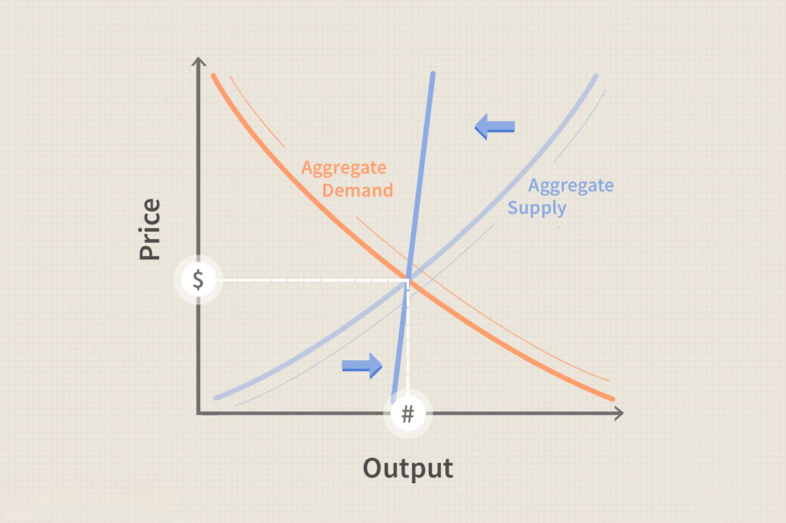

In an increasingly complex global economy, understanding the various levers of fiscal and monetary policy is crucial for both policymakers and investors. These tools allow for the management of economic growth, inflation, and employment, which are essential for maintaining economic stability. Fiscal policy, which involves government spending and taxation, directly influences the level of aggregate demand in an economy. Through mechanisms such as fiscal stimulus, governments aim to encourage economic activity, especially during downturns. Conversely, monetary policy, primarily managed by central banks, involves controlling the money supply and interest rates to achieve macroeconomic objectives like controlling inflation.

This article investigates the interplay between fiscal policy and demand-side economics, while also highlighting the role of algorithmic trading in financial markets. Demand-side economics, largely rooted in Keynesian thought, posits that economic growth is influenced by the overall demand for goods and services. By focusing on increasing demand through government intervention, economies can potentially emerge from recessions more robustly. However, this economic theory has its criticisms, particularly concerning long-term sustainability and the risk of inflation or budget deficits.

On the financial markets front, technological advances have given rise to algorithmic trading, which employs complex algorithms to execute rapid transactions. This innovation has reshaped how financial markets operate, providing increased efficiency and liquidity, but also presenting challenges, such as market volatility and regulatory adjustments. 

Ultimately, this article aims to provide a comprehensive overview of how these economic tools and theories contribute to steering economic growth and stability. By understanding the synergies and challenges within these dynamics, stakeholders can better navigate the complexities of modern economic landscapes.

## Table of Contents

## Understanding Fiscal Policy

Fiscal policy refers to the strategic use of government spending and taxation to influence a country's economic performance. It is a critical tool wielded by governments aiming to moderate economic cycles, manage inflation, and promote employment. During periods of economic downturn, expansionary fiscal policy becomes particularly pertinent. This approach typically involves reducing taxes and increasing public expenditure to boost aggregate demand. The augmentation in demand can lead to higher production levels and potentially pull an economy out of recession by creating jobs and fostering investment.

On the other side, when an economy is overheating—characterized by unsustainable growth leading to high inflation rates—governments may resort to contractionary fiscal policy. This involves increasing taxes and/or cutting public spending, with the goal of reducing aggregate demand to more manageable levels and thereby slowing down inflation. Both policies pivot around the concept of aggregate demand, which is fundamental in determining economic output and employment.

The strategic deployment of fiscal policy profoundly impacts a nation's economic landscape as it can determine patterns of growth and inflation rates. By adjusting tax rates and public expenditure, governments influence the level of disposable income available to consumers and the amount of money circulating in the economy. This, in turn, affects consumption, investment, and overall economic activity. As a result, fiscal policy serves not just as a reactive or stabilizing force but also as a proactive tool for setting a foundation for sustainable long-term economic growth.

However, the effectiveness of fiscal policy can be subject to debate, particularly concerning its long-term ramifications. An increase in public spending or a reduction in taxes can lead to larger budget deficits, which may accumulate into substantial national debt over time. Critics argue that this growing fiscal burden could potentially crowd out private investment and dampen future economic growth. Additionally, there is ongoing discussion about the time lags associated with implementing and realizing the effects of fiscal measures, as these factors can weaken the policy's responsiveness to immediate economic conditions.

In summary, fiscal policy is a pivotal mechanism for economic management, offering tools for both bolstering growth during downturns and reigning in inflation during periods of rapid expansion. Balancing its short-term benefits with long-term fiscal health remains a central challenge for policymakers globally.

## The Mechanics of Demand-Side Economics

Demand-side economics, predominantly linked to Keynesian economics, places significant importance on aggregate demand as the main driver of economic growth. The primary assertion of Keynesian economists is that economic activity is heavily influenced by the overall demand for goods and services. During periods of economic downturn, the economy may not self-correct efficiently or effectively due to insufficient aggregate demand. This perspective gained substantial recognition during the Great Depression, a period characterized by drastic economic decline and high unemployment, where traditional economic approaches proved inadequate.

John Maynard Keynes, the progenitor of Keynesian economics, proposed that increased government intervention is crucial during such downturns. The core elements of this economic theory comprise aggregate demand, government stimulus, and the multiplier effect. Aggregate demand refers to the total demand for goods and services within an economy and is expressed as the sum of consumption, investment, government spending, and net exports. Keynes famously advocated for government actions, such as public spending projects, to enhance aggregate demand and stimulate economic activity.

Government stimulus, which includes both fiscal and monetary policies, plays a critical role in this economic framework. Fiscal policies such as tax cuts and increased government expenditure aim to boost demand directly. Conversely, monetary policies may involve lowering interest rates to encourage borrowing and investment. The multiplier effect, another vital component of demand-side economics, refers to the proportional increase in overall economic activity generated by an initial increase in spending. For instance, public investment in infrastructure projects not only generates immediate employment but also raises consumption as workers spend their earnings, thereby amplifying economic growth.

However, demand-side economics is not without criticism. One significant concern is the potential for these policies to lead to budget deficits. Increasing government expenditure without proportional increases in revenue may exacerbate national debt, posing a risk to long-term economic sustainability. Additionally, critics argue that persistent use of expansionary demand-side measures could prompt inflationary pressures, as continuous increases in demand may exceed the economy's productive capacity, leading to price hikes.

Despite these critiques, demand-side economics has proven effective in addressing short-term economic recessions by injecting necessary stimuli into an underperforming economy. It underscores the importance of maintaining sufficient demand levels to ensure stable economic growth and employment. The balance between stimulating growth and maintaining fiscal discipline remains a central debate among economists and policymakers grappling with the intricacies of economic management.

## Algorithmic Trading: Revolutionizing Financial Markets

Algorithmic trading employs sophisticated algorithms and mathematical models to execute transactions in financial markets at high speeds. This automated trading process enhances market [liquidity](/wiki/liquidity-risk-premium) and operational efficiency while minimizing human error. By implementing algorithmic strategies, trading firms can leverage powerful computational tools to make informed trading decisions quickly, benefiting from data analysis, statistical [arbitrage](/wiki/arbitrage), and complex quantitative models.

High-frequency trading ([HFT](/wiki/high-frequency-trading-strategies)), a subset of [algorithmic trading](/wiki/algorithmic-trading), has notably transformed market dynamics. HFT systems can execute thousands of trades in fractions of a second, capitalizing on minimal price discrepancies and market inefficiencies. This capability is enabled by advanced technologies and infrastructure, such as proximity to exchange servers and access to high-speed networks, which allows traders to optimize latency and ensure rapid order execution.

Despite the benefits of improved liquidity and efficiency, algorithmic trading, particularly HFT, has faced criticism for its potential contribution to market [volatility](/wiki/volatility-trading-strategies) and the occurrence of "flash crashes." Flash crashes are rapid, deep, and volatile market price declines followed by a quick recovery. One prominent example is the 2010 "Flash Crash," where the Dow Jones Industrial Average plummeted nearly 1,000 points within minutes before swiftly recovering. These incidents raise concerns about market stability and the role of algorithms in amplifying disruptive trading patterns.

Financial regulators continuously adapt policies to address the challenges posed by these technological advancements in trading practices. Regulatory measures, such as circuit breakers and trading halts, have been implemented to mitigate the risks associated with excessive market volatility. Additionally, regulatory bodies are exploring methods to enhance transparency and oversight over algorithmic trading activities to safeguard market integrity.

Algorithmic trading remains a significant component of modern financial markets, offering substantial efficiency and liquidity benefits. However, the risks associated with its use underscore the need for careful regulatory oversight and ongoing innovation in risk management and monitoring mechanisms.

## Interconnections and Implications for Economic Growth

Understanding the interconnectedness of fiscal policy, demand-side economics, and algorithmic trading is crucial for crafting effective economic strategies. Fiscal policy and demand-side economics primarily aim at influencing aggregate demand, which is the total demand for goods and services within an economy. Through measures such as adjusting government spending and taxation, fiscal policy directly affects aggregate demand and, indirectly, the broader economic conditions including employment rates and GDP growth.

Algorithmic trading, on the other hand, serves as a mechanism for optimizing financial transactions. By employing complex algorithms, it facilitates high-speed trading, thereby enhancing market liquidity and price discovery. This trading innovation impacts the microeconomic environment by influencing individual investment decisions and market dynamics, potentially affecting corporate financing conditions and, by extension, macroeconomic stability.

The interplay between these elements underscores a complex economic landscape. For instance, effective fiscal policy can stimulate aggregate demand, leading to higher economic output and potentially increasing market activity within financial markets. This increased activity can be amplified by algorithmic trading, which processes transactions at speeds and volumes unattainable by human traders, leading to more efficient capital reallocation and potentially boosting investment levels.

However, the intersection of these tools is not devoid of challenges. While expansionary fiscal policy might stimulate demand, it can also pose risks of inflation and increased public debt. Simultaneously, the rapid execution of trades through algorithmic systems can exacerbate market volatility, as seen in phenomena like 'flash crashes'. This presents a dual challenge where fiscal and monetary stability must be maintained alongside technological advancement in trading practices.

Policymakers are tasked with navigating these interdependencies carefully. A balanced approach is essential, where fiscal measures are designed to complement the efficiency gains from algorithmic trading, ensuring that economic growth is both robust and stable. Such an approach necessitates coordination between fiscal and monetary policymaking bodies and financial market regulators to mitigate potential conflicts and harness the synergies between these economic drivers.

In conclusion, recognizing and managing the nexus between fiscal strategy, demand-driven growth policies, and trading innovations is imperative for fostering a stable economic environment. Policymakers must adapt to the evolving interplay of these factors to secure long-term growth and financial stability. By doing so, they can better manage the cyclical nature of economies while addressing the immediate and long-term challenges posed by technological innovations in finance.

## Conclusion

Economic policies and trading innovations are pivotal forces shaping the global economy. Fiscal policy, together with demand-side economics, offers frameworks that are crucial for managing economic cycles. These frameworks underscore the significance of aggregate demand, with fiscal policy using governmental expenditure and tax adjustments to influence economic activity directly. Demand-side economics, aligned with Keynesian thought, highlights the potential of government interventions in stimulating demand during downturns. Both approaches emphasize adjusting aggregate demand to maintain economic stability and growth. However, challenges such as national debt and inflation remain significant considerations.

Simultaneously, algorithmic trading is transforming the functioning of financial markets. By employing sophisticated algorithms and high-speed computing, this trading approach enhances market efficiency and liquidity, allowing rapid execution of trades that minimize human error. Nevertheless, the automation and speed inherent in algorithmic trading pose regulatory challenges, particularly concerning market volatility and the risk of events such as 'flash crashes.'

An integrated approach that marries traditional economic strategies with these technological innovations is essential for achieving sustainable and resilient economic growth. This approach should not only leverage the strengths of fiscal policies and demand-side interventions but also embrace technological advancements to optimize market operations. Such integration necessitates careful design and monitoring to mitigate potential conflicts and maximize the benefits for economic stability.

Looking ahead, continuous research and dialogue involving economists, policymakers, and industry leaders are critical. These discussions and studies will help navigate the complexities posed by these economic tools and technologies, ensuring that global economic systems remain adaptable and robust. The dynamic interplay between economic policy frameworks and market innovations will define the trajectory of future economic growth and financial stability.

## References & Further Reading

[1]: Keynes, J. M. (1936). ["The General Theory of Employment, Interest, and Money."](http://keynes-general-theory.com/generaltheory.pdf) Macmillan.

[2]: Taylor, J. B. (1999). ["Monetary Policy Rules."](https://www.nber.org/system/files/chapters/c7419/c7419.pdf) University of Chicago Press.

[3]: Lopez de Prado, M. (2018). ["Advances in Financial Machine Learning."](https://www.amazon.com/Advances-Financial-Machine-Learning-Marcos/dp/1119482089) Wiley.

[4]: Chan, E. P. (2009). ["Quantitative Trading: How to Build Your Own Algorithmic Trading Business."](https://github.com/ftvision/quant_trading_echan_book) Wiley.

[5]: Stiglitz, J. E., & Furman, J. (2018). ["The Hamilton Project: Fiscal Policy Reconsidered."](https://academic.oup.com/oxrep/article/34/1-2/70/4781816) Brookings Institution Press.