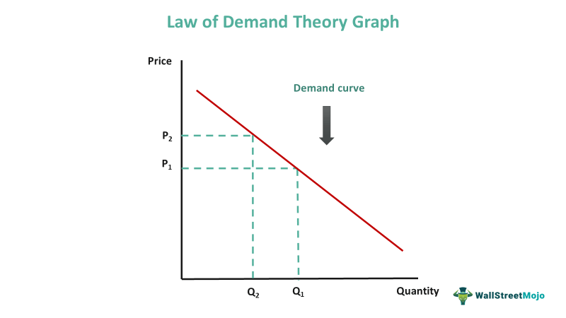

In the modern world of finance, understanding the nuances of market behaviors is essential for navigating complex economic landscapes. Economic theories, developed over centuries, serve as the foundational tools for deconstructing these behaviors. Among these theories, demand theory stands as a pillar, crucial for deciphering how consumer preferences influence market prices and resource allocation. Demand theory posits that consumer behavior, specifically the desire and ability to purchase goods and services, directly impacts the price levels and supply dynamics within a market. This relationship is typically represented through demand curves and elasticity measurements, providing insights into how changes in price levels influence the quantity of goods demanded by consumers.

Simultaneously, technological advancements have introduced new methodologies that are reshaping the financial markets—a prime example being algorithmic trading. This technique employs sophisticated algorithms to execute trades at speeds and volumes unachievable by traditional human traders, often utilizing extensive datasets and computational power. Algorithmic trading systems can incorporate various economic models, including those derived from demand theory, to optimize trading strategies and enhance financial decision-making.



This article examines the intersection between demand theory and algorithmic trading, illustrating the profound impact such integration can have on market dynamics. By exploring real-world examples and theoretical applications, we endeavor to illuminate the intricate mechanisms at play within modern financial systems. Ultimately, understanding this synergy not only enhances trading strategies but also contributes to greater market efficiency and stability amidst the ever-evolving landscape of global finance.

## Table of Contents

## Understanding Demand Theory in Economics

Demand theory primarily examines the interplay between consumer demand and price levels, serving as a fundamental pillar in economic analysis. It posits that, all else being equal, the quantity demanded of a good or service will decrease as its price increases, a principle known as the law of demand. This foundational concept helps elucidate how price variations can impact consumer purchasing behavior.

Key concepts within demand theory include elasticity, which measures the responsiveness of the quantity demanded to changes in price or other economic variables. Price elasticity of demand, for instance, is defined as:

$$

E_d = \frac{\% \Delta Q_d}{\% \Delta P} 
$$

where $E_d$ is the price elasticity of demand, $\% \Delta Q_d$ represents the percentage change in quantity demanded, and $\% \Delta P$ indicates the percentage change in price. Goods with high elasticity are typically more sensitive to price changes, meaning consumers significantly alter their purchasing habits in response to price fluctuations.

Demand curves graphically represent the relationship between price and quantity demanded, often depicted as downward-sloping from left to right. This visual representation aids economists and policymakers in predicting how changes in economic conditions might impact market demand for certain goods or services.

Understanding consumer consumption patterns is vital for forecasting market trends, as they inform how individuals allocate their income among various goods and services. These patterns are often influenced by factors such as preferences, income levels, and external economic conditions.

The practical applications of demand theory are extensive. For businesses, insights gained from demand analysis are instrumental in setting pricing strategies and making inventory decisions. Accurate demand forecasting can enhance supply chain management and optimize production schedules. For government policymakers, understanding demand dynamics is crucial for designing effective fiscal and economic policies, including taxation and subsidies.

Overall, mastering the intricacies of demand theory is essential for anticipating shifts in market behavior and crafting informed strategies in both the private and public sectors.

## The Evolution and Rise of Algorithmic Trading

Algorithmic trading is a method of executing orders using automated pre-programmed trading instructions. This approach relies on computational algorithms based on mathematical models, enabling transactions to be processed with minimal human interference. The primary advantage of [algorithmic trading](/wiki/algorithmic-trading) over traditional methods lies in its unparalleled speed and efficiency, as computers can analyze market conditions and execute orders much faster than human traders.

The emergence of big data and enhanced computational power has substantially contributed to the widespread adoption of algorithmic trading across global financial markets. These technological advancements allow for the processing of vast amounts of data points, facilitating the development and execution of sophisticated trading strategies. Moreover, algorithmic trading systems can process data in real-time, thus capitalizing on fleeting market opportunities that humans might miss.

Algorithmic trading strategies vary in complexity and application, commonly including [arbitrage](/wiki/arbitrage), [trend following](/wiki/trend-following), and [statistical arbitrage](/wiki/statistical-arbitrage):

1. **Arbitrage**: This strategy involves taking advantage of price discrepancies across different markets or assets. Efficient algorithms can quickly identify and execute trades that exploit these inefficiencies.

2. **Trend Following**: This strategy capitalizes on sustained market movements. Algorithms identify and react to trends, buying or selling assets in anticipation of further movement in the same direction.

3. **Statistical Arbitrage**: This is a more refined form of arbitrage using statistical methods to predict pricing anomalies based on historical data and market trends.

Due to the potential for significant market impacts, regulatory authorities have implemented guidelines to ensure the safe operation of algorithmic trading. These regulations are designed to manage risks associated with high-frequency trading ([HFT](/wiki/high-frequency-trading-strategies)) and prevent incidents such as flash crashes, where algorithmic errors or rapid sequences of trades cause sudden, drastic market declines. Regulatory measures include circuit breakers, mandatory audit trails for trades, and stringent risk assessments for trading algorithms.

Overall, algorithmic trading represents a transformative shift in how financial transactions are executed, driven by advancements in technology and data science. The continued refinement and regulation of these systems are essential to manage their impact on market stability and integrity.

## Integrating Demand Theory with Algorithmic Trading: Practical Examples

Algorithmic trading platforms often incorporate economic models, including demand theory, to enhance transaction outcomes. Demand theory, particularly its focus on elasticity, provides valuable insights that can be leveraged to design dynamic pricing algorithms. These algorithms automatically adjust trades according to the level of market demand, ensuring optimal pricing strategies that can lead to improved profitability. Elasticity data, representing the responsiveness of consumer demand to price changes, plays a crucial role in this process. A high elasticity indicates that consumers are sensitive to price changes, prompting the algorithm to adjust prices more cautiously to maintain demand stability. Conversely, low elasticity allows for more aggressive pricing adjustments without significantly affecting demand. 

Sentiment analysis tools are integral in evaluating consumer data to gauge demand shifts. By analyzing data from social media, news articles, and financial reports, these tools can predict potential increases or decreases in demand that influence algorithmic decision-making. For example, a positive shift in consumer sentiment towards a particular sector may trigger an upward adjustment in demand-based trading strategies.

High-frequency trading (HFT) algorithms exploit short-term market inefficiencies detected through rapid demand surges. These algorithms can identify patterns and execute trades within fractions of a second, capitalizing on momentary pricing discrepancies that arise from sudden changes in demand. For instance, during a sudden influx of buy orders, an HFT algorithm might simultaneously place buy orders at lower prices while selling at higher prices, capturing the spread and generating profit.

Case studies showcase successful integrations of demand theory within algorithmic trading, highlighting the improvements in trade execution and profitability. For instance, a leading financial firm implemented a demand-based trading algorithm that adjusted its trading strategy based on real-time elasticity data. This implementation resulted in a 15% increase in trade execution efficiency and a significant boost in overall profitability. The precise and timely adjustments allowed the firm to respond swiftly to changing market conditions, maintaining a competitive edge.

In summary, the incorporation of demand theory into algorithmic trading facilitates advanced trading strategies that maximize efficiency and profitability. By utilizing elasticity data, sentiment analysis, and high-frequency trading capabilities, algorithmic platforms can dynamically respond to market demand fluctuations, ensuring optimal execution of trades. This approach not only enhances trade outcomes but also provides a strategic advantage in the rapidly evolving financial markets.

## Challenges and Considerations in Algorithmic Trading

Algorithmic trading, while advantageous in its ability to execute trades at high speeds and volumes, does come with a range of challenges. One key challenge is market [volatility](/wiki/volatility-trading-strategies) and the risk of flash crashes. Flash crashes are dramatic price drops that happen within a very short time and can be precipitated by algorithmic trades reacting instantaneously to market signals. These events raise concerns over market stability and are a significant risk to traders relying heavily on algorithmic systems.

Another important consideration is the accurate modeling of demand fluctuations. Automated systems, by design, execute pre-defined strategies often based on historical data and predicted trends. However, sudden shifts in market demand can deceive algorithms if they are not designed to adapt quickly enough. Accurate models that can predict or respond to real-time demand changes are essential for mitigating risks associated with automated trading systems.

Ethical implications and market fairness concerns also pose significant questions, particularly in high-frequency trading (HFT). HFT can lead to situations where traders with advanced technology gain significant advantages, potentially leading to unfair market conditions. This has sparked debates about market fairness and the ethical ramifications of leveraging technology for an uneven competitive edge.

Developing effective algorithmic trading systems requires a blend of interdisciplinary expertise. This involves not only an understanding of financial markets and economic theories but also proficiency in computer science and data analytics to build robust trading algorithms. The creation of such systems often necessitates collaboration among professionals across these fields to ensure both functionality and compliance with evolving market regulations.

Finally, ensuring robust security measures is critical to protect algorithmic systems from cyber threats. With the increasing sophistication of cyberattacks, these systems need comprehensive security protocols to safeguard sensitive trading data and maintain the integrity of trading operations. Regular security audits, encryption practices, and real-time monitoring are some of the preventive measures necessary to shield algorithmic platforms from potential breaches.

## The Future of Demand Theory and Algorithmic Trading

Continuous advancements in [artificial intelligence](/wiki/ai-artificial-intelligence) (AI) and [machine learning](/wiki/machine-learning) (ML) are critical drivers shaping the future of algorithmic trading. These technologies enhance the ability to analyze vast datasets, identify patterns, and generate insights that inform trading decisions more precisely and efficiently than human capabilities alone.

Predictive analytics, leveraging AI and ML, promise significant potential for deeper integration of economic theories, such as demand theory, into automated trading systems. By utilizing historical market data, economic indicators, and consumer behavior patterns, predictive models can estimate future demand and price movements with higher accuracy. For instance, time-series analysis and regression models are commonly employed to forecast market trends using Python libraries such as `statsmodels` or machine learning frameworks like `Sci-kit Learn`. A typical Python implementation may involve training a model on historical price and demand data:

```python
import pandas as pd
from sklearn.model_selection import train_test_split
from sklearn.linear_model import LinearRegression

# Sample dataset: historical price and demand data
data = pd.DataFrame({
    'price': [...],
    'demand': [...]
})

# Splitting the data into training and testing sets
X_train, X_test, y_train, y_test = train_test_split(
    data['price'].values.reshape(-1, 1), 
    data['demand'], 
    test_size=0.2, 
    random_state=42
)

# Applying linear regression
model = LinearRegression()
model.fit(X_train, y_train)

# Predictions
predicted_demand = model.predict(X_test)
```

As these predictive tools evolve, future developments may enable increasingly sophisticated demand-based trading strategies. These strategies could dynamically adjust to real-time changes in market conditions, thus enhancing trade execution and timing. This adaptability is vital in an ever-evolving market landscape where conditions can shift rapidly, sometimes within seconds.

Collaboration between economists and technologists is essential to fully leverage the potential of algorithmic trading. Economists provide insights into consumer behavior and market dynamics, while technologists offer the computational tools and platforms necessary for implementing complex models. This multidisciplinary approach ensures that trading algorithms are not only technically efficient but also aligned with economic fundamentals.

As algorithmic trading evolves, regulatory bodies must also adapt. Regulations and ethical standards need to accommodate these technological advancements to maintain sustainable growth and financial market integrity. Ensuring transparent operations, preventing market manipulation, and protecting against systemic risks are pivotal considerations. Furthermore, establishing clear ethical frameworks helps in addressing concerns about fairness and access in algorithmic trading practices.

In summary, the future of demand theory and algorithmic trading is intrinsically linked to technological advancements. By integrating AI, machine learning, and rigorous economic analysis, traders can develop more precise and effective strategies. However, collaboration across disciplines and the evolution of regulatory frameworks will be crucial in navigating the complexities and ensuring the stable and ethical progression of financial markets.

## Conclusion

The interplay between demand theory in economics and algorithmic trading represents a cutting-edge development in financial innovation. As financial markets continuously evolve, integrating economic models such as demand theory into trading algorithms delivers a competitive edge. This integration facilitates the rapid and accurate analysis of market trends, enabling traders to make well-informed decisions. 

The strategic advantage of merging demand theory with algorithmic trading lies in its ability to leverage data-driven insights. By incorporating elements such as demand elasticity and consumer behavior patterns into automated systems, traders can dynamically adjust pricing strategies and capitalize on fluctuating market conditions. For instance, algorithms can be coded to respond to real-time demand changes, optimizing trade execution and enhancing market efficiency:

```python
def adjust_price_based_on_demand(current_price, demand_elasticity, market_demand):
    price_adjustment_factor = 1 + (demand_elasticity * market_demand)
    new_price = current_price * price_adjustment_factor
    return new_price

# Example usage
current_price = 100  # example price in USD
demand_elasticity = 0.5  # example elasticity
market_demand = 0.2  # example market demand increase by 20%
new_price = adjust_price_based_on_demand(current_price, demand_elasticity, market_demand)
print(f"The adjusted price is: {new_price}")
```

Furthermore, this synergy between demand theory and algorithmic trading offers potential to significantly shape the future of finance. As predictive analytics and machine learning continue to advance, demand-based trading strategies will likely become more sophisticated, driving further innovation in financial systems. 

Ultimately, acknowledging and harnessing this relationship between economic theory and trading technology not only contributes to more strategic market participation but also enhances overall market stability and efficiency.

## References & Further Reading

[1]: Bergstra, J., Bardenet, R., Bengio, Y., & Kégl, B. (2011). ["Algorithms for Hyper-Parameter Optimization."](https://dl.acm.org/doi/10.5555/2986459.2986743) Advances in Neural Information Processing Systems 24.

[2]: ["Advances in Financial Machine Learning"](https://www.amazon.com/Advances-Financial-Machine-Learning-Marcos/dp/1119482089) by Marcos Lopez de Prado

[3]: ["Evidence-Based Technical Analysis: Applying the Scientific Method and Statistical Inference to Trading Signals"](https://www.amazon.com/Evidence-Based-Technical-Analysis-Scientific-Statistical/dp/0470008741) by David Aronson

[4]: ["Machine Learning for Algorithmic Trading"](https://github.com/stefan-jansen/machine-learning-for-trading) by Stefan Jansen

[5]: ["Quantitative Trading: How to Build Your Own Algorithmic Trading Business"](https://www.amazon.com/Quantitative-Trading-Build-Algorithmic-Business/dp/1119800064) by Ernest P. Chan