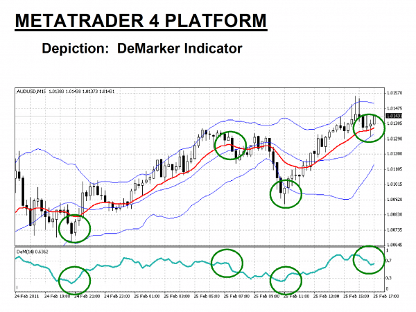

## Table of Contents

## What is the DeMarker Indicator?

The DeMarker Indicator, often shortened to DeM, is a technical analysis tool used by traders to predict price movements in financial markets. It was developed by Tom DeMark and helps traders identify potential trend reversals by measuring the demand for an asset. The indicator calculates the difference between the period's high and the previous period's high, and the period's low and the previous period's low. This information is used to generate a value between 0 and 1, which helps traders understand whether an asset is overbought or oversold.

Traders use the DeMarker Indicator to make buy or sell decisions. When the DeM value is above 0.7, it suggests that the asset might be overbought, meaning its price may soon decrease. Conversely, if the DeM value falls below 0.3, it indicates that the asset could be oversold, suggesting that its price might increase soon. By watching these levels, traders can better time their entry and exit points in the market, potentially increasing their chances of making profitable trades.

## Who developed the DeMarker Indicator and when?

The DeMarker Indicator was developed by Tom DeMark. Tom DeMark is well-known in the world of trading for creating various technical analysis tools. His work has helped many traders make better decisions in the financial markets.

The exact date when Tom DeMark developed the DeMarker Indicator is not widely documented. However, it is known that he introduced this tool to help traders identify potential trend reversals. The indicator became popular among traders looking for a way to predict when an asset might be overbought or oversold.

## How is the DeMarker Indicator calculated?

The DeMarker Indicator is calculated using the highs and lows of an asset's price over time. To start, you look at the difference between the current period's high and the previous period's high. If the current high is higher than the previous high, you record this difference as the "DeMax" for that period. If the current high is not higher, then DeMax is set to zero. Next, you look at the difference between the current period's low and the previous period's low. If the current low is lower than the previous low, you record this difference as the "DeMin" for that period. If the current low is not lower, then DeMin is set to zero.

After finding DeMax and DeMin, you smooth these values over a chosen number of periods, usually 14, to get the Smoothed DeMax and Smoothed DeMin. The smoothing is done by taking the average of the current DeMax (or DeMin) and the previous Smoothed DeMax (or Smoothed DeMin). Once you have the smoothed values, you calculate the DeMarker Indicator by dividing the Smoothed DeMax by the sum of the Smoothed DeMax and Smoothed DeMin. This gives you a value between 0 and 1, which helps traders understand if an asset might be overbought or oversold.

## What are the key components of the DeMarker Indicator?

The DeMarker Indicator uses two main parts to work: DeMax and DeMin. DeMax is found by looking at the difference between the current high price and the high price from the last period. If the current high is higher, you use that difference. If it's not higher, DeMax is zero. DeMin is the opposite. It's the difference between the current low price and the low price from the last period. If the current low is lower, you use that difference. If it's not lower, DeMin is zero.

Once you have DeMax and DeMin, you smooth them over a set number of periods, usually 14. Smoothing means you take the average of the current value and the smoothed value from the last period. After smoothing, you divide the smoothed DeMax by the total of the smoothed DeMax and smoothed DeMin. This gives you the DeMarker value, which is a number between 0 and 1. Traders use this number to see if a price might go up or down soon.

## How can the DeMarker Indicator be used in trading?

The DeMarker Indicator helps traders guess if a price will go up or down soon. It gives a number between 0 and 1. If this number is above 0.7, it means the price might be too high and could go down soon. Traders might sell their assets at this point. If the number is below 0.3, it means the price might be too low and could go up soon. Traders might buy more at this point. By watching these numbers, traders can decide when to buy or sell to make more money.

Traders use the DeMarker Indicator along with other tools to make better choices. It's not perfect, so it's good to use it with other signs like moving averages or trend lines. This way, traders can see the bigger picture and make smarter trades. The DeMarker Indicator helps traders find good times to buy or sell, but it works best when used with other tools to check its guesses.

## What are the typical settings for the DeMarker Indicator?

The DeMarker Indicator usually uses a setting of 14 periods. This means it looks at the last 14 price changes to figure out if a price might go up or down soon. Traders can change this number, but 14 is what most people use because it gives a good balance between seeing quick changes and understanding the bigger picture.

Traders watch the DeMarker number to see if it's above 0.7 or below 0.3. If it's above 0.7, it might mean the price is too high and could drop soon. If it's below 0.3, it might mean the price is too low and could go up soon. These levels help traders decide when to buy or sell, but they often use other tools too to make sure they're making the right choice.

## How does the DeMarker Indicator differ from other momentum indicators?

The DeMarker Indicator is different from other [momentum](/wiki/momentum) indicators because it focuses on the difference between the highs and lows of price changes. Most other momentum indicators, like the Relative Strength Index (RSI) or the Moving Average Convergence Divergence (MACD), look at the closing prices of an asset. The DeMarker Indicator uses the highs and lows to find out if a price might go up or down soon, while others use closing prices to guess the same thing.

Another way the DeMarker Indicator is different is how it calculates its values. The DeMarker Indicator uses DeMax and DeMin to find out if a price is overbought or oversold. DeMax looks at the difference between the current high and the last high, and DeMin looks at the difference between the current low and the last low. Other momentum indicators might use different ways to figure out if a price is too high or too low. For example, the RSI uses the average gain and loss of closing prices over time. So, the DeMarker Indicator gives traders a unique way to see price movements compared to other tools.

## What are the common trading signals generated by the DeMarker Indicator?

The DeMarker Indicator gives traders two main signals to help them decide when to buy or sell. If the DeMarker value goes above 0.7, it means the price might be too high and could go down soon. This is called an overbought signal. When traders see this, they might think about selling their assets to avoid losing money if the price drops.

On the other hand, if the DeMarker value goes below 0.3, it means the price might be too low and could go up soon. This is called an oversold signal. When traders see this, they might think about buying more assets because they believe the price will rise. By watching these signals, traders can try to make better choices about when to buy or sell.

## Can the DeMarker Indicator be used for both short-term and long-term trading?

Yes, the DeMarker Indicator can be used for both short-term and long-term trading. For short-term trading, traders might use a shorter period setting, like 5 or 7 periods, to catch quick changes in the market. This can help them make fast decisions to buy or sell, trying to make money from small price movements that happen often in a short time.

For long-term trading, traders might stick with the usual 14-period setting or even use a longer one, like 20 or 30 periods. This helps them see bigger trends over time and make slower, more thought-out decisions. By using the DeMarker Indicator in different ways, traders can fit it to their own style, whether they want to trade quickly or take their time to see where the market is going.

## How can the DeMarker Indicator be combined with other technical indicators for better results?

The DeMarker Indicator can be used with other technical tools to make better trading choices. One common way is to use it with the Moving Average Convergence Divergence (MACD). The DeMarker Indicator helps traders see if a price is too high or too low, while the MACD shows the strength and direction of a trend. When the DeMarker shows an overbought or oversold signal and the MACD confirms a trend change, traders might feel more sure about their buy or sell decisions.

Another useful combination is with the Relative Strength Index (RSI). Both the DeMarker and RSI look at overbought and oversold levels, but they do it in different ways. When both indicators agree that a price is overbought or oversold, it can give traders a stronger signal to act. For example, if the DeMarker is above 0.7 and the RSI is above 70, it might be a good time to sell. Using these tools together helps traders see the market from different angles and make smarter trades.

## What are the limitations and potential pitfalls of using the DeMarker Indicator?

The DeMarker Indicator can be tricky to use because it's not always right. It might say a price is too high or too low, but the price can keep going up or down longer than you expect. This is called a false signal. Traders can lose money if they buy or sell too soon based on what the DeMarker says. Also, the DeMarker works best in markets that move a lot, but if the market is calm and prices don't change much, the DeMarker might not be very useful.

Another problem is that the DeMarker Indicator doesn't work well by itself. Traders need to use other tools with it to make better choices. If they only use the DeMarker, they might miss important signs from the market. Also, the DeMarker can be hard to set up right. If traders choose the wrong number of periods, like 14, it might not match their trading style or the market they are looking at. This can lead to bad trading choices and losses.

## How can traders optimize the use of the DeMarker Indicator in different market conditions?

Traders can make the DeMarker Indicator work better by changing how many periods it looks at, depending on if the market is moving fast or slow. In a fast-moving market, traders might use a shorter number of periods, like 5 or 7, to catch quick changes. This helps them buy or sell at the right time to make money from small price moves. But if the market is moving slowly, using a longer number of periods, like 20 or 30, can help see bigger trends over time. This way, traders can make slower, more thought-out decisions that fit the market's pace.

It's also important for traders to use the DeMarker Indicator with other tools to get a fuller picture of the market. For example, combining it with the Moving Average Convergence Divergence (MACD) can help confirm if a trend is really changing. If the DeMarker says a price is too high and the MACD agrees, traders can feel more sure about selling. In different market conditions, like when prices are moving a lot or not much at all, using these other tools can help traders avoid false signals and make better choices. By adjusting the DeMarker settings and using it with other indicators, traders can handle different market situations better.

## What is the DeMarker Indicator and how does it work?

The DeMarker Indicator (DeM) is a significant oscillator used in technical analysis, designed to evaluate the demand for an asset by comparing its recent high and low prices to those of previous periods. This comparison helps to assess the relative strength of price movements over time, aiding traders in identifying potential shifts in market trends.

The DeMarker Indicator operates by identifying overbought and oversold conditions, which are crucial for determining potential entry and [exit](/wiki/exit-strategy) points in trading. An asset is typically considered overbought when the DeMarker value is above a certain threshold, often set at 0.70, indicating that a price correction might be forthcoming. Conversely, a value below 0.30 indicates an oversold condition, suggesting a potential price increase as demand rises.

Unlike other oscillators such as the Relative Strength Index (RSI), which primarily considers closing prices, the DeMarker Indicator focuses on intra-period price dynamics. It specifically examines the highs and lows within the selected time frame. This emphasis on intra-period data allows the DeMarker to capture price fluctuations in a nuanced manner, offering a distinctive perspective on an asset's demand level.

Mathematically, the DeMarker Indicator is calculated using a method distinct from other oscillators. It involves two components: DeMMAX and DeMMIN. DeMMAX measures the difference between the current period's high and the previous high, but only records a value if the current high surpasses the previous high. Similarly, DeMMIN captures the difference between the current low and the previous low, recorded only if the current low is lower than the previous low. These components are usually calculated over a pre-defined period, often 14 days, and the DeMarker Indicator value is derived as follows:

$$
\text{DeM} = \frac{\sum_{n=1}^{N} \text{DeMMAX}_n}{\sum_{n=1}^{N} \text{DeMMAX}_n + \sum_{n=1}^{N} \text{DeMMIN}_n}
$$

where $N$ is the number of periods, commonly set to 14.

This formula results in a smooth moving average that oscillates between 0 and 1, enabling traders to assess market conditions effectively. By providing early signals on potential market reversals, the DeMarker Indicator equips traders with the ability to anticipate market movements more effectively.

## How do you calculate the DeMarker Indicator?

The DeMarker Indicator is calculated using specific intra-period price comparisons to gauge the asset's demand. The process begins by defining two components: DeMMAX and DeMMIN, calculated over a chosen period, typically 14 periods. 

### DeMMAX Calculation
To compute DeMMAX, compare the current period's high with the previous period's high. If the current high is greater, calculate the difference. If not, assign a value of zero. Mathematically, this is represented as:

$$
\text{DeMMAX}_t = 
\begin{cases} 
\text{High}_t - \text{High}_{t-1} & \text{if } \text{High}_t > \text{High}_{t-1} \\
0 & \text{otherwise}
\end{cases}
$$

### DeMMIN Calculation
For DeMMIN, the comparison involves the lows of the current and previous periods. If the current low is smaller than the previous low, note the difference. Otherwise, the value is zero. This can be expressed as:

$$
\text{DeMMIN}_t = 
\begin{cases} 
\text{Low}_{t-1} - \text{Low}_t & \text{if } \text{Low}_t < \text{Low}_{t-1} \\
0 & \text{otherwise}
\end{cases}
$$

### Calculating the DeMarker Indicator
With DeMMAX and DeMMIN determined for the entire period, typically 14 periods, the next step is to average these values. The DeMarker Indicator is then calculated by dividing the sum of DeMMAX by the sum of DeMMAX and DeMMIN for the specified period:

$$
\text{DeMarker} = \frac{\sum_{i=1}^{n} \text{DeMMAX}_i}{\sum_{i=1}^{n} \text{DeMMAX}_i + \sum_{i=1}^{n} \text{DeMMIN}_i}
$$

This formula results in a value typically oscillating between 0 and 1, where values closer to 1 indicate potential overbought conditions, and values closer to 0 suggest oversold conditions.

### Python Implementation
To automate the calculation, here is a Python implementation for a generic dataset:

```python
import numpy as np
import pandas as pd

def calculate_demarker(highs, lows, period=14):
    demax = np.where(highs > highs.shift(1), highs - highs.shift(1), 0)
    demin = np.where(lows < lows.shift(1), lows.shift(1) - lows, 0)

    demax_rolling = pd.Series(demax).rolling(window=period).sum()
    demin_rolling = pd.Series(demin).rolling(window=period).sum()

    demarker = demax_rolling / (demax_rolling + demin_rolling)
    return demarker

# Example usage
data = {'High': [your_highs], 'Low': [your_lows]}
highs = pd.Series(data['High'])
lows = pd.Series(data['Low'])

demarker_values = calculate_demarker(highs, lows)
```

This implementation smooths the DeMarker values into a moving average, aligning with typical technical analysis practices and allowing traders to identify overbought or oversold conditions effectively.

## References & Further Reading

[1]: DeMark, T. R. (1994). ["The New Science of Technical Analysis."](https://books.google.com/books/about/The_New_Science_of_Technical_Analysis.html?id=a334yNliorYC) John Wiley & Sons.

[2]: "Technical Analysis of the Financial Markets: A Comprehensive Guide to Trading Methods and Applications" by John J. Murphy (https://www.amazon.com/Technical-Analysis-Financial-Markets-Comprehensive/dp/0735200661)

[3]: Pring, M. J. (1991). "Technical Analysis Explained: The Successful Investor's Guide to Spotting Investment Trends and Turning Points." McGraw-Hill.

[4]: Pardo, R. (2008). ["The Evaluation and Optimization of Trading Strategies."](https://onlinelibrary.wiley.com/doi/book/10.1002/9781119196969) John Wiley & Sons.

[5]: Murphy, J. J. (1999). "Intermarket Technical Analysis: Trading Strategies for the Global Stock, Bond, Commodity, and Currency Markets." John Wiley & Sons.