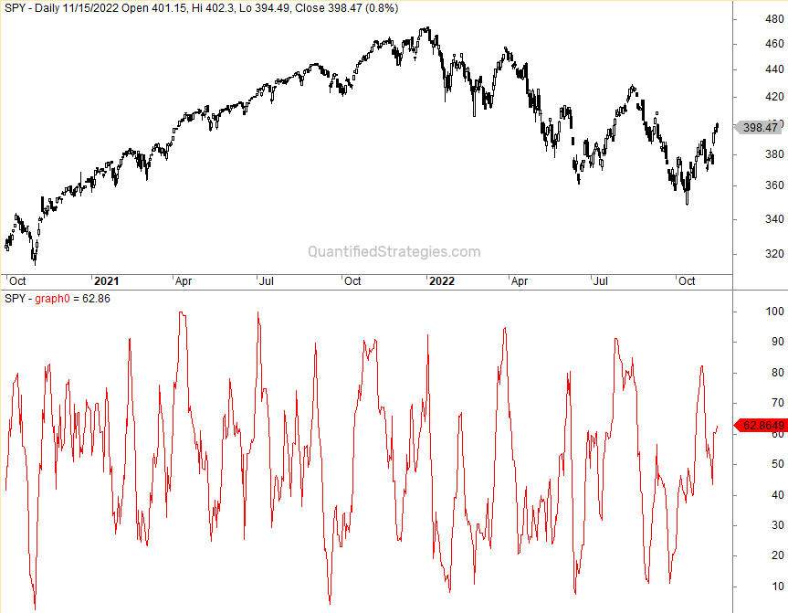

The world of algorithmic trading offers numerous tools and indicators to aid traders in making informed decisions. One such powerful tool is the DeMarker Indicator (DeM), developed by renowned analyst Thomas DeMark. The DeMarker Indicator serves traders by pinpointing potential market trends and signaling changes in momentum. It is popular among both amateur and professional traders for its unique ability to highlight overbought and oversold conditions, making it an integral part of many trading strategies.

Traders leverage the DeMarker Indicator to gain insights into when to enter or exit trades, focusing on its analytical approach that assesses the relative position of current price actions with historical data. Unlike many other oscillators, the DeMarker Indicator emphasizes intra-period price dynamics, which allows for a focused evaluation based on recent high and low prices rather than closing prices. This distinctive approach is particularly beneficial in rapidly changing markets, where recognizing subtle shifts in momentum can be crucial for success.



As algorithmic trading continues to evolve, the need for reliable indicators like the DeMarker Indicator grows, providing traders the advantage of early trend detection and helping to optimize their trading strategies. Whether used alone or in conjunction with other indicators, the DeMarker Indicator can be a potent tool for those looking to refine their approach to trading.

## Table of Contents

## Understanding the DeMarker Indicator

The DeMarker Indicator (DeM) is a significant oscillator used in technical analysis, designed to evaluate the demand for an asset by comparing its recent high and low prices to those of previous periods. This comparison helps to assess the relative strength of price movements over time, aiding traders in identifying potential shifts in market trends.

The DeMarker Indicator operates by identifying overbought and oversold conditions, which are crucial for determining potential entry and exit points in trading. An asset is typically considered overbought when the DeMarker value is above a certain threshold, often set at 0.70, indicating that a price correction might be forthcoming. Conversely, a value below 0.30 indicates an oversold condition, suggesting a potential price increase as demand rises.

Unlike other oscillators such as the Relative Strength Index (RSI), which primarily considers closing prices, the DeMarker Indicator focuses on intra-period price dynamics. It specifically examines the highs and lows within the selected time frame. This emphasis on intra-period data allows the DeMarker to capture price fluctuations in a nuanced manner, offering a distinctive perspective on an asset's demand level.

Mathematically, the DeMarker Indicator is calculated using a method distinct from other oscillators. It involves two components: DeMMAX and DeMMIN. DeMMAX measures the difference between the current period's high and the previous high, but only records a value if the current high surpasses the previous high. Similarly, DeMMIN captures the difference between the current low and the previous low, recorded only if the current low is lower than the previous low. These components are usually calculated over a pre-defined period, often 14 days, and the DeMarker Indicator value is derived as follows:

$$
\text{DeM} = \frac{\sum_{n=1}^{N} \text{DeMMAX}_n}{\sum_{n=1}^{N} \text{DeMMAX}_n + \sum_{n=1}^{N} \text{DeMMIN}_n}
$$

where $N$ is the number of periods, commonly set to 14.

This formula results in a smooth moving average that oscillates between 0 and 1, enabling traders to assess market conditions effectively. By providing early signals on potential market reversals, the DeMarker Indicator equips traders with the ability to anticipate market movements more effectively.

## How to Calculate the DeMarker Indicator

The DeMarker Indicator is calculated using specific intra-period price comparisons to gauge the asset's demand. The process begins by defining two components: DeMMAX and DeMMIN, calculated over a chosen period, typically 14 periods. 

### DeMMAX Calculation
To compute DeMMAX, compare the current period's high with the previous period's high. If the current high is greater, calculate the difference. If not, assign a value of zero. Mathematically, this is represented as:

$$
\text{DeMMAX}_t = 
\begin{cases} 
\text{High}_t - \text{High}_{t-1} & \text{if } \text{High}_t > \text{High}_{t-1} \\
0 & \text{otherwise}
\end{cases}
$$

### DeMMIN Calculation
For DeMMIN, the comparison involves the lows of the current and previous periods. If the current low is smaller than the previous low, note the difference. Otherwise, the value is zero. This can be expressed as:

$$
\text{DeMMIN}_t = 
\begin{cases} 
\text{Low}_{t-1} - \text{Low}_t & \text{if } \text{Low}_t < \text{Low}_{t-1} \\
0 & \text{otherwise}
\end{cases}
$$

### Calculating the DeMarker Indicator
With DeMMAX and DeMMIN determined for the entire period, typically 14 periods, the next step is to average these values. The DeMarker Indicator is then calculated by dividing the sum of DeMMAX by the sum of DeMMAX and DeMMIN for the specified period:

$$
\text{DeMarker} = \frac{\sum_{i=1}^{n} \text{DeMMAX}_i}{\sum_{i=1}^{n} \text{DeMMAX}_i + \sum_{i=1}^{n} \text{DeMMIN}_i}
$$

This formula results in a value typically oscillating between 0 and 1, where values closer to 1 indicate potential overbought conditions, and values closer to 0 suggest oversold conditions.

### Python Implementation
To automate the calculation, here is a Python implementation for a generic dataset:

```python
import numpy as np
import pandas as pd

def calculate_demarker(highs, lows, period=14):
    demax = np.where(highs > highs.shift(1), highs - highs.shift(1), 0)
    demin = np.where(lows < lows.shift(1), lows.shift(1) - lows, 0)

    demax_rolling = pd.Series(demax).rolling(window=period).sum()
    demin_rolling = pd.Series(demin).rolling(window=period).sum()

    demarker = demax_rolling / (demax_rolling + demin_rolling)
    return demarker

# Example usage
data = {'High': [your_highs], 'Low': [your_lows]}
highs = pd.Series(data['High'])
lows = pd.Series(data['Low'])

demarker_values = calculate_demarker(highs, lows)
```

This implementation smooths the DeMarker values into a moving average, aligning with typical technical analysis practices and allowing traders to identify overbought or oversold conditions effectively.

## Settings and Customization

Default settings for the DeMarker Indicator typically employ a 14-period length, with defined thresholds at 0.70 for overbought conditions and 0.30 for oversold conditions. These thresholds help traders to easily identify potential market turning points. However, the effectiveness of these default parameters can vary, depending on the trading environment and individual strategies.

Traders often customize these settings to better suit specific market conditions or trading styles, aiming to find a balance between signal sensitivity and market noise. Adjusting the period length can have significant implications on the performance of the DeMarker Indicator. Shortening the period length can lead to more sensitive signals, allowing traders to capture short-term trends; however, it can also increase the likelihood of false signals due to market noise. On the other hand, lengthening the period can result in smoother indicator lines that are more suitable for identifying longer-term trends, but may lag in responding to recent market changes.

For example, a trader operating in a volatile market might choose to use a shorter period, such as 8 or 10, to capture rapid price movements. Alternatively, a trader focusing on broader market trends might opt for a longer timeframe, like 20 or 21 periods, to filter out minor fluctuations and focus on sustained market movements.

Customizing the overbought and oversold thresholds is another method of fine-tuning the indicator. Tightening these levels can increase the sensitivity of trade signals, potentially leading to earlier entry and [exit](/wiki/exit-strategy) points. Relaxing them, conversely, can reduce false signals, providing clearer confirmations of trend reversals or continuations.

Python can be utilized to adjust and backtest these custom settings. For instance, one might use the `pandas` and `numpy` libraries to calculate the DeMarker Indicator over various periods and assess performance across different historical data sets:

```python
import pandas as pd
import numpy as np

def calculate_demarker(data, period=14):
    def dem_max(row):
        return max(0, row['High'] - row['High_prev'])

    def dem_min(row):
        return max(0, row['Low_prev'] - row['Low'])

    df = data.copy()
    df['High_prev'] = df['High'].shift(1)
    df['Low_prev'] = df['Low'].shift(1)

    df['DeMMAX'] = df.apply(dem_max, axis=1)
    df['DeMMIN'] = df.apply(dem_min, axis=1)

    df['DeMMAX_SMA'] = df['DeMMAX'].rolling(window=period).mean()
    df['DeMMIN_SMA'] = df['DeMMIN'].rolling(window=period).mean()

    df['DeMarker'] = df['DeMMAX_SMA'] / (df['DeMMAX_SMA'] + df['DeMMIN_SMA'])

    return df['DeMarker']

# Example usage with OHLC data
ohlc_data = pd.DataFrame({'High': ..., 'Low': ...})  # Replace with actual data
demarker_values = calculate_demarker(ohlc_data, period=14)
```

Through such customizations and [backtesting](/wiki/backtesting), traders can optimize the DeMarker Indicator to align better with their specific trading goals and market dynamics.

## Utilizing the DeMarker Indicator in Algo Trading

Algorithmic traders use the DeMarker Indicator to create strategies that capitalize on potential market reversals and continuations of trends. This technical tool is particularly effective when employed in conjunction with other indicators, enhancing the robustness of trading signals. For instance, integrating the DeMarker Indicator with moving averages or Bollinger Bands can help confirm entry and exit points in the market. The DeMarker Indicator provides critical insights into market conditions by signaling overbought and oversold territories, thereby offering traders potential entry and exit cues.

In implementing the DeMarker Indicator within [algorithmic trading](/wiki/algorithmic-trading) systems, traders can automate their trades based on specific indicator readings. This automation typically involves setting algorithmic conditions that trigger a trade when the DeMarker Indicator crosses predefined thresholds—for example, when the indicator surpasses the overbought threshold (commonly set at 0.70) or drops below the oversold level (commonly set at 0.30). The ability to automate such processes allows traders to react swiftly to market changes, reducing the delay between signal identification and trade execution.

Below is a simple Python code snippet that demonstrates how one might programmatically implement the DeMarker Indicator within a trading system to automate buy and sell signals based on predefined thresholds:

```python
import pandas as pd

def calculate_demarker(highs, lows, period=14):
    dem_max = [max(highs[i] - highs[i-1], 0) for i in range(1, len(highs))]
    dem_min = [max(lows[i-1] - lows[i], 0) for i in range(1, len(lows))]

    dem_max = pd.Series(dem_max).rolling(period).sum()
    dem_min = pd.Series(dem_min).rolling(period).sum()

    dem = dem_max / (dem_max + dem_min)
    return dem

# Sample usage
data = pd.DataFrame({
    'High': [120, 121, 122, 123, 124, 125, 126, 127, 128, 129],
    'Low': [118, 117, 116, 115, 114, 113, 112, 111, 110, 109]
})

data['DeMarker'] = calculate_demarker(data['High'], data['Low'])

overbought = 0.70
oversold = 0.30

# Generate trade signals
data['Signal'] = 0
data.loc[data['DeMarker'] > overbought, 'Signal'] = -1  # Sell Signal
data.loc[data['DeMarker'] < oversold, 'Signal'] = 1   # Buy Signal

print(data)
```

In this code, the `calculate_demarker` function computes the DeMarker Indicator values based on the provided high and low prices. These computed values are then used to generate trade signals, with -1 indicating a sell signal and 1 indicating a buy signal. This setup allows traders to implement systematic trading strategies that can respond dynamically to evolving market conditions.

## Backtesting DeMarker-Based Strategies

Backtesting historical data is a critical component in validating the effectiveness of trading strategies that utilize the DeMarker Indicator. By simulating trades over a historical dataset, traders can assess how their strategies might perform under various market conditions and refine their approach accordingly.

To begin with, traders need to select an appropriate historical dataset, often choosing benchmarks like the S&P 500 to test the robustness of their strategies. Using such a benchmark allows for a comprehensive understanding of how strategies may behave in well-documented market cycles.

The process involves utilizing software capable of running backtests, such as Python libraries like `pandas` and `numpy` for data manipulation, and `ta` for technical analysis indicators. Here's a basic outline of how a backtesting script might look:

```python
import pandas as pd
import numpy as np
import ta

# Load historical data
data = pd.read_csv('historical_data.csv')  # Ensure your data has 'High', 'Low' columns

# Calculate DeMarker Indicator
def calculate_demarker(high, low, period=14):
    demax = high.diff()
    demax[demax < 0] = 0
    demax_avg = demax.rolling(window=period).mean()

    demin = low.diff()
    demin[demin > 0] = 0
    demin_avg = np.abs(demin.rolling(window=period).mean())

    demarker = demax_avg / (demax_avg + demin_avg)
    return demarker

data['DeMarker'] = calculate_demarker(data['High'], data['Low'])

# Define strategy
def strategy(data, overbought=0.70, oversold=0.30):
    buy_signals = data['DeMarker'] < oversold
    sell_signals = data['DeMarker'] > overbought
    return buy_signals, sell_signals

buy_signals, sell_signals = strategy(data)

# Implement backtesting logic
initial_capital = 10000
positions = 0
capital = initial_capital

for i in range(1, len(data)):
    if buy_signals[i] and capital > 0:
        positions = capital / data['Close'][i]
        capital = 0
    elif sell_signals[i] and positions > 0:
        capital = positions * data['Close'][i]
        positions = 0

final_portfolio_value = capital if capital > 0 else positions * data['Close'].iloc[-1]
performance = (final_portfolio_value - initial_capital) / initial_capital

print("Final Portfolio Value:", final_portfolio_value)
print("Strategy Performance:", performance)
```

Performing such backtests enables traders to optimize the DeMarker settings, such as the period length, according to their specific trading objectives. Traders can experiment with different period lengths and overbought/oversold levels to customize the strategy for responsiveness or to reduce noise depending on the timeframe. 

Moreover, by analyzing backtest results, traders can identify key performance metrics such as cumulative returns, [volatility](/wiki/volatility-trading-strategies), and risk-adjusted returns. These metrics help ascertain the potential profitability of DeMarker-based strategies and facilitate comparing strategies against one another. This comprehensive evaluation aids traders in refining their approaches to achieve more favorable outcomes in live trading scenarios.

## Pros and Cons of the DeMarker Indicator

The DeMarker Indicator, known for its oscillatory behavior, provides several advantages for traders aiming to capture early market trends. One of the key strengths of the DeMarker Indicator is its leading indicator characteristic. Unlike lagging indicators that follow price movements and may provide signals after a trend has already begun, the DeMarker Indicator has the potential to forecast trend reversals at an early stage. This attribute enables traders to enter and exit trades with optimal timing, thus capitalizing on the full extent of a market move.

Its design to consider intra-period price dynamics, focusing on the comparisons of highs and lows rather than closing prices, offers robustness against short-term market fluctuations. This reliance on intra-period data reduces susceptibility to distortions caused by abrupt price movements, thereby providing traders with a more stable view of market [momentum](/wiki/momentum).

On the downside, the DeMarker Indicator is not without its limitations. A significant drawback lies in its propensity to generate false signals, particularly in markets that exhibit low volatility or when the market is not trending clearly. Such false signals can mislead traders into executing trades that might not align with actual market conditions, potentially leading to losses.

To mitigate the risk of false signals, it is advisable to use the DeMarker Indicator alongside other technical indicators. Combining it with tools such as moving averages or Bollinger Bands can enhance signal verification, helping traders filter out noise and make more informed decisions. Through collaborative analysis with complementary indicators, the effectiveness of the DeMarker Indicator can be optimized, providing a balanced approach to trading strategy development.

## Conclusion

The DeMarker Indicator is a versatile tool for algorithmic traders, offering valuable insights for identifying market entry and exit points. Its unique approach of analyzing intra-period price fluctuations allows for the early detection of potential market trends, distinguishing it from other oscillators that primarily rely on closing prices. However, the integration of the DeMarker Indicator into trading systems necessitates careful consideration and thorough backtesting to ensure reliability and effectiveness in various market conditions.

To maximize its utility, traders should consider the DeMarker Indicator as part of a broader strategy, combining it with other technical indicators such as moving averages or Bollinger Bands. This integration can aid in confirming signals and reducing the risk of false alerts, thereby enhancing the efficacy of trading decisions. By aligning DeMarker insights with a well-constructed trading plan, traders increase the likelihood of consistently successful trades. Additionally, the iterative process of backtesting can assist in tailoring the indicator's settings to specific market environments, optimizing performance based on historical data analysis.

In summary, while the DeMarker Indicator is a potent tool, its true potential is realized when used in conjunction with comprehensive trading strategies and a robust risk management framework. This approach not only capitalizes on the indicator's strengths but also mitigates its limitations, ultimately contributing to a higher probability of favorable trading outcomes.

## References & Further Reading

[1]: DeMark, T. R. (1994). ["The New Science of Technical Analysis."](https://books.google.com/books/about/The_New_Science_of_Technical_Analysis.html?id=a334yNliorYC) John Wiley & Sons.

[2]: "Technical Analysis of the Financial Markets: A Comprehensive Guide to Trading Methods and Applications" by John J. Murphy (https://www.amazon.com/Technical-Analysis-Financial-Markets-Comprehensive/dp/0735200661)

[3]: Pring, M. J. (1991). "Technical Analysis Explained: The Successful Investor's Guide to Spotting Investment Trends and Turning Points." McGraw-Hill.

[4]: Pardo, R. (2008). ["The Evaluation and Optimization of Trading Strategies."](https://onlinelibrary.wiley.com/doi/book/10.1002/9781119196969) John Wiley & Sons.

[5]: Murphy, J. J. (1999). "Intermarket Technical Analysis: Trading Strategies for the Global Stock, Bond, Commodity, and Currency Markets." John Wiley & Sons.