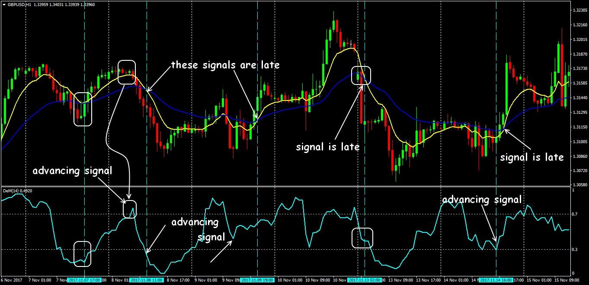

## Table of Contents

## What is the DeMarker Indicator and who developed it?

The DeMarker Indicator, often called DeM, is a tool used in trading to help predict how prices might move in the future. It was created by Tom DeMark, a well-known technical analyst. The indicator works by looking at the difference between the highest price of today and the highest price of yesterday, and the lowest price of today and the lowest price of yesterday. This helps traders figure out if the market is getting too high or too low, which can signal when it might be a good time to buy or sell.

Tom DeMark developed the DeMarker Indicator to give traders a way to see when a trend might be about to change. The indicator uses a value called the DeMarker, which ranges from 0 to 1. When the DeMarker value is high, it might mean the market is overbought and could go down soon. When the value is low, it might mean the market is oversold and could go up soon. Traders use these signals to make decisions about when to enter or exit trades.

## How is the DeMarker Indicator calculated?

The DeMarker Indicator is calculated by looking at the difference between today's high price and yesterday's high price, and the difference between today's low price and yesterday's low price. If today's high is higher than yesterday's high, you take the difference between these two highs. This is called the "up move." If today's low is lower than yesterday's low, you take the difference between these two lows. This is called the "down move." If today's high is not higher than yesterday's high, the up move is zero. If today's low is not lower than yesterday's low, the down move is zero.

Next, you compare the up move and the down move. If there is an up move, you divide it by the larger of the up move or the down move. This gives you the DeMax value. If there is a down move, you divide it by the larger of the up move or the down move. This gives you the DeMin value. Finally, you calculate the DeMarker value by taking the average of the DeMax values over a certain number of periods and dividing it by the sum of the average of the DeMax values and the average of the DeMin values over the same number of periods. This final value, which ranges from 0 to 1, is the DeMarker Indicator.

## What does the DeMarker Indicator measure in the market?

The DeMarker Indicator measures how strong the current trend in the market is. It looks at the difference between today's high and low prices and yesterday's high and low prices. By doing this, it tries to figure out if the market is getting too high or too low. When the DeMarker value is close to 1, it means the market might be overbought, which could mean prices might go down soon. When the DeMarker value is close to 0, it means the market might be oversold, which could mean prices might go up soon.

Traders use the DeMarker Indicator to help them decide when to buy or sell. If the DeMarker value goes above a certain level, like 0.7, it might be a good time to sell because the market could be overbought. If the DeMarker value goes below a certain level, like 0.3, it might be a good time to buy because the market could be oversold. By watching these levels, traders can try to make better decisions about when to enter or [exit](/wiki/exit-strategy) the market.

## How can beginners use the DeMarker Indicator to identify overbought and oversold conditions?

Beginners can use the DeMarker Indicator to identify overbought and oversold conditions by watching its values on a chart. The DeMarker Indicator gives a number between 0 and 1. When this number gets close to 1, like above 0.7, it means the market might be overbought. This is a sign that the price might go down soon, so it could be a good time to sell. On the other hand, when the number gets close to 0, like below 0.3, it means the market might be oversold. This is a sign that the price might go up soon, so it could be a good time to buy.

To use the DeMarker Indicator, beginners should add it to their trading charts. Most trading platforms have this tool available. Once it's on the chart, you can see the DeMarker line moving up and down. If the line goes above 0.7, look for a chance to sell. If the line goes below 0.3, look for a chance to buy. Remember, this is just one tool, and it's a good idea to use it along with other tools and information to make the best trading decisions.

## What are the default settings for the DeMarker Indicator and can they be adjusted?

The default setting for the DeMarker Indicator is usually a period of 14. This means it looks at the last 14 periods of price data to calculate its value. You can see this setting on most trading platforms where you add the DeMarker Indicator to your chart.

Yes, you can change the default setting. If you want to make the DeMarker Indicator react faster to price changes, you can use a smaller number of periods, like 10 or 7. If you want it to be smoother and react slower, you can use a bigger number, like 20 or 25. Just remember, changing the settings can change how the indicator works, so it's good to test different settings to see what works best for you.

## How does the DeMarker Indicator differ from other momentum indicators like the RSI?

The DeMarker Indicator and the Relative Strength Index (RSI) are both [momentum](/wiki/momentum) indicators, but they work in different ways. The DeMarker Indicator looks at the difference between today's high and low prices and yesterday's high and low prices to figure out if the market is overbought or oversold. It gives a number between 0 and 1, and when it's close to 1, it means the market might be overbought, and when it's close to 0, it might be oversold. On the other hand, the RSI looks at the average gains and losses over a set number of periods, usually 14, to find out if the market is overbought or oversold. The RSI gives a number between 0 and 100, and when it's above 70, it might be overbought, and when it's below 30, it might be oversold.

Even though both indicators can help traders see if the market is overbought or oversold, they use different methods to get there. The DeMarker Indicator focuses on the highs and lows of prices, which can give a different view of the market's momentum compared to the RSI, which focuses on average gains and losses. Because of this, traders might use both indicators together to get a better picture of the market and make better trading decisions.

## What are some basic trading strategies that incorporate the DeMarker Indicator?

One basic trading strategy that uses the DeMarker Indicator is to buy when the market is oversold and sell when it is overbought. When the DeMarker value goes below 0.3, it means the market might be oversold. This could be a good time to buy because the price might go up soon. When the DeMarker value goes above 0.7, it means the market might be overbought. This could be a good time to sell because the price might go down soon. By watching these levels, beginners can make simple trading decisions based on when the market looks like it's too high or too low.

Another strategy is to use the DeMarker Indicator along with other tools, like trend lines or moving averages. For example, if the DeMarker shows the market is oversold and the price is also touching a support level, this could be an even stronger sign to buy. On the other hand, if the DeMarker shows the market is overbought and the price is also touching a resistance level, this could be an even stronger sign to sell. Using the DeMarker Indicator with other tools can help traders make better decisions and feel more confident in their trades.

## How can the DeMarker Indicator be used in conjunction with other technical indicators to enhance trading decisions?

The DeMarker Indicator can be used with other technical indicators to make better trading choices. For example, you can use it with moving averages to see when the market is overbought or oversold and also check if the price is following a certain trend. If the DeMarker shows the market is oversold and the price is also below a moving average, it might be a good time to buy because both signs point to the price going up soon. On the other hand, if the DeMarker shows the market is overbought and the price is above a moving average, it might be a good time to sell because both signs point to the price going down soon.

Another way to use the DeMarker Indicator is with the Relative Strength Index (RSI). Both indicators help find when the market is overbought or oversold, but they do it in different ways. If both the DeMarker and the RSI show the market is overbought at the same time, it's a strong sign that the price might drop soon, so you might want to sell. If both show the market is oversold at the same time, it's a strong sign that the price might rise soon, so you might want to buy. Using these indicators together can give you a clearer picture of what's happening in the market and help you make smarter trading decisions.

## What are the limitations and potential pitfalls of using the DeMarker Indicator in trading?

The DeMarker Indicator can be a helpful tool, but it has some limitations that traders need to know about. One big problem is that it can give false signals. This means it might say the market is overbought or oversold when it's not really, and if you make trades based on these signals, you could lose money. Another issue is that the DeMarker Indicator works best in markets that have clear trends. If the market is moving sideways without a clear up or down trend, the DeMarker might not be very useful because it can't predict price changes well in those conditions.

Another potential pitfall is that the DeMarker Indicator is just one tool among many. Relying on it alone without looking at other indicators or market information can lead to bad trading decisions. For example, if you only use the DeMarker and ignore things like news events or other technical indicators, you might miss important signs about what the market will do next. It's always a good idea to use the DeMarker Indicator with other tools to get a fuller picture of the market and make better trading choices.

## How can advanced traders use the DeMarker Indicator to predict market reversals?

Advanced traders can use the DeMarker Indicator to predict market reversals by looking for specific patterns and signals. When the DeMarker value goes above 0.7, it might mean the market is overbought and a reversal to the downside could be coming soon. On the other hand, when the DeMarker value goes below 0.3, it might mean the market is oversold and a reversal to the upside could be coming soon. Advanced traders watch these levels closely and look for other signs, like a divergence between the price and the DeMarker Indicator. If the price is going up but the DeMarker is going down, it might mean the price will soon go down too. This kind of divergence can be a strong signal that a market reversal is about to happen.

To make the most of the DeMarker Indicator, advanced traders often use it with other tools. For example, they might look at support and resistance levels along with the DeMarker. If the DeMarker shows the market is oversold and the price is also near a strong support level, it could be a good time to buy because both signs point to a possible upward reversal. Similarly, if the DeMarker shows the market is overbought and the price is near a strong resistance level, it could be a good time to sell because both signs point to a possible downward reversal. By combining the DeMarker Indicator with other technical analysis tools, advanced traders can get a better idea of when the market might reverse and make smarter trading decisions.

## Can the DeMarker Indicator be effectively used in different market conditions, such as trending vs. ranging markets?

The DeMarker Indicator can be used in different market conditions, but it works better in some than others. In trending markets, where the price is clearly going up or down, the DeMarker Indicator is more helpful. It can signal when the market might be getting too high or too low, which can help traders decide when to buy or sell. For example, if the market is trending up and the DeMarker goes above 0.7, it might be a good time to sell because the market could be overbought and about to go down.

In ranging markets, where the price is moving sideways without a clear trend, the DeMarker Indicator is not as useful. It can still show when the market is overbought or oversold, but these signals might not be as reliable because the price isn't following a clear path. Traders might find the DeMarker giving false signals in these conditions, leading to bad trading choices. So, while the DeMarker can be used in both trending and ranging markets, it's more effective in trending markets where the signals are more likely to be correct.

## What are some case studies or real-world examples where the DeMarker Indicator has been successfully used in trading strategies?

In one real-world example, a trader named Sarah used the DeMarker Indicator to trade stocks. She noticed that whenever the DeMarker value went above 0.7 on a certain stock she was watching, the price would often drop soon after. Sarah used this signal to sell her stocks when the DeMarker hit 0.7, and she was able to make a good profit by selling before the price went down. She also used the DeMarker to buy stocks when the value went below 0.3, which often meant the stock was about to go up. By using these signals, Sarah was able to make successful trades and improve her overall trading strategy.

Another example is a [forex](/wiki/forex-system) trader named John, who combined the DeMarker Indicator with other tools like moving averages. John noticed that when the DeMarker showed the market was oversold and the price was below a key moving average, it was a strong sign to buy. He used this strategy to trade currency pairs and found that it worked well in trending markets. By watching both the DeMarker and the moving average, John was able to catch the start of new trends and make profitable trades. These examples show how the DeMarker Indicator can be a useful tool for traders when used correctly and in the right market conditions.

## How does the DeMarker Indicator work?

Understanding the functionality of the DeMarker Indicator involves analyzing its calculation and the significance of its oscillations. The DeMarker Indicator calculates moving averages of high and low price comparisons to determine market trends. The core of this calculation relies on comparing the high prices of consecutive periods. If the current period's high is greater than the previous period's high, the indicator records the difference. However, if it is not, it logs zero. This comparison helps in identifying the demand for the asset in question.

The formula to calculate the DeMarker Indicator can be expressed as follows:

1. Calculate the DeMax (DeMarker Maximum):
$$
   \text{DeMax}(i) = 
   \begin{cases} 
   \text{High}(i) - \text{High}(i-1) & \text{if High}(i) > \text{High}(i-1) \\
   0 & \text{otherwise}
   \end{cases}

$$

2. Calculate the DeMin (DeMarker Minimum):
$$
   \text{DeMin}(i) = 
   \begin{cases} 
   \text{Low}(i-1) - \text{Low}(i) & \text{if Low}(i) < \text{Low}(i-1) \\
   0 & \text{otherwise}
   \end{cases}

$$

3. Compute the DeMarker Indicator (DeM):
$$
   \text{DeM} = \frac{\text{SMA(DeMax)}}{\text{SMA(DeMax)} + \text{SMA(DeMin)}}

$$

Here, SMA represents the Simple Moving Average, which is often set to a default period of 14 but can be adapted to different timeframes based on the trader’s preference. The choice of period plays a critical role in smoothing out the short-term fluctuations and focusing on the more significant market trends.

The outcome of these calculations is a smoothly oscillating line confined between 0 and 1. When the DeMarker Indicator is nearer to 0, it suggests potential oversold conditions, while values closer to 1 indicate overbought conditions. Monitoring these oscillations allows traders to anticipate possible reversals in the market trend, aiding in the decision-making process.

An example in Python to compute the DeMarker Indicator might look like this:

```python
def calculate_demark(data, period=14):
    demax = [max(data[i]['high'] - data[i-1]['high'], 0) for i in range(1, len(data))]
    demin = [max(data[i-1]['low'] - data[i]['low'], 0) for i in range(1, len(data))]

    sma_demax = [sum(demax[i-period:i]) / period for i in range(period, len(demax)+1)]
    sma_demin = [sum(demin[i-period:i]) / period for i in range(period, len(demin)+1)]

    demarker = [mx / (mx + mn) if (mx + mn) != 0 else 0 for mx, mn in zip(sma_demax, sma_demin)]

    return demarker
```

In this script, `data` is a list of dictionaries containing 'high' and 'low' keys representing the market data for each period. The `calculate_demark()` function computes the DeMarker values for each set of market data.

By interpreting these results, traders can better assess market dynamics, enhancing their ability to effectively respond to changes and identify optimal trading opportunities.

## References & Further Reading

[1]: ["The New Science of Technical Analysis"](https://www.amazon.com/New-Science-Technical-Analysis/dp/0471035483) by Thomas R. DeMark

[2]: DeMark, T. R. (1997). ["DeMark on Day Trading Options: Using Options to Cash in on the Day Trading Phenomenon"](https://archive.org/details/demarkondaytradi0000dema)

[3]: ["Technical Analysis Explained"](https://www.investopedia.com/terms/t/technicalanalysis.asp) by Martin J. Pring

[4]: Wilder Jr, J. W. (1978). ["New Concepts in Technical Trading Systems"](https://archive.org/details/newconceptsintec00wild)

[5]: Caginalp, G., & Laurent, H. W. (1998). "The Predictive Power of Price Patterns." Journal of Technical Analysis, 55, 3-14.