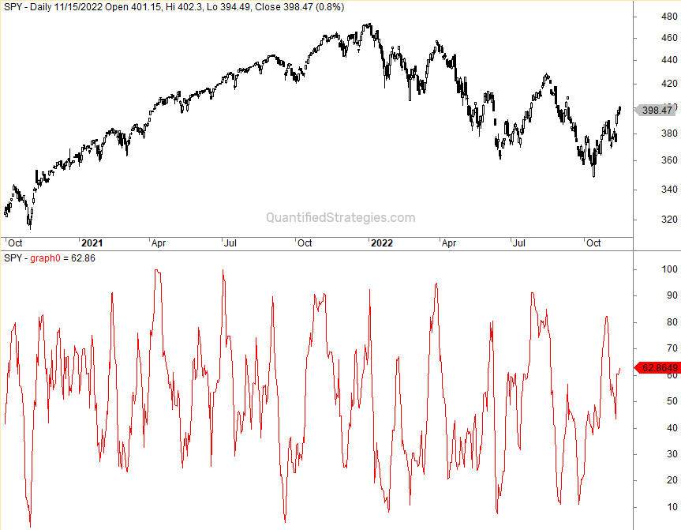

In the world of technical analysis, the DeMarker Indicator (DeM) emerges as a sophisticated tool employed by traders to forecast market trends. Originally developed by Thomas DeMark, the indicator seeks to evaluate the demand for an asset by comparing price movements over different trading periods. This technical oscillator assists traders in identifying overbought and oversold market conditions, facilitating more informed trading decisions.

The DeMarker Indicator is mathematically bounded between 0 and 1, with crucial thresholds generally set at 0.3 and 0.7. These levels serve as alert zones for traders: values above 0.7 signal an overbought condition, potentially indicating a price correction, while values below 0.3 suggest an oversold market, possibly leading to a price rally.



This article explores the intricacies of the DeMarker Indicator, including its calculation, application in trading strategies, and use in algorithmic trading. Moreover, it contrasts the DeMarker Indicator with other popular tools like the Relative Strength Index (RSI), providing traders with a nuanced understanding of its unique characteristics.

The DeMarker Indicator, while powerful, has its strengths and limitations. By understanding these aspects, traders can comprehensively enhance their trading toolkit. Whether you are a novice or an experienced trader, mastering the DeMarker Indicator can significantly elevate your market analysis capabilities. By incorporating this tool into trading strategies, both manual and algorithmic, traders can fine-tune their responses to market dynamics, aiming for more accurate and profitable trading outcomes.

## Table of Contents

## What is the DeMarker Indicator?

The DeMarker Indicator, commonly abbreviated as DeM, is a technical analysis tool developed by renowned financial analyst Thomas DeMark. It serves as an oscillator, a type of indicator that fluctuates between set levels, designed to assess the demand for an asset by comparing the high and low prices of the current period with those of the preceding period. This comparison helps traders evaluate potential price exhaustion points and directional changes in the market.

The primary function of the DeMarker Indicator is to identify overbought and oversold conditions by using bounds typically between 0 and 1. Generally, levels above 0.7 suggest that the asset may be overbought, indicating a possible downside correction or reversal, whereas levels below 0.3 suggest oversold conditions, indicating a potential for upside reversal. These thresholds are instrumental for traders in forecasting market tops and bottoms, effectively making the DeMarker Indicator a valuable tool for risk assessment and market timing.

Mathematically, the DeMarker Indicator can be formulated by calculating a ratio where the numerator captures the sum of differences between the current and previous high prices (whenever the current high is greater than the previous high, else zero) over a specified period. The denominator represents the sum of all upward and downward differences over the same period, ensuring that the indicator remains within its defined range. Here's a simplified Python snippet illustrating the basic calculation structure:

```python
def calculate_de_marker(highs, lows, period=14):
    de_max = []
    de_min = []

    for i in range(1, len(highs)):
        de_max.append(max(0, highs[i] - highs[i-1]))
        de_min.append(abs(min(0, lows[i] - lows[i-1])))

    de_max_sum = sum(de_max[-period:])
    de_min_sum = sum(de_min[-period:])

    de_marker = de_max_sum / (de_max_sum + de_min_sum) if (de_max_sum + de_min_sum) != 0 else 0
    return de_marker

# Example usage
high_prices = [110, 112, 115, 113, 117]
low_prices = [107, 108, 110, 111, 115]
de_marker_value = calculate_de_marker(high_prices, low_prices)
```

Due to its construction, the DeMarker Indicator is viewed as more robust in some scenarios compared to other oscillators, such as the RSI (Relative Strength Index), because it focuses on intraday price extremes rather than closing prices. This feature can provide early signals of market reversals, assisting traders in optimizing their entry and [exit](/wiki/exit-strategy) points across different asset classes and timeframes.

## How Does the DeMarker Indicator Work?

Understanding the functionality of the DeMarker Indicator involves analyzing its calculation and the significance of its oscillations. The DeMarker Indicator calculates moving averages of high and low price comparisons to determine market trends. The core of this calculation relies on comparing the high prices of consecutive periods. If the current period's high is greater than the previous period's high, the indicator records the difference. However, if it is not, it logs zero. This comparison helps in identifying the demand for the asset in question.

The formula to calculate the DeMarker Indicator can be expressed as follows:

1. Calculate the DeMax (DeMarker Maximum):
$$
   \text{DeMax}(i) = 
   \begin{cases} 
   \text{High}(i) - \text{High}(i-1) & \text{if High}(i) > \text{High}(i-1) \\
   0 & \text{otherwise}
   \end{cases}

$$

2. Calculate the DeMin (DeMarker Minimum):
$$
   \text{DeMin}(i) = 
   \begin{cases} 
   \text{Low}(i-1) - \text{Low}(i) & \text{if Low}(i) < \text{Low}(i-1) \\
   0 & \text{otherwise}
   \end{cases}

$$

3. Compute the DeMarker Indicator (DeM):
$$
   \text{DeM} = \frac{\text{SMA(DeMax)}}{\text{SMA(DeMax)} + \text{SMA(DeMin)}}

$$

Here, SMA represents the Simple Moving Average, which is often set to a default period of 14 but can be adapted to different timeframes based on the trader’s preference. The choice of period plays a critical role in smoothing out the short-term fluctuations and focusing on the more significant market trends.

The outcome of these calculations is a smoothly oscillating line confined between 0 and 1. When the DeMarker Indicator is nearer to 0, it suggests potential oversold conditions, while values closer to 1 indicate overbought conditions. Monitoring these oscillations allows traders to anticipate possible reversals in the market trend, aiding in the decision-making process.

An example in Python to compute the DeMarker Indicator might look like this:

```python
def calculate_demark(data, period=14):
    demax = [max(data[i]['high'] - data[i-1]['high'], 0) for i in range(1, len(data))]
    demin = [max(data[i-1]['low'] - data[i]['low'], 0) for i in range(1, len(data))]

    sma_demax = [sum(demax[i-period:i]) / period for i in range(period, len(demax)+1)]
    sma_demin = [sum(demin[i-period:i]) / period for i in range(period, len(demin)+1)]

    demarker = [mx / (mx + mn) if (mx + mn) != 0 else 0 for mx, mn in zip(sma_demax, sma_demin)]

    return demarker
```

In this script, `data` is a list of dictionaries containing 'high' and 'low' keys representing the market data for each period. The `calculate_demark()` function computes the DeMarker values for each set of market data.

By interpreting these results, traders can better assess market dynamics, enhancing their ability to effectively respond to changes and identify optimal trading opportunities.

## Trading Strategies with the DeMarker Indicator

The DeMarker Indicator is a vital instrument for traders focusing on predicting price reversals, with its strategic applications significantly impacting trading performance. Among the primary strategies, the zero crossover technique plays a pivotal role. When the DeMarker Indicator crosses the 0.5 threshold, traders interpret this movement as a potential signal for a trend reversal. This crossing indicates a shift in the buying or selling strength of the asset, prompting traders to reassess their positions.

Overbought and oversold levels are equally important in employing the DeMarker Indicator effectively. Typically, values above 0.7 suggest an overbought condition, serving as a potential cue to exit long positions or enter short positions. Conversely, values below 0.3 indicate an oversold market, often seen as a buying opportunity. This approach assists traders in identifying optimal entry and exit points, thereby increasing trading precision and reducing risk exposure.

Enhancing the accuracy of trading signals, the DeMarker Indicator can be combined with other analytical tools such as the Fibonacci retracement and the Moving Average Convergence Divergence (MACD) indicator. For example, aligning the DeMarker's reversal signals with Fibonacci levels provides a robust method for identifying price targets and potential retracement levels. Similarly, integrating it with the MACD can confirm trend strength and [momentum](/wiki/momentum), offering a multi-faceted view of market dynamics.

Furthermore, the DeMarker Indicator is extensively utilized in [algorithmic trading](/wiki/algorithmic-trading) strategies. Algorithms can be programmed to automate buy and sell decisions based on DeMarker readings, streamlining the trading process and removing emotional biases. Python, among other programming languages, is frequently employed to code such strategies. For instance, a simple Python script could execute trades when the DeMarker crosses predefined thresholds:

```python
import pandas as pd

# Sample function to implement a DeMarker-based strategy
def demarker_strategy(data, period=14):
    data['DeMarker'] = (data['High'] - data['Low']).rolling(window=period).mean() / data['High'].rolling(window=period).mean()
    buy_signals = data[data['DeMarker'] < 0.3] 
    sell_signals = data[data['DeMarker'] > 0.7]
    return buy_signals, sell_signals

# Assuming 'df' is a DataFrame containing price data
buy, sell = demarker_strategy(df)

# Use buy and sell signals for trading decisions
```

Algorithmic trading with the DeMarker Indicator mandates [backtesting](/wiki/backtesting) to refine these strategies for better performance under various market conditions. This backtesting ensures that the strategies can effectively adapt to different market environments, reducing the risk of false signals that can occur, particularly in volatile markets.

## Algorithmic Trading with the DeMarker Indicator

Algorithmic trading leverages the DeMarker Indicator by translating its quantifiable signals into programmable strategies, facilitating automatic market entry and exit decisions. At its core, the DeMarker Indicator evaluates price action by assessing the relationship between current and past high and low prices. In algorithmic trading systems, these readings can be integrated with other technical indicators to enhance decision-making accuracy and improve overall performance.

To effectively employ the DeMarker Indicator in algorithmic trading, traders commonly use algorithms to initiate buy and sell orders based on its readings. A typical algorithm might look as follows in Python:

```python
def demarker_strategy(data, period=14):
    dem_values = []
    for i in range(period, len(data)):
        high_diffs = [max(data[j]['high'] - data[j-1]['high'], 0) for j in range(i-period, i)]
        low_diffs = [max(data[j-1]['low'] - data[j]['low'], 0) for j in range(i-period, i)]

        dem = (sum(high_diffs) / period) / (sum(high_diffs) / period + sum(low_diffs) / period)
        dem_values.append(dem)
    return dem_values

# Example usage on price data
price_data = [{'high': h, 'low': l} for h, l in zip(high_prices, low_prices)]
demarker_values = demarker_strategy(price_data)
```

Backtesting plays a crucial role in refining these algorithms to ensure their effectiveness under diverse market conditions. By simulating the algorithm's performance on historical data, traders can identify potential weaknesses or false signals generated by the indicator. These tests help to calibrate the parameters of the DeMarker Indicator or integrate additional filters and indicators, such as moving averages or Bollinger Bands, to confirm signals and reduce the risk of errors.

The adaptability of the DeMarker Indicator across different timeframes makes it attractive in building comprehensive trading systems. Its flexibility allows for adjustments that can align with specific market dynamics or trading styles. However, caution is imperative, as false signals may still arise, particularly amid volatile market conditions. To mitigate this risk, validation against multiple indicators is recommended. For instance, traders might confirm a DeMarker-based signal with a Relative Strength Index (RSI) reading or a Moving Average Convergence Divergence (MACD) crossover.

By seamlessly integrating the DeMarker Indicator into algorithmic frameworks, traders can harness its potential to generate precise trading signals. The process involves continual monitoring and adjusting strategies in response to shifting market paradigms, ensuring robust system performance and improved trading outcomes.

## Pros and Cons of the DeMarker Indicator

The DeMarker Indicator, a favored tool among traders, presents both advantages and limitations that are important to consider. Among its primary benefits is the ability to provide early signals of trend reversals. This feature is particularly advantageous for traders looking to anticipate market movements and optimize their entry and exit points. The adaptability of the DeMarker Indicator across various timeframes and asset classes further enhances its utility, allowing traders to customize their strategies to suit different trading environments.

A significant advantage of the DeMarker Indicator is its focus on price patterns rather than solely on closing prices. This focus results in the indicator being less susceptible to distortions that can affect indicators relying on closing prices, providing a more stable reference for identifying overbought or oversold conditions. Unlike some other oscillators, the DeMarker Indicator's calculation based on intra-period high and low prices grants it a distinctive edge in recognizing price movements and potential pivots in the market.

Despite these strengths, the DeMarker Indicator is not without its drawbacks. One notable limitation is the propensity to generate false signals, particularly in volatile market conditions. This characteristic necessitates cautious use, requiring traders to complement the DeMarker Indicator with additional indicators or tools to verify its signals. Combining it with other technical indicators, such as Moving Average Convergence Divergence (MACD) or the Relative Strength Index (RSI), can mitigate the risk of acting on inaccurate signals.

To ensure the efficacy of DeMarker-based strategies, rigorous backtesting and real-time performance analysis are essential. Traders should implement historical data testing to ascertain the reliability of their strategies and assess how they perform under different market conditions. By continuously refining their approach through backtesting, traders can better understand the strengths and limitations of the DeMarker Indicator, aligning their strategies to the dynamic nature of financial markets.

## Conclusion

The DeMarker Indicator serves as a multifaceted instrument for traders aiming to manage complex market conditions effectively. It excels in forecasting short-term price fluctuations and recognizing points of market exhaustion, rendering it indispensable for both manual and algorithmic trading strategies. Its predictive capabilities, however, are not foolproof. When integrated with complementary indicators, such as the Relative Strength Index (RSI) or Moving Average Convergence Divergence (MACD), the DeMarker Indicator can substantially improve the precision of trading decisions.

To sustain the effectiveness of DeMarker-based strategies, continuous learning and adaptability in response to evolving market dynamics are essential. The volatile nature of financial markets mandates a rigorous approach to strategy refinement. Traders are advised to consistently update their methodologies and confirm their validity through thorough backtesting. This process not only helps in recognizing patterns and potential pitfalls but also aids in optimizing algorithms to execute trades more efficiently.

Backtesting serves as a critical component in strategy development. By simulating trading strategies against historical data, it enables traders to assess their potential performance in real-time conditions. This iterative process is vital for identifying and rectifying weaknesses in a trading strategy, ensuring that it remains resilient across diverse market scenarios. In conclusion, while the DeMarker Indicator itself is a powerful tool, its true potential is realized when used as part of a comprehensive, well-validated trading system.

## References & Further Reading

[1]: ["The New Science of Technical Analysis"](https://www.amazon.com/New-Science-Technical-Analysis/dp/0471035483) by Thomas R. DeMark

[2]: DeMark, T. R. (1997). ["DeMark on Day Trading Options: Using Options to Cash in on the Day Trading Phenomenon"](https://archive.org/details/demarkondaytradi0000dema)

[3]: ["Technical Analysis Explained"](https://www.investopedia.com/terms/t/technicalanalysis.asp) by Martin J. Pring

[4]: Wilder Jr, J. W. (1978). ["New Concepts in Technical Trading Systems"](https://archive.org/details/newconceptsintec00wild)

[5]: Caginalp, G., & Laurent, H. W. (1998). "The Predictive Power of Price Patterns." Journal of Technical Analysis, 55, 3-14.