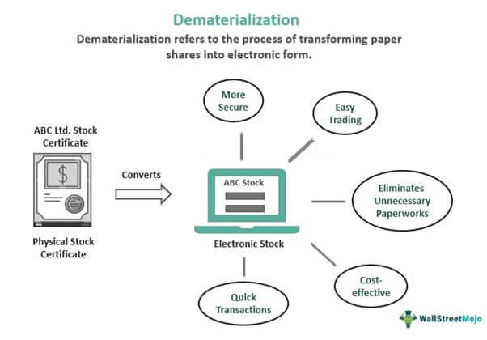

This article explores the integration of financial processes, specifically focusing on DEMAT (Dematerialization) and algorithmic trading. Dematerialization represents a pivotal shift in financial markets by converting physical securities into electronic formats. This transformation has led to enhanced efficiency, reduced risk, and streamlined operations within financial markets. It addresses traditional issues associated with paper-based securities such as theft, damage, and delays in transfers.

On the other hand, algorithmic trading, or algo trading, employs computer algorithms to automate trading decisions. This method of trading capitalizes on speed and accuracy, executing orders at a rate impossible for manual trades. It reduces human error, improves market liquidity, and lowers transaction costs.



The article will discuss the benefits, processes, and implications of dematerialization, and how it intertwines with modern trading methods like algorithmic trading. By examining these modern financial processes and their integration, the article aims to provide insights into how they collectively contribute to the liquidity, transparency, and overall efficiency of today's financial markets. This exploration will show how such advancements in technology continue to redefine the landscape of global finance.

## Table of Contents

## Understanding Dematerialization (DEMAT)

Dematerialization (DEMAT) represents a fundamental shift in the management and trading of securities, transitioning from traditional paper-based documents to digital formats. This transformation is instrumental in minimizing risks associated with physical certificates, such as theft, loss, or damage, and in streamlining the trading and settlement processes. The advent of DEMAT accounts has provided investors with a reliable and efficient method to manage their securities. 

DEMAT accounts serve as electronic repositories where securities are held and transferred seamlessly, eradicating the need for physical handling of certificates. This electronic format allows for immediate and secure transactions, thus mitigating the delays that traditionally plagued paper-based processes. The automation inherent in DEMAT accounts facilitates real-time updates and transaction records, greatly enhancing transparency for all stakeholders involved.

A critical benefit of dematerialization is the reduction in the administrative burden typically associated with physical securities. The automatic updating of transactions in a DEMAT account simplifies auditing procedures for investors and regulatory authorities. This ease of access to transaction history fosters greater compliance with regulatory requirements and enhances overall market integrity.

The implementation of DEMAT systems has revolutionized securities management by providing a digital framework that supports a more efficient, secure, and transparent financial market.

## The Process of Dematerialization

Opening a DEMAT (Dematerialization) account is a foundational step for investors transitioning from physical to electronic securities, aimed at facilitating efficient and secure trading processes. The procedure begins with selecting a Depository Participant (DP), an intermediary entity that acts as a link between the investor and the central depository. The choice of a DP often depends on factors such as fees, services offered, and their reputation in the market.

Once a DP is chosen, investors are required to fulfill the Know Your Customer (KYC) protocol. This involves submitting personal identification documents such as a government-issued ID, address proof, and, in some cases, financial documents. These steps establish the investor's identity and help in maintaining the security and credibility of financial transactions.

The next phase involves the submission of physical certificates. Investors must present these physical securities to the DP for conversion into electronic format. This process is critical, as it marks the transition from paper-based ownership to digital management of assets. The DP collaborates closely with registrar and transfer [agents](/wiki/agents) to authenticate and authorize the conversion. These agents verify the ownership details and ensure there are no discrepancies before the conversion is processed.

After verification, the electronic recording of securities is authorized. This process includes updating the central depository's records to reflect the electronic format of the previously physical securities. Once the conversion is successfully verified and recorded, the securities are credited to the investor's DEMAT account. This step is crucial as it allows investors immediate access to their holdings for trading and management.

The final result is a streamlined process that significantly enhances ease of transaction, mitigates the risk associated with physical certificate loss or damage, and simplifies the management of securities. The switch to electronic formats thus provides a secure, efficient, and transparent platform for trading in the modern financial marketplace.

## Benefits of Dematerialization

Dematerialization has revolutionized the management of securities by transforming them from physical to electronic formats. This shift provides numerous advantages, fundamentally enhancing the security, efficiency, and cost-effectiveness of financial transactions.

One of the primary benefits of dematerialization is the marked increase in security. Physical certificates are susceptible to risks such as theft, damage, or loss. By converting these securities to a dematerialized form, these vulnerabilities are effectively eliminated. Electronic records are securely stored and backed up, reducing the risk of unauthorized access or misplacement.

The process of dematerialization significantly accelerates transaction processing and settlement times. Without the need for physical exchange or verification of paper certificates, transactions can be executed much faster. This increase in speed not only improves [liquidity](/wiki/liquidity-risk-premium) in the market but also allows investors to react more swiftly to market changes, enhancing their ability to capitalize on opportunities.

Cost reduction is another significant advantage of dematerialization. Handling physical certificates often involves substantial storage, handling, and administrative expenses. By transitioning to electronic records, these costs are substantially lowered. This reduction in overheads not only benefits financial institutions but also results in lower fees for investors.

Investors also gain from increased transparency and streamlined trading operations with dematerialized securities. Electronic records facilitate easier tracking and management of assets, providing clear and immediate insight into investment portfolios. This transparency extends to regulatory bodies, aiding in more efficient compliance and auditing processes. The ease of auditing provided by digital records ensures that all transactions are readily verifiable and traceable, promoting trust and integrity in financial markets.

Overall, the move towards electronic securities via dematerialization marks a pivotal shift in financial markets, offering enhanced security, efficiency, and transparency, while simultaneously reducing costs for all parties involved.

## Algorithmic Trading in the Financial Markets

Algorithmic trading, often referred to as algo trading, revolutionizes how financial transactions occur by utilizing computer algorithms to automate trading decisions. These algorithms operate based on pre-set rules and conditions, streamlining the process for buying and selling securities with precision and at unprecedented speeds. This approach to trading starkly contrasts with traditional manual trading, primarily due to its ability to execute trades at a speed and frequency that are beyond human capability.

A primary advantage of algo trading is its contribution to market liquidity. By enabling rapid trade execution, it helps maintain a continuous flow of transactions, which is crucial in keeping markets active and reducing the bid-ask spreads. This enhanced liquidity is beneficial not only for individual traders but also for the overall efficiency of the market.

Moreover, [algorithmic trading](/wiki/algorithmic-trading) significantly reduces transaction costs. By minimizing the need for constant human oversight and intervention, automated systems operate more cost-effectively. They optimize the timing and [volume](/wiki/volume-trading-strategy) of trades based on market conditions, reducing the impact costs associated with larger trades and volatile markets.

Algo trading also minimizes human error. With trading decisions made based on well-defined algorithms, the trading process becomes less prone to the common mistakes that occur in manual trading, such as misjudgment and emotional decision-making. Automated systems consistently adhere to their programmed strategies, ensuring that trades align with the predetermined criteria without deviation.

Understanding algorithmic trading is crucial for leveraging modern financial systems, especially for institutional investors and high-frequency traders. These participants rely on the analytical and execution capabilities that algo trading offers to manage large volumes of assets efficiently. High-frequency trading ([HFT](/wiki/high-frequency-trading-strategies)), a subset of algorithmic trading, exemplifies this reliance. HFT strategies capitalize on small price discrepancies across different markets or securities by executing a vast number of trades in fractions of a second.

In summary, algorithmic trading stands as a cornerstone of contemporary financial markets, offering enhancements in speed, efficiency, and accuracy. Its evolution continues to influence how trading is conducted, encouraging widespread adoption among various market participants. Understanding and implementing these systems can offer significant competitive advantages in today's fast-paced economic environments.

## Integration of Dematerialization and Algorithmic Trading

The integration of dematerialization and algorithmic trading has fundamentally enhanced the efficiency and effectiveness of modern financial markets. The digital nature of dematerialized securities aligns seamlessly with the precision and speed required by algorithmic trading systems, forming an essential backbone for contemporary financial operations.

Dematerialized securities, by existing in digital form, offer a streamlined and secure method for managing transactions, thereby facilitating the rapid execution of trades that algorithmic systems demand. This transformation from physical to electronic form permits real-time updates and near-instantaneous settlements, essential for executing high-frequency trades and complex strategies that define algorithmic trading.

Automated transactions conducted through algorithmic trading rely heavily on the integrity and swiftness of electronic securities processing. The architecture of these systems often involves algorithms designed to parse large datasets, analyze market conditions, and execute trades at scales and speeds unattainable through manual trading. For instance, a typical algorithm might evaluate thousands of data points per second, making instant decisions based on pre-defined criteria like price movements, market news, or technical indicators. This rapid decision-making process is underpinned by computational models and can be illustrated through basic pseudocode:

```python
def execute_trade(security, criteria, threshold):
    if criteria(security) >= threshold:
        place_order(security)
```

The synergy between dematerialized securities and algorithmic systems facilitates seamless execution strategies. The electronic format supports sophisticated trading algorithms capable of executing multiple simultaneous trades, adjusting positions optimally to market conditions without the delays associated with physical securities. Such capabilities enhance overall market liquidity and stability, ensuring that price discovery processes are supported by data rather than manual intervention.

As both processes of dematerialization and algorithmic trading continue to evolve, they consistently redefine modern financial trading. Innovations such as [artificial intelligence](/wiki/ai-artificial-intelligence) and [machine learning](/wiki/machine-learning) are being integrated to improve predictive accuracy and strategy development within algorithmic systems. Meanwhile, ongoing advancements in digital security and blockchain technologies promise even greater reliability and transparency for dematerialized security transactions. The convergence of these technologies is set to further transform global financial markets, promoting efficiency and effectively bridging market access gaps worldwide.

## Future Trends and Developments

Technological advancements are set to profoundly influence the future of dematerialization and algorithmic trading. One of the most significant technologies expected to impact these areas is blockchain. Its decentralized and immutable nature enhances security and transparency, crucial for electronic transactions. By offering a distributed ledger system, blockchain reduces the risks associated with central point failures and ensures real-time access to up-to-date records for all parties involved. This can enhance the integrity of securities transactions, making the financial markets more robust and less susceptible to fraud.

Alongside blockchain, artificial intelligence (AI) and machine learning are poised to transform algorithmic trading. These technologies can analyze vast amounts of data faster and more accurately than humans, allowing for highly sophisticated predictive analytics. This can lead to more accurate modeling of market behavior and better-informed trading decisions. Machine learning algorithms can adapt to changing market conditions, continuously optimizing trading strategies without human intervention. For instance, the use of neural networks and [deep learning](/wiki/deep-learning) can discern complex patterns from historical data, which can then inform trading models that predict stock price movements or identify [arbitrage](/wiki/arbitrage) opportunities.

The global expansion of these technologies holds promise for increasing inclusivity in financial markets, particularly in emerging economies. By providing secure, transparent, and efficient trading mechanisms, blockchain can facilitate access to markets that were previously out of reach due to infrastructure limitations. Similarly, algorithmic trading systems backed by AI can enable these economies to participate in global markets with greater efficiency and lower transaction costs. This democratization of financial markets can lead to enhanced economic development and diversification in regions that adopt these advanced technologies.

In conclusion, the integration of blockchain, AI, and machine learning with dematerialization and algo trading is expected to lead to more secure, transparent, and efficient financial markets. The continuous evolution of these technologies promises to open new opportunities and redefine the dynamics of trading globally.

## Conclusion

The modernization of financial processes through dematerialization and algorithmic trading has profoundly transformed market dynamics, yielding substantial benefits for investors and enhancing the efficiency of trading operations. The shift from physical securities to electronic formats eradicates many historical inefficiencies and limitations associated with paper-based systems. By dematerializing securities, the financial market mitigates risks such as theft, loss, and damage, thereby increasing investor confidence and transactional security.

Algorithmic trading, on the other hand, automates and accelerates trade execution, providing unmatched speed and precision. This automation not only enhances market liquidity but also reduces transaction costs and minimizes human errors. The integration of dematerialization and algorithmic trading represents a synergy that leverages the strengths of both processes, facilitating a level of market efficiency and accessibility previously unattainable.

As technology continues to advance, with innovations such as blockchain and artificial intelligence, further enhancements in security, transparency, and data-driven decision-making are anticipated. These technological developments promise to refine how financial markets operate, ensuring they adapt swiftly to the needs of a globalized economy.

For stakeholders in the financial sector, understanding and adapting to these technological transformations is imperative. The ability to capitalize on the evolving landscape of global finance hinges on a comprehensive grasp of these developments, which continue to redefine market strategies and operations. The future belongs to those who not only embrace but also proactively harness the potential of modern financial technologies.

## References & Further Reading

[1]: Banks, E., & Dunn, R. (2015). ["Practical Risk Management: The Identification, Assessment and Mitigation of Risk."](https://www.semanticscholar.org/paper/Practical-Risk-Management%3A-An-Executive-Guide-to-Banks-Dunn/03a84701ccbe5adf0632b6cda18dbfcb953b80b1) Palgrave Macmillan.

[2]: ["Advances in Financial Machine Learning"](https://www.amazon.com/Advances-Financial-Machine-Learning-Marcos/dp/1119482089) by Marcos Lopez de Prado

[3]: Malz, A. M. (2011). ["Financial Risk Management: Models, History, and Institutions."](https://www.wiley.com/en-us/Financial+Risk+Management%3A+Models%2C+History%2C+and+Institutions-p-9781118022917) John Wiley & Sons.

[4]: ["Algorithmic Trading: Winning Strategies and Their Rationale"](https://www.amazon.com/Algorithmic-Trading-Winning-Strategies-Rationale-ebook/dp/B00CY5HC0U) by Ernest P. Chan

[5]: Jha, M. K. (2021). ["Demystifying Algorithmic Trading"](https://www.researchgate.net/publication/378548435_Algorithmic_Trading_and_AI_A_Review_of_Strategies_and_Market_Impact) Apress.