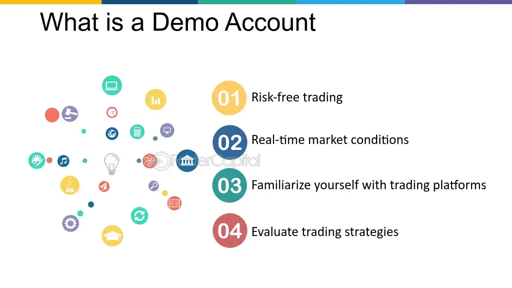

## Table of Contents

## What is a demo account in the context of investing?

A demo account in the context of investing is like a practice account where you can try out investing without using real money. It's a safe way to learn how to buy and sell stocks, bonds, or other investments. You get pretend money to use, so you can see what it's like to make investment decisions without any risk of losing your own money.

Using a demo account helps you get familiar with how the stock market works and how to use trading platforms. You can experiment with different strategies and see how they might work out without any real financial consequences. It's a great tool for beginners who want to gain confidence before they start investing with real money.

## How can someone set up a demo account for trading?

To set up a demo account for trading, you first need to choose a brokerage or trading platform that offers demo accounts. Many popular platforms like eToro, Plus500, and TD Ameritrade have demo accounts available. Once you've picked a platform, go to their website and look for an option to sign up for a demo or practice account. You'll usually need to provide some basic information like your name and email address. After signing up, you'll be given a set amount of virtual money to start trading with.

Once your demo account is set up, you can start exploring the platform and practicing trading. You can buy and sell stocks, [forex](/wiki/forex-system), or other financial instruments using the virtual money. This is a great way to get used to how the platform works and to try out different trading strategies without any risk. Remember, the goal is to learn and practice, so take your time and don't rush into making decisions. When you feel confident and ready, you can then move on to trading with real money.

## What are the main differences between demo accounts and real trading accounts?

The main difference between a demo account and a real trading account is the money you use. In a demo account, you trade with virtual money that isn't real, so you can't lose or gain any actual money. This means you can practice trading without any risk. In a real trading account, you use your own money, so if you make a bad trade, you could lose money. This makes real trading more stressful and serious because your financial decisions have real consequences.

Another key difference is the emotions involved. When you're using a demo account, you might not feel the same pressure or excitement because you know it's not real money. But in a real account, your emotions can play a bigger role. You might feel more nervous or excited, which can affect your decisions. Also, demo accounts often have different features or tools compared to real accounts, so the trading experience might not be exactly the same. This is why it's important to practice a lot with a demo account before moving to a real one, so you can get used to the platform and understand how to handle your emotions when real money is on the line.

## Can demo accounts accurately simulate real market conditions?

Demo accounts try their best to copy real market conditions, but they can't be perfect. They use real market data to show prices and movements, so you can see how stocks or other investments change over time. But sometimes, there might be small delays or differences because the demo account is not connected to the actual market in the same way a real account is.

Also, the way you feel when using a demo account is different from a real account. When you're using pretend money, you might take bigger risks or not feel as worried about losing money. But when it's your real money on the line, you can feel more nervous or excited, which can change how you make decisions. So while demo accounts are great for practice, they can't fully show you what it's like to trade with real money and real emotions.

## How can beginners use demo accounts to learn about investing?

Beginners can use demo accounts to learn about investing by practicing how to buy and sell stocks without using real money. They can start by exploring the trading platform, getting familiar with its features, and understanding how to place orders. As they practice, they can try different investing strategies, like buying low and selling high, and see how these strategies work without risking any real money. This helps them learn from their mistakes without losing anything, which can build their confidence and knowledge.

Another way beginners can use demo accounts is to get a feel for how the market moves. They can watch how stock prices change over time and learn about market trends. By doing this, they can start to understand what affects stock prices and how to make better investing decisions. It's like playing a game where they can experiment and learn at their own pace, which makes it easier for them to understand the basics of investing before they start using real money.

## What common mistakes do people make when using demo accounts?

People often make the mistake of thinking that demo accounts are exactly like real trading. They might forget that in a demo account, they are using pretend money, so they can take bigger risks without worrying. But when they move to a real account, these big risks can lead to big losses because it's their real money on the line. It's important to remember that a demo account is just for practice and doesn't feel the same as trading with real money.

Another common mistake is not using the demo account long enough. Some people rush into real trading without spending enough time learning on the demo account. They might think they know enough after a few trades, but investing takes time to learn. It's better to practice for a while, try different strategies, and understand how the market works before moving to a real account. This helps them avoid costly mistakes when they start using real money.

## How can demo account performance be used to gauge investment proficiency?

Demo account performance can show how well someone understands investing, but it's not perfect. When you use a demo account, you can see if you're making good choices by looking at how much your pretend money grows or shrinks. If you're doing well, it might mean you're learning how to pick good investments and when to buy or sell. But remember, it's easier to make decisions with pretend money because you're not worried about losing real money. So, while it's a good way to practice, it doesn't show everything you need to know about real investing.

It's also important to think about how you feel when using a demo account. In a real account, you might feel more nervous or excited because it's your real money. These feelings can change how you make decisions. So, if you do well on a demo account, it's a good sign, but it doesn't mean you'll do the same with real money. You need to keep learning and practicing to get better at investing, and always remember that a demo account is just a practice tool, not the real thing.

## Are there specific strategies that work better in demo accounts than in real accounts?

Some strategies might work better in demo accounts because you're using pretend money. In a demo account, you might feel more comfortable taking big risks because you're not worried about losing real money. For example, you might try [day trading](/wiki/day-trading-spy) a lot or investing in very risky stocks. These strategies can seem to work well in a demo account because you can see big gains without any real risk. But in a real account, these same strategies could lead to big losses because it's your real money on the line.

In real accounts, people often feel more nervous and might stick to safer strategies. They might choose to invest in more stable stocks or use a long-term approach instead of trying to make quick profits. The emotions you feel when using real money can make you more cautious and less likely to take big risks. So, while some risky strategies might look good in a demo account, they might not work as well or be as safe in a real account where your money is at stake.

## How do experienced investors utilize demo accounts to refine their strategies?

Experienced investors use demo accounts to test out new strategies without risking their real money. They might want to try a new way of investing, like using options or trading in a different market. By using a demo account, they can see how their new strategy works over time without worrying about losing money. They can make changes and see what happens, which helps them understand if the strategy is good or if it needs more work.

Demo accounts also help experienced investors keep their skills sharp. Even if they know a lot about investing, the market can change, and new tools or platforms might come out. By practicing on a demo account, they can get used to these changes and make sure they're still good at what they do. It's like a practice field where they can try new things and keep getting better at investing without any real risk.

## What advanced features should expert traders look for in demo accounts?

Expert traders should look for demo accounts that have advanced charting tools. These tools help them see how prices move over time and spot patterns that can tell them when to buy or sell. They should also make sure the demo account has real-time data, so they can practice trading with the same information they would get in a real account. This helps them get used to making quick decisions based on the latest market changes.

Another important feature is the ability to use different order types, like stop-loss and limit orders. These help expert traders manage their risks and make sure they can buy or sell at the prices they want. Demo accounts should also let them try out different strategies, like trading options or futures, so they can see how these work without risking real money. By using these advanced features, expert traders can practice and refine their skills in a safe environment.

## How can demo account data be analyzed to improve investment decisions?

Demo account data can help people make better investment choices by showing them how well their strategies work. When you practice trading on a demo account, you can look at the data to see which investments made money and which ones lost money. This helps you understand what kinds of stocks or other investments work best for you. You can also see how different strategies, like buying low and selling high, work over time. By studying this data, you can figure out what to do differently to make better decisions in the future.

Another way to use demo account data is to see how you handle risk. You can look at how much money you were willing to risk on each trade and how that affected your results. If you took too many big risks and lost a lot of pretend money, you might want to be more careful in a real account. On the other hand, if you were too safe and didn't make much money, you might want to take a few more risks. By analyzing the data from your demo account, you can learn how to balance risk and reward better, which can help you make smarter investment choices when you use real money.

## What are the limitations of demo accounts in predicting real-world investment success?

Demo accounts are great for practice, but they can't perfectly predict how well you'll do in real investing. One big reason is that demo accounts use pretend money, so you might take bigger risks than you would with real money. When it's not your real money on the line, you might not feel as worried about losing it, so you could make decisions that you wouldn't make in a real account. Also, demo accounts might not show all the real-time changes and fees that you would see in a real account, which can affect how much money you make or lose.

Another limitation is that demo accounts don't show the emotions you feel when using real money. In a real account, you might feel more nervous or excited, and these feelings can change how you make decisions. For example, you might sell a stock too quickly because you're scared of losing money, or you might hold onto a losing stock hoping it will go back up. These emotional decisions can make a big difference in your success, and a demo account can't show you how you'll handle these feelings. So, while demo accounts are helpful for learning, they can't tell you exactly how you'll do when you start investing with real money.

## References & Further Reading

[1]: Bergstra, J., Bardenet, R., Bengio, Y., & Kégl, B. (2011). ["Algorithms for Hyper-Parameter Optimization."](https://dl.acm.org/doi/10.5555/2986459.2986743) Advances in Neural Information Processing Systems 24.

[2]: ["Advances in Financial Machine Learning"](https://www.amazon.com/Advances-Financial-Machine-Learning-Marcos/dp/1119482089) by Marcos Lopez de Prado

[3]: ["Evidence-Based Technical Analysis: Applying the Scientific Method and Statistical Inference to Trading Signals"](https://books.google.com/books/about/Evidence_Based_Technical_Analysis.html?id=MeoJAQAAMAAJ) by David Aronson

[4]: ["Machine Learning for Algorithmic Trading"](https://github.com/stefan-jansen/machine-learning-for-trading) by Stefan Jansen

[5]: ["Quantitative Trading: How to Build Your Own Algorithmic Trading Business"](https://www.amazon.com/Quantitative-Trading-Build-Algorithmic-Business/dp/1119800064) by Ernest P. Chan