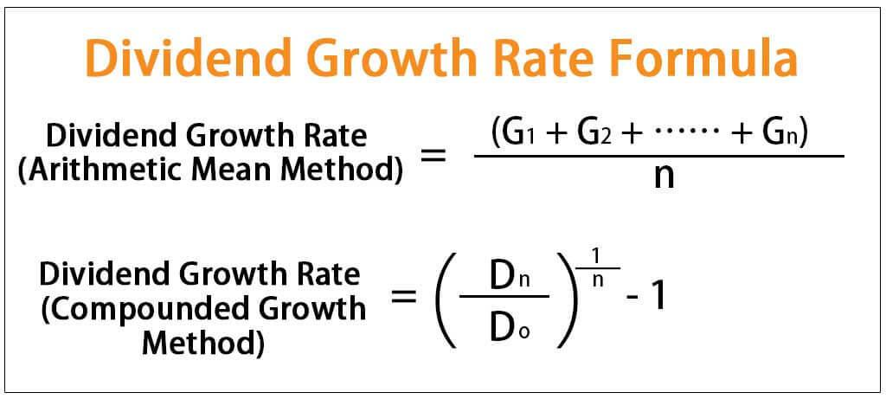

## Table of Contents

## What is the demographic dividend?

The demographic dividend is when a country's economy grows because it has more people of working age than very young or old people. This happens when birth rates go down and people live longer. With more working-age people, a country can produce more goods and services, which can lead to economic growth. This period can be a big opportunity for a country to improve its economy if it uses its workforce well.

However, the demographic dividend is not automatic. A country needs good policies to make the most of it. It needs to invest in education and health so that the working-age people are healthy and skilled. It also needs jobs for these people. If a country does not plan well, it might not benefit from the demographic dividend. After this period, if birth rates stay low, the population might get older, and the country might face new challenges.

## How does the demographic dividend impact economic growth?

The demographic dividend can help a country's economy grow because there are more people who can work than people who are too young or too old to work. When there are more working-age people, they can make more things and provide more services. This can lead to more money being made in the country. If the country uses this time well, it can grow its economy a lot. For example, if it makes good jobs for these workers and helps them learn new skills, the country can become richer.

But, the demographic dividend does not just happen on its own. A country needs to have good plans to make the most of it. It needs to spend money on schools and hospitals so that the working-age people are healthy and can learn. It also needs to create jobs for them. If a country does not plan well, it might not get the benefits of having more workers. After the demographic dividend, if fewer babies are born, the country might have more old people than young people, which can bring new problems.

## What are the key stages of the demographic transition that lead to a demographic dividend?

The demographic transition is a process that countries go through as they change from having high birth and death rates to lower birth and death rates. In the first stage, both birth and death rates are high, so the population grows slowly. In the second stage, death rates start to fall because of better health care, food, and living conditions, but birth rates stay high. This leads to a fast increase in population. The third stage is when birth rates start to fall too, often because people have better access to education and birth control. Now the population grows more slowly.

The fourth stage is when both birth and death rates are low, and the population grows very slowly or stops growing. It's during the third and fourth stages that a country can experience a demographic dividend. This happens because there are more people of working age compared to very young or old people. If a country uses this time well by creating jobs and improving education and health, it can see a lot of economic growth. But if it doesn't plan well, it might not benefit as much from having more workers. After this, if birth rates stay low, the population might start to get older, which can bring new challenges.

## Can you explain the relationship between fertility rates and the demographic dividend?

Fertility rates, or the number of babies born per woman, play a big role in the demographic dividend. When fertility rates are high, there are a lot of young people and not as many working-age people. This means a country has to spend a lot of money on schools and health care for children, and there are fewer people to work and make money. But when fertility rates start to go down, the number of young people goes down too. This means there are more working-age people compared to children. This change can lead to a demographic dividend if the country uses it well.

A demographic dividend happens when there are more people who can work than people who are too young or too old to work. This usually happens after fertility rates start to fall. With more working-age people, a country can make more things and provide more services, which can help the economy grow. But for this to happen, the country needs to have good jobs for these workers and help them learn new skills. If the country does not plan well, it might not get the benefits of having more workers. After the demographic dividend, if fertility rates stay low, the population might start to get older, which can bring new challenges.

## What role does education play in maximizing the benefits of the demographic dividend?

Education is very important for making the most out of the demographic dividend. When there are more working-age people than very young or old people, a country can grow its economy a lot. But this only happens if these working-age people are educated. Education helps people learn new skills and knowledge that they can use to do their jobs better. If a country invests in good schools and makes sure that everyone can go to school, it can have a workforce that is ready to help the economy grow.

If people are not educated, they might not be able to get good jobs, even if there are a lot of them. This means the country might not get the full benefits of the demographic dividend. Good education also helps people stay healthy and make smart choices about their lives, like having fewer children so the country can keep the demographic dividend going. So, education is key to making sure that the demographic dividend leads to a stronger and richer country.

## How can government policies influence the realization of the demographic dividend?

Government policies can help a country make the most of the demographic dividend by focusing on education, health, and jobs. When there are more working-age people than very young or old people, the government can invest in schools to make sure everyone gets a good education. This helps people learn skills they need to do good jobs. The government can also spend money on health care to keep people healthy and able to work. By creating policies that encourage businesses to start and grow, the government can make sure there are enough jobs for everyone who wants to work. All these policies can help the country's economy grow during the demographic dividend.

But if the government does not plan well, the country might not get all the benefits of the demographic dividend. If there are not enough good jobs, or if people do not have the skills they need, the economy might not grow as much. The government needs to make sure that policies help people have fewer children so the demographic dividend can last longer. After the demographic dividend, if the population gets older, the government needs new policies to take care of older people and keep the economy strong. So, good government policies are very important for making the most of the demographic dividend.

## What are some successful examples of countries that have capitalized on the demographic dividend?

South Korea is a good example of a country that used the demographic dividend well. In the 1960s and 1970s, South Korea had a lot of young people who were ready to work. The government helped by making good schools and health care. They also made it easy for businesses to start and grow. This meant there were a lot of jobs for the working-age people. As a result, South Korea's economy grew very fast, and it became one of the richest countries in the world.

Another example is Thailand. In the 1980s and 1990s, Thailand also had a lot of working-age people. The government invested in education and health care to make sure these people were ready to work. They also made policies to help businesses grow and create jobs. Because of these efforts, Thailand's economy grew a lot during this time. Both South Korea and Thailand show how a country can use the demographic dividend to become richer and stronger.

## What challenges might prevent a country from fully benefiting from the demographic dividend?

One big challenge that can stop a country from fully using the demographic dividend is not having enough good jobs. Even if there are a lot of people who can work, if there are not enough jobs for them, the economy will not grow as much. The government needs to help businesses start and grow so they can make jobs. If the government does not do this, the country might not get the full benefits of having more workers.

Another challenge is if the working-age people do not have the skills they need. This can happen if the country does not invest in good schools and education. Without education, people might not be able to do the jobs that are available. The government needs to make sure everyone can go to school and learn the skills they need to work. If they do not, the country might miss out on the chance to grow its economy during the demographic dividend.

A third challenge is if the country does not keep the demographic dividend going long enough. This can happen if people keep having a lot of children. If the birth rate stays high, there will be too many young people and not enough working-age people. The government needs to help people have fewer children so the demographic dividend can last longer. If they do not, the country might not have enough time to grow its economy as much as it could.

## How do labor markets evolve during the period of demographic dividend?

During the period of the demographic dividend, labor markets change a lot. There are more people who can work than very young or old people. This means there are more workers looking for jobs. If the country has good policies, businesses can start and grow, which makes more jobs for these workers. This can help the economy grow because more people are working and making things or providing services.

But if there are not enough good jobs, the labor market might not work well. Even with a lot of workers, if they do not have the right skills, they might not be able to get the jobs that are available. The government needs to make sure people can go to school and learn the skills they need. If the labor market does not evolve well, the country might not get all the benefits of the demographic dividend.

## What are the long-term sustainability concerns associated with the demographic dividend?

After the demographic dividend, a country might face some long-term problems. One big worry is that the population might get older. When fewer babies are born, there will be fewer young people in the future. This means there will be more old people than young people. Old people need more health care and other help, which can cost a lot of money. If there are not enough young people to work and pay taxes, it can be hard for the country to take care of the older people.

Another concern is about the environment. When a country grows its economy a lot during the demographic dividend, it might use more resources and make more pollution. This can hurt the environment and make it harder for the country to keep growing in the future. The country needs to think about how to grow its economy without hurting the environment too much. If it does not plan well, it might face big problems later on.

## How can demographic dividend strategies be adapted for different cultural and economic contexts?

Different countries have different cultures and economies, so they need to change their plans to make the most of the demographic dividend. In some places, people might have strong beliefs about family size, which can affect how many children they have. Governments need to understand these beliefs and work with them to help people have fewer children if they want to. For example, they can make it easier for people to get birth control and teach them about the benefits of smaller families. In some countries, women might not be able to work as much because of cultural reasons. Governments can make policies that help women get good jobs and education, so they can help the economy grow.

Economies also change how a country can use the demographic dividend. In poorer countries, there might not be enough money to spend on schools and health care. These countries need to find ways to get more money, maybe by getting help from other countries or by making their businesses grow. In richer countries, there might be more money, but they still need to make sure it is spent in the right way. They can invest in new kinds of jobs and technology to keep their economy growing. By understanding the culture and economy of a country, governments can make plans that help them use the demographic dividend to make their country stronger and richer.

## What advanced metrics and models are used to predict and measure the impact of the demographic dividend?

To predict and measure the impact of the demographic dividend, experts use different advanced metrics and models. One important metric is the dependency ratio, which shows how many young and old people there are compared to working-age people. A lower dependency ratio means there are more working-age people, which can lead to a demographic dividend. Another useful metric is the total fertility rate, which tells us how many children women are having on average. If this rate goes down, it can help a country move into the demographic dividend period. Economists also look at labor force participation rates to see how many people are working or looking for work. These metrics help experts understand if a country is ready for a demographic dividend.

Models like the cohort-component model are used to predict how the population will change in the future. This model looks at different groups of people, or cohorts, and how they will grow older and change in size over time. It can help experts guess when a country will have a lot of working-age people and when the demographic dividend might happen. Another model is the economic growth model, which looks at how changes in the population can affect the economy. These models use a lot of data and math to make predictions about the future. By using these advanced metrics and models, experts can help governments plan better for the demographic dividend and make the most of it.

## References & Further Reading

[1]: Bloom, D. E., Canning, D., & Sevilla, J. (2003). ["The Demographic Dividend: A New Perspective on the Economic Consequences of Population Change."](https://www.rand.org/pubs/monograph_reports/MR1274.html) RAND Corporation.

[2]: Lee, R., & Mason, A. (2010). ["Fertility, Human Capital, and Economic Growth over the Demographic Transition."](https://pubmed.ncbi.nlm.nih.gov/20495605/) Journal of Population Economics.

[3]: Gans, J. S. (2016). ["The Disruption Dilemma."](https://mitpress.mit.edu/9780262533621/the-disruption-dilemma/) MIT Press.

[4]: Du, X., Jarrow, R. A., & Ye, Y. (2019). ["Understanding High Frequency Trading: No-Arbitrage and Selection Bias Corrections to the Roll Model."](https://www.taylorfrancis.com/books/mono/10.1201/9780429432842/modeling-fixed-income-securities-interest-rate-options-robert-jarrow) Journal of Economic Dynamics and Control.

[5]: Bessis, J. (2015). ["Risk Management in Banking."](https://books.google.com/books/about/Risk_Management_in_Banking.html?id=oq-MAjw2ezQC) John Wiley & Sons.

[6]: Narula, R. (2014). ["Population Dynamics and Economic Growth: A Review."](https://www.emerald.com/insight/content/doi/10.1108/REPS-11-2022-0093/full/html) Spanish Journal of Economics and Finance.