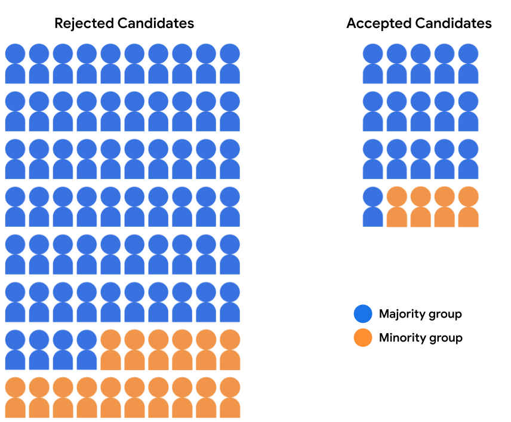

## Table of Contents

## What is demographic parity in the context of machine learning?

Demographic parity is a fairness concept in machine learning that aims to ensure equal outcomes across different groups of people. In simpler terms, it means that a machine learning model should treat all groups, like different races or genders, the same way. For example, if a model is used to decide who gets a loan, demographic parity would mean that the model approves loans at the same rate for men and women, or for different ethnic groups.

To achieve demographic parity, the probability of a positive outcome should be the same for all groups. This can be expressed with a simple formula: $$P(\hat{Y} = 1 | A = a) = P(\hat{Y} = 1)$$ where $$\hat{Y}$$ is the model's prediction, and $$A$$ represents the different groups. If this condition is met, the model is considered fair according to the demographic parity standard. However, achieving demographic parity can sometimes lead to other fairness issues, so it's important to consider other fairness metrics as well.

## Why is demographic parity important in machine learning?

Demographic parity is important in machine learning because it helps make sure that algorithms treat everyone fairly, no matter their race, gender, or other characteristics. When we use machine learning models to make decisions, like approving loans or hiring people, we want these decisions to be unbiased. If a model doesn't achieve demographic parity, it might unfairly favor one group over another, which can lead to discrimination and inequality.

For example, if a bank uses a machine learning model to decide who gets a loan, demographic parity means that the model should approve loans at the same rate for men and women, or for different ethnic groups. This is expressed as $$P(\hat{Y} = 1 | A = a) = P(\hat{Y} = 1)$$, where $$\hat{Y}$$ is the model's prediction, and $$A$$ represents different groups. Ensuring demographic parity helps build trust in technology and promotes a more just society.

## How does demographic parity relate to fairness in machine learning models?

Demographic parity is a way to make sure [machine learning](/wiki/machine-learning) models treat everyone fairly. It means that the chance of getting a good outcome, like getting a loan or a job, should be the same for everyone, no matter their race, gender, or other characteristics. For example, if a bank uses a machine learning model to decide who gets a loan, demographic parity means the model should approve loans at the same rate for men and women, or for different ethnic groups. This is shown by the formula $$P(\hat{Y} = 1 | A = a) = P(\hat{Y} = 1)$$, where $$\hat{Y}$$ is the model's prediction, and $$A$$ represents different groups.

Achieving demographic parity is important because it helps prevent unfair treatment and discrimination. If a model doesn't treat all groups the same, it might unfairly favor one group over another, which can lead to inequality. By making sure the model follows demographic parity, we can build trust in the technology and help create a more just society. However, it's also important to know that demographic parity is just one way to measure fairness, and other methods might be needed to make sure a model is truly fair for everyone.

## What are the common metrics used to measure demographic parity?

To measure demographic parity, we often look at how often different groups get a positive outcome from a machine learning model. One common way to do this is by calculating the difference in positive outcomes between groups. For example, if we want to see if a model is fair to men and women, we might look at the difference in the percentage of men and women who get approved for a loan. This can be expressed as $$|P(\hat{Y} = 1 | A = \text{male}) - P(\hat{Y} = 1 | A = \text{female})|$$, where $$\hat{Y}$$ is the model's prediction and $$A$$ represents the group. If this difference is small, it means the model is close to achieving demographic parity.

Another way to measure demographic parity is by using the ratio of positive outcomes between groups. For instance, we could compare the rate at which men get approved for a loan to the rate at which women get approved. This can be calculated as $$\frac{P(\hat{Y} = 1 | A = \text{male})}{P(\hat{Y} = 1 | A = \text{female})}$$. If this ratio is close to 1, it suggests that the model treats both groups similarly. Both the difference and the ratio methods help us understand if a machine learning model is fair to different groups of people.

## Can you explain the difference between demographic parity and other fairness criteria like equalized odds?

Demographic parity and equalized odds are two different ways to make sure machine learning models are fair. Demographic parity means that the chance of getting a good outcome, like getting a loan or a job, should be the same for everyone, no matter their race, gender, or other characteristics. For example, if a bank uses a machine learning model to decide who gets a loan, demographic parity means the model should approve loans at the same rate for men and women, or for different ethnic groups. This is shown by the formula $$P(\hat{Y} = 1 | A = a) = P(\hat{Y} = 1)$$, where $$\hat{Y}$$ is the model's prediction, and $$A$$ represents different groups.

Equalized odds, on the other hand, focus on making sure the model's predictions are fair when we know the true outcome. It means that the model should be just as good at predicting good outcomes and bad outcomes for different groups. For instance, if we're looking at loan approvals, equalized odds would mean that the model is equally good at predicting who will repay the loan for both men and women. This can be expressed as $$P(\hat{Y} = 1 | Y = y, A = a) = P(\hat{Y} = 1 | Y = y)$$ for both $$y = 0$$ (bad outcome) and $$y = 1$$ (good outcome). While demographic parity looks at overall outcomes, equalized odds look at how well the model predicts outcomes for each group.

## What are some real-world examples where demographic parity is applied in machine learning?

In the world of hiring, companies sometimes use machine learning to help pick the best candidates for jobs. To make sure these systems are fair, they might use demographic parity. This means the system should pick candidates at the same rate for men and women, or for different races. For example, if a company wants to hire new engineers, they might check to see if their machine learning model is approving men and women at the same rate. If the rate is the same, they can say the model follows demographic parity, which helps prevent unfair hiring practices.

Another example is in the banking industry, where machine learning models help decide who gets a loan. Banks might use demographic parity to make sure their models aren't unfairly denying loans to certain groups. They do this by checking if the model approves loans at the same rate for different races or genders. For instance, if a bank finds that their model approves loans for men and women at the same rate, they can say it achieves demographic parity. This helps make sure everyone has an equal chance to get a loan, no matter who they are.

## How can demographic parity be achieved in a machine learning model?

To achieve demographic parity in a machine learning model, we need to make sure that the model treats everyone the same, no matter their race, gender, or other characteristics. This means the chance of getting a good outcome, like getting a loan or a job, should be the same for everyone. To do this, we can adjust the model's predictions so that the probability of a positive outcome is the same across all groups. For example, if we're looking at loan approvals, we might check the rates for men and women and adjust the model if needed. This can be expressed as $$P(\hat{Y} = 1 | A = a) = P(\hat{Y} = 1)$$, where $$\hat{Y}$$ is the model's prediction, and $$A$$ represents different groups.

One way to adjust the model is by using a technique called "post-processing," where we change the model's final predictions to make them fairer. For example, if the model is approving loans for men at a higher rate than women, we might lower the approval threshold for women or raise it for men. Another way is to use "in-processing" methods, where we change how the model learns from the data to make it fairer from the start. This can involve adding fairness constraints to the model's training process. By using these methods, we can help make sure the machine learning model follows demographic parity and treats everyone fairly.

## What are the challenges and limitations of enforcing demographic parity?

Enforcing demographic parity in machine learning can be tricky because it might not always lead to fair results for everyone. For example, if we make sure a loan approval model approves loans at the same rate for men and women, we might end up approving loans for people who can't pay them back just to meet the parity goal. This can hurt the model's overall accuracy and fairness. Also, demographic parity doesn't consider other important factors like the true ability to repay a loan or the qualifications for a job. So, while it aims to treat everyone the same, it might not be the best way to make sure the model is truly fair.

Another challenge is that achieving demographic parity can be hard when the data we use to train the model is already biased. If the data shows that one group gets approved for loans more often than another, the model might learn these biases and keep them, even if we try to adjust it later. This means we need to be careful about the data we use and how we collect it. Also, focusing only on demographic parity might ignore other fairness measures, like equalized odds, which look at how well the model predicts outcomes for each group. So, while demographic parity is important, it's just one part of making sure a machine learning model is fair and works well for everyone.

## How does demographic parity impact model performance and accuracy?

Enforcing demographic parity in a machine learning model can sometimes lower its overall performance and accuracy. When we adjust the model to make sure it treats everyone the same, like approving loans at the same rate for men and women, we might end up approving loans for people who can't pay them back just to meet the parity goal. This can make the model less accurate because it's not making the best decisions based on all the information it has. For example, if the model is trained to approve loans based on credit scores and income, adjusting it to achieve demographic parity might mean ignoring these important factors, leading to worse predictions.

Another way demographic parity can impact model performance is by making the model less effective at predicting outcomes for each group. When we focus only on making sure the overall rates are the same across groups, we might miss other important fairness measures like equalized odds. Equalized odds mean the model should be equally good at predicting good and bad outcomes for different groups, which is shown as $$P(\hat{Y} = 1 | Y = y, A = a) = P(\hat{Y} = 1 | Y = y)$$ for both $$y = 0$$ (bad outcome) and $$y = 1$$ (good outcome). If we only care about demographic parity, the model might not be as good at predicting who will actually repay a loan or who is qualified for a job, which can hurt its overall accuracy and usefulness.

## What are the ethical considerations when implementing demographic parity in machine learning?

When we use demographic parity in machine learning, we need to think about what is right and fair. Demographic parity means making sure the model treats everyone the same, no matter their race, gender, or other characteristics. For example, if a bank uses a machine learning model to decide who gets a loan, demographic parity means the model should approve loans at the same rate for men and women, or for different ethnic groups. This can help prevent unfair treatment and discrimination. However, it's important to make sure that the model doesn't just approve loans for people who can't pay them back just to meet the parity goal. If we focus only on demographic parity, we might end up ignoring other important factors like someone's ability to repay the loan, which can lead to bad decisions and harm people.

Another ethical issue is that the data used to train the model might already be biased. If the data shows that one group gets approved for loans more often than another, the model might learn these biases and keep them, even if we try to adjust it later. This means we need to be careful about the data we use and how we collect it. Also, focusing only on demographic parity might ignore other fairness measures, like equalized odds, which look at how well the model predicts outcomes for each group. Equalized odds mean the model should be equally good at predicting good and bad outcomes for different groups, shown as $$P(\hat{Y} = 1 | Y = y, A = a) = P(\hat{Y} = 1 | Y = y)$$ for both $$y = 0$$ (bad outcome) and $$y = 1$$ (good outcome). So, while demographic parity is important, we need to consider other fairness measures too to make sure the model is truly fair and works well for everyone.

## How can one evaluate if a machine learning model achieves demographic parity?

To evaluate if a machine learning model achieves demographic parity, we need to check if the model gives the same chance of a good outcome to everyone, no matter their race, gender, or other characteristics. For example, if we're looking at loan approvals, we can compare the rate at which the model approves loans for men and women, or for different ethnic groups. This can be done by calculating the difference in positive outcomes between groups, like $$|P(\hat{Y} = 1 | A = \text{male}) - P(\hat{Y} = 1 | A = \text{female})|$$, where $$\hat{Y}$$ is the model's prediction and $$A$$ represents the group. If this difference is small, it means the model is close to achieving demographic parity.

Another way to check for demographic parity is by using the ratio of positive outcomes between groups. For instance, we could compare the rate at which men get approved for a loan to the rate at which women get approved. This can be calculated as $$\frac{P(\hat{Y} = 1 | A = \text{male})}{P(\hat{Y} = 1 | A = \text{female})}$$. If this ratio is close to 1, it suggests that the model treats both groups similarly. By using these methods, we can understand if a machine learning model is fair to different groups of people and whether it achieves demographic parity.

## What advanced techniques or algorithms are used to ensure demographic parity in complex machine learning systems?

To ensure demographic parity in complex machine learning systems, advanced techniques like adversarial training are often used. In adversarial training, we add a second model, called an adversary, that tries to figure out the group a person belongs to based on the main model's predictions. The main model is then trained to make predictions that the adversary can't use to tell groups apart. This helps the main model treat everyone the same, no matter their race, gender, or other characteristics. For example, if we're looking at loan approvals, the main model will try to approve loans in a way that the adversary can't tell if the person is a man or a woman. This can be expressed as trying to minimize the adversary's ability to predict the group $$A$$ from the model's predictions $$\hat{Y}$$.

Another advanced technique is called fairness constraints, where we change how the model learns from the data to make it fairer from the start. This involves adding special rules to the model's training process that make sure the model follows demographic parity. For instance, we might add a rule that says the model should approve loans at the same rate for men and women, or for different ethnic groups. This can be shown as $$P(\hat{Y} = 1 | A = a) = P(\hat{Y} = 1)$$, where $$\hat{Y}$$ is the model's prediction, and $$A$$ represents different groups. By using these fairness constraints, we can help the model learn in a way that treats everyone fairly right from the beginning, without needing to adjust the predictions later.

## References & Further Reading

[1]: Barocas, S., Hardt, M., & Narayanan, A. (2019). ["Fairness and Machine Learning."](https://fairmlbook.org/) fairmlbook.org.

[2]: Mehrabi, N., Morstatter, F., Saxena, N., Lerman, K., & Galstyan, A. (2021). ["A Survey on Bias and Fairness in Machine Learning."](https://arxiv.org/abs/1908.09635) ACM Computing Surveys (CSUR).

[3]: Feldman, M., Friedler, S. A., Moeller, J., Scheidegger, C., & Venkatasubramanian, S. (2015). ["Certifying and removing disparate impact."](https://dl.acm.org/doi/10.1145/2783258.2783311) Proceedings of the 21th ACM SIGKDD International Conference on Knowledge Discovery and Data Mining.

[4]: Hardt, M., Price, E., & Srebro, N. (2016). ["Equality of Opportunity in Supervised Learning."](https://arxiv.org/abs/1610.02413) Advances in Neural Information Processing Systems 29.

[5]: Kleinberg, J., Mullainathan, S., & Raghavan, M. (2016). ["Inherent Trade-Offs in the Fair Determination of Risk Scores."](https://arxiv.org/abs/1609.05807) arXiv preprint arXiv:1609.05807.