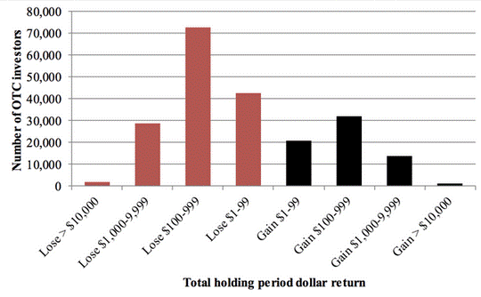

Penny stocks and algorithmic trading represent dynamic and high-risk components of modern investing. Penny stocks are typically traded for less than $5 per share and are not listed on major stock exchanges. They are characterized by their high volatility and potential for rapid gains, attracting investors seeking quick profits. However, these stocks come with significant risks, including susceptibility to market manipulation and limited financial disclosures. Consequently, they are often considered speculative investments.

Algorithmic trading, on the other hand, employs computer algorithms and mathematical models to automate trading decisions. This method enhances trading efficiency by reducing human error and executing trades at high speeds. Algorithms can swiftly navigate market opportunities, making them particularly suitable for volatile instruments such as penny stocks. By applying algorithmic strategies to penny stock trading, investors might optimize their trades and manage risks more effectively.



In this article, we explore how these two elements intersect and offer insights into how investors can engage with them prudently. As we discuss the nuances of penny stocks and algorithmic trading, our goal is to equip investors with knowledge and strategies to navigate this complex landscape effectively.

## Table of Contents

## Understanding Penny Stocks

Penny stocks are shares of small companies that typically trade for under $5 per share and are generally not listed on major stock exchanges like the New York Stock Exchange (NYSE) or NASDAQ. Instead, they are often traded over-the-counter (OTC) through platforms such as OTC Bulletin Board (OTCBB) or through the privately owned OTC Markets Group. The low share price attracts many investors with the allure of substantial profits from even small price movements. However, this potential for high returns is accompanied by significant risks, making penny stocks a speculative investment choice.

The volatility of penny stocks is one of their defining characteristics. Factors contributing to this volatility include low liquidity, limited trade volume, and frequently changing business conditions. These stocks often experience large percentage increases and decreases in price, presenting both an opportunity for profit and a risk of loss. For instance, a $0.50 stock that gains $0.25 experiences a 50% increase in value, which is a more pronounced effect compared to higher-priced stocks. However, the opposite is also true; a small decrease in price can lead to significant percentage losses.

Penny stocks are frequently subject to market manipulation schemes, notably "pump-and-dump" strategies. In such schemes, the value of a stock is artificially inflated through misleading positive statements. Once the price has risen, the manipulators unload their shares at the high price, subsequently causing the value to plummet, resulting in losses for those who bought in at the elevated prices. Because these stocks are minimally regulated, they are more susceptible to such manipulative practices.

Moreover, companies issuing penny stocks often provide limited financial disclosures. They may not be required to file quarterly reports with the Securities and Exchange Commission (SEC), leading to a lack of comprehensive and transparent information. Investors might struggle to perform thorough due diligence due to this lack of information, increasing the risk of investing in financially unstable or non-viable firms.

In summary, while penny stocks offer significant growth potential, they also come with considerable risks related to [volatility](/wiki/volatility-trading-strategies), market manipulation, and limited transparency. Investors should approach penny stocks with caution and make well-informed decisions to navigate the inherent dangers.

## Algorithmic Trading: An Overview

Algorithmic trading, also known as algo trading, is a technique that utilizes computer algorithms and mathematical models to execute trades at times deemed optimal by the algorithm. This method of trading is highly effective in minimizing human error, as trades are executed automatically based on the predefined criteria set within the algorithm. The primary advantage of [algorithmic trading](/wiki/algorithmic-trading) lies in its ability to process vast amounts of market data rapidly, thereby allowing it to execute trades at high speeds. This speed enables the algorithm to capitalize on transient market opportunities that might not be detectable or actionable by human traders.

One of the core components of algorithmic trading is the use of mathematical models to identify trading opportunities. These models can be based on various factors, including historical price data, [volume](/wiki/volume-trading-strategy) patterns, and technical indicators. The algorithms can be straightforward, such as those employing simple moving averages to identify trends, or highly complex, using advanced statistical techniques and [machine learning](/wiki/machine-learning) to predict market movements.

For investors interested in penny stocks, which are characterized by their high volatility and potential for rapid price fluctuations, algorithmic trading presents a strategic advantage. It can efficiently handle the volatility of penny stocks by executing trades instantaneously in response to market movements, allowing investors to take advantage of short-term price changes. Furthermore, algorithms can be designed to implement specific trading strategies, such as [momentum](/wiki/momentum) trading or mean reversion, tailored to the unique characteristics of penny stocks.

Algorithmic trading in the context of penny stocks also offers risk management benefits. By automating the trading process, it reduces the likelihood of emotional decision-making, which can often lead to suboptimal trading decisions. Algorithmic systems can be programmed to incorporate risk management protocols, such as stop-loss orders and position sizing, to help protect against adverse market movements.

In summary, algorithmic trading provides a mechanism for investors to efficiently and effectively navigate the fast-paced environment of penny stocks. By leveraging the power of computational models and automated execution, investors can optimize their trading strategies and manage risk, thereby enhancing their chances of achieving favorable outcomes in the market.

## Benefits of Algorithmic Trading in Penny Stock Investing

Algorithmic trading offers several advantages when investing in penny stocks by enhancing the efficiency and accuracy of trade executions. One of the primary benefits is the ability to navigate the volatile nature of penny stock markets effectively. Algorithms are designed for speed, allowing trades to be executed within milliseconds. This capability ensures that investors can capitalize on fleeting [arbitrage](/wiki/arbitrage) opportunities and market movements which would be impractical with manual trading.

Moreover, algorithmic trading aids investors in harnessing the price fluctuations inherent in penny stocks. Given the typically low [liquidity](/wiki/liquidity-risk-premium) and high price volatility, these stocks present numerous short-term trading opportunities. Algorithms can be programmed to identify such opportunities by analyzing market signals, historical data, and real-time price movements. This function is particularly beneficial in penny stock markets where swift decision-making is crucial to profit from quick price changes.

Another significant advantage is the reduction of emotional bias in trading. Human traders often fall prey to psychological factors such as fear and greed, which can cloud judgment and lead to suboptimal trading decisions. By contrast, algorithmic systems adhere strictly to pre-set rules and strategies, ensuring that trades are executed based on logical and data-driven criteria rather than emotional impulses. These systems can implement complex strategies such as momentum trading, mean reversion, or [market making](/wiki/market-making) without deviation due to emotions.

Here is a simplified example of what a basic algorithmic trading strategy could look like in Python:

```python
import pandas as pd
import numpy as np

# Simple Moving Average Strategy
def simple_moving_average_strategy(data, short_window, long_window):
    signals = pd.DataFrame(index=data.index)
    signals['signal'] = 0.0

    # Short simple moving average
    signals['short_mavg'] = data['Close'].rolling(window=short_window, min_periods=1, center=False).mean()
    # Long simple moving average
    signals['long_mavg'] = data['Close'].rolling(window=long_window, min_periods=1, center=False).mean()

    # Create signals: 1 when short_mavg is greater than long_mavg, 0 otherwise
    signals['signal'][short_window:] = np.where(signals['short_mavg'][short_window:] > signals['long_mavg'][short_window:], 1.0, 0.0)

    # Generate trading orders: Buy/sell
    signals['positions'] = signals['signal'].diff()

    return signals

# Example usage
data = pd.read_csv('historical_stock_data.csv', index_col='Date', parse_dates=True)
signals = simple_moving_average_strategy(data, short_window=40, long_window=100)
```

This strategy uses moving averages to determine trading signals, automating the decision-making process based on statistical averages rather than emotional reactions. Such methodologies enable efficient management of penny stock investments, leveraging algorithmic trading's capacity for systematic, emotion-free operation.

## Risks Involved in Penny Stocks and Algorithmic Trading

Penny stocks present considerable risks for investors due to their highly speculative nature. These stocks, often priced below $5 and not listed on major exchanges, are vulnerable to various forms of market manipulation. Among the most notorious scams are pump-and-dump schemes, where stock prices are artificially inflated through false or misleading statements. Once inflated, insiders sell off their shares at a profit, leaving unsuspecting investors with significant losses once the stock price inevitably collapses. The lack of comprehensive financial disclosures and the generally low liquidity further exacerbate the risks associated with penny stocks.

Algorithmic trading, while offering potential advantages, also comes with its own set of challenges. A substantial initial investment is required to establish a robust technological infrastructure, including high-performance computing systems and data feeds. Furthermore, proficiency in programming and quantitative analysis is necessary to develop and maintain effective trading algorithms. The learning curve can be steep, often requiring extensive technical training or hiring skilled professionals, which adds to the overall cost.

Market anomalies, such as flash crashes, pose a serious threat to algorithmic trading strategies. Flash crashes occur when there is a sudden, severe drop in security prices within a very short time frame, often triggered by automated high-frequency trading algorithms. These events can lead to massive losses if algorithms fail to execute stop-loss orders effectively or if there are delays in market data processing. Such rapid price fluctuations can also trigger erroneous trades, leading to cascading effects that compound market instability.

In summary, while there are potential gains to be made, both penny stocks and algorithmic trading strategies involve significant risks that must be carefully managed. Investors must be vigilant, employing thorough due diligence and continuous monitoring of their trading systems to mitigate these risks effectively.

## How to Get Started with Penny Stocks and Algorithmic Trading

To begin trading penny stocks and integrating algorithmic strategies, it is crucial first to gain a comprehensive understanding of the market dynamics and economic factors influencing these securities. Penny stocks, characterized by their low price and high volatility, are often affected by broader economic indicators such as interest rates, inflation, and industry-specific developments. Investors should regularly review financial news, economic reports, and monitor market trends to anticipate potential impacts on penny stocks.

Selecting a reliable broker is another fundamental step for trading penny stocks with algorithmic tools. Brokers offering such services provide platforms that support the execution of trades in real-time and offer robust technological frameworks necessary for algorithmic trading. These platforms should provide comprehensive market data, have low latency, and support advanced order types. Ensuring that the broker adheres to regulatory standards is essential to safeguard investments against possible fraud or malpractice common in penny stock markets.

Developing an algorithmic trading strategy tailored to individual risk tolerance and investment objectives is integral to achieving success. An effective strategy often involves designing algorithms to identify and respond to specific market signals or patterns. This could include arbitrage opportunities, trend-following strategies, or [statistical arbitrage](/wiki/statistical-arbitrage). The following is a simple Python example utilizing the "pandas" library to backtest a moving average crossover strategy, a common algorithmic tactic:

```python
import pandas as pd

# Sample moving average crossover strategy
def moving_average_strategy(data, short_window, long_window):
    data['short_mavg'] = data['Close'].rolling(window=short_window, min_periods=1).mean()
    data['long_mavg'] = data['Close'].rolling(window=long_window, min_periods=1).mean()

    data['signal'] = 0
    data['signal'][short_window:] = np.where(data['short_mavg'][short_window:] > data['long_mavg'][short_window:], 1, 0)
    data['positions'] = data['signal'].diff()

    return data

# Example data and parameters
data = pd.read_csv('penny_stock_data.csv')
short_window = 40
long_window = 100

# Strategy implementation
strategy_data = moving_average_strategy(data, short_window, long_window)

# Analyze positions
buy_signals = strategy_data[strategy_data['positions'] == 1]
sell_signals = strategy_data[strategy_data['positions'] == -1]
```

This code demonstrates the calculation of short-term and long-term moving averages to generate buy and sell signals based on the crossover of these averages. The investor must refine and test their strategies extensively across historical data and adjust parameters to fine-tune performance and manage the risk effectively.

Incorporating a sound algorithmic strategy requires continuous monitoring and adaptation. The volatile nature of penny stocks may necessitate regular updates to algorithms to ensure adaptability to changing market conditions. Such diligence, combined with a comprehensive understanding of market influences, the selection of a reliable broker, and a refined trading strategy, positions investors to navigate the complex world of penny stocks using algorithmic trading effectively.

## Conclusion

Investing in penny stocks while leveraging algorithmic trading strategies presents both opportunities and challenges. The allure of substantial gains draws investors to these high-volatility securities, as the low price per share can lead to impressive percentage returns. However, this potential gain comes with the inherent risk of significant losses. Algorithmic trading offers a mechanism to navigate these volatile markets efficiently, but it is crucial for investors to manage both strategies with a disciplined approach.

For investors to succeed, a meticulously crafted strategy is indispensable. This involves a thorough understanding of the penny stock market landscape, including the economic and market variables that influence stock movements. Establishing a risk management plan is vital to guard against the extreme swings often encountered in penny stock trading. Algorithmic trading, with its capacity to process information at high speeds and execute trades with precision, can be instrumental in implementing these strategies. Nonetheless, its effective utilization requires ongoing learning and adaptation to evolving market conditions.

Technological vigilance remains a cornerstone for investors employing algorithmic trading. As technology and markets evolve, ensuring that trading algorithms are continuously updated and optimized is essential. This includes regular reviews of the algorithm's performance and the incorporation of new data to refine trading strategies. Additionally, investors should remain informed about advances in trading technology and cybersecurity measures to safeguard against potential disruptions or manipulation attempts.

The balanced integration of strategic planning, continuous education, and technological acumen is thus fundamental. Investors who successfully harmonize these elements can effectively navigate the complexities and capitalize on the opportunities that penny stocks and algorithmic trading offer, maintaining a keen awareness of both the advantages and the risks associated with this venture.

## References & Further Reading

[1]: ["Advances in Financial Machine Learning"](https://www.amazon.com/Advances-Financial-Machine-Learning-Marcos/dp/1119482089) by Marcos Lopez de Prado

[2]: ["Evidence-Based Technical Analysis: Applying the Scientific Method and Statistical Inference to Trading Signals"](https://www.amazon.com/Evidence-Based-Technical-Analysis-Scientific-Statistical/dp/0470008741) by David Aronson

[3]: ["Machine Learning for Algorithmic Trading"](https://github.com/stefan-jansen/machine-learning-for-trading) by Stefan Jansen

[4]: ["Quantitative Trading: How to Build Your Own Algorithmic Trading Business"](https://www.amazon.com/Quantitative-Trading-Build-Algorithmic-Business/dp/1119800064) by Ernest P. Chan

[5]: Bergstra, J., Bardenet, R., Bengio, Y., & Kégl, B. (2011). ["Algorithms for Hyper-Parameter Optimization."](https://dl.acm.org/doi/10.5555/2986459.2986743) Advances in Neural Information Processing Systems 24.