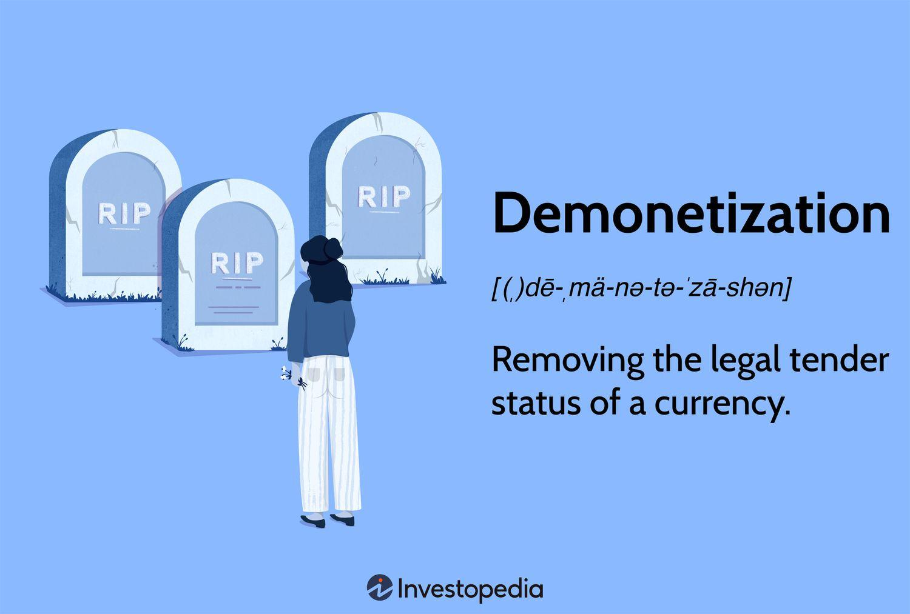

Economic policies such as currency withdrawal, demonetization, and monetary policy are pivotal in shaping the financial landscape, directly influencing investment strategies, business operations, and policy decisions. The effectiveness of these policies hinges on their intricate mechanisms, which can have far-reaching implications for both stability and growth within an economy.

Demonetization, a significant policy tool, involves stripping a currency unit of its legal tender status. It can act as a catalyst for transformation, encouraging shifts towards cashless economies and curbing illicit financial activities such as black money and counterfeiting. However, demonetization's impacts are dualistic; it can lead to immediate economic downturns and societal inconvenience if not managed adeptly. Historical instances, like India's demonetization in 2016, exemplify both the potential benefits of modernization and the economic challenges that can arise from such a sweeping policy change.

Within financial markets, algorithmic trading represents a seminal evolution, bridging economics and advanced technology. By employing automated systems to execute trade based on pre-defined strategies and criteria, algorithmic trading enhances market efficiency. It allows for high-speed transactions that provide liquidity and can narrow bid-ask spreads, thereby influencing the overall functionality of financial markets. However, this reliance on algorithms introduces complexities, including risks of market manipulation and the need for oversight to ensure market integrity.

Understanding these economic concepts is essential for navigating the modern financial ecosystem, where policies and technologies dynamically interact. As such, investors, businesses, and policymakers must leverage insights from these mechanisms to harness opportunities while mitigating potential risks inherent within evolving economic systems.

## Table of Contents

## Understanding Currency Withdrawal and Monetary Policy

Currency withdrawal refers to the process of removing specific denominations of banknotes from circulation. This is often implemented by a government or central bank as part of a broader economic strategy to manage inflation or influence economic activity. The rationale behind currency withdrawal can be multifaceted. For instance, eliminating certain high-denomination notes can help combat black market activities by reducing anonymity in large transactions, which are often conducted with such notes. Additionally, by limiting the availability of cash, currency withdrawal can push people towards more transparent digital transactions, thereby improving tax compliance and reducing the scope for tax evasion.

Monetary policy, a primary tool used by central banks, involves regulating the money supply and interest rates to achieve national economic goals such as controlling inflation, maintaining employment levels, and fostering economic growth. Through tools like open market operations, reserve requirements, and [interest rate](/wiki/interest-rate-trading-strategies) adjustments, central banks influence the economy's liquidity. For example, increasing interest rates can reduce inflation by discouraging borrowing and spending, whereas lowering rates can stimulate economic activity by making borrowing cheaper.

A historical illustration of these dynamics is evident in India's 2016 demonetization, although technically distinct from currency withdrawal, it featured overlapping objectives such as targeting black money and promoting digital payments. The abrupt invalidation of certain high-value currency notes was intended to flush out illicit funds and modernize the financial system.

Globally, many countries have explored similar monetary interventions. For example, the Eurozone, through the European Central Bank, frequently adjusts interest rates as part of its monetary policy to stabilize the euro and maintain inflation targets. Such measures are essential in addressing economic disparities and ensuring a healthy, transparent economic environment. 

By influencing money supply and interest rates, monetary policy aims to create the conditions necessary for stable economic growth. Simultaneously, currency withdrawal can act as a tactical approach to circumvent economic challenges like tax evasion and informal economies. Together, these measures represent critical levers for governments worldwide in their pursuit of fiscal responsibility and economic fortitude.

## The Process and Impact of Demonetization

Demonetization refers to the process by which a government strips a currency unit of its legal tender status, effectively rendering it unusable for financial transactions. This action can be a component of broader economic strategies aimed at addressing issues such as inflation, corruption, and digital financial integration.

One of the most notable examples of demonetization occurred in India on November 8, 2016, when the government announced the invalidation of the 500 and 1,000 rupee banknotes. The move was aimed at combating black money, counterfeit currency, and corruption, as well as promoting a shift towards a digital economy. While the initiative succeeded in bringing a significant portion of the unaccounted wealth back into the formal banking system, it also posed substantial challenges.

The advantages of demonetization as a policy tool are multifaceted. By nullifying large denominations of currency, governments can disrupt the hoarding of untaxed income and force individuals and businesses to declare their assets. In India's case, demonetization led to a surge in bank deposits and increased tax compliance, as the holders of undeclared wealth were compelled to disclose their income. Additionally, the measure accelerated the transition to digital payment methods, as cash shortages prompted both consumers and businesses to adopt electronic transactions.

However, the impacts of demonetization are not universally positive. The sudden withdrawal of currency can result in significant short-term economic disruptions. In India, the demonetization of 2016 led to [liquidity](/wiki/liquidity-risk-premium) shortages that affected various sectors, particularly those dependent on cash transactions, such as agriculture and small businesses. The abrupt reduction in circulating currency caused economic activity to slow down, with GDP growth temporarily hampered.

Moreover, the implementation of demonetization can result in inconvenience to the public, as individuals may face long queues at banks and ATMs, difficulty in accessing basic services, and potential loss of income due to reduced cash flow. The effectiveness of demonetization also depends on the efficiency of re-minting new currency and the ability of the financial infrastructure to adapt to increased demands for digital transactions.

In conclusion, while demonetization can be a potent tool for addressing certain economic issues, its success largely depends on careful planning and execution. The potential benefits, such as curbing corruption and fostering digital currencies, must be weighed against the risks of economic slowdown and public inconvenience. The case of India exemplifies the complex balancing act required to harness the advantages of demonetization while minimizing its drawbacks.

## Algorithmic Trading: Enhancing Market Efficiency

Algorithmic trading involves the use of computer programs and systems to execute trades in financial markets at extremely high speeds based on predetermined strategies and criteria. This technology-driven approach leverages mathematical models and algorithms to make decisions and execute trades without human intervention, thereby minimizing latency and enhancing precision. It plays a pivotal role in enhancing market efficiency by providing liquidity, narrowing spreads, and enabling more informed pricing mechanisms.

High-frequency trading ([HFT](/wiki/high-frequency-trading-strategies)), a subset of [algorithmic trading](/wiki/algorithmic-trading), is responsible for a significant portion of the trades conducted on exchanges. By processing large volumes of orders in fractions of a second, HFT firms contribute substantially to market liquidity, which refers to the ease with which an asset can be bought or sold in the market without affecting its price. Liquidity is crucial for the functioning of financial markets, as it ensures that securities can be traded quickly and with minimal price impact.

Algorithmic trading also aids in narrowing the bid-ask spread, the difference between the price a buyer is willing to pay for a security (bid) and the price a seller is willing to accept (ask). A narrower spread indicates a more efficient and liquid market, benefiting all types of investors by lowering transaction costs. For example, if the bid price is $10.00 and the ask price is $10.05, the spread is $0.05. Algorithmic trading strategies, by offering competing prices, can reduce this spread, improving overall market pricing.

However, the increasing reliance on algorithms introduces challenges and risks that need to be managed effectively. One significant risk is market manipulation, where traders might use algorithms to artificially influence market prices through high-speed trades or deceptive practices like spoofing—placing large orders with no intention of executing them to create a false sense of demand or supply. Such practices can destabilize markets and lead to significant losses.

To mitigate these risks, robust regulatory oversight is imperative. Regulatory bodies, such as the U.S. Securities and Exchange Commission (SEC) and the European Securities and Markets Authority (ESMA), have implemented rules and guidelines to monitor algorithmic trading activities. These regulations often require high-frequency traders to maintain detailed logs of their algorithms and trading activities to detect and prevent abusive practices.

Algorithmic trading also necessitates the development of sophisticated risk management systems. These systems must be capable of analyzing and responding to market conditions in real-time, ensuring that trading strategies remain aligned with market movements and institutional objectives. Advanced computational techniques, such as [machine learning](/wiki/machine-learning) and [artificial intelligence](/wiki/ai-artificial-intelligence), are increasingly being integrated into these systems to enhance their predictive capabilities and adaptability.

In conclusion, while algorithmic trading significantly enhances market efficiency through liquidity provision and spread reduction, it also poses unique challenges that require careful management through regulatory measures and advanced risk management technologies. As financial markets continue to evolve, the role of algorithmic trading is expected to expand, necessitating ongoing innovation and oversight to sustain its benefits and mitigate its risks.

## Interconnections: Monetary Policy, Demonetization, and Algorithmic Trading

Monetary policy significantly influences algorithmic trading strategies, particularly those reliant on interest rates and inflation indicators. Central banks' decisions to adjust interest rates or alter the money supply can cause fluctuations in market prices that algorithms are designed to detect and act upon. Algorithmic trading systems often incorporate predictive models to anticipate these policy decisions, allowing traders to capitalize on movements in currency and commodities markets. For instance, a reduction in interest rates typically results in depreciating domestic currency values, prompting algorithms to adjust positions accordingly to maximize returns.

Demonetization and currency withdrawal introduce abrupt changes in market values, eliciting rapid responses from algorithmic trading systems. The discontinuation of a currency unit, as witnessed during events like India's 2016 demonetization, can lead to immediate liquidity challenges and [volatility](/wiki/volatility-trading-strategies) in financial markets. Algorithms, programmed to scan for such changes, might respond by modifying trading strategies or reallocating assets to mitigate potential losses. Such responsiveness ensures that trading entities remain competitive and operational amidst economic restructuring.

Understanding the interactions between monetary policy, demonetization, and algorithmic trading provides valuable insights for investors and policymakers. By recognizing how these factors interrelate, stakeholders can better anticipate market behaviors and implement strategies that balance risk and reward. Policymakers, in particular, need to consider the ripple effects of economic decisions on automated trading systems, which play a significant role in contemporary financial markets. This awareness is crucial not only for maintaining market stability but also for crafting regulations that safeguard against systemic disruptions.

## Conclusion

The interactions among currency withdrawal, monetary policy, demonetization, and algorithmic trading are shaping the contours of modern financial landscapes. Each component has its distinct role: currency withdrawal and demonetization can alter the supply and demand dynamics in an economy, while monetary policy aims to stabilize economies through controlled interest rates and money supply adjustments. Moreover, algorithmic trading, with its capacity for rapid analysis and execution of trades, significantly influences market behavior and liquidity.

Examining these interactions closely can provide insights into both opportunities and risks associated with economic decisions and financial market strategies. For instance, understanding how market conditions induced by monetary policy affect algorithmic trading systems may lead to refined and robust trading strategies. Similarly, acknowledging the implications of demonetization on liquidity and market psychology highlights the critical nature of timing and communication of such policies.

As financial technology continues to evolve and integrate more deeply into economic systems, staying informed becomes imperative. The efficiencies brought by technology, while offering new opportunities, also bring challenges that require vigilance and adaptability. By leveraging data analytics and predictive models, policymakers and investors can better anticipate market shifts and make informed decisions that bolster economic stability and growth.

In summary, the synthesis of currency withdrawal, economic policies, and technological advancements in trading presents a complex yet actionable framework. This framework, when carefully analyzed and applied, lays the groundwork for a resilient and adaptable financial system capable of withstanding and thriving amidst global economic fluctuations.

## References & Further Reading

[1]: ["India's Demonetization: The Unmaking of a Great Idea."](https://www.hbs.edu/faculty/Pages/item.aspx?num=53336) Harvard Business School Case Study by G. Gopinath and R. Hanna.

[2]: ["Algorithmic Trading and DMA: An Introduction to Direct Access Trading Strategies"](https://archive.org/details/algorithmictradi0000john) by Barry Johnson

[3]: ["The Great Indian Demonetization"](https://www.aeaweb.org/articles?id=10.1257/jep.34.1.55) by Manmohan Singh, published in Journal of International Money and Finance

[4]: ["High-Frequency Trading: A Practical Guide to Algorithmic Strategies and Trading Systems"](https://www.ahmetbeyefendi.com/wp-content/uploads/2020/07/High-Frequency-Trading-Irene-Aldridge.pdf) by Irene Aldridge

[5]: ["The Impact of High-Frequency Trading on Market Activity"](https://www.oxjournal.org/assessing-the-impact-of-high-frequency-trading-on-market-efficiency-and-stability/) by Jonathan A. Brogaard, Terrence Hendershott, and Ryan Riordan, published in Financial Review