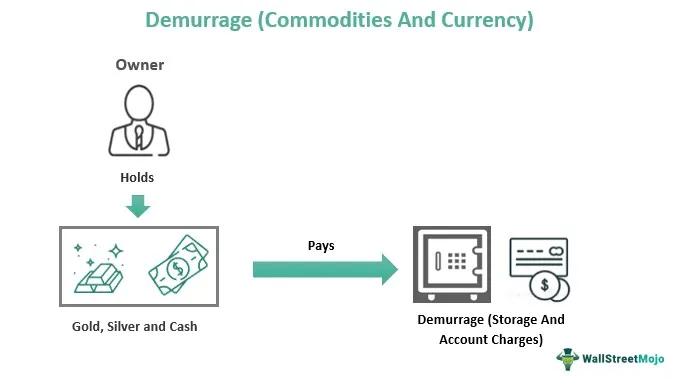

In the complex domains of logistics and finance, grasping specific terminologies such as demurrage, cargo fees, and algorithmic trading is pivotal for gaining a competitive edge. These elements are integral to the operational costs and strategic financial planning of businesses involved in the movement and management of goods. Demurrage charges, in particular, are a prevalent concern, impacting the financial outcomes for companies engaged in shipping and transportation. These charges arise when cargo or shipping containers exceed the allotted free time at a port or terminal, leading to additional costs that can affect the overall efficiency and cost-effectiveness of logistics operations.

In this article, we examine how understanding the intricacies of demurrage logistics and associated cargo fees can significantly influence the profitability and smooth functioning of logistics and supply chain processes. Moreover, the role of algorithmic trading, traditionally linked with financial markets, is increasingly relevant in this context. By leveraging automation and predictive analytics, algorithmic trading optimizes logistics operations, influencing pricing, route selection, and delivery scheduling to enhance efficiency and reduce costs. Understanding these components not only facilitates better cost management but also offers insights into how technological advancements are reshaping the logistics landscape.

## Table of Contents

## Understanding Demurrage in Logistics

Demurrage in logistics is a critical concept that refers to the charges incurred when shipping containers or cargo exceed the allotted free time at ports or railways. This system of fees is strategically implemented to encourage the timely loading and unloading of cargo, thereby mitigating congestion and preventing bottlenecks at crucial transport hubs. 

The genesis of demurrage charges lies in the need to optimize the utilization of limited port and railway infrastructure. When containers occupy valuable space longer than anticipated, it impedes the flow of incoming and outgoing shipments, disrupting logistic operations and schedules. Hence, these charges serve as an economic disincentive for companies, urging them to facilitate prompt cargo transitions to maintain fluidity in the supply chain.

Cost implications associated with demurrage can be substantial for businesses engaged in logistics. The fees often escalate quickly once the free time elapses, potentially escalating to figures that significantly impact the bottom line. Therefore, it is imperative for logistics managers and planners to implement robust strategies aimed at minimizing demurrage costs. Efficient operations, such as precise scheduling, advanced planning, and real-time monitoring of cargo movement, are essential to avoid unnecessary delays.

By leveraging technology, companies can mitigate the risks associated with demurrage. For instance, deploying software solutions that provide predictive analytics and logistics tracking can help anticipate potential delays and adjust operations accordingly. Additionally, fostering strong communication channels with stakeholders, including shipping lines and port authorities, can facilitate proactive measures to navigate demurrage scenarios effectively.

In summary, understanding and managing demurrage is essential for maintaining cost-effectiveness and operational efficiency within the logistics industry. Properly addressing this aspect can enhance a company's capability to streamline logistics operations, ensuring timely delivery and optimizing the utilization of resources at transport hubs.

## Cargo Fees: Beyond Demurrage

Cargo fees constitute a critical component of logistics and encompass a range of charges associated with the transportation and handling of goods, extending beyond just demurrage. These fees play a pivotal role in the overall cost structure of shipping operations and must be meticulously managed to ensure cost-efficiency and operational fluidity.

### Types of Cargo Fees

1. **Demurrage Fees**: These charges accrue when cargo is not moved out of the port or terminal within the allocated free time. They are intended to incentivize expedient handling and facilitate the smooth flow of goods through transport hubs.

2. **Detention Fees**: Detention fees are levied when import containers are held beyond the free period of use outside the port, effectively encouraging the return of the containers for reuse or further transportation.

3. **Handling Charges**: These include costs associated with the physical handling of cargo at different stages – loading, unloading, and storage. Handling charges vary based on cargo type, required equipment, and complexity of handling processes.

### Importance of Managing Cargo Fees

Efficient management of cargo fees is essential to minimize operational costs and avoid unnecessary logistical disruptions. By understanding the specific criteria and conditions under which different fees are applied, businesses can navigate these costs effectively. 

#### Factors Influencing Cargo Fees

- **Container Type and Size**: Different containers incur different fees based on their dimensions and special handling requirements.

- **Storage Duration**: Extended storage beyond contracted periods triggers additional charges, necessitating careful planning.

- **Port and Terminal Policies**: Each port may have distinctive fee structures and regulatory requirements, making it crucial for logistics managers to be aware of local nuances.

### Strategies for Cost Savings

1. **Optimized Scheduling**: By precisely scheduling pickups and drop-offs, companies can avoid unnecessary fees associated with delays.

2. **Real-Time Monitoring**: Implementing advanced tracking systems allows for proactive management of cargo movements, anticipating potential overruns.

3. **Negotiation**: Engaging with service providers to secure favorable terms can lead to reduced rates and an extension of free periods when required.

In conclusion, navigating the various cargo fees effectively is imperative for logistics service providers aiming to maintain cost-effective operations. Awareness and comprehension of these financial implications, coupled with strategic planning, can result in tangible cost savings and enhanced operational efficiency.

## The Role of Algorithmic Trading in Logistics

Algorithmic trading, initially designed for financial markets, is making significant strides in the logistics and supply chain sectors. By employing advanced algorithms, businesses can analyze vast datasets to predict trends and make informed decisions. Predictive analytics is particularly useful for optimizing logistics operations, as it enables companies to forecast demand, manage inventory levels, and streamline delivery schedules. For instance, by analyzing historical shipping data and market trends, algorithms can predict peak demand periods, allowing companies to adjust their logistics strategies accordingly.

Furthermore, [algorithmic trading](/wiki/algorithmic-trading) enhances decision-making processes through automation. Automated systems can evaluate multiple variables in real-time to determine the most efficient routes and pricing strategies. This capability is essential in dynamic logistics environments where conditions can change rapidly. For example, algorithms can quickly recalculate optimal delivery routes based on real-time traffic information or sudden changes in shipping costs.

The integration of these technologies helps businesses enhance operational efficiency and reduces costs. Automating routine tasks and optimizing logistics activities minimize human errors and resource wastage. For instance, predictive maintenance algorithms can reduce downtime by determining the optimal times for equipment servicing, thereby avoiding unforeseen disruptions.

Incorporating algorithmic trading techniques into logistics also supports dynamic pricing strategies. By analyzing market conditions, competitors' pricing, and customer demand, algorithms can suggest price adjustments that maximize profitability without losing competitiveness. This approach is particularly valuable in industries where pricing fluctuations can significantly impact margins.

Overall, the application of algorithmic trading in logistics represents a convergence of financial acumen and logistical efficiency, offering businesses an innovative approach to managing complex supply chains. As algorithms continue to evolve, their role in logistics is expected to become even more pronounced, further transforming how businesses operate in this sector.

## Best Practices for Mitigating Demurrage and Cargo Fees

Proper planning and forecasting are critical to mitigating demurrage and cargo fees effectively. By implementing meticulous planning strategies, companies can significantly reduce the likelihood of incurring unnecessary costs. Employing advanced tracking systems and real-time analytics play a pivotal role in achieving this objective. These technologies enable logistics managers to predict potential delays and adjust operations proactively, thereby preventing cost overruns associated with demurrage.

Advanced tracking systems, such as GPS and RFID technology, provide continuous visibility over the movement of goods. This real-time data ensures that logistics managers are aware of the exact location and status of shipments, enabling them to respond swiftly to any disruptions. In addition to tracking systems, real-time analytics facilitate the monitoring and analysis of current and historical data. By analyzing patterns and trends, businesses can forecast potential disruptions and adjust schedules accordingly to minimize additional charges.

Negotiating favorable terms with shipping lines is another effective strategy for mitigating demurrage and cargo fees. Engaging in negotiations with a clear understanding of the logistics requirements and constraints allows companies to secure terms that minimize the risk of incurring extra charges. It's essential for businesses to establish relationships with carriers based on mutual understanding and flexibility, ensuring that terms are set with considerations for potential delays or unforeseen circumstances.

Proactivity in communication with stakeholders, including shipping lines, port authorities, and customs, is equally important in preventing additional charges. Regular and transparent communication ensures that all parties are informed of potential issues and can collaborate to resolve them promptly. This approach reduces the chances of miscommunication and unexpected delays that could lead to demurrage fees.

In summary, effective mitigation of demurrage and cargo fees relies on comprehensive planning, the utilization of advanced technologies, strategic negotiation, and proactive stakeholder communication. Implementing these best practices enables businesses to enhance operational efficiency and reduce unnecessary logistics costs.

## Case Studies on Demurrage and Algo Trading in Logistics

In examining real-world applications of demurrage management and algorithmic trading in logistics, several case studies demonstrate notable achievements in cost mitigation and operational efficiency.

### Case Study 1: Global Shipping Company 

A leading global shipping company leveraged data analytics and algorithmic trading to optimize its demurrage management strategy. By implementing an advanced algorithmic system to predict vessel arrival and departure times, the company reduced its demurrage charges by 15%. The system utilized real-time data from various sources, including weather forecasts and port congestion levels, to adjust shipping schedules dynamically. This allowed for more accurate estimates of free storage periods, significantly minimizing unnecessary delays.

### Case Study 2: Retail Supply Chain Optimization

A multinational retail corporation employed algorithmic trading techniques to enhance its supply chain operations. By integrating [machine learning](/wiki/machine-learning) models, the company optimized its delivery schedules based on demand forecasts and route efficiencies. The algorithm analyzed historical sales data and external market trends to predict peak demand periods, adjusting inventory levels and transportation schedules accordingly. This strategic approach resulted in a 20% reduction in overall logistics costs, primarily by decreasing reliance on urgent air freight options and minimizing storage fees like demurrage.

### Case Study 3: Port Authority Digital Transformation

A port authority implemented a digital transformation project incorporating algorithmic trading and predictive analytics to streamline port operations. The system focused on reducing congestion and demurrage costs by providing real-time insights into port traffic and resource allocation. Through this initiative, the port achieved a 25% increase in throughput efficiency and reduced average container dwell time by 30%. The enhanced visibility into port operations enabled better scheduling of cargo movements and more effective management of storage facilities, leading to cost savings and improved service levels for shipping clients.

### Case Study 4: Third-Party Logistics (3PL) Company

A 3PL company specializing in international freight services adopted an integrated software solution embedded with algorithmic trading capabilities. This system facilitated automated decision-making processes for routing and pricing, factoring in dynamic elements such as fuel costs, labor availability, and geopolitical risks. The implementation enabled the company to reduce demurrage penalties significantly and optimize its resource allocation, achieving a 10% improvement in operational efficiency. The proactive approach to logistics management reflected the benefits of combining technology with strategic planning in complex supply chain environments.

These case studies underscore the transformative impact of technological advancement and strategic foresight in the logistics industry. By adopting algorithmic trading and optimizing demurrage management, businesses can navigate intricate logistical challenges and achieve substantial cost reductions.

## Conclusion

In conclusion, demurrage logistics and cargo fees are fundamental components of the global supply chain network, significantly influencing operational costs and efficiencies. Understanding these elements is crucial for businesses striving to enhance logistical operations and reduce expenses. By effectively managing demurrage and cargo fees, companies can optimize their shipping processes and avoid unnecessary financial burdens.

Incorporating algorithmic trading techniques into logistics provides an additional competitive edge, particularly in decision-making related to pricing, routing, and scheduling. These techniques allow for more precise predictions and real-time adjustments, contributing to better resource allocation and cost management within the supply chain.

As the logistics industry continues to advance, embracing technological innovations becomes paramount. Businesses must remain informed and adaptive to the latest developments to maintain efficiency and competitiveness. Leveraging data analytics, automation, and sophisticated algorithmic solutions enables companies to not only navigate existing challenges but also capitalize on emerging opportunities within the logistics sector.

Ultimately, staying proactive in technological adoption and strategic logistics management can position a company for sustained success in an ever-evolving global marketplace.

## References & Further Reading

[1]: Stopford, M. (2009). ["Maritime Economics"](https://www.taylorfrancis.com/books/mono/10.4324/9780203891742/maritime-economics-3e-martin-stopford). Routledge.

[2]: Murphy, P. R., & Knemeyer, A. M. (2017). ["Contemporary Logistics"](https://www.pearson.com/en-us/subject-catalog/p/contemporary-logistics/P200000005999/9780137503865). Pearson.

[3]: Lopez de Prado, M. (2018). ["Advances in Financial Machine Learning"](https://www.amazon.com/Advances-Financial-Machine-Learning-Marcos/dp/1119482089). Wiley.

[4]: Aronson, D. (2006). ["Evidence-Based Technical Analysis: Applying the Scientific Method and Statistical Inference to Trading Signals"](https://www.amazon.com/Evidence-Based-Technical-Analysis-Scientific-Statistical/dp/0470008741). Wiley.

[5]: Jansen, S. (2018). ["Machine Learning for Algorithmic Trading"](https://github.com/stefan-jansen/machine-learning-for-trading). Packt Publishing.

[6]: Chan, E. P. (2009). ["Quantitative Trading: How to Build Your Own Algorithmic Trading Business"](https://github.com/ftvision/quant_trading_echan_book). Wiley.