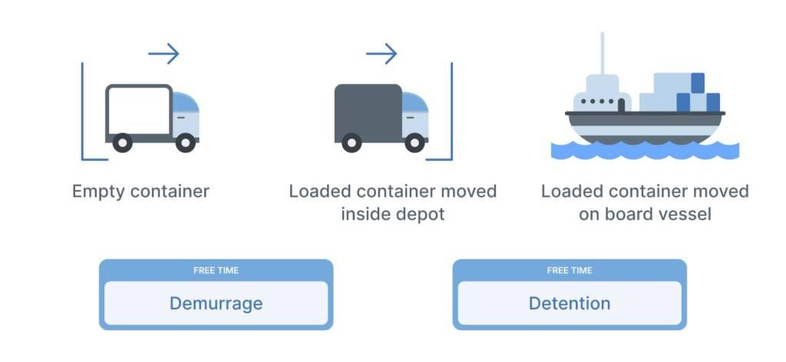

## Table of Contents

## What is demurrage?

Demurrage is a fee that you have to pay when you keep containers or cargo at a port or terminal longer than the allowed free time. It's like a penalty for taking too long to pick up your goods or return the containers. Shipping companies charge demurrage to cover the costs of the space that the containers are taking up, which could be used for other shipments.

The rules for demurrage can be different depending on the port or the shipping company. Usually, you get a few free days to pick up your cargo or return the containers. If you go over this time, the demurrage fees start. These fees can add up quickly, so it's important to manage your time well and understand the terms of your shipping contract.

## How does demurrage work in shipping?

Demurrage in shipping is like a penalty fee you pay when you keep containers or cargo at a port or terminal longer than the allowed free time. When your goods arrive at the port, you usually get a few days to pick them up or return the containers without any extra cost. These days are called "free time." If you don't move your goods within this free time, the shipping company will start charging you demurrage fees. The fees help the shipping company cover the costs of the space your containers are using, which could be used for other shipments.

The amount of demurrage you have to pay can change based on the port or the shipping company. Each place and company has its own rules about how many free days you get and how much the demurrage fees will be. It's important to know these rules and plan your time well so you don't end up paying more than you need to. If you're not careful, demurrage fees can add up quickly and make your shipping costs a lot higher.

## What is the purpose of demurrage charges?

Demurrage charges are like a penalty you pay when you keep containers or cargo at a port longer than you're supposed to. They help make sure that people pick up their goods quickly so the port can stay busy and keep moving other shipments. If you don't move your stuff on time, you're taking up space that other people need, so the port charges you to cover the cost of that space.

These charges encourage everyone to work faster and keep the whole shipping process running smoothly. If nobody paid demurrage, ports would get too crowded with containers that aren't being picked up, and that would slow everything down. By having demurrage fees, ports can keep things moving and make sure there's always room for new shipments coming in.

## Who is typically responsible for paying demurrage fees?

The person or company that's supposed to pick up the cargo or return the containers usually has to pay the demurrage fees. This could be the importer, the buyer, or whoever is in charge of getting the goods from the port. It depends on the terms of the shipping contract, which says who is responsible for what.

Sometimes, if the shipper or the shipping company is the one causing the delay, they might have to pay the demurrage fees instead. But most of the time, it's up to the person receiving the goods to make sure they get picked up on time, or else they'll have to pay the extra charges. It's important to read the contract carefully to know who's responsible for these fees.

## How are demurrage charges calculated?

Demurrage charges are calculated based on how many days you keep your containers or cargo at the port after the free time is over. Each port and shipping company has its own rules about how many free days you get. Once those free days are up, you start getting charged a daily fee for each container that's still at the port. The amount of the fee can be different depending on the port and the shipping company, and it might go up if you keep the containers there for a long time.

The exact way demurrage charges are calculated can be a bit complicated, but it usually involves a set fee per day for each container. For example, if the free time is 5 days and you keep your container there for 7 days, you'll be charged for 2 days of demurrage. The fee might be a flat rate, or it could increase over time to encourage you to move your goods faster. It's important to know the specific rules and rates for the port and shipping company you're working with so you can plan and avoid extra costs.

## Can demurrage fees be negotiated or waived?

Yes, sometimes demurrage fees can be negotiated or waived, but it depends on the situation and the shipping company. If the delay was caused by something out of your control, like bad weather or a strike at the port, you might be able to talk to the shipping company and ask them to waive the fees. It's a good idea to keep good records and show them why you couldn't pick up your goods on time.

Even if the delay was your fault, you might still be able to negotiate a lower fee. It's worth trying to talk to the shipping company and see if they can give you a better deal. They might agree to reduce the fees if you have a good relationship with them or if you're a regular customer. Just remember, it's always better to avoid demurrage fees in the first place by picking up your goods on time.

## What are the common causes of demurrage?

Demurrage happens when you don't pick up your containers or cargo from the port on time. A common reason for this is delays in customs clearance. If the paperwork isn't ready or there are issues with the documents, it can take longer to get your goods through customs, and you might end up paying demurrage fees.

Another reason for demurrage is problems with transportation. If the trucks or trains that are supposed to move your goods from the port are delayed, your containers will sit at the port longer than planned. Bad weather, strikes, or mechanical issues can all cause these transportation delays.

Sometimes, the person or company receiving the goods might not be ready to take them. This can happen if they don't have enough space in their warehouse or if they're waiting on payment from their customer. When the receiver isn't prepared, the containers stay at the port, and demurrage fees start to pile up.

## How can businesses avoid or minimize demurrage costs?

Businesses can avoid or minimize demurrage costs by planning ahead and making sure everything is ready before the goods arrive at the port. This means having all the paperwork done and making sure customs clearance will go smoothly. It's also important to coordinate with the transportation company to make sure there are trucks or trains available to pick up the goods as soon as they're ready. By being prepared, businesses can pick up their containers within the free time and avoid demurrage fees.

Another way to minimize demurrage costs is to keep a close eye on the shipment's progress and stay in touch with the shipping company. If there are any delays or problems, knowing about them early can help you find a solution before the free time runs out. Sometimes, businesses can work with the shipping company to get an extension on the free time or negotiate lower fees if there's a good reason for the delay. By staying proactive and communicating well, businesses can reduce the risk of demurrage and keep their shipping costs down.

## What is the difference between demurrage and detention?

Demurrage and detention are two different fees you might have to pay when you're dealing with shipping containers. Demurrage is the fee you pay when you keep your cargo at the port longer than the allowed free time. This happens if you don't pick up your goods from the port within the set number of days. The port charges demurrage to cover the cost of the space your containers are taking up, which could be used for other shipments.

Detention, on the other hand, is the fee you pay when you keep the shipping containers longer than you're supposed to after you've picked them up from the port. This fee starts once the free time for using the containers is over. Detention charges are meant to make sure that containers are returned quickly so they can be used for other shipments. Both demurrage and detention help keep the shipping process running smoothly by encouraging everyone to move their goods and return containers on time.

## How does demurrage impact the overall logistics and supply chain management?

Demurrage can have a big impact on logistics and supply chain management. When containers stay at the port longer than they should, it can slow down the whole process of moving goods. This delay can cause problems for everyone involved in the supply chain, from the people who make the products to the people who sell them. If goods are stuck at the port, it can lead to late deliveries, which can make customers unhappy and cost businesses money. Plus, the extra fees from demurrage can make the cost of shipping go up, which can affect a company's profits.

To manage demurrage and keep the supply chain running smoothly, businesses need to plan carefully and stay on top of their shipments. This means making sure all the paperwork is ready for customs and that transportation is lined up to pick up the goods on time. Good communication with everyone involved, like shipping companies and port authorities, can also help avoid delays. By being proactive and prepared, businesses can reduce the risk of demurrage and keep their supply chain efficient and cost-effective.

## What are some real-world examples of demurrage in international trade?

In international trade, demurrage can happen when there are delays at the port. For example, a company in the United States might import electronics from China. If the electronics arrive at the port of Los Angeles, the company has a certain number of free days to pick them up. But if there's a problem with the customs paperwork, the containers might sit at the port longer than planned. The company would then have to pay demurrage fees for each extra day the containers stay there. This can add up quickly and make the cost of importing the electronics a lot higher.

Another example is when a European car manufacturer ships vehicles to Brazil. The cars arrive at the port of Santos, and the manufacturer has a few days to get them out of the port. But if there's a strike by the truck drivers who are supposed to move the cars, the vehicles will stay at the port longer than expected. The manufacturer would then have to pay demurrage fees for the extra time the cars are taking up space at the port. These fees can affect the manufacturer's profits and might even delay the delivery of the cars to dealerships in Brazil.

## How do regulations and international laws affect demurrage practices?

Regulations and international laws play a big role in how demurrage is handled in shipping. Different countries have their own rules about how long you get to pick up your goods from the port before you have to start paying demurrage fees. These rules can be part of international trade agreements, which help make sure that everyone follows the same standards. For example, the United Nations Convention on Contracts for the International Carriage of Goods Wholly or Partly by Sea (the Rotterdam Rules) sets out guidelines for how demurrage should be managed. These kinds of laws help make sure that demurrage practices are fair and clear for everyone involved in shipping.

These regulations also affect how demurrage fees are calculated and whether they can be negotiated or waived. Some countries have strict rules about how much shipping companies can charge for demurrage, while others might let companies set their own fees. International laws can also say when it's okay to waive demurrage fees, like if there's a natural disaster or other things that are out of your control. By setting these rules, governments and international organizations help keep demurrage practices fair and prevent companies from charging too much. This helps keep the whole shipping process running smoothly and makes sure that businesses can plan their shipments without worrying about unexpected costs.

## References & Further Reading

[1]: Stopford, M. (2009). ["Maritime Economics"](https://www.taylorfrancis.com/books/mono/10.4324/9780203891742/maritime-economics-3e-martin-stopford). Routledge.

[2]: Murphy, P. R., & Knemeyer, A. M. (2017). ["Contemporary Logistics"](https://www.pearson.com/en-us/subject-catalog/p/contemporary-logistics/P200000005999/9780137503865). Pearson.

[3]: Lopez de Prado, M. (2018). ["Advances in Financial Machine Learning"](https://www.amazon.com/Advances-Financial-Machine-Learning-Marcos/dp/1119482089). Wiley.

[4]: Aronson, D. (2006). ["Evidence-Based Technical Analysis: Applying the Scientific Method and Statistical Inference to Trading Signals"](https://www.amazon.com/Evidence-Based-Technical-Analysis-Scientific-Statistical/dp/0470008741). Wiley.

[5]: Jansen, S. (2018). ["Machine Learning for Algorithmic Trading"](https://github.com/stefan-jansen/machine-learning-for-trading). Packt Publishing.

[6]: Chan, E. P. (2009). ["Quantitative Trading: How to Build Your Own Algorithmic Trading Business"](https://github.com/ftvision/quant_trading_echan_book). Wiley.