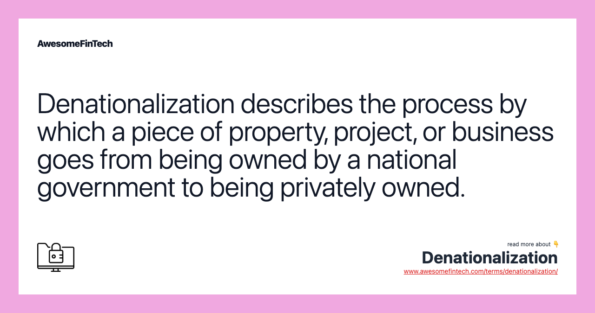

## Table of Contents

## What is denationalization?

Denationalization is when a country takes away someone's citizenship. This can happen for different reasons, like if a person commits a serious crime or if they get citizenship in another country. When someone loses their citizenship, they might not have a country anymore, which can be very hard for them.

Sometimes, countries use denationalization to punish people they don't like or to get rid of people they see as a problem. This can lead to big problems because people without a country can't easily get help from any government. It's a controversial topic because it can affect people's rights and their ability to live safely.

## What are the common reasons for denationalization?

Denationalization often happens when a person does something very bad, like committing a serious crime such as terrorism or treason. Countries might take away someone's citizenship to show that they do not support these actions and to punish the person. Another common reason is if a person gets citizenship in another country. Some countries have rules that say you can't have more than one citizenship, so if you become a citizen of another country, you might lose your original citizenship.

Sometimes, denationalization can also happen if a person got their citizenship through false information or lies. If it's found out that someone tricked the government to get their citizenship, the country might take it away. This is to make sure that only people who meet the right requirements can be citizens. Overall, denationalization is used by countries to control who is a citizen and to respond to certain actions or situations.

## How does denationalization affect individuals?

When someone loses their citizenship through denationalization, it can change their life a lot. They might not be able to live in the country where they were a citizen anymore. This means they could have to leave their home, their job, and their friends and family. Without citizenship, it can be hard for them to get help from the government, like health care or money if they are struggling. They might also find it difficult to travel because they don't have a passport from that country anymore.

Losing citizenship can also make people feel very sad and alone. They might feel like they don't belong anywhere. If they don't have citizenship in any other country, they could become stateless, which means they don't have a country at all. Being stateless can make it hard to do simple things like go to school, get a job, or even open a bank account. It's a big problem that can make life very difficult and stressful for the person who loses their citizenship.

## Can denationalization be challenged legally?

Yes, denationalization can be challenged in court. If someone thinks their citizenship was taken away unfairly, they can ask a judge to look at their case. They might say that the government made a mistake or broke the rules when they took away the citizenship. The person can use lawyers to help them argue their case and show why they should keep their citizenship.

Sometimes, the challenge can be successful if the court agrees that the denationalization was not right. But other times, the court might decide that the government did everything correctly and the person will stay without citizenship. It's a hard process and can take a long time, but it's one way people can try to get their citizenship back if they believe it was taken away unfairly.

## What is the difference between denationalization and statelessness?

Denationalization is when a country takes away someone's citizenship. It can happen because the person did something very bad, got citizenship in another country, or got their citizenship through lies. When someone loses their citizenship, they might have to leave the country where they were a citizen and can't get help from that government anymore.

Statelessness is when a person does not have citizenship in any country. This can happen if someone is denationalized and doesn't have citizenship anywhere else. Being stateless can make life very hard because it's tough to get basic things like health care, a job, or even a passport. It's a big problem that can leave people feeling like they don't belong anywhere.

## Which countries have laws allowing denationalization?

Many countries have laws that let them take away someone's citizenship. For example, the United States can denationalize people if they got their citizenship by lying or if they join a group that wants to overthrow the government. In the UK, they can take away citizenship from people who do very bad things like terrorism, especially if the person has citizenship in another country too. Australia also has rules that let them denationalize people who fight for terrorist groups or do other serious crimes.

Other countries like France and the Netherlands can denationalize people for similar reasons. France can take away citizenship from people who get another country's citizenship if they were born outside France and their parents were not French. The Netherlands can denationalize someone if they join a terrorist group or if they lied to get their citizenship. These laws show that many countries use denationalization to deal with serious crimes or to control who can be a citizen.

## What are some historical examples of denationalization?

In the past, denationalization has been used in different ways. One big example is from Nazi Germany in the 1930s and 1940s. The Nazis took away the citizenship of Jewish people and other groups they did not like. This made it easier for them to send these people to concentration camps and treat them badly. It was a terrible time when many people lost their rights and their lives because they were no longer seen as citizens.

Another example is from the United States during World War II. The U.S. government took away the citizenship of some Japanese Americans. They did this because they thought these people might help Japan, even though many of them were born in the U.S. and had never been to Japan. This led to many Japanese Americans being sent to internment camps, where they had to live in bad conditions just because of their background.

## How do international laws and treaties address denationalization?

International laws and treaties try to protect people from denationalization, especially when it might make them stateless. The Universal Declaration of Human Rights, created by the United Nations, says that everyone has the right to a nationality. This means countries should not take away someone's citizenship if it will leave them without a country. The 1961 Convention on the Reduction of Statelessness also sets rules to stop people from becoming stateless. It says that countries should be very careful about taking away citizenship and should only do it if the person has citizenship somewhere else.

However, not all countries follow these rules, and some still use denationalization. The European Convention on Nationality, for example, says that countries should not take away citizenship in a way that makes someone stateless, but it also lets countries do it in some cases if they have good reasons. So, while international laws try to protect people, they can be hard to enforce, and different countries might have different rules about denationalization. This can lead to some people losing their citizenship and facing big problems.

## What are the political and social implications of denationalization?

Denationalization can cause big problems in politics and society. When a country takes away someone's citizenship, it can make people feel scared and unsure. They might worry that the same thing could happen to them or people they know. This can make people trust the government less and feel like their rights are not safe. Politicians might use denationalization to look tough on crime or to show they are protecting the country, but it can also make them seem unfair or harsh. This can lead to arguments and disagreements about what is right and wrong.

On the social side, denationalization can split communities. When someone loses their citizenship, they might have to leave their home and their friends. This can make people feel sad and lonely. It can also make some groups of people feel targeted or unwelcome. For example, if a certain group is more likely to be denationalized, it can cause anger and resentment. This can lead to more tension and conflict in society. Overall, denationalization can make it harder for people to feel like they belong and can cause a lot of stress and worry.

## How has the policy on denationalization evolved over time?

Over time, the way countries handle denationalization has changed a lot. In the past, some countries used it to hurt certain groups of people, like what happened in Nazi Germany when they took away the citizenship of Jewish people. This was a very bad time, and it showed how denationalization could be used to do terrible things. After World War II, the world started to see that denationalization could lead to big problems, like people becoming stateless and losing their rights. So, countries and international groups began to make rules to stop this from happening as much.

Today, many countries still have laws that let them take away someone's citizenship, but there are more rules to make sure it is done fairly. For example, countries like the United States and the UK can denationalize people for serious crimes, but they have to be careful not to leave someone without any citizenship at all. International laws, like the Universal Declaration of Human Rights, say that everyone should have a nationality, and treaties like the 1961 Convention on the Reduction of Statelessness try to stop people from becoming stateless. Even though these rules exist, some countries still use denationalization, which can cause big debates about what is fair and right.

## What are the ethical considerations surrounding denationalization?

Denationalization raises big ethical questions because it can take away someone's rights and make them stateless. When a country takes away someone's citizenship, it can leave them without a country to call home. This can make life very hard for them because they might not be able to get help from any government. They could lose their home, job, and be separated from their family and friends. It's important to think about whether it's fair to punish someone by taking away their citizenship, especially if it leaves them with no country at all.

Another ethical issue is how denationalization can be used unfairly. Sometimes, countries might use it to target certain groups of people they don't like. This can make people feel scared and unsafe. It can also make some groups feel like they are not welcome in the country. When a government uses denationalization in this way, it can cause a lot of anger and division in society. It's important for countries to use this power carefully and make sure they are not hurting people's rights or treating them unfairly.

## What future trends might influence denationalization policies?

In the future, more countries might use denationalization because of worries about terrorism and safety. They might want to show they are tough on crime by taking away the citizenship of people who do bad things. This could lead to more laws that let countries take away citizenship, but they will also need to be careful not to break international rules that protect people's rights. As the world gets more connected, countries might work together more to decide when it's okay to take away someone's citizenship, so they can keep people safe without making them stateless.

Another trend could be more focus on human rights and fairness. People and groups that care about human rights might push for stricter rules to stop denationalization from being used unfairly. They might want to make sure that no one loses their citizenship if it will leave them without a country. This could lead to changes in laws and more countries agreeing to follow international treaties that protect people from becoming stateless. As these ideas become more important, countries might have to balance keeping their citizens safe with making sure they treat everyone fairly.

## References & Further Reading

[1]: ["Universal Declaration of Human Rights"](https://www.un.org/en/about-us/universal-declaration-of-human-rights) by the United Nations

[2]: ["Advances in Financial Machine Learning"](https://www.amazon.com/Advances-Financial-Machine-Learning-Marcos/dp/1119482089) by Marcos Lopez de Prado

[3]: ["Quantitative Trading: How to Build Your Own Algorithmic Trading Business"](https://www.amazon.com/Quantitative-Trading-Build-Algorithmic-Business/dp/1119800064) by Ernest P. Chan

[4]: ["Evidence-Based Technical Analysis: Applying the Scientific Method and Statistical Inference to Trading Signals"](https://www.amazon.com/Evidence-Based-Technical-Analysis-Scientific-Statistical/dp/0470008741) by David Aronson

[5]: ["Machine Learning for Algorithmic Trading"](https://github.com/PacktPublishing/Machine-Learning-for-Algorithmic-Trading-Second-Edition) by Stefan Jansen

[6]: ["Denationalization: Rethinking Nationality and Sovereignty in the Modern World"](https://assets.cambridge.org/97805217/65855/frontmatter/9780521765855_frontmatter.pdf) by Ayelet Shachar

[7]: ["The Effects of Algorithmic Trading on Market Dynamics: A Review and Future Directions"](https://www.semanticscholar.org/paper/ALGORITHMIC-TRADING%3A-A-COMPREHENSIVE-REVIEW-OF-AND-Garg/94ead853e1835e7caae78d080e8b0e2f5f504607) by the Journal of Financial Studies