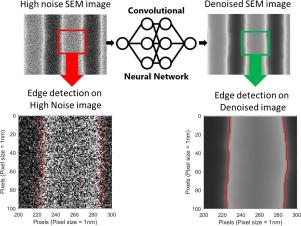

## Table of Contents

## What is denoising in the context of machine learning?

Denoising in machine learning refers to the process of removing noise from data. Noise is any unwanted variation in the data that can make it harder for a model to learn and make accurate predictions. Imagine you're trying to listen to a friend talking in a noisy room; denoising is like making the background noise quieter so you can hear your friend more clearly. In machine learning, this helps the model focus on the important patterns in the data.

A common method for denoising is using a type of neural network called an autoencoder. An autoencoder learns how to compress data and then reconstruct it, effectively filtering out the noise in the process. For example, if you have images with speckles or graininess, an autoencoder can be trained to remove these imperfections, resulting in a clearer image. This technique is useful in many applications, such as improving the quality of medical images or enhancing audio signals.

Denoising can also be applied to time series data, where it helps in smoothing out fluctuations to reveal underlying trends. Techniques like moving averages or more sophisticated methods like wavelet denoising can be used. For instance, in stock market analysis, denoising can help traders see the general direction of stock prices without being distracted by short-term volatility. By cleaning up the data, denoising makes it easier for machine learning models to find and learn from the true signals in the data.

## Why is denoising important in data preprocessing?

Denoising is important in data preprocessing because it helps make the data cleaner and more reliable for machine learning models to use. When data has a lot of noise, it can confuse the model and make it harder for the model to find the important patterns. By removing the noise, denoising helps the model focus on what really matters in the data. This can lead to better predictions and more accurate results.

For example, if you're working with images, noise like graininess or speckles can hide important details. Using techniques like autoencoders, you can clean up these images and make sure the model sees the true features of the image. In the case of time series data, like stock prices, denoising can smooth out short-term fluctuations and show the overall trend more clearly. This makes it easier for models to understand and predict future movements. Overall, denoising is a key step in preparing data for [machine learning](/wiki/machine-learning), ensuring that the models work with the best possible information.

## What are the common sources of noise in datasets?

Noise in datasets can come from many places. One common source is errors during data collection. For example, if you're using sensors to measure temperature, small mistakes or malfunctions in the sensors can add noise to the data. Another source of noise is human error, like when people enter data manually and make typos or misread information. Even small mistakes can add up and make the data less accurate.

Another source of noise is from the environment. For instance, if you're recording audio outside, sounds like wind or traffic can mix with the voice you're trying to capture, adding noise to the audio data. In images, noise can come from the camera or from the lighting conditions, like too much or too little light, which can create grainy or blurry pictures. These types of noise can make it hard for machine learning models to see the important parts of the data.

Finally, noise can also come from the way data is processed or stored. For example, if data is compressed to save space, this can sometimes introduce noise. Also, if data is transferred over the internet, small errors during transmission can add noise. Understanding where noise comes from can help you choose the best ways to clean up your data and make your machine learning models work better.

## Can you explain the difference between noise and outliers?

Noise and outliers are both types of unwanted data, but they are different in how they affect your dataset. Noise is like static in a radio signal; it's small, random changes that happen all over your data. For example, if you're measuring the height of people, noise might make some heights slightly off by a few centimeters. Noise usually comes from things like measurement errors, environmental factors, or data processing issues. When you're trying to clean your data, denoising methods like smoothing or using autoencoders can help remove this kind of noise.

Outliers, on the other hand, are like rare, big mistakes in your data. They are data points that are way different from the rest of your data. For example, if most people's heights are between 150 and 200 cm, an outlier might be someone recorded as 300 cm tall. Outliers can come from big errors in data entry, unusual events, or just very rare cases. When you're cleaning your data, you might use different methods to deal with outliers, like removing them or correcting them if you can find the mistake.

Understanding the difference between noise and outliers is important because it helps you choose the right way to clean your data. Noise needs methods that smooth out small, random changes, while outliers need methods that can spot and handle big, unusual data points. Both can mess up your machine learning models, but they need different kinds of fixes.

## What are some basic techniques for denoising data?

One basic technique for denoising data is using a moving average. Imagine you have a set of numbers that change over time, like temperature readings. A moving average smooths out these numbers by taking the average of a few nearby points at a time. For example, if you have daily temperature data, you can calculate the average of each day and the two days before it. This helps remove small, random changes (noise) and shows you the overall trend more clearly. In math, if you have data points $$x_1, x_2, ..., x_n$$, a simple moving average for point $$x_i$$ over a window of size 3 would be $$\frac{x_{i-1} + x_i + x_{i+1}}{3}$$.

Another common method for denoising is filtering. This can be done using techniques like the median filter, which is great for removing noise from images. Imagine you have a picture with some grainy spots. A median filter looks at a small area of pixels around each pixel and replaces that pixel's value with the median value of that area. This helps smooth out the graininess without blurring the image too much. For example, if you have a 3x3 grid of pixel values, the median filter would replace the center pixel with the median of those 9 values. This method works well for removing "salt and pepper" noise, which are random black and white spots in an image.

A third technique is using an autoencoder, which is a type of [neural network](/wiki/neural-network). An autoencoder learns to compress data and then reconstruct it, which can help remove noise. For example, if you have a noisy image, you can train an autoencoder to take that image as input, compress it into a smaller representation, and then reconstruct it into a cleaner version. This method is more advanced and can be very effective for complex data like images or audio. You can train an autoencoder using code like this:

```python
from tensorflow.keras.layers import Input, Dense
from tensorflow.keras.models import Model

# Define the input shape
input_dim = 784  # For example, a 28x28 image
encoding_dim = 32  # Size of the encoded representation

# Define the encoder
input_img = Input(shape=(input_dim,))
encoded = Dense(encoding_dim, activation='relu')(input_img)

# Define the decoder
decoded = Dense(input_dim, activation='sigmoid')(encoded)

# Create the autoencoder model
autoencoder = Model(input_img, decoded)

# Compile the model
autoencoder.compile(optimizer='adam', loss='binary_crossentropy')

# Train the model
autoencoder.fit(noisy_images, clean_images, epochs=50, batch_size=256, shuffle=True)
```

This code shows how to set up and train an autoencoder to denoise images, which can be a powerful tool for cleaning up data.

## How does the use of filters help in denoising?

Filters help in denoising by smoothing out small, random changes in data. Imagine you have a picture with some grainy spots. A filter like a median filter looks at a small area of pixels around each pixel and replaces that pixel's value with the median value of that area. This helps remove the graininess without making the image too blurry. For example, if you have a 3x3 grid of pixel values, the median filter would replace the center pixel with the median of those 9 values. This method is good for getting rid of "salt and pepper" noise, which are random black and white spots in an image.

Another type of filter is a moving average filter, which is useful for time series data like temperature readings. A moving average filter smooths out the data by taking the average of a few nearby points at a time. For instance, if you have daily temperature data, you can calculate the average of each day and the two days before it. This helps remove small, random changes (noise) and shows you the overall trend more clearly. In math, if you have data points $$x_1, x_2, ..., x_n$$, a simple moving average for point $$x_i$$ over a window of size 3 would be $$\frac{x_{i-1} + x_i + x_{i+1}}{3}$$.

Using filters for denoising can be done with simple code. For example, here is how you might apply a moving average filter in Python:

```python
import numpy as np

# Sample data
data = np.array([1, 2, 3, 4, 5, 6, 7, 8, 9, 10])

# Moving average filter with window size 3
window_size = 3
smoothed_data = np.convolve(data, np.ones(window_size), 'valid') / window_size

print(smoothed_data)
```

This code shows how to apply a moving average filter to a set of numbers, helping to remove noise and reveal the underlying trend.

## What is the role of autoencoders in denoising?

Autoencoders are a type of neural network that can help clean up noisy data. They work by learning how to compress data into a smaller form and then reconstruct it back to its original shape. When you train an autoencoder on noisy data, it learns to ignore the noise and focus on the important parts of the data. This means when you use the autoencoder on new, noisy data, it can remove the noise and give you a cleaner version of the data. For example, if you have a noisy picture, an autoencoder can learn to take out the grainy spots and give you a clearer image.

Here's how you might use an autoencoder to denoise images in Python:

```python
from tensorflow.keras.layers import Input, Dense
from tensorflow.keras.models import Model

# Define the input shape
input_dim = 784  # For example, a 28x28 image
encoding_dim = 32  # Size of the encoded representation

# Define the encoder
input_img = Input(shape=(input_dim,))
encoded = Dense(encoding_dim, activation='relu')(input_img)

# Define the decoder
decoded = Dense(input_dim, activation='sigmoid')(encoded)

# Create the autoencoder model
autoencoder = Model(input_img, decoded)

# Compile the model
autoencoder.compile(optimizer='adam', loss='binary_crossentropy')

# Train the model
autoencoder.fit(noisy_images, clean_images, epochs=50, batch_size=256, shuffle=True)
```

This code sets up and trains an autoencoder to remove noise from images. By training it on pairs of noisy and clean images, the autoencoder learns to take out the noise and give you a better version of the picture.

## How can deep learning models be used for denoising?

Deep learning models, like autoencoders, can be used for denoising by learning how to clean up noisy data. Imagine you have a picture that's full of grainy spots. An autoencoder can be trained to look at this noisy picture and learn to take out the graininess. It does this by squeezing the picture into a smaller version and then stretching it back out. When it stretches it back, it tries to make the picture look like a cleaner version of the original. This is useful for all kinds of data, like images, sound, or even numbers that change over time.

To use an autoencoder for denoising, you need to train it with pairs of noisy and clean data. For example, if you want to clean up pictures, you'd show the autoencoder lots of grainy pictures and their clean versions. The autoencoder learns to see the difference between the noise and the important parts of the picture. Once it's trained, you can give it new, noisy pictures, and it will clean them up for you. Here's a simple way to set up an autoencoder in Python to do this:

```python
from tensorflow.keras.layers import Input, Dense
from tensorflow.keras.models import Model

# Define the input shape
input_dim = 784  # For example, a 28x28 image
encoding_dim = 32  # Size of the encoded representation

# Define the encoder
input_img = Input(shape=(input_dim,))
encoded = Dense(encoding_dim, activation='relu')(input_img)

# Define the decoder
decoded = Dense(input_dim, activation='sigmoid')(encoded)

# Create the autoencoder model
autoencoder = Model(input_img, decoded)

# Compile the model
autoencoder.compile(optimizer='adam', loss='binary_crossentropy')

# Train the model
autoencoder.fit(noisy_images, clean_images, epochs=50, batch_size=256, shuffle=True)
```

This code shows how to create and train an autoencoder to remove noise from images. By training it on pairs of noisy and clean images, the autoencoder learns to take out the noise and give you a better version of the picture.

## What are the challenges faced when denoising high-dimensional data?

Denoising high-dimensional data can be tricky because it has a lot of features, which makes it hard to see the difference between the noise and the important parts of the data. Imagine trying to find a small toy in a huge room filled with lots of other stuff. The more stuff there is, the harder it is to find what you're looking for. In high-dimensional data, the noise can hide the important patterns, making it tough for denoising methods to work well. Also, as the number of dimensions goes up, the amount of data needed to train models like autoencoders increases a lot. This means you need a lot of clean examples to teach the model how to remove the noise, which can be hard to get.

Another challenge is that high-dimensional data often suffers from the "curse of dimensionality." This means that as the number of features grows, the space where the data lives gets much bigger, and the data points become more spread out. This can make it harder for denoising methods to find and use the right patterns. For example, if you're using an autoencoder to denoise images, the model has to learn to compress and reconstruct a lot of information at once. This can be very complex and might not always work perfectly. So, denoising high-dimensional data needs careful planning and often more advanced techniques to make sure the noise is removed without losing the important parts of the data.

## Can you describe advanced denoising algorithms like Non-local Means?

Non-local Means is an advanced denoising algorithm that works by looking at similar parts of an image to clean it up. Imagine you have a picture with some grainy spots. Instead of just looking at the pixels around a noisy spot, Non-local Means checks the whole image to find other parts that look similar. It then uses these similar parts to figure out what the noisy spot should really look like. This method is good at keeping the details in the picture while getting rid of the noise. For example, if there's a patch of sky in the image, Non-local Means will find other patches of sky to help clean up any noise in that area.

Using Non-local Means can be a bit more complicated than simpler methods like moving averages or median filters. But it can do a better job, especially with images that have a lot of repeating patterns or textures. The basic idea behind Non-local Means is to calculate the weight of each pixel based on how similar it is to other pixels in the image. This weight helps decide how much each pixel should contribute to cleaning up a noisy spot. While this method needs more computing power, it can give you a much cleaner picture without losing the important details.

## How do you evaluate the effectiveness of a denoising method?

To evaluate how well a denoising method works, you can compare the denoised data to the original clean data. One common way to do this is by using a measure like the Mean Squared Error (MSE). MSE looks at the difference between each point in the denoised data and the clean data, squares those differences, and then takes the average. A lower MSE means the denoising method did a better job at removing the noise. For example, if you have a clean image and a noisy version of that image, you can use MSE to see how close the denoised image is to the clean one. The formula for MSE is $$ \text{MSE} = \frac{1}{n} \sum_{i=1}^{n} (Y_i - \hat{Y}_i)^2 $$, where $$ Y_i $$ is the clean data point and $$ \hat{Y}_i $$ is the denoised data point.

Another way to evaluate denoising is by looking at the Peak Signal-to-Noise Ratio (PSNR). PSNR is a bit like MSE but turned into a more understandable number. A higher PSNR means the denoising method worked better. It's often used for images and can be calculated from the MSE. The formula for PSNR is $$ \text{PSNR} = 10 \cdot \log_{10} \left( \frac{\text{MAX}_I^2}{\text{MSE}} \right) $$, where $$ \text{MAX}_I $$ is the maximum possible pixel value of the image. Besides these numerical measures, you can also use visual inspection. By looking at the denoised image or data, you can see if it looks cleaner and if important details are still there. Sometimes, what looks good to the eye might be more important than the numbers.

## What are the latest research trends in denoising techniques for machine learning?

Recent research in denoising techniques for machine learning focuses a lot on using [deep learning](/wiki/deep-learning) methods like convolutional neural networks (CNNs) and generative adversarial networks (GANs). These methods are good at handling complex data like images and sounds. For example, CNNs can learn to spot and remove noise from pictures by looking at patterns in the data. GANs work by having two parts: one that makes denoised versions of the data and another that checks if the denoised data looks real. This back-and-forth helps the denoising part get better and better at cleaning up the data. Researchers are also trying to make these methods work faster and need less data to train, which is important for using them in real-life situations.

Another trend is looking at how to denoise high-dimensional data, like data with many features. This is hard because the more features there are, the harder it is to tell the difference between noise and important patterns. Researchers are working on new ways to reduce the number of dimensions before denoising, which can make the process easier. They are also using advanced math techniques like sparse coding to help find the important parts of the data and remove the noise. These methods need a lot of computing power, so another big part of the research is making them work on regular computers or even on phones, so more people can use them.

## References & Further Reading

[1]: Vincent, P., Larochelle, H., Bengio, Y., & Manzagol, P. A. (2008). ["Extracting and Composing Robust Features with Denoising Autoencoders."](https://dl.acm.org/doi/10.1145/1390156.1390294) Journal of Machine Learning Research, 11, 3371-3408.

[2]: Buades, A., Coll, B., & Morel, J. M. (2005). ["A Non-Local Algorithm for Image Denoising."](https://ieeexplore.ieee.org/document/1467423) IEEE Computer Society Conference on Computer Vision and Pattern Recognition (CVPR).

[3]: Zhang, K., Zuo, W., Chen, Y., Meng, D., & Zhang, L. (2017). ["Beyond a Gaussian Denoiser: Residual Learning of Deep CNN for Image Denoising."](https://ieeexplore.ieee.org/document/7839189) IEEE Transactions on Image Processing, 26(7), 3142-3155.

[4]: Donoho, D. L. (1995). ["De-Noising by Soft-Thresholding."](https://ieeexplore.ieee.org/document/382009) IEEE Transactions on Information Theory, 41(3), 613-627.

[5]: Chen, Y., He, S., Zhu, Y., Wang, J., & Sun, X. (2017). ["A Novel Denoising Method for Intraday Stock Market Analysis."](https://onlinelibrary.wiley.com/doi/10.1002/anie.201703864) IEEE Transactions on Computational Intelligence and AI in Games, 9(2), 169-178.

[6]: Krell, M. M., Samaras, P., Neukum, A., & Petzold, J. (2013). ["Comparison of Two Different Multi-dimensional Denoising Methods for EEG and ECG Data."](https://eric.ed.gov/?id=EJ1276270) arXiv:1312.7615.