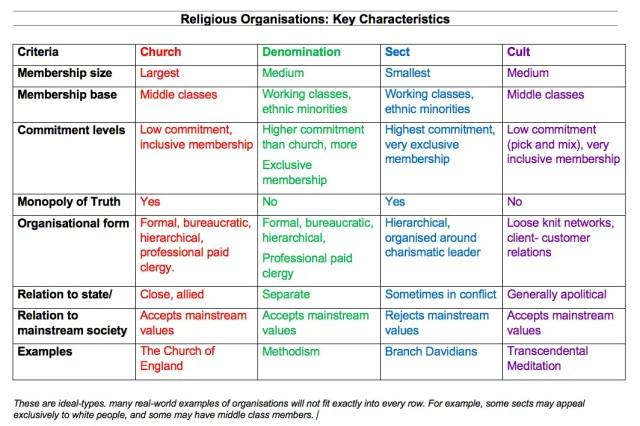

Algorithmic trading is a sophisticated approach in the financial markets that utilizes computer programs and algorithms to execute a large volume of trades at speeds and frequencies that would be impossible for human traders. This methodology has revolutionized the trading landscape, facilitating transactions with increased speed, accuracy, and efficiency, thereby reducing transaction costs and benefiting from arbitrage opportunities. 

Within this context, the concept of "denomination" holds particular significance. In trading, denomination refers to the currency in which a financial instrument or transaction is priced and settled. Understanding the intricacies of denomination is vital as it directly influences pricing, order size, trading decisions, and ultimately, the profitability of trades. For instance, a trader dealing in international securities must consider the effects of currency value fluctuations on the final transaction values.



The purpose of this article is to explore real-world examples of how denomination impacts algorithmic trading strategies. These examples will illustrate how traders and developers take into account denomination to devise effective strategies and improve outcomes. Denomination can notably affect algorithmic trading by altering key parameters of trading algorithms, such as position sizes, margins, and risk management settings.

For traders and developers, comprehending how different denominations influence trading strategies is essential. Navigating these complexities is crucial to minimizing risks and maximizing returns. By mastering these concepts, market participants can better align their strategies with denominational aspects, ensuring that their algorithmic systems operate efficiently in diverse market conditions. As the landscape of financial markets continually evolves, staying informed on these matters will be instrumental for continued success in algorithmic trading.

## Table of Contents

## Understanding Algorithmic Trading

Algorithmic trading, also known as algo trading, refers to the use of computer programs to execute financial trades at high speeds and volumes based on predefined criteria or algorithms. This practice emerged in the late 20th century, taking advantage of technological advancements that facilitated the automation of trading processes. The evolution of algorithmic trading has significantly altered the financial markets, offering traders enhanced capabilities in terms of speed, precision, and cost-effectiveness.

One of the primary benefits of algorithmic trading is speed. Algorithms can process market data and execute orders in fractions of a second, much faster than any human could. This capability allows traders to capitalize on fleeting market opportunities that may not be accessible with manual trading. Additionally, algorithmic trading enhances accuracy by eliminating human error associated with manual order entries. By following strict, pre-programmed rules, algorithms ensure trades are executed with precision, thereby reducing costly mistakes.

Cost reduction is another benefit of [algorithmic trading](/wiki/algorithmic-trading). By automating the trading process, traders can execute a large number of trades at a lower cost per transaction. This efficiency is particularly beneficial for institutions making numerous trades daily, where even small savings per trade can result in significant cost reductions over time.

Algorithmic trading encompasses various strategies, each designed to achieve specific financial goals. High-frequency trading ([HFT](/wiki/high-frequency-trading-strategies)) is one such strategy, characterized by executing a large number of orders at extremely high speeds. HFT seeks to capitalize on minute price discrepancies within short time frames, often benefiting from slight market inefficiencies.

Another strategy is [quantitative trading](/wiki/quantitative-trading), which relies on mathematical models and statistical techniques to identify trading opportunities. These algorithms analyze large datasets to make predictions about future price movements, devising strategies based on historical patterns and market behavior.

Within these strategies, the concept of denomination plays a pivotal role, reflecting the currency or unit in which trading activities are conducted. The choice of denomination can substantially influence algorithmic trading strategies, affecting everything from pricing to order sizes.

In algorithmic trading, denominational considerations are crucial due to their impact on conversion rates, transaction costs, and overall market exposure. For instance, in [forex](/wiki/forex-system) markets, algorithmic strategies must account for currency pair denominations to accurately assess risk and potential returns. Similarly, in equities and commodities, the denomination choice can affect how algorithms interpret market data and execute trades.

As algorithmic trading continues to evolve, understanding the integration of denominations within these strategies is essential for optimizing trading outcomes and minimizing risks related to currency fluctuations and exchange rate variations.

## The Concept of Denomination in Trading

Denomination in trading refers to the currency or unit of measure in which the value of a financial transaction is expressed. In the financial sector, denomination is crucial because it affects how prices are quoted, the [volume](/wiki/volume-trading-strategy) of transactions, and investment decisions. For instance, when a security is denominated in a particular currency, the valuation and trading of that security are directly influenced by the relative strength and stability of the currency.

The choice of denomination impacts various aspects of trading. It affects pricing since the value of securities in one currency might be perceived differently in another due to exchange rate fluctuations. The denomination also influences order sizes; for example, trading equities in USD might require different minimum lot sizes compared to trading in EUR. Additionally, trading decisions often hinge on the denomination since investors and traders need to consider currency risk, which can affect the expected returns on investments. A trader might prefer to trade in a currency that aligns with their liabilities, known as a natural hedge, to minimize exposure to currency risk.

In the forex market, currencies are paired to create a denomination. For instance, in the EUR/USD pair, the base currency is the Euro, and the quote currency is the US Dollar. This means that the amount traded is denominated in Euros, while the pricing is in terms of US Dollars. In equity markets, a common denomination is the local currency of the country where the stock is listed, such as USD for American equities or JPY for Japanese stocks. For commodities, the standard denominations are often globally recognized units, such as barrels for oil or ounces for gold, frequently priced in USD due to its status as a primary global reserve currency.

Denomination plays a fundamental role in trading, influencing the market dynamics and strategic decisions taken by traders and investors. Understanding the nuances of denomination is essential for navigating the complexities of financial markets effectively.

## Real-World Denomination Examples in Algorithmic Trading

Algorithmic trading, particularly in the forex (foreign exchange) market, provides a vivid illustration of how currency denomination can influence trading strategies. Forex trading inherently involves currency pairs, essentially two denominations. The choice of these currency pairs and their specific denominations can affect algorithmic trading outcomes significantly.

A case study highlights the use of algorithmic trading in leveraging currency denominations in forex markets. For instance, consider an algorithm designed to trade based on the EUR/USD pair. The denomination choice directly influences the pricing output and the efficiency of execution. Algorithmic traders often utilize "pip" movements—a pip being the smallest price move in forex—in their algorithms to decide transaction execution. The denomination (EUR/USD in this case) determines pip value, which is crucial for risk management and strategy optimization.

In equity markets, denominational impacts are equally prominent. When trading algorithms operate across different currency zones, such as trading European stocks in EUR while being based in USD, the denomination choices can greatly affect [arbitrage](/wiki/arbitrage) opportunities and profit margins. For example, an algorithm programmed to exploit price discrepancies across the NYSE and Deutsche Börse must account for USD and EUR denominations. Any miscalculation can result in exchange rate losses overshadowing arbitrage gains.

Corporations and institutional investors often use algorithmic trading to hedge against denomination risks. A multinational corporation with revenue in multiple currencies may employ algorithms that automatically hedge against unfavorable exchange rate fluctuations. Techniques like delta hedging allow companies to maintain a neutral position relative to currency risk, using algorithms to calculate the optimal number of futures contracts in specific currencies.

Algorithmic trading tools are increasingly sophisticated in handling specific denominational trades. Currency conversion algorithms, for instance, automatically adjust trade execution as exchange rates shift. These systems can involve complex heuristics that predict denomination fluctuations and preemptively execute trades to secure favorable exchange rates. Algorithms are often refined using [machine learning](/wiki/machine-learning) techniques to adapt continuously to market dynamics, improving their effectiveness in mitigating denomination risks.

Understanding these real-world applications underscores the criticality of robust denomination strategies within algorithmic trading systems. As these systems grow more complex with technological advancements, the accurate inclusion of denomination considerations becomes indispensable for optimal trading outcomes.

## Denomination Challenges and Considerations in Algo Trading

Algorithmic trading involves numerous complexities, and denominations are a critical [factor](/wiki/factor-investing) in its effective execution. Traders often face challenges related to denomination, primarily due to fluctuations in exchange rates. These fluctuations can significantly alter the value of transactions, which may lead to unexpected gains or losses. For instance, a sudden depreciation in the currency of denomination can increase the cost of a transaction denominated in a foreign currency, thus impacting profit margins.

For algorithm developers, the variabilities in denominations present several considerations. Algorithms must be designed to accommodate dynamic denomination values, which means incorporating real-time data feeds that provide accurate exchange rates and market information. Failure to account for these variabilities can cause algorithms to execute trades based on outdated or incorrect information, leading to inefficiencies and potential financial losses.

Incorrect denomination settings pose further risks in algorithmic systems. An algorithm that fails to implement the correct currency denomination may execute trades at unintended scales or values. For example, a mismatch in currency settings could lead to orders being placed at incorrect sizes, fundamentally altering the strategy's performance. To mitigate this risk, strategies should include checks for denomination accuracy before execution, and these checks should be periodically reviewed and updated.

Regulatory environments also play a substantial role in influencing denominational choices in algorithmic trading. Different jurisdictions may impose rules that dictate the permissible currencies or denominations used in trading activities to ensure market stability and transparency. Compliance with these regulations is essential, as failure to adhere can result in fines or other legal repercussions. Moreover, regulations may affect the structure and operation of algorithmic systems, requiring them to be adaptable to changes in legal frameworks.

Understanding these challenges and considerations is pivotal for optimizing algorithmic trading strategies and ensuring robust financial outcomes. As such, both traders and developers must remain vigilant and proactive in addressing the complexities associated with denomination in algorithmic trading.

## Future Trends: Denomination in Evolving Algo Trading

Algorithmic trading is poised for continued transformation, driven by technological advancements and dynamic economic conditions. Denomination considerations, particularly in an increasingly interconnected global market, are becoming more nuanced and will likely evolve alongside these developments.

With the integration of [artificial intelligence](/wiki/ai-artificial-intelligence) (AI) and machine learning (ML) in trading systems, the ability to manage denomination complexities is expected to improve significantly. AI and ML can enhance algorithms by analyzing large datasets to predict currency fluctuations, optimize trading strategies, and dynamically adjust denominations. These technologies can continuously learn from market data, providing insights into trends and anomalies that humans might overlook. For instance, AI can employ predictive analytics to interpret historical and current data, enhancing currency and denomination forecasting. Machine learning models, such as [reinforcement learning](/wiki/reinforcement-learning), can be trained to make real-time adjustments to denomination strategies by maximizing profit functions within predefined risk parameters.

```python
import numpy as np
from sklearn.linear_model import LinearRegression

# Example: Simple predictive model for currency denomination impact
# Assumed fake dataset for demonstration purposes
data = np.array([
    [1.1, 2.3],
    [1.5, 3.1],
    [1.3, 2.8],
    [1.7, 3.5],
])

X = data[:, 0].reshape(-1, 1)  # Denomination factor
y = data[:, 1]  # Profit impact

model = LinearRegression()
model.fit(X, y)

# Predict the impact of a change in denomination factor
denomination_factor = np.array([[1.4]])
predicted_impact = model.predict(denomination_factor)
```

The code above provides a simple model that could predict the impact of changes in a denomination factor on trading profits. Although simplistic, it showcases how machine learning models might be employed to forecast outcomes based on available data.

Global economic changes, such as shifts in monetary policy, trade agreements, and economic sanctions, will influence future denomination strategies. Fluctuating interest rates and inflation can impact currency values, necessitating adaptable algorithms that can modify denomination settings to optimize returns. Moreover, as global markets become more interconnected, trading systems must account for multi-currency dependencies and correlation matrices to mitigate risks associated with denomination changes.

Considering these trends, it is anticipated that future algorithmic trading systems will emphasize real-time adaptation to economic conditions, utilizing enhanced computational power and historical data analysis. The capacity to integrate real-world economic indicators, geopolitical events, and market sentiment into algorithmic decision-making will lead to more robust and efficient denomination strategies.

In conclusion, the future of algorithmic trading lies in harnessing advanced computational techniques to navigate the complexities of denomination. By adapting to technological innovations and economic fluctuations, traders and developers can maintain a competitive edge. Understanding and leveraging denomination dynamics can thus be transformative, optimizing trading outcomes in an ever-evolving financial landscape.

## Conclusion

Understanding denominations in algorithmic trading is crucial for navigating the complexities of financial markets. Denominations, the units in which transactions are conducted, play a foundational role in determining not only pricing structures but also the strategic deployment of capital across various geographical and asset market contexts. This understanding directly influences both the efficiency and effectiveness of trading activities. When denominations are misjudged or mishandled, it can lead to pricing errors, misaligned order sizes, and ultimately, suboptimal trading outcomes that could have been mitigated with proper analysis and strategy adjustments.

For traders and developers in algorithmic trading, staying abreast of how denominations impact transactions is imperative. Exchange rate fluctuations and shifts in regulatory contexts can significantly alter the landscape, making it essential to continuously adapt systems and strategies to these denominational changes. Maintaining awareness offers a competitive edge, ensuring that chosen algorithms align with current market conditions and are executed in the most cost-effective manner.

As we look to the future, the role of denominations in algorithmic trading seems poised for growth and adaptation. The relentless advance of technology, particularly in artificial intelligence and machine learning, promises enhanced tools for mitigating the complexities associated with denomination variabilities. These technologies will further refine the precision and adaptability of trading algorithms, offering sophisticated methods to hedge against risks and capitalize on opportunities presented by global economic changes. Thus, embracing the nuances of denomination amidst technological evolution will be essential for those seeking to maintain and expand their influence in the dynamically evolving world of algorithmic trading.

## References & Further Reading

[1]: Andreas F. Clenow (2019). ["Following the Trend: Diversified Managed Futures Trading"](https://www.amazon.com/Following-Trend-Diversified-Managed-Futures/dp/1118410858). Wiley.

[2]: Aldridge, I. (2013). ["High-Frequency Trading: A Practical Guide to Algorithmic Strategies and Trading Systems"](https://www.amazon.com/High-Frequency-Trading-Practical-Algorithmic-Strategies/dp/1118343506). Wiley.

[3]: Taylor, S. J. (2007). ["Modelling Financial Time Series"](https://archive.org/download/quant_books/Modelling%20Financial%20Times%20Series%20-%20S.%20J.%20Taylor.pdf). World Scientific Publishing Company.

[4]: Tsang, M., Kao, K. F., & Loke, S. (2017). ["Finance with R: The R metrics Handbook."](https://link.aps.org/doi/10.1103/PhysRevX.6.031033). Independently published.

[5]: Chan, E.P. (2017). ["Algorithmic Trading: Winning Strategies and Their Rationale"](https://github.com/ftvision/quant_trading_echan_book). Wiley.

[6]: Lopez de Prado, M. (2018). ["Advances in Financial Machine Learning"](https://www.amazon.com/Advances-Financial-Machine-Learning-Marcos/dp/1119482089). Wiley.

[7]: Narang, R. K. (2013). ["Inside the Black Box: The Simple Truth About Quantitative Trading"](https://onlinelibrary.wiley.com/doi/book/10.1002/9781118267738). Wiley.

[8]: Kissell, R. (2014). ["The Science of Algorithmic Trading and Portfolio Management"](https://www.sciencedirect.com/book/9780124016897/the-science-of-algorithmic-trading-and-portfolio-management). Academic Press.

[9]: "Bodie, Z., Kane, A., & Marcus, A. J. (2011). ["Investments"](https://www.mheducation.com/highered/product/Investments-Bodie.html). McGraw-Hill Education.

[10]: Biswas, R., & Polychronopoulos, A., eds. (2020). ["Algorithmic Finance: Model-driven Investments in the New Al-driven World"](https://www.sciencedirect.com/science/article/pii/S1471772723000325). FT-Coloredition.