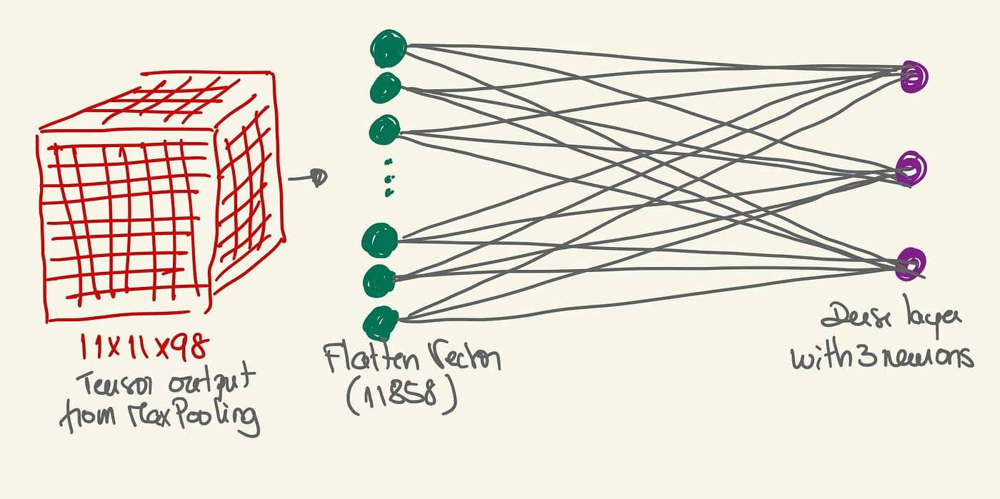

## Table of Contents

## What is a dense feature in machine learning?

In machine learning, a dense feature is a type of input data that contains a lot of information in a compact form. Imagine you have a list of numbers where most of the numbers are not zero. This list would be considered dense because it's packed with values. For example, if you're trying to predict house prices and you use features like the number of bedrooms, square footage, and age of the house, these are dense features because they all have specific, non-zero values that contribute to the prediction.

Dense features are different from sparse features, which have many zero values. For instance, if you're looking at a dataset where most of the entries are zero except for a few, that would be sparse. Dense features are often used in models like neural networks because they can handle a lot of information efficiently. When you use dense features, you might need to normalize or standardize them to make sure they're on the same scale, which helps the model learn better.

## How do dense features differ from sparse features?

Dense features and sparse features are two different ways to represent data in machine learning. Dense features are like a packed suitcase where most of the space is filled with items. In a dense feature, most of the values are non-zero and carry important information. For example, if you're looking at a dataset of house prices, features like the number of bedrooms, square footage, and age of the house are dense because they all have specific values that help predict the price.

On the other hand, sparse features are like a mostly empty suitcase with just a few items inside. In a sparse feature, most of the values are zero, and only a few values are non-zero and carry the important information. For instance, if you're looking at a dataset of words in documents, most words won't appear in most documents, so the feature representing the presence of a specific word will be zero for many entries. This makes the data sparse. Understanding the difference between dense and sparse features helps in choosing the right algorithms and techniques for processing and analyzing data effectively.

## Why are dense features important in machine learning models?

Dense features are important in [machine learning](/wiki/machine-learning) models because they contain a lot of information in a compact way. When you use dense features, you're giving the model lots of specific details that can help it make better predictions. For example, if you're trying to predict house prices, dense features like the number of bedrooms, the size of the house, and how old it is can all give the model important clues about what the price might be. These features are packed with useful data, so the model can learn more from them.

Dense features also work well with many types of machine learning algorithms, especially neural networks. Neural networks are good at handling a lot of data at once, so they can make the most out of dense features. When you use dense features, you might need to make sure they're all on the same scale, which helps the model learn even better. By using dense features, you're helping the model understand the data more deeply and make more accurate predictions.

## What types of data are typically represented as dense features?

Dense features are often used for data where most of the values are important and not zero. For example, if you're trying to predict house prices, things like the number of bedrooms, the size of the house, and how old it is are all dense features. These features are packed with useful information that helps the model understand what affects the price of a house. They are like a full suitcase where every item inside counts.

Another type of data that is often represented as dense features is sensor data. Imagine you have a sensor that measures temperature every minute. Most of these measurements will have a value, and they are all important for understanding how temperature changes over time. This kind of data is dense because it's full of non-zero values that [carry](/wiki/carry-trading) a lot of information. Using dense features like these helps machine learning models learn and predict better because they get a lot of detailed data to work with.

## How can you convert sparse data into dense features?

Converting sparse data into dense features involves changing how the data is stored and represented. Sparse data has a lot of zero values, which means most of the space is empty. To make it dense, you can fill in those empty spots with some kind of value. One common way to do this is to use a technique called imputation, where you replace the missing values with an estimate. For example, you might fill in the zeros with the average of the non-zero values in that feature. This way, every spot in the data has a number, making it dense.

Another way to convert sparse data into dense features is to use a process called feature engineering. This means creating new features from the existing sparse data that are more dense. For example, if you have a sparse feature that represents the presence of certain words in a document, you can count the total number of unique words instead. This new feature would be dense because it has a value for every document. By transforming the data in these ways, you can turn sparse data into dense features that can be used more effectively in machine learning models.

## What are the advantages of using dense features in neural networks?

Dense features are great for neural networks because they give the model a lot of information to work with. When you use dense features, most of the values are important and not zero, so the [neural network](/wiki/neural-network) can learn from every piece of data. This helps the model understand the patterns in the data better and make more accurate predictions. For example, if you're trying to predict house prices and you use dense features like the number of bedrooms, the size of the house, and its age, the neural network can see how all these details affect the price.

Another advantage of using dense features in neural networks is that they work well with the way neural networks process data. Neural networks are designed to handle lots of data at once, so dense features fit perfectly into this system. When you use dense features, you might need to make sure all the values are on the same scale, which can help the neural network learn even better. By using dense features, you're giving the neural network the best chance to learn from the data and make the most accurate predictions possible.

## What are the potential drawbacks of using dense features?

Using dense features can sometimes make your machine learning model slower and use more computer memory. Imagine you have a big suitcase full of items. It's heavy and takes up a lot of space. Dense features are like that suitcase. They contain a lot of information, but handling all that data can slow things down. If you're working with a lot of dense features, your computer might need more time to process everything, and you might need more memory to store it all.

Another potential drawback is that dense features can sometimes make it harder to see what's really important in your data. When you have a lot of non-zero values, it can be tough to figure out which ones are the most useful for making predictions. It's like trying to find a few important [books](/wiki/algo-trading-books) in a huge library. You might need to do extra work to make sure you're focusing on the right features, which can take more time and effort.

## How do you preprocess data to create dense features?

Preprocessing data to create dense features often involves filling in missing values and making sure all the data is on the same scale. One common way to do this is by using a technique called imputation. Imputation means you replace the missing values with an estimate, like the average or median of the other values in that feature. This way, all the empty spots get filled, and your data becomes dense because there are no more zeros or missing values. Another way to preprocess data is by normalizing or standardizing it. This means you adjust the values so they all fit within a certain range or have the same average and spread. This helps the machine learning model learn better from the dense features.

Another approach to creating dense features is through feature engineering. This means you create new features from the existing data that are more dense. For example, if you have a sparse feature that counts the presence of certain words in a document, you can create a new feature that counts the total number of unique words. This new feature would be dense because it has a value for every document. Feature engineering can also involve combining multiple sparse features into a single dense feature that captures more information. By using these preprocessing techniques, you can turn your data into dense features that can be used more effectively in machine learning models.

## What techniques can be used to reduce the dimensionality of dense features?

One way to reduce the dimensionality of dense features is by using Principal Component Analysis (PCA). PCA looks at the data and finds the directions where it changes the most. It then creates new features, called principal components, that capture most of the information in fewer dimensions. Imagine you have a bunch of data points in a 3D space. PCA can squish this data down to a 2D space while keeping the most important information. This helps make the data easier to work with and can speed up your machine learning model.

Another technique is called t-distributed Stochastic Neighbor Embedding (t-SNE). t-SNE is good at keeping similar data points close together and pushing different ones apart. It's often used for visualizing high-dimensional data in 2D or 3D. While t-SNE is great for understanding the structure of your data, it's not always the best for reducing dimensions for machine learning models because it can be hard to interpret the new features. But it's a powerful tool for exploring your data and seeing how different points relate to each other.

You can also use feature selection methods to reduce dimensionality. These methods look at your dense features and pick out the ones that are most important for your model. One simple way to do this is by using correlation analysis. You can check how each feature relates to the thing you're trying to predict. If a feature doesn't help much, you can leave it out. This way, you end up with fewer, but more useful, dense features.

## How do dense features impact the performance and training time of machine learning models?

Dense features can make your machine learning model work better because they give the model a lot of detailed information. When you use dense features, the model can see all the important details and learn from them. This can lead to more accurate predictions. For example, if you're trying to predict house prices and you use dense features like the number of bedrooms, the size of the house, and how old it is, the model can understand how these details affect the price. But, dense features can also make your model slower and use more memory. It's like having a heavy suitcase full of stuff. It takes more time and space to handle all that data, so your computer might need to work harder and take longer to train the model.

To make things easier, you can use techniques like Principal Component Analysis (PCA) to reduce the number of dense features. PCA looks at your data and finds the most important directions of change. It then creates new features, called principal components, that capture most of the information in fewer dimensions. This can make your model faster and use less memory. Another way to reduce the impact of dense features on training time is by using feature selection methods. These methods pick out the most important features and leave out the ones that don't help much. This way, you end up with fewer, but more useful, dense features, which can speed up your model and make it easier to train.

## Can you explain how dense features are used in deep learning architectures?

In [deep learning](/wiki/deep-learning) architectures, dense features play a crucial role by providing a lot of information in a compact form. Imagine you're trying to teach a neural network to recognize pictures of cats. Dense features like the color of the cat's fur, the shape of its ears, and the size of its eyes are all important details that help the network understand what makes a cat a cat. These features are like a full suitcase where every item inside counts. When you feed these dense features into a neural network, each layer can learn from them and make better predictions. For example, the first layer might learn to recognize edges and colors, while deeper layers can combine these to identify more complex patterns like the shape of a cat's face.

Dense features also work well with the way neural networks process data. Neural networks are designed to handle lots of data at once, so dense features fit perfectly into this system. When you use dense features, you might need to make sure all the values are on the same scale, which helps the neural network learn even better. This process is called normalization or standardization. By using dense features, you're giving the neural network the best chance to learn from the data and make the most accurate predictions possible. However, it's important to remember that too many dense features can make the model slower and use more computer memory, so sometimes you need to use techniques like Principal Component Analysis (PCA) to reduce the number of features while keeping the most important information.

## What advanced methods exist for optimizing the use of dense features in complex models?

One advanced method for optimizing the use of dense features in complex models is feature selection. Feature selection helps you pick the most important dense features that really matter for your model's predictions. Imagine you're trying to predict house prices and you have lots of dense features like the number of bedrooms, the size of the house, and the age of the house. Feature selection methods like LASSO (Least Absolute Shrinkage and Selection Operator) can automatically choose which features are the most useful by shrinking the coefficients of less important features to zero. This way, your model can focus on the key details and work faster and more efficiently.

Another method is dimensionality reduction, which helps you keep the important information in your dense features but in fewer dimensions. Principal Component Analysis (PCA) is a popular technique for this. PCA looks at your dense features and finds the directions where the data changes the most. It then creates new features, called principal components, that capture most of the information in fewer dimensions. For example, if you have a dataset with many dense features, PCA can reduce them to a smaller set of principal components that still represent the data well. This makes your model easier to train and can improve its performance without losing too much information.