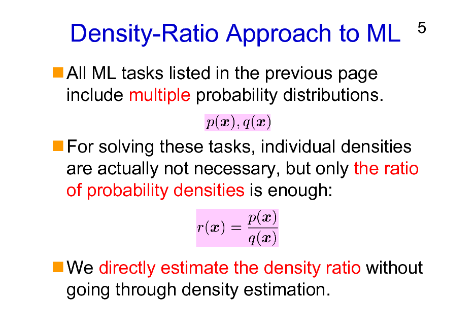

## Table of Contents

## What is Density Ratio Learning in the context of machine learning?

Density Ratio Learning is a technique used in machine learning to compare two probability distributions without directly estimating them. Instead of trying to model the entire distribution, which can be complex and computationally expensive, density ratio learning focuses on the ratio between two distributions. This approach is particularly useful in tasks like anomaly detection, where you might want to identify data points that are significantly different from the norm, or in domain adaptation, where you need to adjust a model trained on one dataset to work well on another.

The key idea behind density ratio learning is to estimate the ratio $$ \frac{p(x)}{q(x)} $$, where $$ p(x) $$ is the probability density of the target distribution and $$ q(x) $$ is the probability density of the reference distribution. By focusing on this ratio, we can often simplify the problem and achieve better results with less computational effort. For example, in covariate shift adaptation, if the data distribution changes between training and testing, we can use density ratio learning to reweight the training samples to better match the test distribution, improving the model's performance on new data.

## How does Density Ratio Learning differ from traditional supervised learning?

Density Ratio Learning and traditional supervised learning are different in how they approach data and what they aim to achieve. In traditional supervised learning, the goal is to learn a function that maps input features to output labels using a labeled dataset. This means the model is trained to predict outcomes based on examples where the correct answers are known. For instance, if you're trying to predict whether an email is spam or not, you would train your model on a dataset of emails labeled as spam or not spam.

On the other hand, Density Ratio Learning focuses on understanding the relationship between two probability distributions without directly estimating them. Instead of predicting labels, it estimates the ratio $$ \frac{p(x)}{q(x)} $$, where $$ p(x) $$ is the target distribution and $$ q(x) $$ is the reference distribution. This approach is useful in scenarios where you want to compare how different two sets of data are, like in anomaly detection or domain adaptation. For example, if you want to detect unusual behavior in a system, you could use Density Ratio Learning to compare the normal behavior distribution to the current behavior distribution and identify anomalies.

In summary, while traditional supervised learning is about predicting specific outcomes from labeled data, Density Ratio Learning is about understanding and comparing distributions to find differences or adapt models to new data. Both methods have their place in [machine learning](/wiki/machine-learning), but they serve different purposes and are used in different contexts.

## What are the main applications of Density Ratio Learning?

Density Ratio Learning is used in many areas of machine learning. One big use is in anomaly detection. This means finding things that are unusual or different from what is normal. For example, if you want to find strange behavior in a computer system, you can use Density Ratio Learning to compare the normal behavior to the current behavior. By looking at the ratio $$ \frac{p(x)}{q(x)} $$, where $$ p(x) $$ is the normal behavior and $$ q(x) $$ is the current behavior, you can spot anomalies easily.

Another important use is in domain adaptation. This is when you want to use a model trained on one set of data to work well on a different set of data. For instance, if you trained a model on pictures taken during the day and now want it to work on pictures taken at night, you can use Density Ratio Learning to adjust the model. By estimating the ratio $$ \frac{p(x)}{q(x)} $$, where $$ p(x) $$ is the new data distribution and $$ q(x) $$ is the old data distribution, you can make the model work better on the new data.

Density Ratio Learning is also helpful in covariate shift adaptation. This happens when the data distribution changes between training and testing. For example, if you trained a model to predict house prices in one city and now want to use it in another city, the data might be different. By using Density Ratio Learning to estimate the ratio $$ \frac{p(x)}{q(x)} $$, where $$ p(x) $$ is the new city's data and $$ q(x) $$ is the original city's data, you can adjust the model to work better in the new city.

## Can you explain the basic concept of importance sampling in Density Ratio Learning?

Importance sampling in Density Ratio Learning is a way to estimate the ratio between two distributions more easily. Imagine you have two sets of data, and you want to compare them. Instead of looking at all the data, importance sampling helps you focus on the important parts. You do this by giving more weight to some data points over others. This way, you can get a good estimate of the ratio $$ \frac{p(x)}{q(x)} $$ without needing to look at everything.

In practice, importance sampling works by using weights to adjust how much each data point contributes to the final estimate. If a data point is more likely under the target distribution $$ p(x) $$ than under the reference distribution $$ q(x) $$, it gets a higher weight. This means that data points that are more important for understanding the difference between the two distributions get more attention. By doing this, you can make better use of your data and get a more accurate estimate of the density ratio with less work.

## What is the role of the density ratio in machine learning algorithms?

The density ratio, which is written as $$ \frac{p(x)}{q(x)} $$, plays a key role in machine learning algorithms. It helps us compare two sets of data without having to look at all the details of each set. Instead of trying to understand everything about the data, we focus on how different the two sets are. This makes it easier to solve problems like finding unusual things in data or making a model work well on new data.

In practical terms, the density ratio is used in many ways. For example, in anomaly detection, we use it to spot things that are not normal by comparing the current data to what is usually seen. In domain adaptation, the density ratio helps us adjust a model that was trained on one set of data to work well on a different set. By focusing on the ratio, we can make our models smarter and more flexible, without needing to do a lot of extra work.

## How does GradientDICE utilize Density Ratio Learning?

GradientDICE is a method that uses Density Ratio Learning to make [reinforcement learning](/wiki/reinforcement-learning) better. In reinforcement learning, an agent learns to do tasks by getting rewards for good actions and penalties for bad ones. GradientDICE helps by estimating the density ratio $$ \frac{p(x)}{q(x)} $$, where $$ p(x) $$ is the target policy's state visitation distribution and $$ q(x) $$ is the behavior policy's state visitation distribution. By focusing on this ratio, GradientDICE can adjust the learning process to make the agent explore the environment more effectively and learn from the most important experiences.

This approach makes reinforcement learning more efficient because it helps the agent pay more attention to states that are more relevant to the task at hand. By using the density ratio, GradientDICE can weigh the importance of different states and actions, leading to better policy updates. This means the agent can learn faster and perform better, especially in complex environments where traditional methods might struggle to find the best path to success.

## What are the advantages of using Density Ratio Learning over other methods?

Density Ratio Learning has several advantages over other methods. One big advantage is that it focuses on the ratio between two distributions, $$ \frac{p(x)}{q(x)} $$, instead of trying to understand the whole distribution. This makes it easier and faster to compare data sets, like when you're trying to find unusual things or adjust a model to work on new data. By only looking at the ratio, Density Ratio Learning can work well even when the data is complex or there isn't a lot of it.

Another advantage is that Density Ratio Learning can be more efficient. Instead of needing to look at all the data, it uses techniques like importance sampling to focus on the most important parts. This means you can get good results without using as much computer power or time. For example, in reinforcement learning, methods like GradientDICE use Density Ratio Learning to make learning faster and better by paying more attention to the most useful experiences.

## What challenges are commonly faced when implementing Density Ratio Learning?

One common challenge in implementing Density Ratio Learning is accurately estimating the density ratio $$ \frac{p(x)}{q(x)} $$. This can be difficult because it requires a good understanding of both the target distribution $$ p(x) $$ and the reference distribution $$ q(x) $$. If the data is complex or if there isn't enough of it, the estimate might not be very accurate. This can lead to problems like overfitting, where the model works well on the data it was trained on but not on new data, or underfitting, where the model doesn't learn enough from the data.

Another challenge is choosing the right method to estimate the density ratio. There are many ways to do this, like using importance sampling or other techniques, and each has its own pros and cons. Picking the wrong method can make the results less reliable or take more time to compute. It's important to test different methods and see which one works best for the specific problem you're trying to solve.

## How can one estimate density ratios effectively in practice?

One effective way to estimate density ratios in practice is by using importance sampling. This method involves giving more weight to data points that are more important for understanding the difference between the two distributions. For example, if you want to estimate the ratio $$ \frac{p(x)}{q(x)} $$, you can use importance sampling to focus on the data points where $$ p(x) $$ is much larger than $$ q(x) $$. This helps you get a good estimate without needing to look at all the data, making the process more efficient. You can implement importance sampling in code using libraries like Python's NumPy, which can handle the weighting and calculations needed for this technique.

Another approach is to use machine learning models to directly estimate the density ratio. Techniques like logistic regression or neural networks can be trained to predict the ratio $$ \frac{p(x)}{q(x)} $$. These models learn from the data to find patterns that help estimate the ratio accurately. For instance, you can use a [neural network](/wiki/neural-network) to learn the function that maps input features to the density ratio. This method can be particularly useful when dealing with complex data, as the model can capture non-linear relationships that simpler methods might miss. Implementing this in code involves training the model on labeled data and then using it to predict the density ratio for new data points.

## What are some advanced techniques for optimizing Density Ratio Learning models?

One advanced technique for optimizing Density Ratio Learning models is to use regularization. Regularization helps prevent the model from overfitting by adding a penalty to the loss function. This penalty discourages the model from relying too much on any single data point or feature. For example, in logistic regression used for density ratio estimation, you can add an L2 regularization term to the loss function. This helps the model generalize better to new data by keeping the weights from getting too large. You can implement this in code using libraries like scikit-learn, which have built-in options for adding regularization to models.

Another technique is to use ensemble methods, which combine multiple models to get a better estimate of the density ratio $$ \frac{p(x)}{q(x)} $$. By training several models and then averaging their predictions, you can reduce the impact of any single model's errors. This can lead to more stable and accurate estimates. For instance, you could train multiple neural networks with different initializations and then average their outputs to get the final density ratio estimate. Implementing this in code involves training the models separately and then combining their predictions, which can be done using libraries like TensorFlow or PyTorch.

## How does Density Ratio Learning contribute to off-policy evaluation and learning?

Density Ratio Learning helps with off-policy evaluation and learning by making it easier to compare different ways of doing things. In off-policy learning, you want to learn from data collected using one strategy (the behavior policy) to improve another strategy (the target policy). The key is to estimate the ratio $$ \frac{p(x)}{q(x)} $$, where $$ p(x) $$ is the state visitation distribution of the target policy and $$ q(x) $$ is the state visitation distribution of the behavior policy. By focusing on this ratio, you can weigh the importance of different experiences and learn more effectively from the data you have.

This approach makes off-policy learning more efficient because it helps you use the data better. Instead of trying to understand everything about the data, you can focus on the parts that matter most for the target policy. This can lead to faster learning and better performance, especially when the target policy is very different from the behavior policy. By using Density Ratio Learning, you can make the most out of the data you have and improve your strategies more quickly.

## What future developments can we expect in the field of Density Ratio Learning?

In the future, we can expect Density Ratio Learning to become even more important in machine learning. One big area of development will be in making the methods for estimating the density ratio $$ \frac{p(x)}{q(x)} $$ even better. Researchers might come up with new ways to do this that are faster and more accurate. They could also find new ways to use Density Ratio Learning in different kinds of problems, like making self-driving cars safer or helping doctors find diseases earlier. As computers get more powerful, we might see Density Ratio Learning used in bigger and more complex data sets, making it a key tool for understanding and working with data.

Another exciting development could be in combining Density Ratio Learning with other machine learning techniques. For example, we might see it used more with [deep learning](/wiki/deep-learning) to make models that can learn from data in new ways. This could help solve problems that are hard to tackle with just one method. Also, as more people start using Density Ratio Learning, we might see new tools and software that make it easier to use. This would help more people take advantage of what Density Ratio Learning can do, making it a common part of many machine learning projects.

## References & Further Reading

[1]: Sugiyama, M., Krauledat, M., & Müller, K.-R. (2007). ["Covariate Shift Adaptation by Importance Weighted Cross Validation."](https://jmlr.csail.mit.edu/papers/volume8/sugiyama07a/sugiyama07a.pdf) Journal of Machine Learning Research, 8, 985-1005.

[2]: Sugiyama, M., Nakajima, S., Kanamori, T., & Miyamoto, H. (2012). ["Density Ratio Estimation: A Comprehensive Review."](https://www.cambridge.org/core/books/density-ratio-estimation-in-machine-learning/BCBEA6AEAADD66569B1E85DDDEAA7648) Statistical Analysis and Data Mining: The ASA Data Science Journal, 5(1), 51-70.

[3]: Kanamori, T., Hido, S., & Sugiyama, M. (2009). ["A Least-squares Approach to Direct Importance Estimation."](https://jmlr.csail.mit.edu/papers/volume10/kanamori09a/kanamori09a.pdf) Journal of Machine Learning Research, 10, 1391-1445.

[4]: Gretton, A., Borgwardt, K. M., Rasch, M. J., Schölkopf, B., & Smola, A. (2012). ["A Kernel Two-Sample Test."](https://jmlr.org/papers/volume13/gretton12a/gretton12a.pdf) Journal of Machine Learning Research, 13, 723-773.

[5]: Liu, S., Lee, J., & Sha, F. (2018). ["Analytic Score Function for Nonlinear Models."](https://www.sciencedirect.com/science/article/pii/S0165993618304102) Advances in Neural Information Processing Systems 31.