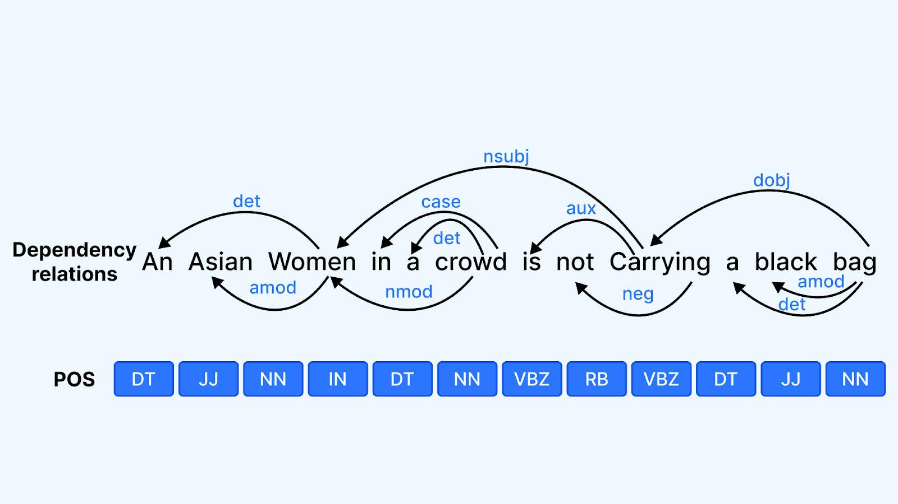

## Table of Contents

## What is a dependency parser in the context of machine learning?

A dependency parser is a tool in machine learning that helps understand the structure of a sentence by figuring out how words relate to each other. Imagine a sentence like a tree, where the main word (like the verb) is the trunk, and other words (like subjects or objects) branch out from it. The parser looks at the sentence and decides which word depends on which other word, creating a map of these relationships. This map is called a dependency tree, and it's very useful for understanding the meaning of sentences in natural language processing tasks.

In practice, a dependency parser uses algorithms to analyze the sentence and determine the best way to connect the words. These algorithms might use machine learning models that have been trained on lots of example sentences to recognize patterns. Once trained, the parser can take a new sentence and quickly produce a dependency tree. This helps in tasks like machine translation, where understanding the structure of a sentence in one language can help translate it accurately into another language. By showing how words are linked, dependency parsing makes it easier for computers to process and understand human language.

## How does a dependency parser work to analyze sentence structure?

A dependency parser works by figuring out how words in a sentence connect to each other. It starts by looking at each word and trying to understand its role in the sentence. For example, if the sentence is "The cat sleeps," the parser would identify "sleeps" as the main verb, and "The" and "cat" as words that depend on "sleeps." The parser uses rules or machine learning models it has learned from many example sentences to decide how to connect the words. It creates a tree-like structure called a dependency tree, where the main word (often the verb) is at the top, and other words branch out from it, showing how they relate to each other.

Once the parser has created the dependency tree, it can show us the structure of the sentence in a clear way. In our example, "The cat sleeps," the tree would show that "cat" is the subject of "sleeps," and "The" is an article that describes "cat." This tree helps computers understand the sentence better because it shows the relationships between words. For instance, if we want to translate the sentence into another language, knowing that "cat" is the subject of "sleeps" helps us keep the meaning correct in the new language. By using dependency parsing, computers can process and understand human language more effectively.

## What are the main types of dependency parsers?

There are two main types of dependency parsers: transition-based parsers and graph-based parsers. Transition-based parsers work by making a series of decisions about how to connect words in a sentence. They start at the beginning of the sentence and move through it, choosing at each step whether to connect the current word to another word or to move on to the next word. This process continues until all words are connected in a way that makes sense. These parsers often use [machine learning](/wiki/machine-learning) models to decide what to do at each step, making them good at handling complex sentences.

Graph-based parsers, on the other hand, look at the entire sentence all at once and try to find the best way to connect all the words. They do this by scoring different possible ways of connecting the words and choosing the one with the highest score. This method can be thought of as finding the best path through a network of possible connections. Graph-based parsers are often very accurate because they consider all possible connections before making a final decision, but they can be slower than transition-based parsers because they need to look at many possibilities.

Both types of parsers have their strengths and are used in different situations depending on what is needed. Transition-based parsers are faster and can handle sentences as they come in, which is useful for real-time applications. Graph-based parsers, while slower, can be more accurate and are often used when precision is more important than speed.

## What is the role of machine learning in dependency parsing?

Machine learning plays a big role in making dependency parsers work well. It helps the parser learn from lots of example sentences. By looking at these examples, the parser can figure out patterns and rules about how words connect in sentences. For instance, a machine learning model might learn that in English, the word "sleeps" often has a subject like "cat" or "dog." The parser uses this knowledge to make better guesses about how to connect words in new sentences it hasn't seen before.

There are two main ways machine learning is used in dependency parsing: transition-based and graph-based methods. In transition-based parsing, the machine learning model makes decisions step-by-step, deciding how to connect words as it moves through the sentence. This method is fast and works well for real-time applications. On the other hand, graph-based parsing uses machine learning to score all possible ways of connecting words in a sentence and picks the best one. This method can be slower but often gives more accurate results because it looks at all possibilities before deciding. Both methods show how machine learning helps dependency parsers understand and analyze sentence structures effectively.

## How is training data used in developing a dependency parser?

Training data is very important for developing a dependency parser. It includes many sentences that have already been analyzed and labeled to show how words connect to each other. The parser uses this data to learn patterns and rules about sentence structure. For example, it can learn that in English, the word "sleeps" often has a subject like "cat" or "dog." By looking at thousands of these labeled sentences, the parser gets better at figuring out how to connect words in new sentences it hasn't seen before.

When the parser is being trained, it tries to predict the correct connections between words in the training sentences. If it makes a mistake, it adjusts its understanding based on the correct labels in the training data. This process is repeated many times, allowing the parser to improve its accuracy. Once the training is complete, the parser can be used on new sentences, using what it learned to create dependency trees that show how words relate to each other. This helps in tasks like understanding the meaning of sentences or translating them into other languages.

## What are some common challenges faced when implementing dependency parsers?

One common challenge when implementing dependency parsers is dealing with ambiguous sentences. Some sentences can be understood in different ways, and it can be hard for the parser to decide which way is right. For example, in the sentence "I saw the man with the telescope," it's not clear if "with the telescope" describes how I saw or who the man is. The parser needs to use context and rules it learned from training data to make the best guess, but it might still get it wrong sometimes.

Another challenge is handling different languages. Each language has its own rules and ways of connecting words, and a parser trained on one language might not work well on another. For example, English and Japanese have very different sentence structures. To make a parser work for many languages, it needs to be trained on a lot of data from each language, which can be time-consuming and hard to get.

Lastly, the accuracy of the parser can be affected by the quality and amount of training data. If the training data doesn't cover a wide range of sentences or if it has mistakes, the parser might not learn the right patterns. This can lead to errors when the parser tries to analyze new sentences. Getting good training data is important but can be difficult and expensive.

## Can you explain the difference between transition-based and graph-based dependency parsing?

Transition-based dependency parsing works by making decisions one at a time as it moves through a sentence. It starts at the beginning and decides how to connect each word to others, step by step, until it has connected all the words. Imagine you're reading a sentence and deciding which word depends on which as you go. This method is fast because it doesn't need to look at all possible ways to connect words at once. It's like solving a puzzle piece by piece. Transition-based parsers often use machine learning to help make these decisions, learning from lots of example sentences to get better at figuring out how words connect.

Graph-based dependency parsing, on the other hand, looks at the whole sentence all at once. It tries to find the best way to connect all the words by scoring different possible ways of making connections. Think of it like drawing a map of all possible connections and then choosing the best path. This method can be more accurate because it considers all possibilities before deciding, but it's slower because it needs to look at many options. Graph-based parsers also use machine learning, but they score the entire structure of the sentence, choosing the highest-scoring one as the final dependency tree.

## How does DDParser specifically approach dependency parsing?

DDParser, or Deep Dependency Parser, uses a special way to understand how words in a sentence connect to each other. It combines ideas from both transition-based and graph-based parsing methods. DDParser uses a [deep learning](/wiki/deep-learning) model to look at the whole sentence at once, like graph-based parsing, but it also makes decisions step-by-step, like transition-based parsing. This mix helps DDParser be both fast and accurate. It learns from lots of example sentences to figure out patterns and rules about how words connect.

By using deep learning, DDParser can understand complex relationships between words better than older methods. It looks at each word and the words around it, considering the whole context of the sentence. This helps it make better guesses about how words should be connected. DDParser has been shown to work well on many different languages, making it a useful tool for understanding sentences in different parts of the world.

## What metrics are used to evaluate the performance of dependency parsers?

To measure how well a dependency parser works, people use a few main metrics. One of the most important is the labeled attachment score (LAS). This score tells us how many words the parser connected to the right other words and also got the type of connection right. For example, if the parser says "cat" is the subject of "sleeps" and that's correct, it gets a point. The LAS is a percentage, so if the parser got everything right, the LAS would be 100%. Another important metric is the unlabeled attachment score (UAS). This score is similar, but it only cares if the words are connected right, not the type of connection. So, if the parser connects "cat" to "sleeps" but calls it the wrong type of connection, it still gets a point for UAS.

Another metric used is the label accuracy, which looks at how often the parser gets the type of connection right, no matter if the words are connected to the right other words. This can be helpful to see if the parser understands the roles of words well. Sometimes, people also look at the sentence accuracy, which is the percentage of sentences where the parser got everything right. This can be a strict measure because even one mistake in a sentence makes it count as wrong. All these metrics help us understand different parts of how well a dependency parser is doing its job.

## How can dependency parsing improve natural language processing applications?

Dependency parsing helps natural language processing (NLP) applications by making it easier for computers to understand how words in a sentence are related. When a computer knows that "cat" is the subject of "sleeps," it can better understand what the sentence means. This understanding is important for tasks like machine translation, where the computer needs to keep the meaning of a sentence the same when it changes it into another language. For example, knowing the structure of a sentence helps the computer decide where to put words in the new language so that the translation makes sense.

Dependency parsing also improves other NLP tasks, like sentiment analysis and information extraction. In sentiment analysis, understanding how words connect can help the computer figure out if a sentence is positive or negative. For example, if "not" is connected to "good," the computer can understand that "not good" means something different than just "good." In information extraction, dependency parsing helps pull out important information from sentences, like who did what to whom. By showing the structure of sentences, dependency parsing makes these NLP applications work better and more accurately.

## What are the latest advancements in dependency parsing algorithms?

Recent advancements in dependency parsing have focused on improving the accuracy and efficiency of parsing algorithms. One significant development is the use of deep learning models, such as neural networks, which can better understand the context and nuances of sentences. These models, like the ones used in DDParser, combine the strengths of transition-based and graph-based methods. They look at the whole sentence at once but also make decisions step-by-step, which helps them be both fast and accurate. Another advancement is the use of pre-trained language models, like BERT, which have been trained on huge amounts of text. These models can capture a lot of information about language, which helps them make better guesses about how words connect in sentences.

Another important advancement is the development of multilingual dependency parsers. These parsers can work well on many different languages, which is very useful for global applications. They use techniques like transfer learning, where a model trained on one language can be fine-tuned to work on another. This makes it easier to build parsers that can handle a wide range of languages without needing a lot of training data for each one. Overall, these advancements are making dependency parsing more accurate and useful for natural language processing tasks, helping computers understand and process human language better.

## How can one fine-tune a dependency parser like DDParser for a specific domain or language?

To fine-tune a dependency parser like DDParser for a specific domain or language, you need to use training data that comes from that domain or language. For example, if you want the parser to work better on medical texts, you would train it with sentences from medical [books](/wiki/algo-trading-books) and articles. This helps the parser learn the special words and ways of connecting words that are common in that field. You can also use transfer learning, where you start with a model that already knows a lot about general language and then teach it more about your specific domain or language. This makes the training process faster and often leads to better results because the model already has a good base to build on.

Fine-tuning for a specific language involves similar steps but focuses on understanding the grammar and structure of that language. You would use sentences in the target language to train the parser, helping it learn the unique patterns and rules. If you are using a pre-trained model like DDParser, you can fine-tune it by adjusting the model's parameters to better fit the new language or domain. This usually involves running the model on your new training data and letting it adjust its weights to improve its accuracy on the specific task. By doing this, you can make the dependency parser more useful and accurate for your specific needs.

## References & Further Reading

[1]: Jurafsky, D., & Martin, J. H. (2021). ["Speech and Language Processing"](https://www.researchgate.net/publication/200111340_Speech_and_Language_Processing_An_Introduction_to_Natural_Language_Processing_Computational_Linguistics_and_Speech_Recognition) (3rd ed. draft). Prentice Hall.

[2]: Kiperwasser, E., & Goldberg, Y. (2016). ["Simple and Accurate Dependency Parsing Using Bidirectional LSTM Feature Representations"](https://aclanthology.org/Q16-1023/). Proceedings of the 54th Annual Meeting of the Association for Computational Linguistics (Volume 1: Long Papers).

[3]: McDonald, R., & Pereira, F. C. N. (2006). ["Online Learning of Approximate Dependency Parsing Algorithms"](https://aclanthology.org/E06-1011/). Proceedings of the 11th Conference of the European Chapter of the Association for Computational Linguistics.

[4]: Dozat, T., & Manning, C. D. (2017). ["Deep Biaffine Attention for Neural Dependency Parsing"](https://arxiv.org/abs/1611.01734). International Conference on Learning Representations (ICLR).

[5]: Chen, D., & Manning, C. D. (2014). ["A Fast and Accurate Dependency Parser using Neural Networks"](https://aclanthology.org/D14-1082/). Proceedings of the Conference on Empirical Methods in Natural Language Processing (EMNLP).