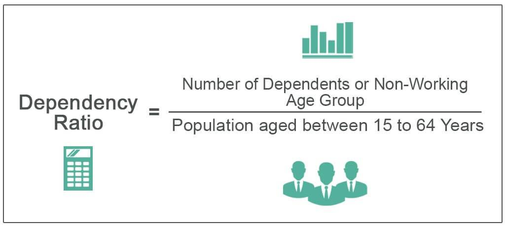

## Table of Contents

## What is the dependency ratio?

The dependency ratio is a measure that compares the number of people who are not in the workforce to those who are. It shows how many people depend on the working population for support. This ratio is important because it helps us understand the economic burden on the working-age group. A high dependency ratio means that there are more people who need support, like children and the elderly, compared to the number of people working.

There are two main types of dependency ratios: the youth dependency ratio and the old-age dependency ratio. The youth dependency ratio looks at the number of children (usually under 15 years old) compared to the working-age population (usually 15 to 64 years old). The old-age dependency ratio focuses on the number of elderly people (usually 65 and older) compared to the working-age group. Both ratios help governments and planners understand the needs of different age groups and plan resources accordingly.

## Why is the dependency ratio important?

The dependency ratio is important because it shows how many people are not working and need support from those who are working. This helps us understand how much pressure there is on the people who have jobs. If there are a lot of people who are too young or too old to work, the people who are working have to support more people. This can affect things like taxes, social services, and how much money people have to spend.

Knowing the dependency ratio also helps governments plan for the future. If they see that the number of elderly people is going up, they might need to spend more money on healthcare and pensions. If there are more young people, they might need to invest more in schools and childcare. By understanding these ratios, governments can make better decisions about where to spend money and how to help their citizens.

## How is the dependency ratio calculated?

The dependency ratio is calculated by dividing the number of people who are not working by the number of people who are working. The people who are not working are usually children and elderly people. The working-age group is usually people between 15 and 64 years old. To find the dependency ratio, you add up the number of children (under 15) and the number of elderly people (65 and over), and then divide that total by the number of people in the working-age group.

There are two main types of dependency ratios: the youth dependency ratio and the old-age dependency ratio. The youth dependency ratio is calculated by dividing the number of children (under 15) by the number of people in the working-age group (15 to 64). The old-age dependency ratio is calculated by dividing the number of elderly people (65 and over) by the number of people in the working-age group. Both ratios help us understand how many young or old people depend on the working-age population.

## What are the different types of dependency ratios?

There are two main types of dependency ratios: the youth dependency ratio and the old-age dependency ratio. The youth dependency ratio is calculated by dividing the number of children, who are usually under 15 years old, by the number of people in the working-age group, which is usually between 15 and 64 years old. This ratio helps us understand how many young people depend on the working population for support.

The old-age dependency ratio is calculated by dividing the number of elderly people, who are usually 65 years old and over, by the number of people in the working-age group. This ratio shows how many older people depend on those who are working. Both types of dependency ratios are important because they help governments and planners understand the needs of different age groups and plan resources accordingly.

## What is the difference between the youth dependency ratio and the elderly dependency ratio?

The youth dependency ratio is a number that shows how many kids under 15 years old depend on people who are working. It is found by dividing the number of kids by the number of people aged 15 to 64. This ratio is important because it helps us know how many young people need support like schools and healthcare from the working adults.

The elderly dependency ratio is different. It shows how many people who are 65 years old and older depend on the working population. This ratio is calculated by dividing the number of elderly people by the number of people aged 15 to 64. It is important because it helps us understand how many older people need things like pensions and medical care from those who are working.

Both ratios help governments plan for the future. If there are a lot of kids, more money might need to be spent on education. If there are a lot of elderly people, more money might need to be spent on healthcare and retirement benefits.

## How does the dependency ratio vary across different countries?

The dependency ratio can be very different from one country to another. In countries where there are a lot of young people, like many in Africa, the youth dependency ratio is high. This means there are many children who need support from the working adults. These countries might need to spend more money on schools and healthcare for kids. On the other hand, in countries with fewer young people and more elderly people, like Japan and many European countries, the old-age dependency ratio is high. This means there are more older people who need support, so these countries might need to spend more on pensions and healthcare for the elderly.

These differences can affect how much money people in each country have to spend and how governments plan for the future. In countries with a high youth dependency ratio, the government might need to focus on building more schools and creating jobs for young people as they grow up. In countries with a high old-age dependency ratio, the government might need to focus on healthcare and retirement benefits. Understanding these differences helps countries plan better and make sure they can support all their people, no matter their age.

## What are the economic implications of a high dependency ratio?

A high dependency ratio means that there are a lot of people who are not working and need support from those who are working. This can put a lot of pressure on the working people because they have to support more people. When there are more children or elderly people than workers, the government might need to raise taxes to pay for things like schools, healthcare, and pensions. This can mean less money for the working people to spend on their own needs and wants. If taxes go up too much, it might make it harder for businesses to grow and create new jobs.

In countries with a high dependency ratio, the economy can grow more slowly. This is because a smaller part of the population is working and producing goods and services. When fewer people are working, there is less money coming into the economy. This can lead to slower economic growth and might make it harder for the country to improve living standards. Governments in these countries need to plan carefully to make sure they can support everyone, while also helping the economy grow.

## How does the dependency ratio affect social security systems?

A high dependency ratio can put a lot of pressure on social security systems. When there are more people who are not working, like children and elderly people, the government has to spend more money on things like pensions, healthcare, and education. This money comes from taxes paid by the people who are working. If there are fewer workers compared to the number of people who need support, the government might need to raise taxes. This can make it harder for working people to save money and spend on their own needs.

In countries with a high old-age dependency ratio, the social security system might struggle to pay for all the pensions and healthcare needed by the elderly. This can lead to higher taxes or cuts in other areas of spending. On the other hand, in countries with a high youth dependency ratio, the government might need to spend more on schools and childcare. If the dependency ratio is very high, it can make it hard for the social security system to keep up with all the needs of the people it is supposed to help.

## What historical trends can be observed in dependency ratios globally?

Over the last few decades, we have seen big changes in dependency ratios around the world. In many countries, the youth dependency ratio was high after World War II because there were a lot of babies being born. This is called the "baby boom." As these babies grew up and started working, the dependency ratio went down because there were more people working and fewer young people who needed support. But as these baby boomers got older and retired, the old-age dependency ratio started to go up. This means there are now more older people who need support from the working population.

In some parts of the world, like Africa and parts of Asia, the youth dependency ratio is still high because there are a lot of young people. These countries need to spend a lot of money on schools and healthcare for kids. On the other hand, in countries like Japan and many in Europe, the old-age dependency ratio is very high because people are living longer and having fewer babies. This means these countries need to spend more money on pensions and healthcare for the elderly. These trends show how different countries face different challenges because of their dependency ratios.

## How do demographic changes influence the dependency ratio?

Demographic changes, like changes in birth rates and life expectancy, can really change the dependency ratio. When a country has a lot of babies being born, the youth dependency ratio goes up. This means there are more kids who need support from the working adults. If the birth rate goes down, the youth dependency ratio will go down too, because there are fewer kids to support. Also, if people start living longer, the old-age dependency ratio goes up. This happens because there are more older people who need help from the working population.

These changes can have a big impact on a country's economy and social services. For example, if a country has a lot of young people, it might need to spend more money on schools and healthcare for kids. But if a country has a lot of older people, it might need to spend more on pensions and healthcare for the elderly. Governments need to plan carefully to make sure they can support everyone, no matter their age. Understanding how demographic changes affect the dependency ratio helps countries prepare for the future and make sure they can take care of all their people.

## What are the policy measures that can be implemented to manage a high dependency ratio?

When a country has a high dependency ratio, it means there are a lot of people who are not working and need support from those who are. One way to manage this is by encouraging people to have fewer children. Governments can do this by making birth control easier to get and by educating people about family planning. This can help lower the youth dependency ratio over time. Another way is by helping more women join the workforce. This can be done by providing childcare and making it easier for women to balance work and family. More workers mean less pressure on each worker to support others.

Another important policy is to encourage people to work longer before they retire. This can help lower the old-age dependency ratio. Governments can do this by changing the retirement age or offering incentives for people to keep working. It's also important to make sure the economy is growing and creating new jobs. A strong economy means more people can work and support those who can't. By using these policies, governments can manage a high dependency ratio and make sure everyone in the country is taken care of.

## How can predictive models be used to forecast future dependency ratios?

Predictive models can help us guess what the dependency ratio might be like in the future. These models use information about how many babies are being born, how long people are living, and how many people are working now. By looking at these numbers, the models can make a guess about how many kids and old people there will be compared to the number of working people in the future. This helps governments plan ahead so they can be ready for changes in the dependency ratio.

For example, if a model shows that there will be a lot more old people in the future, the government might need to spend more money on healthcare and pensions. If the model shows there will be a lot more kids, the government might need to build more schools and spend more on education. By using these predictive models, governments can make better decisions about where to spend money and how to help their people, making sure they are ready for whatever the future brings.

## How do you calculate the dependency ratio?

The dependency ratio is a vital demographic indicator that quantifies the proportion of dependents in relation to the working-age population. It is expressed through the formula:

$$
\text{Dependency Ratio (\%)} = \left( \frac{\text{Number of Dependents}}{\text{Population Aged 15-64}} \right) \times 100
$$

In demographic terms, 'dependents' are broadly classified as individuals aged below 15 and those aged 65 and above. This ratio provides valuable insights into the economic pressure exerted on the productive segment of society, highlighting the resources necessary to support services like healthcare, pensions, and education. 

Consider a hypothetical country with the following demographic structure:

- Total population: 1,000,000
- Population aged below 15: 200,000
- Population aged 15-64: 600,000
- Population aged 65 and above: 200,000

In this example, the number of dependents would be the sum of those below 15 and those 65 and older: 

$$
\text{Number of Dependents} = 200,000 + 200,000 = 400,000
$$

Substituting these values into the formula yields:

$$
\text{Dependency Ratio (\%)} = \left( \frac{400,000}{600,000} \right) \times 100 = 66.67\%
$$

This ratio of 66.67% indicates that there are approximately 67 dependents for every 100 working-age individuals, suggesting a significant demand for economic resources allocated towards non-working populations.

Understanding the nuances of this calculation is crucial for accurate application across various sectors. For instance, the dependency ratio should inform not only social services planning but also economic strategies that can adjust to shifts in demographic trends. Analysts, policymakers, and businesses can integrate this metric, along with other economic indicators, to enrich their forecasting and strategic planning efforts.

## References & Further Reading

[1]: World Bank. ["World Development Indicators: Dependency Ratio."](https://wdi.worldbank.org/table/2.1?tableNo=2.1)

[2]: Casey, B. H. (2003). ["The Economic Implications of Population Ageing in France: A Micro Simulation Approach."](https://www.researchgate.net/publication/371413419_The_Economic_Consequences_of_Population_Aging_Challenges_and_Policy_Implications) Journal of Aging & Social Policy.

[3]: Global Burden of Disease Study 2010. ["The Global Burden of Disease: Generating Evidence, Guiding Policy."](https://documents.worldbank.org/curated/en/927821468170975008/pdf/808490PUB0L2590Box0379820B00PUBLIC0.pdf) The Lancet.

[4]: Chu, K., & Cui, W. (2013). ["Demographic Ageing and Economic Growth in China."](https://onlinelibrary.wiley.com/doi/full/10.1111/j.1468-0106.2008.00428.x) China Economic Review.

[5]: Algorithms for Hyper-Parameter Optimization. ["Algorithms for Hyper-Parameter Optimization."](https://papers.nips.cc/paper/4443-algorithms-for-hyper-parameter-optimization.pdf) Advances in Neural Information Processing Systems 24.