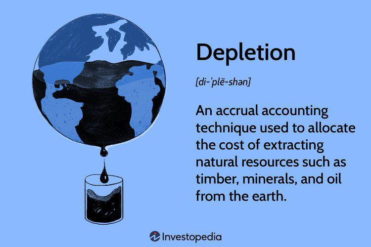

The intersection of depletion resource management and algorithmic trading (algo trading) represents a complex but vital area of financial and environmental analysis. Depletion involves the gradual exhaustion of natural resources, which underscores the necessity for effective management strategies to ensure sustainable growth. The strategic management of natural resources aims to prevent their overuse and guarantee their long-term availability, thereby safeguarding ecological and economic equilibrium.

Simultaneously, algorithmic trading employs sophisticated algorithms to enhance the efficiency of financial resource management. These algorithms enable automated decision-making processes in financial markets, significantly improving the speed, accuracy, and efficiency of trading operations. By minimizing human emotional biases and relying on data-driven strategies, algo trading can optimize financial outcomes and offer potential efficiencies in resource allocation.

This article examines how these two domains—depletion resource management and algorithmic trading—interact with one another. By exploring the factors that influence resource depletion management and their ramifications on algo trading, we intend to provide a comprehensive understanding for investors and stakeholders interested in managing resources sustainably and efficiently. This dual focus seeks to bridge financial innovation with environmental sustainability, promising a more integrated approach to resource management that aligns economic activities with ecological principles.

## Table of Contents

## Understanding Depletion Resource Management

Depletion resource management is centered on the strategic handling of natural resources to avert their overuse and guarantee their long-term availability. This practice is essential for maintaining ecological balance while supporting economic growth. The approach is defined by several key processes: acquisition, exploration, development, and restoration of resources.

Acquisition involves securing rights to access and extract natural resources. This step establishes the foundation for resource management and requires significant financial investment. Exploration follows, requiring advanced technologies to locate and evaluate resource deposits. The success of this stage dictates the potential value of the acquisition and the feasibility of subsequent development.

Development involves the extraction and processing of resources, focusing on maximizing yield while minimizing environmental impact. This stage requires a balanced approach to technological application and resource exploitation to sustain resource availability over time. Restoration is the final step, emphasizing the rehabilitation of resource sites to restore ecological function and ensure that areas can continue to support biodiversity.

A critical aspect of depletion resource management is the calculation of depletion expenses, which are essential for financial reporting and planning. Two primary methods are employed: percentage depletion and cost depletion. Percentage depletion allows a fixed percentage of gross income from resource extraction to be deducted as depletion expense, which often benefits investments in smaller or marginal resource sites. Cost depletion calculates the expense based on the cost of the resource reserve and the number of units extracted, reflecting a more precise allocation of resource cost over its useful life.

Effective depletion management necessitates a balance between environmental stewardship and economic requirements, underscoring the importance of regulatory frameworks. These frameworks establish guidelines for resource identification, extraction methods, and post-extraction restoration efforts, aiming to limit environmental degradation while ensuring the resource's economic viability. These regulations are vital for maintaining sustainable practices, encouraging innovation in resource management techniques, and fostering a responsible approach to resource exploitation that supports long-term economic and environmental health.

## Factors Influencing Depletion Resource Management

Depletion resource management is influenced by several key factors, each playing a critical role in determining how natural resources are utilized and conserved. 

Acquisition costs are the initial investment required to access natural resources. These costs can encompass purchasing land or rights, installation of necessary infrastructure, and compliance with legal and regulatory requirements. High acquisition costs can act as a barrier to entry, limiting resource exploitation to entities with significant capital. Conversely, lower acquisition costs may encourage over-extraction, potentially leading to rapid resource depletion.

Exploration expenses are another significant [factor](/wiki/factor-investing). Exploration involves costs related to identifying and quantifying natural resources. This process can be capital-intensive and technologically demanding, involving geophysical surveys, drilling, and the assessment of environmental impacts. These expenses are essential for accurately estimating resource availability and sustainability, which directly affect management decisions and the rate of resource extraction.

The development and restoration efforts are vital for sustainable depletion resource management. Development costs include building infrastructure necessary for resource extraction and processing. However, without adequate restoration efforts, resource extraction can lead to environmental degradation, reducing the long-term availability of resources. Restoration involves activities aimed at rehabilitating ecosystems post-extraction to maintain ecological balance and biodiversity.

Market dynamics heavily influence resource depletion. Economic factors such as demand, supply, and price fluctuations dictate the extent of resource extraction. High demand and favorable prices incentivize increased resource exploitation whereas declining prices or demand might lead to reduced extraction efforts. Economic incentives are often reflected in corporate strategies and state policies, which can either foster conservation or accelerate depletion.

Technological advancements present both opportunities and challenges. Technology can enhance resource management through improved exploration methods, efficient extraction techniques, and advanced monitoring systems. However, it can also expedite resource depletion by making previously inaccessible resources available for extraction. Therefore, the pace of technological progress must be balanced with sustainable management practices to prevent unsustainable resource exhaustion.

Regulatory environments are crucial in shaping resource management practices. Regulations can dictate limits on resource extraction, enforce environmental protection standards, and provide incentives for sustainable practices. Robust regulatory frameworks help balance economic interests with environmental conservation, ensuring long-term resource availability.

In conclusion, effective depletion resource management requires a comprehensive approach that considers acquisition costs, exploration expenses, development, restoration efforts, market dynamics, technological advancements, and regulatory frameworks. By addressing these factors, stakeholders can develop strategies that align economic goals with environmental sustainability, ensuring that natural resources are managed responsibly for future generations.

## Algorithmic Trading in Financial Markets

Algorithmic trading, commonly known as algo trading, is a method that employs advanced mathematical models and computerized systems to execute financial trades at speeds and frequencies that are impossible for a human trader. This automation utilizes predetermined criteria to scrutinize market conditions, enabling precise and efficient execution of trades.

Key benefits of [algorithmic trading](/wiki/algorithmic-trading) include its unparalleled speed and efficiency in executing trades. Algorithms can react to market changes within milliseconds, a feat far beyond human capabilities. This high-speed execution leads to significant advantages in markets where competitive pricing is critical. Additionally, algo trading minimizes the emotional risks associated with human trading. By following a strictly defined set of rules, algorithms eliminate the potential for human emotional biases that can lead to irrational decision-making during financial [volatility](/wiki/volatility-trading-strategies).

Algo trading strategies are varied and have become increasingly sophisticated. They range from simple trend-following strategies, which capitalize on the [momentum](/wiki/momentum) of trading volumes, to complex statistical [arbitrage](/wiki/arbitrage) strategies that analyze price discrepancies across different markets. These strategies employ diverse methods, such as mean reversion and market-making, allowing traders to deploy various approaches according to their market analysis and risk preferences.

The infrastructure integral to supporting algo trading involves a comprehensive technology stack consisting of various components. These include platforms capable of delivering real-time market data crucial for immediate decision-making. Such platforms often integrate advanced [backtesting](/wiki/backtesting) capabilities, allowing traders and developers to test and refine their trading algorithms against historical data before deploying them in live environments. This process is essential to validate the efficacy of trading strategies under different market conditions.

Automated execution engines form another critical component of this infrastructure. These engines not only execute trades at high speeds but also manage orders in a manner that minimizes market impact, ensuring positive alignment with the firm's trading goals. The robustness of these systems is crucial for the reliability and success of algorithmic trading, as they provide the computational power and security necessary for handling vast amounts of trading data.

In summary, algorithmic trading reshapes the landscape of financial markets by enhancing the precision and execution speed of trades, effectively reducing human error and emotion-based decision-making. Its strategic diversity and technological foundation are pivotal to its growing dominance, ensuring it remains a cornerstone of modern trading methodologies.

## The Intersection of Depletion Resource Management and Algo Trading

The intersection of depletion resource management and algorithmic trading showcases an innovative approach to enhancing both environmental and financial resource efficiency. Economic theories in resource management provide valuable insights into optimizing outcomes, and these principles can be directly applied to algorithmic trading strategies. Both disciplines seek to achieve maximum efficiency—depletion resource management with finite natural resources and algorithmic trading with financial assets.

Algorithmic trading improves market efficiency by automating trades using sophisticated algorithms that process large volumes of data. This automation not only speeds up transactions but eliminates emotional biases, leading to more rational and consistent decision-making. Similarly, resource management aims to optimize the use of natural resources by implementing regulatory frameworks and strategies to maintain ecological balance and sustainability.

The benefits of algorithmic trading, particularly in terms of volatility and [liquidity](/wiki/liquidity-risk-premium) improvements, can be compared to the stabilized resource management frameworks enacted to manage depletion. By intensifying liquidity in financial markets, algorithmic trading ensures that trades can occur more swiftly without drastically affecting asset prices, thus maintaining market stability. This effect parallels how regulatory measures in resource management seek to control the rate of resource depletion, ensuring their availability over the long term.

One can draw an analogy between the two sectors through supply and demand dynamics, which are fundamental to price setting both in markets and resource extraction. Mathematical models that underpin trading algorithms often follow principles that are similar to those used in resource management. For instance, econometric models that predict market movements in algorithmic trading may integrate variables akin to those considered when predicting natural resource availability or exhaustion rates over time.

The integration of economic theories into algorithmic strategies may involve models like the Hotelling's Rule, which explains how the net price of exhaustible resources should increase over time, reflecting scarcity. In algorithmic trading, similar predictive models can be employed to simulate market dynamics under conditions of scarcity and abundance, allowing traders and investors to optimize their portfolios sustainably.

To enhance effectiveness, both fields benefit from advanced technologies such as [machine learning](/wiki/machine-learning) and [artificial intelligence](/wiki/ai-artificial-intelligence), capable of processing vast datasets and unveiling patterns that humans might overlook. These technologies have the potential to forecast

## Challenges and Future Directions

Integrating depletion management principles into the dynamic realm of financial trading presents significant challenges. The primary difficulty lies in aligning the long-term objectives of sustainable resource management with the short-term nature of trading activities. Depletion management focuses on ensuring the longevity and availability of natural resources, whereas algorithmic trading often prioritizes immediate financial gains. Bridging this gap requires a strategic overhaul in how trading strategies are developed and executed.

Scarcity of natural resources is a critical factor that should be incorporated into algorithmic trading strategies to advance sustainability. Traditional trading algorithms are not inherently equipped to consider environmental impacts or resource limitations. To address this, algorithms must evolve to incorporate environmental data, such as resource availability and ecological footprints, into their decision-making processes. This integration would help reflect the true cost of resource depletion while promoting market stability and sustainability.

Artificial intelligence (AI) and machine learning (ML) offer promising directions for addressing these challenges. AI-driven algorithms can be designed to analyze complex datasets comprising environmental, social, and market factors to predict resource trends. By leveraging these predictions, traders can adjust their strategies to minimize the negative impact on natural resources. Machine learning models, such as neural networks or gradient boosting algorithms, could be trained to recognize patterns in historical data, allowing for more informed trading decisions that align with sustainable resource use.

A cross-disciplinary approach is crucial for the successful convergence of depletion resource management with algorithmic trading. Collaboration between environmental scientists, economists, data scientists, and financial experts will facilitate the development of comprehensive frameworks. These frameworks should integrate real-time environmental data, market analyses, and trading algorithms, fostering a more holistic understanding of the interplay between resource scarcity and financial markets. By promoting such interdisciplinary efforts, the financial sector can better respond to environmental challenges while ensuring market efficiency and sustainability.

## Conclusion

Sustainable management of natural and financial resources is paramount for ensuring long-term growth and stability in both the environmental and financial sectors. This dual necessity hinges on a comprehensive understanding of the influencing factors behind resource depletion and the integration of these insights into algorithmic trading strategies. The depletion of natural resources poses a significant risk to both ecosystems and economic systems, necessitating strategic approaches to mitigate over-exploitation and ensure equitable resource distribution.

Algorithmic trading, by its nature, is adept at optimizing resource allocation due to its ability to process vast amounts of data rapidly and make decisions based on complex algorithms. By incorporating factors that influence resource depletion, such as acquisition costs, exploration expenditures, and restoration efforts, algo trading can be tailored to account for these variables, enabling more efficient and responsible allocation of financial resources. This integration ensures that trading strategies not only seek financial returns but also align with sustainability principles by considering the availability and management of natural resources.

Innovation in technology and strategic policy development are crucial components in this process. The advancement of AI and machine learning offers unprecedented opportunities to predict trends in resource availability and adjust trading strategies dynamically. These technologies can process environmental data alongside financial indicators, providing a holistic view that supports sustainable decision-making.

Moreover, developing strategic policies that incentivize sustainable practices in both resource management and financial markets is essential. Such policies could include regulatory frameworks that encourage investment in sustainable industries or financial instruments that promote environmental responsibility. Cross-disciplinary collaboration among environmental scientists, economists, and financial technologists will be pivotal in crafting these policies, ensuring they are both effective and adaptable to evolving challenges.

In conclusion, the symbiosis between depletion resource management and algorithmic trading represents a forward-thinking approach to sustainability. By marrying the precision and efficiency of algorithmic trading with the strategic insights from resource management, we can foster a more resilient and sustainable economic landscape. Continued innovation, coupled with robust policy initiatives, will be key to navigating the complexities of this intersection and securing a prosperous future.

## References & Further Reading

[1]: Bergstra, J., Bardenet, R., Bengio, Y., & Kégl, B. (2011). ["Algorithms for Hyper-Parameter Optimization."](https://dl.acm.org/doi/10.5555/2986459.2986743) Advances in Neural Information Processing Systems 24.

[2]: ["Advances in Financial Machine Learning"](https://www.amazon.com/Advances-Financial-Machine-Learning-Marcos/dp/1119482089) by Marcos Lopez de Prado

[3]: ["Evidence-Based Technical Analysis: Applying the Scientific Method and Statistical Inference to Trading Signals"](https://www.amazon.com/Evidence-Based-Technical-Analysis-Scientific-Statistical/dp/0470008741) by David Aronson

[4]: ["Machine Learning for Algorithmic Trading"](https://github.com/stefan-jansen/machine-learning-for-trading) by Stefan Jansen

[5]: ["Quantitative Trading: How to Build Your Own Algorithmic Trading Business"](https://www.amazon.com/Quantitative-Trading-Build-Algorithmic-Business/dp/1119800064) by Ernest P. Chan