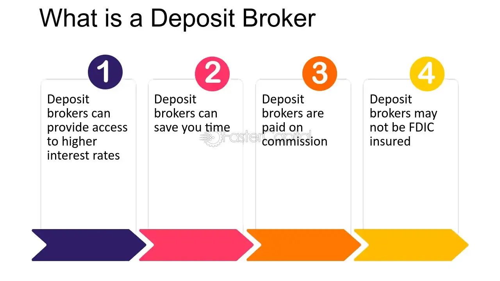

## Table of Contents

## What is a deposit broker?

A deposit broker is a person or company that helps people find the best places to put their money in banks or credit unions. They look for accounts that offer the highest interest rates and other benefits. People use deposit brokers because they want to make sure their money is safe and growing as much as possible.

Deposit brokers work with many different banks and financial institutions. They can find special deals and rates that might not be available to the public. This can be very helpful for someone who wants to save money but doesn't have the time to research all the options themselves. By using a deposit broker, people can feel more confident that they are getting the best deal for their savings.

## How does a deposit broker function?

A deposit broker acts like a middleman between people who want to save money and the banks or credit unions that offer savings accounts. When someone wants to save their money, they can go to a deposit broker instead of going directly to a bank. The deposit broker knows about many different banks and the types of accounts they offer. They help the person find the best place to put their money by looking at things like interest rates, how safe the bank is, and any special deals the bank might have.

Once the deposit broker finds a good account, they help the person set it up. This can be easier than doing it on their own because the broker already knows all the details and can handle the paperwork. The broker might also keep an eye on the account and let the person know if there are better options later on. This way, the person can feel confident that their money is in a good place and growing as much as possible.

## What are the benefits of using a deposit broker?

Using a deposit broker can save you a lot of time and effort. Instead of spending hours looking at different banks and trying to understand all the details about their accounts, you can just talk to a deposit broker. They already know about all the options and can quickly find the best one for you. This is especially helpful if you don't know much about banking or if you're too busy to do the research yourself.

Another big benefit is that deposit brokers can often find better deals than you might find on your own. They have connections with many banks and can get special rates or deals that aren't available to everyone. This means you could earn more interest on your savings. Plus, deposit brokers can help you keep an eye on your money and let you know if there are even better options later on, so you always have the best place for your savings.

## What types of deposits can a broker help with?

A deposit broker can help you with different kinds of savings accounts. They can find you the best regular savings accounts where you can save money and earn interest. They also know about money market accounts, which usually offer higher interest rates but might need you to keep more money in the account. 

They can also help you with certificates of deposit, or CDs. CDs are special accounts where you agree to keep your money in the bank for a certain time, like six months or a year, and in return, you get a higher [interest rate](/wiki/interest-rate-trading-strategies). A deposit broker can find the CDs with the best rates and terms that fit what you need.

## How do deposit brokers earn their income?

Deposit brokers make money by getting a fee from the banks or credit unions they work with. When someone opens a savings account through a deposit broker, the bank pays the broker a small amount of money for bringing them a new customer. This fee is usually a percentage of the money that the person puts into the account.

Sometimes, deposit brokers might also charge their customers a fee for their services. This fee could be a one-time payment or a small percentage of the money they help you save. But most of the time, the bank pays the broker, so you don't have to pay anything extra to use their help.

## What are the legal and regulatory requirements for deposit brokers?

Deposit brokers need to follow certain rules and regulations to make sure they are doing things the right way. In the United States, deposit brokers are regulated by the Federal Deposit Insurance Corporation (FDIC). They must register with the FDIC and follow their rules, which are meant to protect people's money and make sure brokers are honest and fair. This includes rules about how they advertise their services and what they can and can't say to customers.

Besides the FDIC, deposit brokers might also need to follow rules from other places, like state governments or the Financial Industry Regulatory Authority (FINRA). These rules can be different depending on where the broker works and what kind of accounts they help people with. It's important for deposit brokers to know all these rules and follow them carefully to keep their customers safe and avoid getting in trouble.

## How does a deposit broker differ from a traditional bank?

A deposit broker is different from a traditional bank because they don't keep your money themselves. Instead, a deposit broker helps you find the best place to put your money in different banks. They look at many banks and find the ones with the best interest rates and deals. A traditional bank, on the other hand, is where you actually put your money. They offer different kinds of accounts like savings accounts and certificates of deposit, and they keep your money safe and pay you interest.

Another difference is how they make money. A deposit broker earns money by getting a fee from the banks when they help someone open an account. Sometimes, they might also charge you a small fee for their services. A traditional bank makes money in different ways, like charging fees for account services and using the money you deposit to make loans to other people, which earns them interest. So, while a deposit broker helps you find the best bank, a traditional bank is where you actually save your money.

## What should one consider when choosing a deposit broker?

When choosing a deposit broker, it's important to think about their reputation and experience. You want to work with someone who has a good history of helping people find the best savings accounts. You can check reviews and see if they are registered with the FDIC, which means they follow the rules and are more likely to be trustworthy. Also, see if they have been in business for a while and have experience with the type of account you're interested in, like regular savings accounts or certificates of deposit.

Another thing to consider is what kind of services the deposit broker offers. Some brokers might help you find the best account and then leave you on your own, while others might keep an eye on your account and let you know if there are better options later. It's also good to know if they charge you any fees for their help, or if they only get paid by the banks. Make sure you understand how they make money so there are no surprises. By thinking about these things, you can choose a deposit broker that will help you make the most of your savings.

## Can deposit brokers enhance the safety of my investments?

Deposit brokers can help make your savings safer by finding banks that are insured by the FDIC. This means if the bank has problems, your money is still safe up to a certain amount, usually $250,000. Deposit brokers know which banks are insured and can help you pick the safest ones for your money.

They also keep an eye on the banks they work with. If a bank starts to have issues, a good deposit broker will let you know and help you move your money to a safer place. This way, you don't have to worry about keeping track of all the banks yourself. By using a deposit broker, you can feel more confident that your savings are in good hands.

## How do deposit brokers manage risk for their clients?

Deposit brokers help manage risk for their clients by choosing banks that are insured by the FDIC. This means if a bank fails, the government will protect your money up to $250,000. Deposit brokers know which banks have this insurance, so they can make sure your savings are in a safe place. They also look at how stable a bank is, so they can avoid banks that might have problems in the future.

They also keep watching the banks they work with. If a bank starts to have issues, a good deposit broker will tell you right away. They can help you move your money to a safer bank before any problems get worse. This way, you don't have to worry about keeping track of everything yourself. A deposit broker helps make sure your money stays safe and grows as much as possible.

## What advanced strategies do expert deposit brokers use to optimize returns?

Expert deposit brokers use a few smart tricks to help their clients get the best returns on their savings. One of their main strategies is called "laddering." This means they help you spread your money across different certificates of deposit (CDs) that mature at different times. For example, instead of putting all your money in one CD for five years, they might suggest putting some in a one-year CD, some in a two-year CD, and so on. This way, you can take advantage of higher interest rates as they become available and still have access to some of your money without penalty.

Another strategy they use is to keep an eye on interest rates and move money around when better deals come up. They know that interest rates can change, so they watch the market closely. If they see a bank offering a much better rate, they'll help you move your money there. They might also use something called "rate chasing," where they always look for the highest rates available and switch your savings to take advantage of them. By using these strategies, expert deposit brokers can help make sure your savings grow as much as possible.

## How do global economic changes impact the operations of deposit brokers?

Global economic changes can really affect what deposit brokers do. When interest rates around the world go up or down, it changes the rates that banks offer on savings accounts. Deposit brokers need to keep a close eye on these changes so they can find the best deals for their clients. If interest rates in one country go up, a deposit broker might suggest moving money to a bank in that country to get a higher return. On the other hand, if a country's economy starts to have problems, the deposit broker might warn clients to move their money to a safer place.

These economic changes also make deposit brokers have to work harder to find good options for their clients. For example, if there's a big economic crisis, like a recession, banks might offer lower interest rates or be less stable. Deposit brokers need to understand these situations and help their clients find the safest and most profitable places for their savings. By staying on top of global economic news and trends, deposit brokers can better serve their clients and help them make smart choices with their money.

## References & Further Reading

[1]: Bergstra, J., Bardenet, R., Bengio, Y., & Kégl, B. (2011). ["Algorithms for Hyper-Parameter Optimization."](https://dl.acm.org/doi/10.5555/2986459.2986743) Advances in Neural Information Processing Systems 24.

[2]: ["Advances in Financial Machine Learning"](https://www.amazon.com/Advances-Financial-Machine-Learning-Marcos/dp/1119482089) by Marcos Lopez de Prado

[3]: ["Evidence-Based Technical Analysis: Applying the Scientific Method and Statistical Inference to Trading Signals"](https://www.amazon.com/Evidence-Based-Technical-Analysis-Scientific-Statistical/dp/0470008741) by David Aronson

[4]: ["Machine Learning for Algorithmic Trading"](https://github.com/stefan-jansen/machine-learning-for-trading) by Stefan Jansen

[5]: ["Quantitative Trading: How to Build Your Own Algorithmic Trading Business"](https://books.google.com/books/about/Quantitative_Trading.html?id=j70yEAAAQBAJ) by Ernest P. Chan