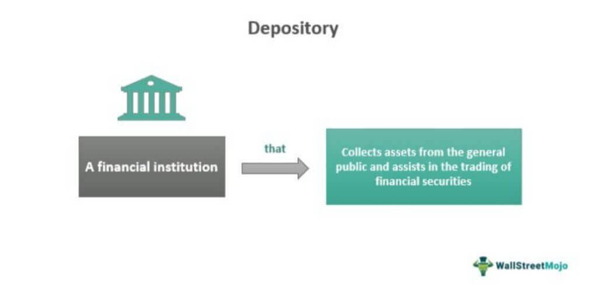

In the ever-evolving world of finance, technology continues to play a pivotal role in reshaping market dynamics. The rapidly advancing field of financial technology, or FinTech, has brought about significant changes in how financial markets operate, leading to more efficient, transparent, and accessible financial services. This article explores the intersection of investment financial services, deposit brokers, and algorithmic trading, all of which are crucial components of the modern financial ecosystem.

Investment financial services have long been integral to growing individual and institutional wealth. These services are now more accessible due to technological advancements that streamline investment processes and offer new ways to manage assets. One critical aspect of investment services is the role of deposit brokers. Deposit brokers act as intermediaries, helping individuals and businesses place funds into accounts with insured depository institutions. This service not only provides investors with potentially higher yields through fixed-term products but also aids banks by enhancing their liquidity.



Algorithmic trading, or algo trading, represents another technological frontier that has significantly transformed financial markets. Using sophisticated computer algorithms, traders can execute trades at speeds and efficiencies unattainable by human capabilities alone. Algo trading leverages pre-defined criteria and market data analysis, allowing for precision in decision-making and execution that maximizes efficiency and potential returns. Understanding the intricacies of algorithmic trading offers opportunities for both retail and institutional investors to capitalize on market movements.

By understanding these elements, investors and financial institutions can enhance their strategies and optimize returns. With this article, we will journey through the roles and benefits of deposit brokers and algorithmic trading, highlighting how they contribute to the broader financial landscape. By doing so, we can gain deeper insight into how these elements work independently and together, enabling a more nuanced approach to modern financial challenges and opportunities. Let's examine these crucial facets of modern finance to better understand their impact and potential for innovation.

## Table of Contents

## Understanding Deposit Brokers

A deposit broker is a specialized financial professional who facilitates the allocation of deposits into insured depository institutions, effectively serving as an intermediary between investors and banks. Unlike stockbrokers, deposit brokers focus on the placement of fixed-term investment products which typically offer low-risk yields. The primary responsibility of a deposit broker lies in consolidating deposit activities for a wide pool of individual investors to provide banks with necessary liquidity. This aggregation process enhances the financial ecosystem by ensuring banks have adequate funds to meet lending requirements and operational needs.

Deposit brokers assess various fixed-term investment products, such as certificates of deposit (CDs), and negotiate competitive rates for investors. Their expertise allows them to scan the market efficiently for opportunities that offer profitable returns while weighing risk factors pertinent to each investment product. This intermediary role is vital as it enables banks to access larger sums of liquidity that may not be feasible through individual deposits alone.

Regulatory considerations play an important role in deposit brokering. Deposit brokers must adhere to the rules set forth by authorities such as the Federal Deposit Insurance Corporation (FDIC) in the United States, which ensures the security and insurance of deposits. These regulations are designed to protect consumers and maintain trust in financial systems. Brokers must ensure that all transactions are compliant with these regulations to foster a stable financial environment and protect investor interests.

Understanding the operational and regulatory aspects of deposit brokering helps investors and financial institutions strategize and manage their assets more effectively. By bridging the gap between individual investor capital and bank funding needs, deposit brokers contribute to a more fluid and resilient financial system. With their ability to offer tailored investment advice and negotiate favorable terms, deposit brokers serve as a crucial component in maximizing asset management and achieving returns with minimized risks.

## Investment Financial Services Through Deposit Brokers

Investment financial services offer a diverse range of solutions, with deposit brokers playing a pivotal role. These professionals not only facilitate deposit transactions but also provide valuable advisory services to investors seeking secure investment channels. Deposit brokers act as intermediaries, connecting investors to financial institutions that offer lucrative yet low-risk deposit opportunities, thereby ensuring both the safety and growth of their funds.

A deposit broker's advisory services are integral to helping investors navigate the intricacies of fixed-term investment products, which are typically characterized by low risk and stable returns. This advisory component is crucial, as it assists investors in making informed decisions that align with their financial goals and risk tolerance. By understanding the landscape of available deposit options and the prevailing interest rates, brokers can recommend the most suitable products to their clients.

Deposit brokers enhance their value by leveraging technology, which is increasingly becoming a fundamental part of the industry. Digital tools and platforms enable brokers to streamline the process of matching investors with deposit opportunities, ensuring efficiency and accuracy in their services. These technological advancements also facilitate better data analysis and client communication, leading to more personalized financial advice.

Despite their benefits, deposit brokers face several challenges, particularly in terms of regulatory compliance and technological integration. The regulatory environment for deposit brokers is stringent, requiring adherence to policies that protect investor interests and maintain the integrity of financial markets. This includes ensuring that the deposits are placed with federally insured institutions and that the investors' funds are secured.

Moreover, the rapid pace of technological change presents both opportunities and challenges for deposit brokers. While technology enhances service delivery, it also demands continuous adaptation and investment in new tools and systems. Brokers must keep abreast of technological trends and equip themselves with the necessary skills to utilize these innovations effectively.

In summary, deposit brokers are crucial players in the investment financial services landscape, providing critical advisory and intermediary services. As technological integration evolves and regulatory landscapes shift, the role of deposit brokers continues to adapt, ensuring they remain a vital part of the financial ecosystem.

 to Algorithmic Trading

Algorithmic trading, commonly known as algo trading, represents a significant innovation in financial markets, allowing for the execution of trades at speeds unattainable by human traders. This method harnesses advanced computer programs that utilize pre-defined rules, mathematical modeling, and market data analysis to make informed trading decisions rapidly and efficiently.

The foundation of [algorithmic trading](/wiki/algorithmic-trading) lies in leveraging algorithms—explicit step-by-step instructions or formulas that process input data and provide output solutions. These algorithms analyze vast datasets and execute trades based on strategic criteria such as timing, price, and market conditions. The primary objective is to capitalize on short-lived market scenarios to enhance profitability and operational efficiency.

Historically, trading involved manual processes where human traders executed buy and sell orders. With technological advancements, the shift towards automated systems began in the latter part of the 20th century. The evolution was marked by increased processing power and sophisticated software capable of handling complex trading strategies with minimal human intervention.

Across global markets, algorithmic trading has become increasingly prominent. It now accounts for a significant portion of the trading [volume](/wiki/volume-trading-strategy) on major exchanges. The advantages that algorithms bring—speed, accuracy, and the ability to react instantaneously to market changes—make them indispensable tools for both retail and institutional investors.

For retail investors, algorithms can democratize trading by providing access to strategies that were once exclusive to large institutions. They allow for automation of investment strategies, disciplined execution without emotional decision-making, and consistent application of complex trading plans.

Institutional investors benefit from algorithms' ability to manage large volumes across multiple asset classes while minimizing market impact. For instance, algorithms can slice large orders into smaller transactions distributed over time, known as "iceberg orders," to prevent significant price swings.

In conclusion, algorithmic trading continues to transform financial landscapes, providing new strategies for maximizing returns while reducing manual workload. Its role in modern markets underscores the importance for investors to comprehend and integrate algorithmic techniques to remain competitive in an increasingly automated trading environment.

## Algo Trading Strategies

Algorithmic trading incorporates a variety of strategies designed to capitalize on different market conditions and trends. Among the most prevalent strategies are [trend following](/wiki/trend-following), mean reversion, and statistical [arbitrage](/wiki/arbitrage). Each strategy operates under distinct principles, offering specific benefits and suitability under different market scenarios.

### Trend Following
Trend following is built on the premise that prices often exhibit [momentum](/wiki/momentum), continuing in their current direction over time. Traders using this strategy aim to capitalize on long, sustained moves in the market by identifying and entering positions in the direction of the prevailing trend. This strategy is particularly effective in markets characterized by strong price movements and clear directional trends. One common tool used in trend following is the moving average crossover, where traders enter buy orders when a shorter-term moving average crosses above a longer-term average, signaling an upward trend, and sell orders when the opposite occurs.

Benefits include simplicity and alignment with the natural market tendency for trends. However, the strategy can be less effective in sideways or choppy markets, where price movements are more erratic and trend signals less reliable.

### Mean Reversion
Mean reversion operates on the hypothesis that asset prices fluctuate around a historical average or mean, and deviations from this mean are temporary. Traders employing this strategy seek to identify and exploit these deviations by taking opposite positions, expecting the price to revert to its mean. This strategy often involves statistical tools like Bollinger Bands or Z-score analysis to quantify how far a price has diverged from its average.

The primary advantage of mean reversion is its effectiveness in range-bound markets, where prices oscillate within defined boundaries. However, in strongly trending markets, mean reversion can lead to frequent losses, as price levels may not revert to the mean as expected due to sustainable directional momentum.

### Statistical Arbitrage
Statistical arbitrage is a sophisticated strategy that relies on statistical and computational techniques to identify pricing inefficiencies between related securities. It typically involves the simultaneous buying and selling of strongly correlated assets to exploit differential pricing and return to equilibrium. Pair trading, a subset of [statistical arbitrage](/wiki/statistical-arbitrage), involves selecting two historically correlated securities, taking a long position in the underperforming one and a short position in the outperforming one, in anticipation of convergence.

Statistical arbitrage strategies benefit from market neutrality, as they aim to profit from relative price movements rather than directional market trends. These strategies can generate returns in both bullish and bearish markets, although they require rigorous data analysis and the use of quantitative models to identify opportunities.

### Implementation Considerations
Traders can leverage these strategies by meticulously aligning their choice of algorithms with current market conditions. Python, with its rich ecosystem of libraries such as NumPy, pandas, and scikit-learn, offers robust tools for developing and back-testing algorithmic trading strategies. For instance, traders can use pandas to manipulate time series data and construct moving average crossovers easily, while scikit-learn can be used to develop [machine learning](/wiki/machine-learning) models for more advanced statistical arbitrage.

In Python, a simple trend-following strategy using moving averages might look like this:

```python
import pandas as pd

# Assume 'data' is a DataFrame containing stock price data with a 'Close' column.
short_window = 40
long_window = 100

# Compute moving averages
data['Short_MA'] = data['Close'].rolling(window=short_window, min_periods=1).mean()
data['Long_MA'] = data['Close'].rolling(window=long_window, min_periods=1).mean()

# Generate signals
data['Signal'] = 0.0  
data['Signal'][short_window:] = np.where(data['Short_MA'][short_window:] > data['Long_MA'][short_window:], 1.0, 0.0)   

# Calculate trading positions
data['Position'] = data['Signal'].diff()
```

Each strategy presents unique advantages and limitations, and their efficacy can vary based on market conditions. By understanding and employing these strategies, traders can enhance their ability to achieve optimal performance across different market environments.

## The Role of Brokers in Algo Trading

Brokers are integral to the execution of algorithmic trades by offering the platforms and market access required for such operations. These platforms enable traders to deploy sophisticated algorithmic strategies, often automated, which rely on both speed and precision to capitalize on market opportunities. Modern brokers provide a variety of tools and integrations, including Application Programming Interfaces (APIs), allowing traders to create and execute customized algorithms efficiently.

APIs are crucial for enabling real-time data analysis and the seamless execution of trades according to pre-defined strategies. For instance, a trader might use an API to collect live market data, input it into an algorithm that determines optimal trading actions, and then execute those trades instantaneously across multiple markets. This technological capability ensures that algorithmic trading can occur at speeds far beyond human ability, enhancing both efficiency and profit potential.

Selecting an appropriate broker is pivotal in determining trading success in algorithmic environments. A broker's reliability, speed, available data feeds, and the sophistication of their platform must align with the trader's specific needs. Among the criteria for evaluating brokers, traders should prioritize the following:

1. **Latency and Execution Speed**: The time it takes for an order to be executed directly impacts trading results, particularly in high-frequency trading environments. Therefore, brokers with low latency infrastructures are preferred.

2. **Data Availability and Quality**: Access to high-quality, real-time data is essential for accurate algorithmic decision-making. Brokers providing comprehensive data coverage and historical data records offer significant advantages.

3. **APIs and Integration Capabilities**: The ability to integrate custom algorithms with the broker's trading platform via robust and versatile APIs is a critical consideration. This feature ensures that traders can adapt their strategies dynamically as market conditions change.

4. **Fee Structure**: Algorithmic trading often involves numerous trades in a short time span, making the fee structure an important economic factor. Brokers offering competitive pricing without compromising service quality are more advantageous.

5. **Support and Resources**: Given the technical nature of algorithmic trading, brokers that offer strong technical support, extensive documentation, and educational resources can aid traders in maintaining and optimizing their trading strategies.

Ultimately, the choice of a broker can drastically influence a trader’s efficiency and profitability in algorithmic trading. Careful evaluation and selection based on the above criteria are essential for aligning broker services with personalized trading requirements. As algorithmic trading continues to evolve, traders must stay informed about technological advancements and broker offerings to maintain a competitive edge in the market.

## Advantages and Challenges of Algo Trading

Algorithmic trading offers significant advantages that have transformed the modern trading landscape. The most notable benefits of algo trading include speed, precision, and the capacity to execute complex strategies. Using computer algorithms, trades can be executed in fractions of a second, far beyond human capability. This speed enables traders to capitalize on short-lived market opportunities, often capturing favorable prices that are not accessible through manual trading methods.

Precision is another hallmark of algorithmic trading. It reduces the chances of human error by adhering strictly to pre-programmed instructions. This reliability ensures trades are executed with consistency, minimizing manual intervention that could lead to execution errors or oversight. Additionally, algorithmic trading can manage complex strategies, such as arbitrage, [market making](/wiki/market-making), or statistical analysis, efficiently processing vast amounts of market data to make informed decisions.

Despite these advantages, algorithmic trading is not without challenges. Technical glitches can disrupt trading operations, potentially leading to significant financial losses. Since algorithms rely heavily on technology, any malfunction, such as hardware failure, network connectivity issues, or software bugs, can adversely impact trading efficiency.

Another challenge lies in the need for thorough [backtesting](/wiki/backtesting). Before deploying an algorithm, traders must ensure that it has been rigorously tested against historical data to validate its effectiveness and resilience under various market conditions. Inadequate backtesting might result in strategies that perform poorly in live markets due to unseen market anomalies or inadequate parameter settings.

Risk management tools and practices are critical to mitigating these challenges. Trailing stops, limit and stop-loss orders are commonly used to automatically execute trades based on pre-set criteria, safeguarding investments against adverse price movements. Portfolio diversification can also help in spreading risk across different assets and market conditions. Furthermore, maintaining robust technological infrastructure and having a rapid incident response plan are essential to address potential technical failures swiftly.

In summary, while algorithmic trading provides unparalleled advantages in speed and precision, it requires careful consideration and robust risk management practices to address the attendant challenges. By balancing these aspects, traders can effectively harness the power of algorithmic trading while mitigating associated risks.

## Conclusion

As financial technology progresses, comprehending the roles of deposit brokers and algorithmic trading is increasingly important. Deposit brokers serve as crucial intermediaries, linking investors seeking secure and low-risk investment opportunities with depository institutions that require [liquidity](/wiki/liquidity-risk-premium). By channeling funds effectively, deposit brokers support financial stability while providing investors with tailored financial products. This synergy between investors and banks enhances capital efficiency and contributes to the robustness of financial systems.

Simultaneously, algorithmic trading revolutionizes trading strategies by employing rapid data analysis and automated trade execution. Algorithms are designed to recognize market patterns and execute trades with precision and speed that surpass human capabilities. This method not only optimizes trading outcomes but also introduces novel strategies that can be particularly beneficial in volatile markets. The precision and speed inherent in algorithmic trading offer significant advantages, but they must be balanced with rigorous risk management and continuous system evaluations to mitigate potential challenges such as technical glitches.

By integrating traditional financial mechanisms with advanced technological solutions, such as deposit brokering and algorithmic trading, investors and institutions can elevate their financial services and trading strategies, ensuring a more efficient and secure financial landscape. Continuous education and adaptation to these evolving tools is essential for maximizing their potential. As these technologies advance, staying informed and embracing innovation becomes pivotal for investors and financial professionals aiming to maintain a competitive edge in the dynamic financial environment.

## References & Further Reading

[1]: Bergstra, J., Bardenet, R., Bengio, Y., & Kégl, B. (2011). ["Algorithms for Hyper-Parameter Optimization."](https://dl.acm.org/doi/10.5555/2986459.2986743) Advances in Neural Information Processing Systems 24.

[2]: ["Advances in Financial Machine Learning"](https://www.amazon.com/Advances-Financial-Machine-Learning-Marcos/dp/1119482089) by Marcos Lopez de Prado

[3]: ["Evidence-Based Technical Analysis: Applying the Scientific Method and Statistical Inference to Trading Signals"](https://www.amazon.com/Evidence-Based-Technical-Analysis-Scientific-Statistical/dp/0470008741) by David Aronson

[4]: ["Machine Learning for Algorithmic Trading"](https://github.com/stefan-jansen/machine-learning-for-trading) by Stefan Jansen

[5]: ["Quantitative Trading: How to Build Your Own Algorithmic Trading Business"](https://books.google.com/books/about/Quantitative_Trading.html?id=j70yEAAAQBAJ) by Ernest P. Chan