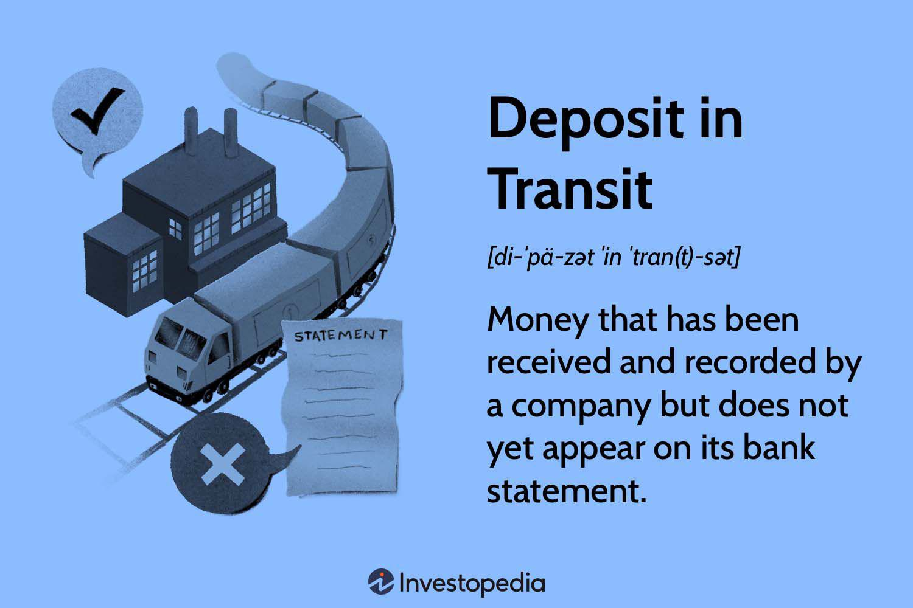

## Table of Contents

## What is a deposit in transit?

A deposit in transit is money that a company has sent to the bank, but the bank hasn't added it to the company's account yet. This can happen because of the time it takes for checks to clear or for electronic transfers to process. When a company makes a deposit at the end of the day or close to a bank holiday, it might not show up in the bank's records right away.

This situation is important when a company is doing its bank reconciliation. Bank reconciliation is when a company compares its own records of money with the bank's records to make sure they match. If there's a deposit in transit, the company's records will show more money than the bank's records. The company needs to remember to include this deposit in transit in its reconciliation to make sure everything adds up correctly.

## How does a deposit in transit affect a company's financial statements?

A deposit in transit does not directly change a company's financial statements right away. When a company makes a deposit, it records the money as part of its cash in the balance sheet. But if the bank hasn't added the money to the company's account yet, the bank statement will not show this deposit. So, there might be a difference between the company's records and the bank's records.

This difference is important when the company is doing its bank reconciliation. During reconciliation, the company will see that its cash balance is higher than what the bank shows because of the deposit in transit. The company needs to remember this deposit when it's figuring out its true cash balance. Once the bank processes the deposit, the bank statement will match the company's records, and the financial statements will be up to date.

## Can you explain the process of recording a deposit in transit?

When a company sends money to the bank, it records this money as cash in its [books](/wiki/algo-trading-books) right away. This means the company adds the amount of the deposit to its cash account in the balance sheet. The company does this because it knows the money is on its way to the bank, even if the bank hasn't added it to the account yet.

But, when the company looks at its bank statement, the deposit might not be there yet. This is because the bank takes some time to process the deposit. So, there's a difference between what the company's books show and what the bank's records show. This difference is called a deposit in transit. When the company does its bank reconciliation, it needs to remember to include this deposit in transit to make sure its cash balance is correct. Once the bank finally processes the deposit, the bank statement will match the company's books, and everything will be up to date.

## What is the difference between a deposit in transit and a cash balance?

A deposit in transit is money that a company has sent to the bank, but the bank hasn't added it to the company's account yet. This can happen because it takes time for checks or electronic transfers to go through. When a company makes a deposit, it records the money in its books right away, but the bank might not show the money until later. So, a deposit in transit is a kind of temporary difference between what the company's books say and what the bank's records show.

A cash balance, on the other hand, is the total amount of money a company has in its bank accounts at a certain time. This is the money the company can use right away for its business needs. The cash balance comes from the company's financial records and should match what the bank says, except for things like deposits in transit. When a company does its bank reconciliation, it looks at both the cash balance and any deposits in transit to make sure everything adds up correctly.

## How can a deposit in transit impact a company's cash flow management?

A deposit in transit can make a company's cash flow management a bit tricky. When a company sends money to the bank, it counts that money as part of its cash right away. But if the bank hasn't added the money to the account yet, the company might think it has more cash than it really does. This can be a problem if the company needs to use that money for something important, like paying bills or buying supplies.

To manage this, the company needs to keep a close eye on its bank statements and do regular bank reconciliations. By doing this, the company can see if there are any deposits in transit and plan its cash flow better. It can wait to use the money until it knows for sure that the bank has added it to the account. This way, the company avoids running into cash flow problems and can keep its business running smoothly.

## What are common reasons for delays in deposits in transit?

Deposits in transit can be delayed for a few common reasons. One reason is the time it takes for checks to clear. When a company deposits a check, the bank needs to make sure the check is good before adding the money to the account. This can take a few days, especially if the check is from another bank or if it's a large amount. Another reason is the timing of the deposit. If a company makes a deposit late in the day or right before a bank holiday, the bank might not process it until the next business day.

Electronic transfers can also cause delays. Sometimes, electronic payments take longer to go through, especially if they are international or if there are issues with the payment system. Banks have their own processing times, and these can vary. So, even though electronic transfers are usually faster than checks, they can still be held up. Companies need to be aware of these possible delays and plan their cash flow accordingly.

## How can a company verify that a deposit in transit has been recorded correctly?

A company can check if a deposit in transit has been recorded correctly by doing a bank reconciliation. This means the company compares its own records of money with the bank's records to see if they match. If the company's books show more money than the bank's statement, it might be because of a deposit in transit. The company needs to make sure this deposit is listed in its records and that it's the right amount. If everything looks good, the company can be sure the deposit in transit has been recorded correctly.

Once the bank finally processes the deposit, the company should check the bank statement again. The deposit should now show up on the bank's records, and the company's cash balance should match what the bank says. If the numbers match, the company knows the deposit in transit was recorded correctly and has been added to its account. This helps the company keep its financial records accurate and manage its cash flow better.

## What are the potential risks associated with deposits in transit?

Deposits in transit can create some risks for a company. One big risk is that the company might think it has more cash than it really does. When a company sends money to the bank, it counts that money as cash right away. But if the bank hasn't added the money to the account yet, the company might make plans to use that money for things like paying bills or buying supplies. If the deposit takes longer to show up in the bank's records, the company could run into cash flow problems.

Another risk is that the deposit might not go through at all. Sometimes, checks can bounce or electronic transfers can fail. If this happens, the company's cash balance will be wrong, and it might have to wait to get the money back. This can mess up the company's financial planning and cause problems with its day-to-day operations. To avoid these risks, companies need to keep a close eye on their bank statements and do regular bank reconciliations to make sure their cash balances are correct.

## How do banks handle deposits in transit?

Banks handle deposits in transit by processing them once they receive them. When a company sends money to the bank, it might take a little time for the bank to add the money to the company's account. This is because the bank needs to make sure everything is right, especially if the deposit is a check. The bank checks if the check is good and if there's enough money in the account it came from. This can take a few days, especially if the check is from another bank or if it's a big amount.

If the deposit is an electronic transfer, the bank also takes some time to process it. Banks have their own systems and rules for handling electronic payments, and these can take a bit longer if the payment is going between different countries or if there's a problem with the payment system. Once the bank finishes processing the deposit, whether it's a check or an electronic transfer, it adds the money to the company's account. Then, the company's records and the bank's records should match, and the deposit in transit is no longer an issue.

## What internal controls should be in place to manage deposits in transit effectively?

To manage deposits in transit effectively, a company should have strong internal controls. One important control is to have a clear process for recording deposits. As soon as the company sends money to the bank, it should be recorded in the company's books. This helps make sure the company knows how much cash it has, even if the bank hasn't added the money to the account yet. Another control is to have different people handle different parts of the deposit process. For example, one person can make the deposit, another person can record it in the books, and a third person can do the bank reconciliation. This way, if there's a mistake, it's easier to find and fix.

Another key internal control is to do regular bank reconciliations. This means the company should compare its own records of money with the bank's records every month, or even more often if needed. During the reconciliation, the company needs to check for any deposits in transit and make sure they are recorded correctly. If there's a difference between the company's books and the bank's statement, the company should look into it right away. By keeping a close eye on its bank statements and doing these reconciliations, the company can manage deposits in transit better and avoid cash flow problems.

## How does the timing of deposits in transit affect the accuracy of financial reporting?

The timing of deposits in transit can make financial reporting less accurate if a company doesn't keep track of them well. When a company sends money to the bank, it counts that money as cash right away in its books. But if the bank hasn't added the money to the account yet, the company's cash balance will be higher than what the bank shows. This difference can make the company's financial reports look like it has more cash than it really does, which can be a problem if the company needs to use that money for things like paying bills or buying supplies.

To make sure the financial reports are correct, the company needs to do regular bank reconciliations. This means the company compares its own records of money with the bank's records to see if they match. During the reconciliation, the company should check for any deposits in transit and make sure they are recorded correctly. By doing this, the company can make sure its financial reports show the right amount of cash, even if some money is still on its way to the bank.

## Can you provide a real-world example of how a deposit in transit was managed in a business scenario?

A small retail store called "Sunny's Shop" had a busy day and collected a lot of cash and checks from customers. At the end of the day, the owner, Sunny, decided to deposit the money into the bank. It was late in the afternoon, so Sunny knew the deposit might not show up in the bank's records right away. Sunny recorded the deposit in the store's books as soon as it was made, showing the cash balance as higher than what the bank would show the next day.

The next morning, Sunny checked the bank statement online and saw that the deposit wasn't there yet. Knowing this was a deposit in transit, Sunny did a bank reconciliation to make sure the store's cash balance was correct. Sunny compared the store's records with the bank's records, adding the deposit in transit to the bank's balance to make sure everything matched. A few days later, the bank finally processed the deposit, and the bank statement showed the same cash balance as Sunny's Shop's books. This way, Sunny made sure the store's financial reports were accurate and managed the cash flow well.

## References & Further Reading

[1]: ["Understanding Bank Reconciliation"](https://www.investopedia.com/terms/b/bankreconciliation.asp) by CPA.com

[2]: ["Financial Accounting, 11th Edition"](https://www.amazon.com/Financial-Accounting-11th-Jerry-Weygandt-ebook/dp/B08FF8Y18N) by Robert Libby, Patricia Libby, and Frank Hodge

[3]: ["Algorithmic Trading and DMA: An introduction to direct access trading strategies"](https://www.amazon.com/Algorithmic-Trading-DMA-introduction-strategies/dp/0956399207) by Barry Johnson

[4]: ["Blockchain in Financial Services: A Comprehensive Overview"](https://www.emerald.com/insight/content/doi/10.1108/jgoss-07-2020-0039/full/html) by Deloitte

[5]: ["Cloud Accounting: A Simple Introduction for Business Owners"](https://cloudvara.com/what-is-cloud-accounting-a-simple-guide-for-business-owners/) by Just Accounting