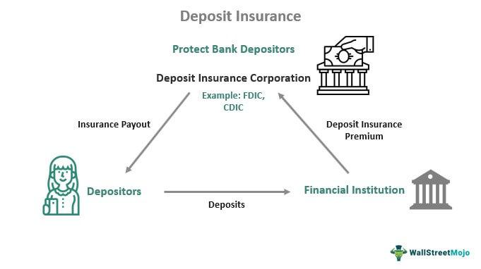

In today's dynamic financial landscape, safeguarding investments and savings holds paramount importance for individuals and institutions alike. The stability of the global financial system relies heavily on mechanisms that protect depositor interests and maintain confidence in banking institutions. One of the critical components ensuring this stability is the Deposit Insurance Fund (DIF), which plays a pivotal role in fostering trust among depositors.

The Deposit Insurance Fund provides a safety net for depositors by insuring deposits held in member banks. Managed by the Federal Deposit Insurance Corporation (FDIC) in the United States, the DIF acts as a bulwark against the loss of depositor funds in the event of a bank failure. Funded through insurance premiums paid by the banks and the interest earned on these premiums, the DIF ensures that even in periods of financial distress, depositors can rely on the safety of their insured deposits.

These financial protection mechanisms underpin the confidence that consumers and businesses place in banks as safe repositories for their funds. Such assurance is crucial, especially in an era characterized by rapid technological advances and evolving financial instruments. The landscape is further complicated by the advent of algorithmic trading, a practice that has revolutionized the way financial markets operate. Algorithmic trading employs complex algorithms to automate trading decisions, offering increased trading efficiency, reduced costs, and enhanced risk management capabilities.

As financial markets continue to evolve, both the Deposit Insurance Fund and algorithmic trading signify the changing paradigm of financial protection and market operations. Understanding the intricacies of these mechanisms is vital for stakeholders seeking to navigate the complexities of modern finance, ensuring both security in deposits and efficiency in trading activities.

## Table of Contents

## Understanding the Deposit Insurance Fund (DIF)

The Deposit Insurance Fund (DIF) plays a crucial role in maintaining financial stability and depositor confidence within the U.S. banking system. Managed by the Federal Deposit Insurance Corporation (FDIC), the DIF acts as a safety net for depositors in banks that are members of the FDIC. This fund ensures that, in the event of a bank failure, depositors can regain access to their insured deposits, up to a specified limit.

The DIF is primarily funded through insurance premiums paid by banks that are insured by the FDIC. These premiums are assessed based on the risk profile of the respective banks, with higher-risk institutions contributing more to the fund. In addition to these premiums, the DIF accumulates funds through interest earned on investments in U.S. Treasury securities. This diversification of funding sources helps maintain the DIF's solvency and its ability to cover insured deposits during financial downturns.

Key features of the DIF include the coverage limits and protections it offers to depositors. As of 2023, the standard insurance amount is $250,000 per depositor, per insured bank, for each account ownership category. This coverage limit applies to all types of deposits, including savings accounts, checking accounts, money market deposit accounts, and certificates of deposit (CDs). The guarantee provided by the DIF ensures that depositors have protection against potential financial institution failures.

In maintaining its reserves, the DIF aims to meet the Designated Reserve Ratio (DRR), a target reserve ratio set by the FDIC for the total fund balance relative to insured deposits. By aligning the DIF's balance with the DRR, the FDIC ensures that the fund has an adequate buffer to manage ordinary bank failures while maintaining depositor confidence.

Collectively, the DIF's funding mechanisms and protective features are structured to provide a robust safeguard for depositors, enhancing trust in the financial system and preventing potential panic in the event of bank failures. This system of deposit insurance is an essential component of the broader financial safety net within the United States, contributing to overall economic stability.

## Recent Reforms in Deposit Insurance

The Dodd-Frank Wall Street Reform and Consumer Protection Act, enacted in 2010, introduced significant reforms to the deposit insurance framework in the United States. One of its primary objectives was to fortify the financial system and prevent a recurrence of the financial crises that occurred in the late 2000s. This comprehensive legislation affected various aspects of financial regulation, including the Deposit Insurance Fund (DIF), which is crucial for maintaining depositor confidence in insured financial institutions.

A notable impact of the Dodd-Frank Act is the permanent increase in the standard maximum deposit insurance amount (SMDIA) from $100,000 to $250,000 per depositor, per insured bank, for each account ownership category. This measure was instrumental in reassuring depositors about the security of their assets. Additionally, the act abolished the requirement for the FDIC to pay dividends to insured institutions when the DIF reserve ratio exceeded a certain threshold, allowing the fund to build a larger reserve to better absorb potential losses.

Legislative changes have also influenced the DIF's strategy and operations by mandating the adoption of a risk-based assessment system for insured depositories. This approach ensures that the premiums paid by banks to the DIF are commensurate with their risk profiles, thus promoting a more stable banking environment. The introduction of these risk-based assessments seeks to deter risky behavior by financial institutions, addressing the moral hazard concerns that contributed to previous financial instabilities.

The evolution of the Designated Reserve Ratio (DRR) marks another crucial change brought about by the Dodd-Frank Act. The DRR, which is the target reserve ratio between the DIF balance and insured deposits, was set at a minimum of 1.35% as opposed to the previous 1.15%. This increase means that the FDIC must maintain a more robust capital buffer to safeguard against potential future losses. Banks are assessed fees to maintain this higher reserve level, and the failure to maintain it prompts increased assessment rates, ensuring the DIF remains adequately funded.

These legislative reforms and adjustments to the DIF underscored the importance of a resilient deposit insurance framework. By promoting a more risk-sensitive approach to assessment and increasing coverage limits, the Dodd-Frank Act has strengthened the role of deposit insurance in maintaining financial stability and protecting depositors. As the banking landscape continues to evolve, these reforms serve as a foundation for addressing future challenges that arise within the financial system.

## Bank Insurance Challenges and Solutions

Bank insurance is an essential mechanism for maintaining financial stability, yet it is not without its challenges. One significant issue is the moral hazard associated with bank insurance. Moral hazard occurs when banks take on excessive risk because they know they are protected by deposit insurance. This behavior can lead to financial instability, as banks may engage in risky lending practices or invest in high-risk assets, potentially leading to bank failures.

Balancing adequate coverage with managing moral risks is a complex task. Deposit insurance must provide enough coverage to protect depositors and maintain confidence in the banking system. However, overly generous insurance can encourage banks to take on excessive risks, knowing they are shielded from the consequences. Policymakers must balance these conflicting needs by setting reasonable coverage limits and employing risk-based insurance premiums. This approach ensures banks contributing more to risk pay higher premiums, incentivizing them to maintain prudent practices.

Future-proofing deposit insurance systems involves implementing best practices to withstand potential financial crises. Firstly, regular stress testing of banks can help assess their resilience to economic shocks. Secondly, ensuring that the Designated Reserve Ratio (DRR) is maintained at adequate levels provides a buffer to absorb potential losses. Legislation such as the Dodd-Frank Act has introduced reforms aimed at strengthening the regulatory framework, reducing systemic risks, and enhancing the resilience of the financial system.

Furthermore, ongoing monitoring and supervision are crucial to identify and mitigate emerging risks in the banking sector. Regulators should foster transparency and accountability by requiring banks to disclose risk exposures and maintain robust internal risk management protocols. Additionally, leveraging technological advancements such as data analytics and [machine learning](/wiki/machine-learning) can enhance risk assessment and monitoring capabilities, ensuring a more proactive approach to managing financial stability.

In summary, addressing the moral hazards of bank insurance requires a multifaceted approach that balances coverage with risk management. By implementing best practices and leveraging technology, deposit insurance systems can be fortified against future financial crises, safeguarding both depositors and the broader economy.

## Algorithmic Trading: Revolutionizing the Financial Sector

Algorithmic trading has fundamentally transformed the financial sector by introducing speed, precision, and the ability to process vast quantities of data in real time. By leveraging complex mathematical models and algorithms, modern trading strategies can execute decisions in milliseconds, far outpacing human capabilities.

One of the principal advantages of [algorithmic trading](/wiki/algorithmic-trading) is its ability to enhance market efficiency. Algorithms can quickly assess market conditions, identify [arbitrage](/wiki/arbitrage) opportunities, and execute trades with minimal delay. This efficiency reduces the bid-ask spread, leading to better pricing for investors. Furthermore, algorithms facilitate cost reduction by minimizing transaction costs such as brokerage fees and slippage, the latter of which occurs when there's a difference between the expected price of a trade and the price at which the trade is executed.

Risk management is another critical area where algorithms have proven invaluable. Automated trading systems can monitor multiple markets simultaneously and implement risk mitigation strategies dynamically. For example, algorithms can be programmed to execute stop-loss orders, which automatically sell an asset when it falls below a specified price, limiting potential losses. 

The integration of algorithmic trading with banking institutions introduces new regulatory challenges and opportunities. On one hand, the speed and complexity of algorithm-driven decisions necessitate rigorous oversight to prevent market manipulation and ensure fair trading practices. Regulations often require detailed audits of trading algorithms and provide frameworks to handle flash crashes, where markets can plummet due to rapid automated selling. On the other hand, algorithmic trading enhances market [liquidity](/wiki/liquidity-risk-premium) and can improve the price discovery process, benefiting both institutions and retail investors.

Algorithmic trading is a cornerstone of modern finance, offering significant advantages in terms of efficiency, cost, and risk management. However, it also demands robust regulatory frameworks to safeguard the integrity of financial markets, balancing innovation with the stability and transparency essential for a fair trading environment.

## The Future of Financial Protection and Trading

In exploring the trajectory of financial protection and trading, it is apparent that technological advancements will significantly influence the landscape of deposit insurance and bank protection mechanisms. Innovations such as blockchain, [artificial intelligence](/wiki/ai-artificial-intelligence), and machine learning are increasingly seen as pivotal tools for enhancing the efficiency, security, and transparency of financial systems. These technologies have the potential to streamline bank operations, improve fraud detection, and ensure compliance with regulatory standards, thus bolstering the overall stability of financial institutions.

Looking ahead, the integration of distributed ledger technology, exemplified by blockchain, may redefine the way deposit insurance is structured and administered. By providing a secure and immutable record of transactions, blockchain can reduce the risk of fraudulent activities and enhance the traceability of funds. Additionally, smart contracts—self-executing agreements with the terms directly written into code—can automate complex processes related to insurance claims and payments, reducing administrative costs and improving efficiency.

As technological developments continue to advance, implementing robust cybersecurity measures will be critical to protecting sensitive financial data and maintaining public trust. Financial institutions must prioritize investing in cutting-edge security technologies to safeguard against potential cyber threats, which are becoming increasingly sophisticated. This will not only protect depositors' assets but also reinforce confidence in the financial system as a whole.

Algorithmic trading is another transformative force in the future of financial protection and trading. By leveraging algorithms and quantitative models, financial firms can execute transactions at speeds and volumes that are unmanageable by human traders. Algorithmic trading enhances market liquidity, reduces transaction costs, and improves price discovery. However, the rise of algorithmic trading is not without risks. The potential for systemic disruptions, as exemplified by flash crashes, poses a significant challenge to regulators and market participants.

To mitigate these risks, it is essential to establish stringent regulatory frameworks that govern the use of algorithmic trading. This includes implementing safeguards such as circuit breakers, which temporarily halt trading in the event of excessive market [volatility](/wiki/volatility-trading-strategies), and requiring rigorous testing and validation of trading algorithms before deployment. Furthermore, close collaboration between regulators and financial institutions is necessary to create adaptive policies that balance innovation with stability.

Evaluating the rewards of algorithmic trading reveals significant benefits in terms of efficiency and market accessibility. By leveling the playing field, algorithmic trading can democratize access to financial markets, enabling a broader range of participants to engage in trading activities. This democratization, while beneficial, must be accompanied by comprehensive educational initiatives to ensure traders, both institutional and retail, understand the complexities and risks involved.

In conclusion, the future of financial protection and trading will be shaped by the dual forces of technological innovation and regulatory adaptation. As financial institutions harness the power of new technologies, they must also remain vigilant against emerging risks, ensuring that the evolution of deposit insurance and trading practices continues to align with the overarching goal of financial stability and protection for all stakeholders.

## Conclusion

In today's financial ecosystem, where stability is paramount, the Deposit Insurance Fund (DIF) serves as a pivotal mechanism in fostering depositor confidence. Ensuring that depositors are protected encourages trust in the banking system, thereby maintaining economic stability and preventing potential bank runs. As financial markets evolve, ongoing reforms in deposit insurance play an essential role in adapting to new challenges. The legislative frameworks governing deposit insurance undergo shifts to better align with contemporary market dynamics and risks, as evidenced by recent regulatory changes.

Simultaneously, advancements in algorithmic trading are revolutionizing the financial sector. Algorithms have enhanced trading efficiency, reduced transaction costs, and improved risk management practices. This technological evolution is integral to the future of financial systems, requiring both regulators and financial institutions to stay abreast of these changes. Ensuring that regulatory strategies are both robust and adaptable to technological advancements is crucial for maintaining market stability.

Furthermore, as algorithmic trading and deposit insurance mechanisms collectively shape the financial landscape, regulators and institutions must strike a balance between protection measures and market innovation. This balance will ensure that stakeholders are safeguarded against financial vicissitudes while allowing the market to benefit from technological progress.

In conclusion, to secure long-term stability and ensure the protection of all stakeholders, both the DIF and algorithmic trading systems must evolve together. Regulators, policymakers, and financial entities need to collaborate in adapting strategic frameworks and operational practices to anticipate future challenges. This proactive approach will ensure that financial protection systems remain resilient and efficient, safeguarding the integrity of financial markets globally.

## References & Further Reading

[1]: Federal Deposit Insurance Corporation. (n.d.). ["Deposit Insurance."](https://www.fdic.gov/)

[2]: Saunders, A., & Cornett, M. M. (2018). **Financial Institutions Management: A Risk Management Approach**. McGraw-Hill Education.

[3]: Lopez de Prado, M. (2018). ["Advances in Financial Machine Learning."](https://www.amazon.com/Advances-Financial-Machine-Learning-Marcos/dp/1119482089) John Wiley & Sons.

[4]: Aronson, D. R. (2006). ["Evidence-Based Technical Analysis: Applying the Scientific Method and Statistical Inference to Trading Signals."](https://www.amazon.com/Evidence-Based-Technical-Analysis-Scientific-Statistical/dp/0470008741) Wiley Trading.

[5]: Hull, J. C. (2018). **Options, Futures, and Other Derivatives**. Pearson.

[6]: Jarrow, R. A., & Protter, P. (2016). **Quantitative Finance and Risk Management: A Physicist's Guide to the Mathematics of Finance**. Springer.

[7]: Chan, E. P. (2009). ["Quantitative Trading: How to Build Your Own Algorithmic Trading Business."](https://github.com/ftvision/quant_trading_echan_book) John Wiley & Sons.

[8]: Jansen, S. (2020). ["Machine Learning for Algorithmic Trading."](https://github.com/stefan-jansen/machine-learning-for-trading) Packt Publishing.