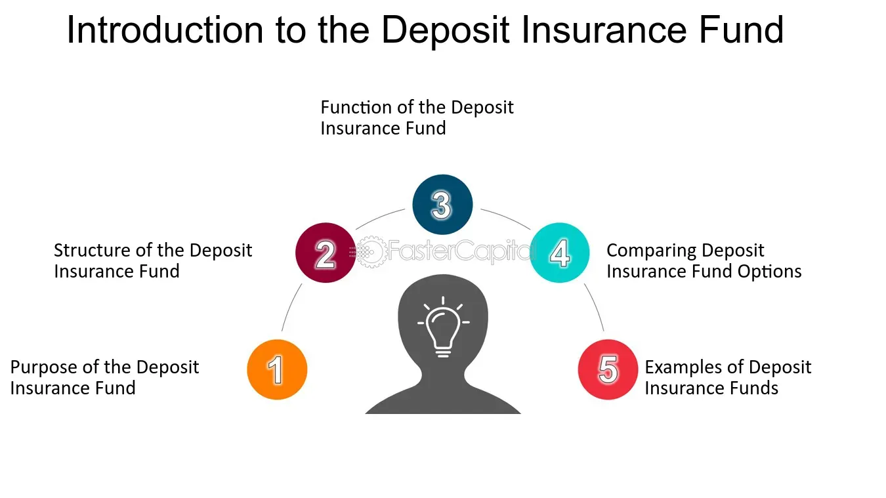

## Table of Contents

## What is a Deposit Insurance Fund?

A Deposit Insurance Fund is a special kind of money set aside by a country's government or a financial organization to protect people's bank deposits. If a bank fails and can't give people their money back, the Deposit Insurance Fund steps in to help. This way, people don't lose all their savings if their bank has problems. It makes people feel safer about keeping their money in banks.

The fund is usually paid for by the banks themselves. They contribute money to the fund regularly, based on how much money they hold in deposits. This system helps keep the banking system stable because it reduces the risk that people will panic and take all their money out of banks at once. By knowing their money is protected, people are more likely to trust banks and keep their money there.

## Why was the Deposit Insurance Fund established?

The Deposit Insurance Fund was set up to protect people's money in banks. Before it existed, if a bank failed, people could lose all their savings. This made people very worried about keeping their money in banks. The Deposit Insurance Fund helps solve this problem by promising to give people their money back if their bank fails. This makes people feel safer and more likely to trust banks with their money.

Another reason for the Deposit Insurance Fund is to keep the banking system stable. Without it, if people heard that a bank was in trouble, they might rush to take their money out. This could cause a "bank run," where everyone tries to get their money at once, which can make the bank fail even faster. The Deposit Insurance Fund helps prevent this by giving people confidence that their money is safe, even if their bank is having problems. This stability is good for the whole economy.

## How does the Deposit Insurance Fund protect depositors?

The Deposit Insurance Fund protects depositors by promising to give them their money back if their bank fails. If a bank goes out of business and can't return people's savings, the fund steps in and covers the losses up to a certain amount. This means that even if a bank fails, depositors won't lose all their money. They can get back a big part of what they had in the bank, which helps them feel more secure about saving money in banks.

This protection also helps keep the banking system stable. Without the Deposit Insurance Fund, people might panic and take all their money out of a bank if they hear it's in trouble. This can lead to a "bank run," where everyone rushes to get their money at the same time, which can make the bank fail even faster. The Deposit Insurance Fund stops this from happening by making people feel confident that their money is safe, no matter what happens to their bank. This stability is important for the whole economy.

## What types of deposits are covered by the Deposit Insurance Fund?

The Deposit Insurance Fund usually covers regular savings accounts and checking accounts where people keep their everyday money. This includes money in accounts that people can take out easily, like the money they use to pay bills or save for a short time. The fund helps make sure that if a bank fails, people can still get their money back from these accounts up to a certain limit.

Sometimes, the Deposit Insurance Fund also covers other types of accounts, like certificates of deposit (CDs), which are savings accounts that people agree to leave their money in for a set time. But, the fund does not cover money in investment accounts, like stocks or mutual funds, because those are riskier and not the same as regular savings. The exact types of deposits covered can be different in each country, so it's good to check with your bank or the government to know for sure what is protected.

## What is the maximum amount of deposit insurance provided by the fund?

The maximum amount of deposit insurance provided by the Deposit Insurance Fund can be different in each country. In the United States, for example, the Federal Deposit Insurance Corporation (FDIC) insures up to $250,000 per depositor, per insured bank, for each account ownership category. This means if you have different types of accounts at the same bank, like a savings account and a joint account, each might be insured up to $250,000.

In other countries, the maximum amount might be higher or lower. For instance, in Canada, the Canada Deposit Insurance Corporation (CDIC) insures eligible deposits up to $100,000 per depositor, per insured category. The goal is to make sure that most people's savings are safe, even if their bank fails. It's a good idea to check with your country's deposit insurance agency to find out the exact amount of coverage you have.

## How is the Deposit Insurance Fund financed?

The Deposit Insurance Fund is financed mainly by the banks themselves. Banks pay money into the fund regularly, based on how much money they hold in deposits. This means that the bigger a bank is, the more it has to contribute to the fund. This system makes sure that there is enough money in the fund to cover losses if a bank fails.

Sometimes, the government might also help finance the Deposit Insurance Fund. This can happen if there's a big financial crisis and the money from banks isn't enough to cover all the losses. The government can step in to make sure people still get their money back. This helps keep people's trust in the banking system and keeps the economy stable.

## What happens to depositors' money if a bank fails?

If a bank fails, depositors' money is protected by the Deposit Insurance Fund. This fund steps in to make sure people get their money back, up to a certain limit. For example, in the United States, if you have less than $250,000 in your account, you will get all of it back. If you have more, you might only get back up to that $250,000 limit.

The money from the Deposit Insurance Fund comes from the banks themselves. They pay into the fund regularly, so there's enough money to help if a bank fails. Sometimes, if there's a big problem and not enough money in the fund, the government might help out to make sure people don't lose their savings. This system helps keep people's trust in banks and keeps the economy stable.

## How does the Deposit Insurance Fund assess and manage risk?

The Deposit Insurance Fund assesses risk by looking at how healthy banks are. They check things like how much money the bank has, how much it owes, and how well it's doing with its loans. If a bank seems risky, the fund might ask it to pay more money into the fund. This helps make sure there's enough money to cover losses if the bank fails. The fund also keeps an eye on the economy to see if there are any big problems that might affect banks.

To manage risk, the Deposit Insurance Fund sets rules for banks to follow. These rules help make sure banks are safe and don't take too many risks. The fund also has plans in place for what to do if a bank does fail. They work quickly to pay back depositors and might even help find another bank to take over the failed one. This helps keep people's trust in the banking system and stops problems from spreading to other banks.

## What role does the Deposit Insurance Fund play in maintaining financial stability?

The Deposit Insurance Fund helps keep the financial system stable by making sure people's money is safe if a bank fails. When people know their money is protected, they feel more confident about keeping it in banks. This stops them from panicking and trying to take all their money out at once, which can cause a "bank run" and make the bank fail even faster. By preventing bank runs, the Deposit Insurance Fund helps keep banks strong and the whole economy stable.

The fund also keeps an eye on banks to make sure they are not taking too many risks. It checks how healthy banks are and might ask risky banks to pay more into the fund. This helps make sure there's enough money to cover any losses if a bank does fail. The Deposit Insurance Fund also has plans ready to quickly pay back depositors and find another bank to take over a failed one. This quick action helps stop problems from spreading and keeps people trusting the banking system.

## How does the Deposit Insurance Fund interact with regulatory bodies?

The Deposit Insurance Fund works closely with regulatory bodies to keep banks safe and the financial system stable. Regulatory bodies are the ones who make rules for banks and watch to make sure they follow them. The Deposit Insurance Fund shares information with these bodies about how healthy banks are and any risks they see. This helps the regulators know which banks might need more watching or help.

When a bank is in trouble, the Deposit Insurance Fund and regulatory bodies work together to figure out the best way to handle it. They might decide to close the bank, help it get better, or find another bank to take over. The goal is to make sure people don't lose their money and to stop problems from spreading to other banks. By working together, the Deposit Insurance Fund and regulatory bodies help keep the whole banking system strong and trustworthy.

## What are the historical changes and developments in the Deposit Insurance Fund?

The idea of deposit insurance started a long time ago, but it became really important during the Great Depression in the 1930s. In the United States, the Federal Deposit Insurance Corporation (FDIC) was created in 1933 because many banks were failing and people were losing their savings. The FDIC was set up to protect people's money in banks up to a certain amount. Over the years, the amount of money protected has changed. It started at $2,500 and has gone up to $250,000 today. This change was made to keep up with inflation and to make sure more of people's money is safe.

As time went on, other countries started their own deposit insurance systems. Each country made its own rules about how much money to protect and how the fund would work. Some countries, like Canada, set up their systems later, with the Canada Deposit Insurance Corporation (CDIC) starting in 1967. These systems have also changed over time to better protect people's savings and to keep the banking system stable. The funds have gotten better at watching banks and managing risks, and they work more closely with other parts of the government to make sure banks stay safe.

## How does the Deposit Insurance Fund compare to similar funds in other countries?

The Deposit Insurance Fund in the United States, known as the FDIC, is one of the oldest and most well-known systems. It was set up in 1933 and covers up to $250,000 per depositor, per insured bank, for each account ownership category. This high limit helps make sure most people's savings are safe if a bank fails. The FDIC gets its money from the banks, which pay into the fund based on how much money they hold in deposits. This system is very strong and has helped keep the U.S. banking system stable for many years.

In other countries, deposit insurance systems can be different. For example, in Canada, the Canada Deposit Insurance Corporation (CDIC) was set up in 1967 and covers up to $100,000 per depositor, per insured category. This is a lower limit than in the U.S., but it still helps protect people's money. Like the FDIC, the CDIC is also paid for by the banks. In Europe, each country has its own system, but the European Union has rules to make sure all these systems work well together. The amounts covered and how the funds work can vary, but the main goal is the same everywhere: to protect people's savings and keep banks stable.

## References & Further Reading

[1]: Federal Deposit Insurance Corporation. (n.d.). ["Deposit Insurance."](https://www.fdic.gov/)

[2]: Saunders, A., & Cornett, M. M. (2018). **Financial Institutions Management: A Risk Management Approach**. McGraw-Hill Education.

[3]: Lopez de Prado, M. (2018). ["Advances in Financial Machine Learning."](https://www.amazon.com/Advances-Financial-Machine-Learning-Marcos/dp/1119482089) John Wiley & Sons.

[4]: Aronson, D. R. (2006). ["Evidence-Based Technical Analysis: Applying the Scientific Method and Statistical Inference to Trading Signals."](https://www.amazon.com/Evidence-Based-Technical-Analysis-Scientific-Statistical/dp/0470008741) Wiley Trading.

[5]: Hull, J. C. (2018). **Options, Futures, and Other Derivatives**. Pearson.

[6]: Jarrow, R. A., & Protter, P. (2016). **Quantitative Finance and Risk Management: A Physicist's Guide to the Mathematics of Finance**. Springer.

[7]: Chan, E. P. (2009). ["Quantitative Trading: How to Build Your Own Algorithmic Trading Business."](https://github.com/ftvision/quant_trading_echan_book) John Wiley & Sons.

[8]: Jansen, S. (2020). ["Machine Learning for Algorithmic Trading."](https://github.com/stefan-jansen/machine-learning-for-trading) Packt Publishing.