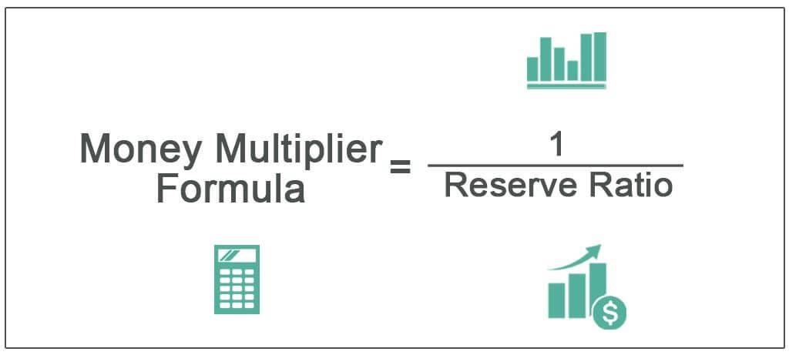

In the dynamic world of finance and trading, understanding key concepts such as the money multiplier, deposit multiplier, and algorithmic trading is essential for grasping the complexities of the financial ecosystem. These concepts are fundamental to comprehending how money creation, banking operations, and technological advancements in trading strategies interact and shape modern economies.

The money multiplier and deposit multiplier are macroeconomic tools that demonstrate how money circulates and expands within the banking system. They are crucial in illustrating how banks influence the money supply through the lending process facilitated by the fractional reserve banking system. This, in turn, impacts economic stability and guides monetary policy development. The money multiplier measures the overall economic effects of banking activities, whereas the deposit multiplier focuses on the operational aspects within banks.



Algorithmic trading, on the other hand, signifies a technological revolution in investment strategies. Leveraging computer programs to execute trades rapidly based on predefined criteria enhances efficiency and precision. This technical prowess allows for more sophisticated risk management and decision-making processes. Understanding the connections between financial multipliers and algorithmic trading can unlock strategic insights that are indispensable for navigating liquidity and capital flow shifts in volatile markets.

This article explores the roles and intersections of these concepts within the broader financial ecosystem, acknowledging their importance in banking, macroeconomics, and trading. Recognizing their implications offers traders and financial analysts a framework for developing effective strategies that adapt to the evolving financial landscape. As the financial systems continue to progress, grasping these foundational concepts becomes vital for achieving optimal outcomes and maintaining a competitive edge in fast-paced markets.

## Table of Contents

## Understanding the Money Multiplier

The money multiplier is a fundamental macroeconomic concept that describes the process by which the banking system amplifies new deposits to increase the overall money supply. This concept is closely tied to the structure of the fractional reserve banking system, where banks are required to keep only a fraction of their deposits as reserves, allowing them to lend out the remainder. This ability to lend enhances the money creation process, which is a critical component of monetary policy and economic stability.

In the fractional reserve banking system, when a bank receives a deposit, it is required to hold a certain percentage of that deposit as reserves. The reserve requirement is set by the central bank and influences the proportion of funds that can be loaned out. If the reserve requirement is 10%, for example, and a customer deposits $1,000 into the bank, the bank must retain $100 as reserves and can lend out the remaining $900. This loaned amount can subsequently be deposited into another bank, allowing the process to repeat itself indefinitely through the banking system.

The money multiplier effect can be mathematically represented by the formula:

$$
\text{Money Multiplier} = \frac{1}{\text{Reserve Requirement Ratio}}
$$

Using the previous example with a 10% reserve requirement, the money multiplier is calculated as:

$$
\text{Money Multiplier} = \frac{1}{0.10} = 10
$$

This indicates that the total potential increase in the money supply is up to ten times the initial deposit. The money created through this process does not involve the physical printing of new currency but rather an increase in the money available within the economy via lending activities.

The implications of the money multiplier are significant for monetary policy. By adjusting reserve requirements or using open market operations, central banks can influence the money supply. A lower reserve requirement leads to a higher money multiplier, thereby boosting economic activity by increasing the amount of money available for lending and spending. Conversely, increasing the reserve requirement reduces the multiplier, restricting the money supply and slowing economic growth. 

Understanding this concept is crucial, as it highlights how variations in banking practices and regulatory frameworks can markedly affect economic stability and growth. Central banks monitor these dynamics continually, adjusting policy levers to maintain equilibrium within the economy.

## Exploring the Deposit Multiplier

The deposit multiplier, frequently termed the deposit expansion multiplier, is a critical concept in the banking and financial industry. It represents the potential increase in money supply arising from an initial deposit, governed by the reserve requirements stipulated by central banks. These reserve requirements dictate the proportion of deposits a bank must retain as reserves, either in its vault or with the central bank, as opposed to lending out. 

The process begins when an account holder deposits money into a bank. The bank retains a fraction of this deposit as required reserves and lends out the rest. This loan subsequently becomes a deposit in another bank, which also retains a portion and lends out the remainder. This cycle continues, amplifying the initial deposit throughout the banking system—a phenomenon captured mathematically by the deposit multiplier. The formula for the deposit multiplier $(\frac{1}{R})$ depends inversely on the reserve ratio $R$ set by the central bank.

For banks, mastering the deposit multiplier is essential to effectively manage their [liquidity](/wiki/liquidity-risk-premium) and appropriately address the demand for loans. By understanding the potential money supply generated from initial deposits, banks can strategize how much to lend versus how much to hold in reserves, ensuring they meet reserve requirements while maximizing their ability to extend credit.

Moreover, banks use this knowledge to fine-tune their balance sheets, adjust interest offerings, and align with regulatory requirements. Ultimately, the deposit multiplier is a crucial component of the banking system, reflecting how regulatory policies translate into real-world impacts on money supply and credit availability. Understanding this concept is vital for banks to optimize their reserve management and lending strategies, ensuring financial stability and operational efficiency.

## Difference Between Money Multiplier and Deposit Multiplier

The money multiplier and the deposit multiplier are both integral to understanding money creation within an economy, but they operate on different levels and serve distinct functions.

The deposit multiplier, often referred to as the deposit expansion multiplier, deals primarily with banking operations. It describes how an initial deposit can lead to a larger increase in total deposits across the banking system, driven by the reserve requirements dictated by central banks. In a fractional reserve banking system, banks keep a fraction of deposits as reserves and lend out the rest, creating new deposits in the process. Mathematically, if `r` is the reserve ratio, the deposit multiplier can be calculated as $\text{Deposit Multiplier} = \frac{1}{r}$. This multiplier guides banks in managing their liquidity and preparing for loans while adhering to liquidity requirements.

On the other hand, the money multiplier encompasses broader economic effects and reflects how an initial amount of base money from the central bank results in an amplified increase in the overall money supply. It considers not just the banking operations but the additional factors that influence money supply, such as excess reserves held by banks and the currency held by the public. The money multiplier is typically less than what the simple deposit multiplier suggests due to these factors. The mathematical representation of the money multiplier can be expressed similarly to the deposit multiplier but considers additional influences from the public's currency preferences and banks’ reserve choices.

In practice, variations occur between these multipliers because factors like excess reserves, personal financial behavior, and economic conditions diverge. For example, during economic uncertainty, banks might hold excess reserves beyond required reserves, reducing the effective money multiplier. Similarly, if the public prefers holding cash instead of depositing it, the overall money supply expansion would be less pronounced.

Understanding the differences between these multipliers is crucial for analyzing monetary supply dynamics. Policymakers and economists observe these multipliers to forecast economic conditions and devise monetary policies. Traders, particularly those involved in [algorithmic trading](/wiki/algorithmic-trading), assess these variations to predict liquidity changes and adjust their strategies accordingly.

## Algorithmic Trading: Overview

Algorithmic trading, often referred to as algo trading, employs computer programs to automate the execution of trading orders, based on predefined datasets and calculations. These programs are designed to follow specific trading strategies, making decisions at speeds and accuracies that are far superior to human capabilities. This technological approach allows traders to capitalize on small price discrepancies with greater efficiency, often executing multiple trades within seconds.

Algo trading integrates smoothly into financial markets due to its capability to process vast amounts of data in real time. By leveraging advanced algorithms, these systems can analyze market conditions, historical data, and price charts to determine optimal trading opportunities. Such precision in decision-making is achieved through a combination of statistical and mathematical models, which are continuously refined to enhance performance.

One of the key advantages of algorithmic trading is the minimization of human error and the removal of emotional factors from trading decisions. This characteristic is crucial in executing large volumes of trades that require instant processing and exact price points to maximize profitability. Moreover, algo trading ensures that trades are executed at the best possible prices, reducing transaction costs and enhancing overall market liquidity.

The implications of algorithmic advancements for modern financial strategies are profound. By incorporating high-frequency trading ([HFT](/wiki/high-frequency-trading-strategies)) and predictive analytics, traders can efficiently manage their portfolios and hedge against potential risks. Algorithmic systems can quickly adjust to market fluctuations, offering a dynamic approach to investment strategies.

Algorithmic trading also opens the doors to quantitative investing, where portfolios are maintained based on quantitative analysis rather than traditional methods. This approach harnesses the power of big data, [machine learning](/wiki/machine-learning), and predictive modeling, offering insights that are continually updated with real-time data. As a result, financial strategies become increasingly data-driven, allowing for more informed decision-making in ever-evolving markets.

In conclusion, algorithmic trading represents a significant shift in the landscape of financial trading by enhancing speed, accuracy, and efficiency. Its ability to integrate with real-time data feeds and automate complex trading strategies makes it indispensable for modern traders looking to optimize their market presence and performance.

## Leveraging Multipliers in Algo Trading

Understanding both the deposit and money multipliers offers algorithmic traders a powerful tool for anticipating market liquidity and capital flow shifts. The core idea behind utilizing these multipliers in algo trading is grounded in their ability to predict potential changes in the money supply, which subsequently affect financial market conditions.

Algorithmic traders can use multiplier analysis to optimize their trading strategies. For example, by comprehensively analyzing the money multiplier formula, which can be expressed as:

$$
M = \frac{1}{R}
$$

where $M$ is the money multiplier and $R$ is the reserve ratio set by the central bank, traders can predict how changes in reserve requirements might affect money supply. This prediction can be incorporated into trading algorithms to anticipate potential liquidity changes.

In Python, an algorithmic trader might utilize such insights as follows:

```python
def calculate_money_multiplier(reserve_ratio):
    return 1 / reserve_ratio

reserve_ratio = 0.1 # example reserve ratio (10%)
money_multiplier = calculate_money_multiplier(reserve_ratio)

# Use calculated money multiplier to adjust trading strategy
```

Through multiplier analysis, algorithmic traders can better gauge market liquidity by understanding how central banks' policies on reserve requirements influence deposit expansion. This understanding helps traders refine risk management techniques by adjusting their algorithms to account for potential shifts in capital flow. For example, increased reserves by banks might indicate lower liquidity risk, prompting a strategy focused on leveraging high-[volume](/wiki/volume-trading-strategy) trades.

Moreover, the insights gained from deposit multiplier trends can guide allocations and entry/[exit](/wiki/exit-strategy) times for trades, optimizing performance by aligning trading strategies with real-time financial market dynamics. Such strategies often involve statistical models and machine learning techniques, allowing algorithms to predict and adapt to market conditions swiftly and efficiently, hence enhancing overall trading efficacy. 

In this rapidly evolving landscape, using multiplier insights to adapt algorithmic trading models not only refines execution but also fosters robust risk management, offering traders an edge in maximizing market opportunities.

## The Role of Central Banks

Central banks significantly influence the operational landscape of money and deposit multipliers through their monetary policy frameworks. By regulating reserve requirements, central banks control how much money commercial banks must hold in reserve versus what they can lend. This regulation is critical in determining the extent of money creation within an economy, as it directly affects the money multiplier effect.

### Monetary Policy Tools

One of the primary tools employed by central banks is the adjustment of reserve requirements. When central banks increase reserve requirements, banks retain a higher percentage of deposits, reducing their lending capacity. This contraction in the lending potential decreases the money multiplier, limiting money supply expansion. Conversely, lowering reserve requirements enables banks to lend more, thus amplifying the money multiplier and potentially increasing the money supply.

For example, if the required reserve ratio is $10\%$, the money multiplier ($M_m$) can be calculated using the formula:

$$
M_m = \frac{1}{\text{Reserve Requirement}} = \frac{1}{0.10} = 10
$$

This implies that for every unit of currency deposited, the banking system can magnify the money supply by up to 10 times, assuming full utilization of the lending capacity without any excess reserves.

### Impact on Economic Environment

Through these policies, central banks strive to ensure economic stability. In periods of inflation, increasing reserve requirements can help temper spending and borrowing, reducing inflationary pressures. In contrast, during economic downturns, reducing reserve requirements can stimulate lending and investment, aiding economic recovery.

### Observations by Traders and Financial Analysts

Traders and financial analysts closely monitor central banks' policy adjustments to tailor their financial strategies. Changes in reserve requirements and other monetary policies can significantly impact market liquidity and interest rates, affecting asset prices and investment returns. Algorithmic trading professionals can incorporate these variables into their trading models to anticipate market shifts more accurately and develop risk management strategies that align with central bank policies.

Understanding these policies enables traders to make informed predictions about how central bank actions might influence market liquidity and capital flows, essential for optimizing decision-making processes in fast-paced financial markets.

## Conclusion

Grasping the nuances of money multipliers, deposit multipliers, and algorithmic trading is critical in navigating today's fast-paced financial markets. The money multiplier reflects how new deposits can be amplified within the banking system, influencing the overall money supply and economic conditions. Similarly, the deposit multiplier offers insights into a bank's capacity to create money based on reserve requirements imposed by central banks. Understanding the differences and interconnections between these multipliers enables traders and financial analysts to better forecast changes in liquidity and money supply.

Algorithmic trading leverages these economic insights to enhance trading strategies. By employing predefined criteria, algo trading systems optimize speed and precision, remaining responsive to shifts in economic conditions driven by changes in the money supply metrics. The integration of algorithmic trading with multiplier analysis not only improves market-driven decision-making but also facilitates more robust risk management.

As financial systems continue to evolve, encapsulating complex interactions between economic factors and technological advancements, continual learning and adaptation become crucial. This adaptability allows traders and financial institutions to harness these fundamental concepts, optimizing outcomes amid ever-changing market dynamics. With such knowledge, stakeholders can confidently approach economic shifts, deploying effective strategies tailored to new financial challenges.

## References & Further Reading

[1]: Mishkin, F. S. (2019). ["The Economics of Money, Banking, and Financial Markets"](https://www.pearsonhighered.com/assets/preface/0/1/3/4/0134855388.pdf) (12th Edition). Pearson.

[2]: Freixas, X., & Rochet, J.-C. (2008). ["Microeconomics of Banking"](https://mitpress.mit.edu/9780262062701/microeconomics-of-banking/) (2nd Edition). MIT Press.

[3]: Lopez de Prado, M. (2018). ["Advances in Financial Machine Learning"](https://www.amazon.com/Advances-Financial-Machine-Learning-Marcos/dp/1119482089). Wiley.

[4]: Chan, E. P. (2009). ["Quantitative Trading: How to Build Your Own Algorithmic Trading Business"](https://github.com/ftvision/quant_trading_echan_book). Wiley.

[5]: Murphy, R. (2017). ["Machine Learning: Financial Applications"](https://www.sciencedirect.com/science/article/pii/S0957417423001410).

[6]: McCauley, R. N., & McGuire, P. (2009). The financial crisis and the dollar funding of global banks. BIS Quarterly Review, March. [Link](https://www.bis.org/publ/qtrpdf/r_qt0912i.pdf)

[7]: Hull, J. C. (2017). ["Options, Futures, and Other Derivatives"](https://www.semanticscholar.org/paper/Options%2C-Futures%2C-and-Other-Derivatives-Hull/89bdee500c8623864fc9eb7a471546aa713acc44) (10th Edition). Pearson.