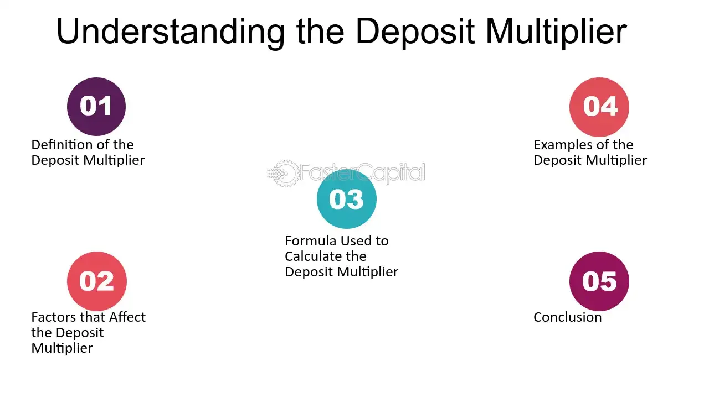

## Table of Contents

## What is the deposit multiplier?

The deposit multiplier is a way to figure out how much money banks can create from an initial deposit. It's based on the reserve requirement, which is the amount of money banks must keep on hand. If the reserve requirement is 10%, that means for every $100 deposited, the bank must keep $10 and can lend out $90. The deposit multiplier helps us see how this lending can lead to more deposits and more lending, creating a bigger money supply.

When a bank lends out the $90, that money might be deposited into another bank. This second bank then keeps 10% ($9) and can lend out the remaining $81. This process keeps going, with each new deposit leading to more loans and more deposits. The deposit multiplier formula is 1 divided by the reserve requirement. So, if the reserve requirement is 10%, the multiplier is 1/0.10 = 10. This means the original $100 deposit could lead to a total of $1,000 in the money supply.

## What is the money multiplier?

The money multiplier is a number that shows how much the money supply can grow from a single deposit. It's based on the idea that banks don't keep all the money people deposit. Instead, they keep a small part, called the reserve, and lend out the rest. The money multiplier helps us understand how these loans can turn into new deposits at other banks, which then get loaned out again, making the money supply bigger.

Imagine you deposit $100 in a bank, and the bank has to keep 10% of it, which is $10. The bank can lend out the other $90. When someone borrows that $90 and spends it, it might end up in another bank as a new deposit. This new bank keeps 10% of the $90, which is $9, and can lend out the remaining $81. This process keeps going, with each new deposit leading to more loans and more deposits. The money multiplier is calculated by dividing 1 by the reserve requirement. So, if the reserve requirement is 10%, the money multiplier is 1/0.10 = 10. This means the original $100 deposit could lead to a total of $1,000 in the money supply.

## How does the deposit multiplier work in banking?

The deposit multiplier is a way to see how banks can create more money from the money people put in them. Imagine you put $100 in a bank. The bank has to keep a little bit of that money, say 10%, which is $10. This $10 is called the reserve. The bank can lend out the rest, which is $90. When someone borrows that $90 and spends it, it might end up in another bank as a new deposit. This new bank also keeps 10% of the $90, which is $9, and lends out the rest, which is $81. This keeps happening, with each new deposit leading to more loans and more deposits.

The deposit multiplier helps us figure out how much bigger the money supply can get from one deposit. It's calculated by dividing 1 by the reserve requirement. If the reserve requirement is 10%, the deposit multiplier is 1/0.10 = 10. This means that the original $100 deposit could lead to a total of $1,000 in the money supply. So, even though you only put in $100, the banks can turn it into much more money through this process of lending and depositing.

## How is the money multiplier calculated?

The money multiplier is a number that shows how much the money supply can grow from a single deposit. It's all about how banks use the money people put in them. When you deposit money in a bank, the bank doesn't keep all of it. They have to keep a small part, called the reserve, and they can lend out the rest. The reserve is a percentage set by the central bank, like 10% or 20%.

To calculate the money multiplier, you divide 1 by the reserve requirement. For example, if the reserve requirement is 10%, you do 1 divided by 0.10, which equals 10. This means that if you put $100 in the bank, the total money supply could grow to $1,000 because of the way banks lend out the money and it gets deposited again and again. It's a simple but powerful way to see how banks can create more money from the money they get.

## What is the difference between the deposit multiplier and the money multiplier?

The deposit multiplier and the money multiplier are similar ideas that help us understand how banks can create more money from the money people deposit. Both multipliers are based on the fact that banks don't keep all the money they get. Instead, they keep a small part, called the reserve, and lend out the rest. The reserve is a percentage set by the central bank, like 10% or 20%. Both multipliers are calculated by dividing 1 by the reserve requirement. If the reserve requirement is 10%, both the deposit multiplier and the money multiplier would be 10.

The main difference between the two is in what they focus on. The deposit multiplier looks at how much new money can be created from a single deposit through the process of lending and re-depositing. It shows how one deposit can lead to more deposits and more lending, making the money supply bigger. On the other hand, the money multiplier looks at the overall effect on the money supply from all deposits and lending activities. It's a broader concept that considers how the whole banking system can expand the money supply. So, while they are calculated the same way, the deposit multiplier focuses on the process starting from one deposit, and the money multiplier looks at the bigger picture of the entire money supply.

## What role does the reserve requirement play in the money multiplier?

The reserve requirement is a rule set by the central bank that tells banks how much money they need to keep in their vaults or at the central bank. This amount is a percentage of the money people deposit. For example, if the reserve requirement is 10%, then for every $100 someone puts in the bank, the bank has to keep $10 and can lend out the other $90. The reserve requirement is really important because it affects how much money banks can create from the money they get.

The money multiplier is a number that shows how much the money supply can grow from a single deposit. It's calculated by dividing 1 by the reserve requirement. So, if the reserve requirement is 10%, the money multiplier is 10. This means that if someone puts $100 in the bank, the total money supply could grow to $1,000 because of the way banks lend out the money and it gets deposited again and again. The lower the reserve requirement, the higher the money multiplier, which means more money can be created from the same deposit.

## How do banks use the deposit multiplier to create money?

When you put money in a bank, the bank doesn't keep all of it. They have to keep a small part, called the reserve, and they can lend out the rest. The reserve is a percentage set by the central bank, like 10% or 20%. If the reserve requirement is 10%, and you put $100 in the bank, they keep $10 and can lend out $90. This is where the deposit multiplier comes in. It helps us see how much more money can be created from your $100 deposit.

When the bank lends out the $90, that money might be spent and end up in another bank as a new deposit. This new bank also keeps 10% of the $90, which is $9, and lends out the rest, which is $81. This process keeps going, with each new deposit leading to more loans and more deposits. The deposit multiplier is calculated by dividing 1 by the reserve requirement. So, if the reserve requirement is 10%, the deposit multiplier is 10. This means that your original $100 deposit could lead to a total of $1,000 in the money supply. That's how banks use the deposit multiplier to create more money from the money people put in them.

## What are the limitations of the money multiplier model?

The money multiplier model is a simple way to see how banks can create more money from the money people put in them. But it has some problems. One big problem is that it assumes all the money that banks lend out will come back to them as new deposits. In real life, this doesn't always happen. People might keep the money they borrow, or they might spend it in ways that don't lead to new deposits in banks. Also, the model doesn't think about how people might want to keep more cash instead of putting it in banks, which can change how much money banks can lend out.

Another problem with the money multiplier model is that it doesn't take into account the behavior of banks. Banks might decide to keep more money than the reserve requirement says they have to. They might do this because they think it's safer or because they expect more people to take their money out. This means they won't lend out as much money as the model says they will. Also, the model doesn't think about how the central bank might change the reserve requirement or other rules, which can affect how much money banks can create. So, while the money multiplier model is helpful for understanding the basics, it doesn't always match up with what happens in the real world.

## How has the concept of the money multiplier evolved over time?

The idea of the money multiplier started a long time ago when people began to understand how banks work. Back then, banks would take in money from people and keep some of it safe, while lending out the rest. This led to the realization that one deposit could turn into more money if it kept being lent out and deposited again. The money multiplier was a way to show how much bigger the money supply could get from just one deposit. At first, it was a simple idea that helped people see how banks could create money.

Over time, the concept of the money multiplier got more complicated as people learned more about how banks and the economy work. Economists found out that the money multiplier doesn't always work the way the simple model says it should. Things like people wanting to keep more cash, banks deciding to hold onto more money than they have to, and changes in rules from the central bank can all affect how much money banks can create. So, while the money multiplier is still a helpful way to understand the basics of banking, it's now seen as just one part of a bigger picture that includes many other factors.

## Can you explain the impact of quantitative easing on the money multiplier?

Quantitative easing, or QE, is when a central bank, like the Federal Reserve, buys a lot of bonds and other financial stuff to put more money into the economy. When they do this, it can change how the money multiplier works. The money multiplier is a number that shows how much bigger the money supply can get from one deposit. With QE, the central bank is adding more money to the system, which can make the money multiplier go up because there's more money for banks to lend out.

But, it's not always that simple. When the central bank does QE, it can also make banks and people act differently. Banks might decide to keep more money instead of lending it out because they feel safer that way. People might also want to keep more cash instead of putting it in banks. So, even though there's more money in the system, the money multiplier might not go up as much as you'd think. It all depends on how banks and people react to the extra money from QE.

## What are the criticisms of the deposit multiplier theory in modern economics?

The deposit multiplier theory is a simple way to explain how banks create money from the money people put in them. But some people in modern economics think it's too simple and doesn't match up with how things really work. One big criticism is that it assumes all the money banks lend out will come back to them as new deposits. In real life, this doesn't always happen. People might keep the money they borrow, or they might spend it in ways that don't lead to new deposits in banks. Also, the theory doesn't think about how people might want to keep more cash instead of putting it in banks, which can change how much money banks can lend out.

Another criticism is that the deposit multiplier theory doesn't take into account the behavior of banks. Banks might decide to keep more money than the reserve requirement says they have to. They might do this because they think it's safer or because they expect more people to take their money out. This means they won't lend out as much money as the theory says they will. Also, the theory doesn't think about how the central bank might change the reserve requirement or other rules, which can affect how much money banks can create. So, while the deposit multiplier theory is helpful for understanding the basics, it doesn't always match up with what happens in the real world.

## How do changes in monetary policy affect the effectiveness of the deposit and money multipliers?

When the central bank changes its monetary policy, it can affect how well the deposit and money multipliers work. The deposit multiplier shows how much new money banks can make from one deposit, and the money multiplier shows how much the whole money supply can grow. If the central bank lowers the reserve requirement, which is the amount of money banks have to keep, it makes the multipliers bigger. This means banks can lend out more money, which can lead to more deposits and a bigger money supply. But if the central bank raises the reserve requirement, the multipliers get smaller because banks have to keep more money and can lend out less.

Changes in monetary policy can also affect how banks and people act, which can change the effectiveness of the multipliers. For example, if the central bank does something like quantitative easing, where it puts more money into the economy, banks might feel safer and decide to lend out more money. This could make the multipliers work better. But if people start keeping more cash instead of putting it in banks, or if banks decide to keep more money than they have to, the multipliers might not work as well. So, the effectiveness of the deposit and money multipliers depends a lot on what the central bank does and how banks and people react to those changes.

## What is the Money Multiplier and How Does it Work?

The money multiplier is a fundamental macroeconomic concept that describes the process by which the banking system amplifies new deposits to increase the overall money supply. This concept is closely tied to the structure of the fractional reserve banking system, where banks are required to keep only a fraction of their deposits as reserves, allowing them to lend out the remainder. This ability to lend enhances the money creation process, which is a critical component of monetary policy and economic stability.

In the fractional reserve banking system, when a bank receives a deposit, it is required to hold a certain percentage of that deposit as reserves. The reserve requirement is set by the central bank and influences the proportion of funds that can be loaned out. If the reserve requirement is 10%, for example, and a customer deposits $1,000 into the bank, the bank must retain $100 as reserves and can lend out the remaining $900. This loaned amount can subsequently be deposited into another bank, allowing the process to repeat itself indefinitely through the banking system.

The money multiplier effect can be mathematically represented by the formula:

$$
\text{Money Multiplier} = \frac{1}{\text{Reserve Requirement Ratio}}
$$

Using the previous example with a 10% reserve requirement, the money multiplier is calculated as:

$$
\text{Money Multiplier} = \frac{1}{0.10} = 10
$$

This indicates that the total potential increase in the money supply is up to ten times the initial deposit. The money created through this process does not involve the physical printing of new currency but rather an increase in the money available within the economy via lending activities.

The implications of the money multiplier are significant for monetary policy. By adjusting reserve requirements or using open market operations, central banks can influence the money supply. A lower reserve requirement leads to a higher money multiplier, thereby boosting economic activity by increasing the amount of money available for lending and spending. Conversely, increasing the reserve requirement reduces the multiplier, restricting the money supply and slowing economic growth. 

Understanding this concept is crucial, as it highlights how variations in banking practices and regulatory frameworks can markedly affect economic stability and growth. Central banks monitor these dynamics continually, adjusting policy levers to maintain equilibrium within the economy.

## How can you leverage multipliers in algo trading?

Understanding both the deposit and money multipliers offers algorithmic traders a powerful tool for anticipating market [liquidity](/wiki/liquidity-risk-premium) and capital flow shifts. The core idea behind utilizing these multipliers in algo trading is grounded in their ability to predict potential changes in the money supply, which subsequently affect financial market conditions.

Algorithmic traders can use multiplier analysis to optimize their trading strategies. For example, by comprehensively analyzing the money multiplier formula, which can be expressed as:

$$
M = \frac{1}{R}
$$

where $M$ is the money multiplier and $R$ is the reserve ratio set by the central bank, traders can predict how changes in reserve requirements might affect money supply. This prediction can be incorporated into trading algorithms to anticipate potential liquidity changes.

In Python, an algorithmic trader might utilize such insights as follows:

```python
def calculate_money_multiplier(reserve_ratio):
    return 1 / reserve_ratio

reserve_ratio = 0.1 # example reserve ratio (10%)
money_multiplier = calculate_money_multiplier(reserve_ratio)

# Use calculated money multiplier to adjust trading strategy
```

Through multiplier analysis, algorithmic traders can better gauge market liquidity by understanding how central banks' policies on reserve requirements influence deposit expansion. This understanding helps traders refine risk management techniques by adjusting their algorithms to account for potential shifts in capital flow. For example, increased reserves by banks might indicate lower liquidity risk, prompting a strategy focused on leveraging high-[volume](/wiki/volume-trading-strategy) trades.

Moreover, the insights gained from deposit multiplier trends can guide allocations and entry/[exit](/wiki/exit-strategy) times for trades, optimizing performance by aligning trading strategies with real-time financial market dynamics. Such strategies often involve statistical models and [machine learning](/wiki/machine-learning) techniques, allowing algorithms to predict and adapt to market conditions swiftly and efficiently, hence enhancing overall trading efficacy. 

In this rapidly evolving landscape, using multiplier insights to adapt [algorithmic trading](/wiki/algorithmic-trading) models not only refines execution but also fosters robust risk management, offering traders an edge in maximizing market opportunities.

## What is the Role of Central Banks?

Central banks significantly influence the operational landscape of money and deposit multipliers through their monetary policy frameworks. By regulating reserve requirements, central banks control how much money commercial banks must hold in reserve versus what they can lend. This regulation is critical in determining the extent of money creation within an economy, as it directly affects the money multiplier effect.

### Monetary Policy Tools

One of the primary tools employed by central banks is the adjustment of reserve requirements. When central banks increase reserve requirements, banks retain a higher percentage of deposits, reducing their lending capacity. This contraction in the lending potential decreases the money multiplier, limiting money supply expansion. Conversely, lowering reserve requirements enables banks to lend more, thus amplifying the money multiplier and potentially increasing the money supply.

For example, if the required reserve ratio is $10\%$, the money multiplier ($M_m$) can be calculated using the formula:

$$
M_m = \frac{1}{\text{Reserve Requirement}} = \frac{1}{0.10} = 10
$$

This implies that for every unit of currency deposited, the banking system can magnify the money supply by up to 10 times, assuming full utilization of the lending capacity without any excess reserves.

### Impact on Economic Environment

Through these policies, central banks strive to ensure economic stability. In periods of inflation, increasing reserve requirements can help temper spending and borrowing, reducing inflationary pressures. In contrast, during economic downturns, reducing reserve requirements can stimulate lending and investment, aiding economic recovery.

### Observations by Traders and Financial Analysts

Traders and financial analysts closely monitor central banks' policy adjustments to tailor their financial strategies. Changes in reserve requirements and other monetary policies can significantly impact market liquidity and interest rates, affecting asset prices and investment returns. Algorithmic trading professionals can incorporate these variables into their trading models to anticipate market shifts more accurately and develop risk management strategies that align with central bank policies.

Understanding these policies enables traders to make informed predictions about how central bank actions might influence market liquidity and capital flows, essential for optimizing decision-making processes in fast-paced financial markets.

## References & Further Reading

[1]: Mishkin, F. S. (2019). ["The Economics of Money, Banking, and Financial Markets"](https://www.pearsonhighered.com/assets/preface/0/1/3/4/0134855388.pdf) (12th Edition). Pearson.

[2]: Freixas, X., & Rochet, J.-C. (2008). ["Microeconomics of Banking"](https://mitpress.mit.edu/9780262062701/microeconomics-of-banking/) (2nd Edition). MIT Press.

[3]: Lopez de Prado, M. (2018). ["Advances in Financial Machine Learning"](https://www.amazon.com/Advances-Financial-Machine-Learning-Marcos/dp/1119482089). Wiley.

[4]: Chan, E. P. (2009). ["Quantitative Trading: How to Build Your Own Algorithmic Trading Business"](https://github.com/ftvision/quant_trading_echan_book). Wiley.

[5]: Murphy, R. (2017). ["Machine Learning: Financial Applications"](https://www.sciencedirect.com/science/article/pii/S0957417423001410).

[6]: McCauley, R. N., & McGuire, P. (2009). The financial crisis and the dollar funding of global banks. BIS Quarterly Review, March. [Link](https://www.bis.org/publ/qtrpdf/r_qt0912i.pdf)

[7]: Hull, J. C. (2017). ["Options, Futures, and Other Derivatives"](https://www.semanticscholar.org/paper/Options%2C-Futures%2C-and-Other-Derivatives-Hull/89bdee500c8623864fc9eb7a471546aa713acc44) (10th Edition). Pearson.