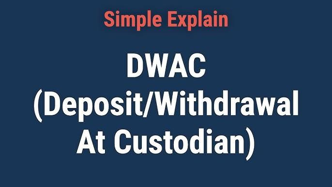

Deposit/Withdrawal at Custodian (DWAC) is an essential component of today's financial landscape, facilitating seamless securities transfers in a digital format. DWAC represents a method through which securities are deposited into or withdrawn from a brokerage account without the need for physical certificates. In the evolving financial environment, this system is pivotal, as it drastically reduces the time and risk traditionally associated with the transfer of assets. 

Modern financial markets are increasingly driven by algorithmic trading—where complex algorithms execute trades at fractions of a second. This evolution underscores the necessity for systems like DWAC that can keep pace with the high-frequency demands of contemporary trading practices. Electronic systems offer the ability to process thousands of transactions quickly, which is crucial for maintaining operational efficiency in markets characterized by rapid asset movement and liquidity demands.

Electronic platforms such as DWAC improve market efficiency by reducing settlement times and minimizing errors associated with manual processing. Notably, these systems also serve to mitigate various risks, including those related to the ownership verification of securities and the logistical challenges of handling physical stocks. As financial institutions strive for operational excellence, integrating electronic systems like DWAC is increasingly crucial in safeguarding the integrity and fluidity of financial transactions.

## Table of Contents

## What is DWAC?

Deposit/Withdrawal at Custodian (DWAC) is a financial service that facilitates the electronic transfer of securities between brokerage firms and their respective custodians, bypassing the need for physical stock certificates. This system operates through the Depository Trust Company (DTC), which acts as a central securities depository, ensuring efficient and paperless transactions. DWAC is particularly valuable in today's fast-paced financial markets, as it significantly enhances the speed and reduces the risk associated with securities transfers.

In a DWAC transaction, the primary entities involved are brokers, custodians, and the DTC. Brokers are responsible for executing trades on behalf of their clients, while custodians hold and safeguard the securities on behalf of the investors. The DTC, as the intermediary, facilitates the transfer process by maintaining an electronic record of securities ownership and enabling the seamless movement of these assets between accounts. By keeping the process digital, DWAC reduces the time and effort required for traditional paper-based transfers, thus improving overall market efficiency.

One of the key advantages of using DWAC is the reduction in processing time for securities transfers. Since the transactions are conducted electronically, they are executed almost instantaneously, as opposed to the days or weeks required for manual processing. This rapid execution is essential for financial institutions that engage in high-frequency trading and need swift settlement of trades.

The implementation of DWAC also plays a critical role in mitigating risks associated with physical security transfers. By eliminating the need for paper certificates, DWAC reduces the potential for loss, theft, or damage of physical documents, which can lead to significant legal and financial repercussions. Moreover, the electronic nature of DWAC transactions provides enhanced traceability and transparency, further minimizing the risk of fraud and ensuring compliance with regulatory standards.

Overall, Deposit/Withdrawal at Custodian represents a pivotal advancement in the securities transfer process, streamlining operations for brokers, custodians, and the DTC. By facilitating electronic and paperless transactions, it has become an integral component of the modern financial ecosystem, offering increased speed, reduced risk, and improved efficiency.

## The Role of the Fast Automated Securities Transfer (FAST) Program

The Fast Automated Securities Transfer (FAST) program is integral to the Deposit/Withdrawal at Custodian (DWAC) process, significantly streamlining the securities transfer system. Managed by the Depository Trust Company (DTC), the FAST program simplifies the transfer of securities by eliminating the need for physical stock certificates. Traditionally, the transfer of shares required handling tangible certificates, which posed risks of loss, damage, and increased transaction times. FAST circumvents these issues through electronic registration of securities, thereby supporting swift and paperless transactions.

FAST operates by allowing issuers and their transfer [agents](/wiki/agents) to hold a master certificate at the DTC in electronic form, thereby enabling direct electronic registration and transfer of securities. This innovation removes the necessity for issuing new physical certificates whenever a transaction occurs, making the process far more efficient and less error-prone.

One of the primary advantages of the FAST program is its capacity for substantial cost savings. By eschewing the production, handling, and mailing of physical certificates, financial institutions can reduce both direct operational costs and ancillary expenses associated with lost or delayed documentation. Moreover, FAST enhances transaction efficiency by accelerating settlement times. This is achieved through a streamlined electronic system that facilitates real-time updates and transfers, reducing both administrative overhead and the potential for settlement delays.

Furthermore, FAST supports a more secure transaction environment. The digital nature of securities transfers within the program minimizes the risk of theft or fraud linked to paper certificates, reinforcing the integrity of the securities transfer process. By mitigating these risks, FAST not only ensures the safety and reliability of transactions but also instills greater confidence among market participants.

In conclusion, the FAST program is a pivotal advancement within the DWAC framework, promoting cost-effectiveness and heightened efficiency. By transforming how securities are transferred and registered, FAST effectively addresses the limitations of traditional, paper-based methods, setting a robust standard for modern securities management.

## Understanding Algo Trading in the Context of DWAC

Algorithmic trading, commonly referred to as algo trading, involves the use of computer algorithms to execute trading orders automatically with minimal human intervention. These algorithms follow a predefined set of rules to determine aspects such as the timing, price, and quantity of trade orders. The impact of [algorithmic trading](/wiki/algorithmic-trading) on financial markets is profound, enhancing [liquidity](/wiki/liquidity-risk-premium), reducing spreads, and improving the efficiency of price discovery.

Algo trading benefits significantly from electronic platforms, such as Deposit/Withdrawal at Custodian (DWAC), which streamline securities transactions. DWAC facilitates electronic, paperless transactions, providing a robust infrastructure that supports the high-speed execution required by algo trading strategies. By minimizing transaction time and reducing the risk associated with traditional paper-based systems, DWAC ensures that trade executions align more closely with the rapidly changing market conditions that high-frequency traders exploit.

The synergy between DWAC's rapid transaction capabilities and high-frequency trading ([HFT](/wiki/high-frequency-trading-strategies)) models is crucial. HFT, a subset of algorithmic trading, involves executing a high number of trades at extremely fast speeds, often capitalizing on small price discrepancies. The capability of DWAC to handle transactions quickly and efficiently allows HFT models to operate with minimal latency, which is critical for the profitability of these strategies.

Moreover, the integration of electronic platforms like DWAC with algo trading systems can lead to significant improvements in operational efficiency. By automating securities transfers and reducing the reliance on physical documentation, these platforms decrease the likelihood of human error and enhance the precision of trading operations. This automation not only aligns with the speed requirements of algo trading but also reduces operational costs, further benefiting financial institutions engaged in such trading activities.

In summary, electronic systems like DWAC not only complement algo trading strategies by providing the necessary infrastructural support but also enhance the effectiveness of high-frequency trading models by ensuring rapid and seamless execution of transactions.

## Benefits of DWAC for Financial Institutions

Deposit/Withdrawal at Custodian (DWAC) offers significant cost-saving advantages for large financial institutions. By facilitating the electronic transfer of securities, DWAC reduces the need for physical transportation and paperwork traditionally associated with securities transactions. This shift to electronic methods minimizes administrative costs and lowers the operational burden on institutions. Moreover, DWAC transactions generally incur fewer fees compared to manual processes, which can translate into substantial savings for high-[volume](/wiki/volume-trading-strategy) traders and institutions. 

In terms of risk mitigation, DWAC plays a crucial role by eliminating the necessity for physical security certificates. Physical certificates are susceptible to risks such as loss, theft, and damage, which can lead to significant financial and operational repercussions. By adopting DWAC, financial institutions can mitigate these risks as the electronic nature of the transactions provides a higher level of security and traceability. Additionally, electronic records lower the chances of fraudulent activities, thereby ensuring a more secure trading environment.

DWAC further supports efficient asset management for institutional investors by enabling real-time processing of securities transactions. The ability to execute swift transactions ensures that fund managers can adjust their holdings in response to market movements without the delays inherent in physical transfers. This real-time capability allows for more agile and responsive investment strategies, improving the overall efficiency of asset management. Furthermore, the streamlined processes associated with DWAC free up valuable institutional resources, allowing personnel to focus on strategic decision-making rather than administrative tasks. 

Overall, the adoption of DWAC offers numerous benefits for financial institutions, including cost efficiency, enhanced security, and improved asset management capabilities, making it a critical component of modern financial operations.

## Challenges and Considerations

Adopting the Deposit/Withdrawal at Custodian (DWAC) system is accompanied by several challenges and considerations that financial institutions must address to ensure successful implementation and operation. One of the most significant hurdles is overcoming technological barriers. The efficacy and reliability of DWAC depend heavily on advanced electronic infrastructure capable of handling large volumes of securities transactions with precision and speed. Many institutions may face difficulties in upgrading their legacy systems to meet the demands of modern electronic platforms like DWAC. This challenge necessitates significant investment in new technologies and staff training, which may not be feasible for all organizations, especially smaller ones.

Another critical aspect involves regulatory compliance. Securities transfers are subject to a myriad of regulations designed to ensure market integrity and investor protection. Financial institutions must navigate complex regulatory frameworks, which can vary across jurisdictions, to implement DWAC successfully. Failure to comply with these regulations can result in severe penalties and damage to the institution's reputation. Therefore, organizations must maintain a proactive approach to regulatory changes and ensure that their DWAC operations are compliant at all times.

Continuous updates and cybersecurity measures are paramount in protecting electronic transactions facilitated through DWAC. The financial sector is a prime target for cyberattacks, and the shift towards electronic systems increases the potential risk of data breaches and fraudulent activities. Institutions must invest in robust cybersecurity measures, including encryption, two-[factor](/wiki/factor-investing) authentication, and regular security audits, to safeguard sensitive information and maintain the integrity of their transactions. Additionally, continuous updates to the DWAC system are essential to address vulnerabilities, improve performance, and accommodate evolving market conditions.

The implementation of DWAC also has implications for market liquidity and transparency. By facilitating faster transaction times and reducing the reliance on physical securities, DWAC can contribute to increased liquidity in financial markets. However, this enhancement in liquidity must be balanced with transparency. Rapid electronic transactions can obscure the visibility of underlying asset flows, leading to potential information asymmetries among market participants. Ensuring transparency in DWAC processes is crucial to maintaining fair and efficient markets, which may require ongoing efforts by institutions to track and report transaction data accurately.

These challenges underscore the importance of strategic planning and investment in technology, compliance, and cybersecurity for institutions looking to leverage DWAC's benefits. While DWAC offers significant advantages in terms of cost savings and operational efficiency, addressing these considerations is vital to its successful adoption and to bolstering confidence in electronic securities transfer systems.

## Future Prospects and Innovations

Emerging trends in securities transfers and electronic trading platforms are poised to significantly transform the financial landscape, with innovations in Deposit/Withdrawal at Custodian (DWAC) and the Fast Automated Securities Transfer (FAST) programs playing a crucial role. The continuous development in electronic trading platforms aims at enhancing efficiency, reducing costs, and mitigating risks associated with traditional securities transfers. These innovations hold promise for more streamlined operations and greater market accessibility.

One of the key innovations to streamline DWAC and FAST processes is the integration of advanced digital solutions such as [artificial intelligence](/wiki/ai-artificial-intelligence) and [machine learning](/wiki/machine-learning). These technologies can enhance the speed and accuracy of transactions, reduce manual errors, and provide better risk assessment tools. Implementing AI-driven algorithms could automatically optimize transaction routes and dynamically adapt to market conditions, thereby increasing the efficiency of securities transfers.

The emergence of digital currencies and blockchain technology presents a transformative potential for DWAC systems. Blockchain, with its decentralized and immutable ledger, offers enhanced security and transparency for transaction records. This can significantly reduce the chances of fraud and disputes in securities settlements. In particular, smart contracts facilitated by blockchain technology can automate various DWAC-related processes, eliminating intermediaries, and further reducing transaction times and costs.

In a rapidly digitizing market, the adoption of distributed ledger technologies is expected to provide DWAC and FAST programs with a competitive edge. For instance, programmable money and securities could facilitate instantaneous transfers without the need for reconciliation steps traditionally required in securities settlements. However, this transition would require robust regulatory frameworks to ensure compliance and safeguard against potential cyber threats.

Additionally, the integration of Internet of Things (IoT) devices into the trading ecosystem can further enhance data accuracy and transaction speed by providing real-time data analytics. This could lead to more informed trading decisions and improved asset management strategies.

As we look to the future, it is likely that DWAC will play a pivotal role in an increasingly digital-centric financial ecosystem. The symbiotic relationship between DWAC capabilities and blockchain technology suggests a future where securities transfers are not only more efficient but also more secure and transparent. This transformation may render traditional methods obsolete, prompting financial institutions to innovate continuously and adapt to this new paradigm. To remain competitive, institutions must invest in the technological infrastructure necessary to support these advances, ensuring a seamless integration of digital solutions into their existing processes.

## Conclusion

Deposit/Withdrawal at Custodian (DWAC) is a keystone in the modern financial ecosystem, enabling efficient, electronic transactions that negate the need for physical stock certificates. Through its mechanisms, DWAC offers notable advantages in terms of cost savings and risk mitigation. By facilitating faster transactions and reducing the uncertainties and delays associated with physical securities transfers, DWAC enhances the overall efficiency and security of securities transactions.

DWAC operates seamlessly within financial markets alongside algorithmic trading platforms, helping expedite transactions and align with high-frequency trading models. This synergy improves market liquidity and supports advanced trading strategies, rendering it a crucial tool for financial institutions seeking refined asset management approaches.

Despite potential technological and regulatory challenges, the case for DWAC's integration into financial infrastructures remains compelling. Future innovations, possibly interfacing with digital currencies and blockchain, might further enhance its capabilities. Leveraging DWAC within trading and settlement processes allows financial institutions to harness its full potential, optimizing both operational efficiency and investment outcomes. Therefore, integrating DWAC into strategic operations is highly recommended for institutions aiming to streamline their financial transactions and reduce operational risks.

## References & Further Reading

[1]: Depository Trust & Clearing Corporation (DTCC). ["The Role of FAST in Securities Transfer."](https://www.dtcc.com/)

[2]: Hasbrouck, J., & Saar, G. (2013). ["Low-latency trading."](https://papers.ssrn.com/sol3/papers.cfm?abstract_id=1695460) The Review of Financial Studies, 26(9), 2585-2622.

[3]: Kearns, M., & Nevmyvaka, Y. (2013). ["Machine Learning for Market Microstructure and High-Frequency Trading."](https://www.cis.upenn.edu/~mkearns/papers/KearnsNevmyvakaHFTRiskBooks.pdf) In T. Chorafas (Ed.), Handbook of Systemic Risk.

[4]: Lopez de Prado, M. (2018). ["Advances in Financial Machine Learning."](https://www.amazon.com/Advances-Financial-Machine-Learning-Marcos/dp/1119482089) Wiley.

[5]: Securities and Exchange Commission (SEC). ["Guide to Broker-Dealer Registration."](https://www.sec.gov/about/divisions-offices/division-trading-markets/broker-dealers)

[6]: Angel, J. J., Harris, L. E., & Spatt, C. S. (2011). ["Trading in Fragmented Markets."](https://papers.ssrn.com/sol3/papers.cfm?abstract_id=1584026) Journal of Financial Markets, 14(4), 547-585. 

[7]: "Settlement and custody: modernizing infrastructure for capital markets" – Available on IMF website

