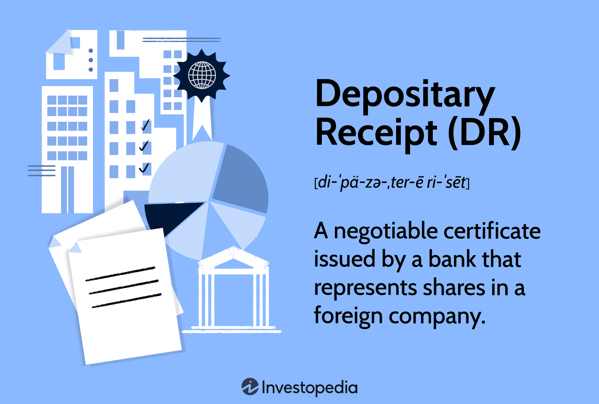

Investment securities such as depositary receipts and the advent of algorithmic trading have revolutionized the global financial markets. The innovative blend of these financial instruments with technology-driven trading strategies has transformed how investors engage with international markets. Depositary receipts play a pivotal role in simplifying international investment by allowing investors to hold shares in foreign companies through domestically traded instruments. This mechanism effectively bridges geographical and regulatory gaps, providing a streamlined path for cross-border equity investment.

Algorithmic trading, often referred to as algo trading, utilizes advanced computational algorithms to optimize trading decisions and execution. These algorithms leverage mathematical models and data analytics to conduct trades at speeds and volumes far exceeding human capabilities, often identifying market trends and capitalizing on fleeting opportunities. Algo trading enhances market efficiency and has become a dominant force in modern trading by minimizing transaction costs and driving liquidity.

Understanding the interplay of depositary receipts and algorithmic trading is crucial for modern investors navigating the increasingly interconnected global financial landscape. As these concepts continue to evolve and converge, they present investors with both opportunities and challenges, emphasizing the need for strategic insight and technological acumen in the pursuit of optimized investment outcomes.

## Table of Contents

## Understanding Depositary Receipts

Depositary receipts are negotiable financial instruments that provide investors the opportunity to hold shares in a foreign company without the complexities of dealing directly in the foreign market. These instruments are integral to global financial markets due to their facilitation of cross-border investments. 

The most prevalent types of depositary receipts include American Depositary Receipts (ADRs), Global Depositary Receipts (GDRs), and European Depositary Receipts (EDRs). ADRs are perhaps the most well-known, especially because they are traded on U.S. stock exchanges, thus enabling U.S. investors to purchase shares in non-U.S. companies with ease. Each ADR represents a specific number of shares—a ratio—of the foreign company held by a U.S. depository bank, which issues the ADRs. The primary purpose of ADRs is to simplify the process for American investors to buy foreign stocks, thereby broadening investment opportunities while reducing the logistical and regulatory hurdles typically associated with international transactions.

Global Depositary Receipts (GDRs) serve a similar purpose but extend beyond the U.S. market, allowing companies to raise capital in multiple countries through international exchanges. This makes GDRs appealing to multinational corporations seeking to tap into various capital markets. European Depositary Receipts (EDRs), although less common, also share this function, focusing on European markets.

The structure of depositary receipts involves a tripartite arrangement among the investor, the depositary bank, and the foreign company. The depositary bank holds the underlying shares in custody and issues depositary receipts, which can then be traded in the local financial market. This arrangement reduces the need for investors to navigate foreign regulations and currency conversions, thus simplifying the investment process. Furthermore, depositary receipts often enjoy greater [liquidity](/wiki/liquidity-risk-premium) and trading ease compared to direct investments in foreign stock markets.

In essence, depositary receipts provide a streamlined process for investing in foreign equities, delivering benefits such as enhanced portfolio diversification and easier access to global markets. While they offer an efficient vehicle for international investment, prospective investors should be mindful of the inherent risks, including currency fluctuations and geopolitical factors that may impact the foreign companies involved.

## Algo Trading: A Modern Trading Approach

Algorithmic trading utilizes sophisticated computer algorithms to automate trading processes at remarkable speeds and volumes, significantly transforming the financial trading landscape. By harnessing mathematical models and data analytics, [algorithmic trading](/wiki/algorithmic-trading) enhances market efficiency and reduces transaction costs, offering traders considerable advantages.

The core of algorithmic trading lies in its ability to process immense volumes of market data almost instantaneously, making it possible to execute trades in milliseconds. This rapid processing capability is crucial for exploiting short-lived market opportunities and effectively implementing high-frequency trading strategies.

Mathematical models serve as the backbone for decision-making in algorithmic trading. Traders develop algorithms based on complex statistical models, often using approaches such as regression analysis, time series forecasting, and [machine learning](/wiki/machine-learning) techniques. These models analyze historical and real-time data to identify patterns, predict future price movements, and generate trading signals for optimal decision-making. The basic mathematical concept often employed in algorithmic trading is the expected value of a trading opportunity, which can be formulated as:

$$
\text{Expected Value} = \sum (\text{Probability of Outcome} \times \text{Payoff of Outcome})
$$

Data analytics play a pivotal role in algorithmic trading, allowing traders to evaluate vast datasets to identify market inefficiencies. Identifying such anomalies provides lucrative opportunities for [arbitrage](/wiki/arbitrage)—strategies where traders capitalize on pricing differences across markets or instruments. For instance, [statistical arbitrage](/wiki/statistical-arbitrage) strategies might use cointegration techniques to trade securities that historically exhibit a stable mean-reverting relationship.

Algorithmic trading has broad implications across various financial instruments, ranging from equities and foreign exchange to commodities and derivatives. By automating trades, firms can lower manual intervention, minimize human error, and streamline their trading operations. Additionally, automated systems ensure consistent adherence to predefined trading criteria, leading to more disciplined trading and the removal of emotional bias from decision-making.

The rise of algorithmic trading has reshaped market dynamics, contributing to increased liquidity as algorithms provide continuous bid-ask quotes and execute large volumes of orders without significantly impacting market prices. This enhanced liquidity not only benefits algorithmic traders but also improves the overall market environment by narrowing spreads and enhancing price discovery.

Despite its advantages, algorithmic trading poses challenges, including increased market [volatility](/wiki/volatility-trading-strategies) and the necessity for robust risk management systems to prevent substantial losses due to erroneous algorithms or unforeseen market events. Consequently, continuous monitoring and refinement of algorithms are essential to adapt to evolving market conditions.

In summary, algorithmic trading represents a modern trading approach that leverages technology to maximize efficiency and returns while transforming market operations and dynamics.

## The Role of Algorithmic Trading in Depositary Receipts

Algorithmic trading has fundamentally transformed the trading of depositary receipts by leveraging large-scale data processing capabilities. This method facilitates enhanced liquidity and pricing efficiency, allowing market participants to exploit arbitrage opportunities effectively. Algorithmic trading systems are adept at quickly processing vast amounts of data, which is crucial for identifying price discrepancies between depositary receipts and their underlying foreign shares.

By integrating algorithmic trading strategies, investors can also navigate the complexities inherent in American Depositary Receipts (ADRs). These complexities include managing currency risks and adapting to varying regulatory standards across different jurisdictions. For instance, currency risk arises from fluctuations in exchange rates between the US dollar and the currency of the underlying shares, potentially affecting the value of ADRs. Algorithmic trading systems can incorporate models to hedge against such risks, calibrating trading decisions based on real-time currency movements.

However, the deployment of algorithmic trading in the ADR space is not devoid of challenges. The increased speed and [volume](/wiki/volume-trading-strategy) of trades can exacerbate market volatility, with rapid price swings negatively impacting market stability. Furthermore, algorithmic trading necessitates robust risk management systems to mitigate potential losses from erratic market behavior. These systems must include components like stop-loss triggers and real-time monitoring to ensure continued alignment with investment strategies and risk tolerance.

In summary, algorithmic trading revolutionizes the trading of depositary receipts by improving liquidity and pricing while providing mechanisms to handle investment complexities. Nonetheless, successful implementation requires meticulous risk assessment and management to counteract the potential for heightened market volatility.

## Advantages and Disadvantages of Investing in Depositary Receipts

Depositary receipts (DRs) are popular investment vehicles that provide a straightforward method for investors to gain exposure to foreign equity markets without directly dealing with the complexities of foreign direct investments. These instruments, traded on local exchanges, serve as proxies for shares in foreign companies, thus offering several benefits and drawbacks to investors.

Depositary receipts significantly simplify access to international investments, thereby facilitating portfolio diversification. By allowing investment in foreign companies through domestic exchanges, DRs enable investors to broaden their investment horizons and mitigate country-specific risks. This ease of access is a major advantage for investors looking to diversify their portfolios across different geographic regions, often leading to better risk-adjusted returns.

Despite these advantages, investing in depositary receipts also presents certain risks. One of the primary concerns is currency fluctuation. Since DRs represent shares in foreign companies, any changes in the currency exchange rate between the investor's domestic currency and the foreign company's currency can affect the DR's value. This exchange rate risk can significantly impact returns, making currency management an essential consideration for investors.

Another drawback of DRs is the limited selection of companies available to investors. While DRs provide access to numerous international markets, not all foreign companies issue them. This limitation can restrict the investor's ability to choose from a wider array of potential investments, focusing only on companies that have opted to participate in depositary receipt programs.

The distinction between sponsored and unsponsored ADRs is also crucial. Sponsored ADRs, backed by the foreign company, offer improved regulatory compliance and greater transparency in financial reporting compared to unsponsored ADRs, which are issued without the direct involvement of the foreign company. Sponsored DRs provide more reliable financial information and typically adhere to higher reporting standards, offering an additional layer of security for investors.

While the advantages of depositary receipts include simplified international investment and enhanced diversification, they also bring challenges such as currency risk and limited company choice. Investors must weigh these factors carefully, taking into account both the benefits of accessing foreign markets and the inherent risks involved. Balancing these elements is essential for making informed investment decisions in depositary receipts.

## Real-World Examples and Case Studies

Notable American Depositary Receipts (ADRs) such as Alibaba Group (BABA) underscore the significant potential for Chinese technology firms within U.S. markets. Alibaba, listed on the New York Stock Exchange, offers a compelling case study of how ADRs enable foreign companies to access capital and investor bases beyond their home countries. The listing of Alibaba in the United States allowed the company to raise considerable capital, which helped fuel its global expansion. This also provided U.S. investors with opportunities to participate in the growth of a leading Chinese technology firm without investing directly in the Chinese stock market.

Historical performance data from companies like Nestlé and Toyota offer insights into the stability and growth potential inherent in ADR investments. Nestlé, a Swiss multinational food and drink processing conglomerate, has a long-standing presence in the U.S. stock markets through its ADRs, reflecting consistent performance and stability over time. Similarly, Toyota's ADRs provide access to one of the largest automobile manufacturers globally, highlighting opportunities for growth and diversification in investor portfolios.

Algorithmic trading plays a crucial role in aligning the prices of ADRs with their underlying shares. For instance, Petrobras, the Brazilian multinational corporation in the petroleum industry, exemplifies how ADR prices can swiftly adjust due to algorithmic trading strategies, ensuring efficient market pricing. Algorithms detect discrepancies between the ADRs traded in the U.S. and their corresponding local shares, executing trades to exploit any arbitrage opportunities, thereby aligning the prices effectively.

ADRs are instrumental in bridging investment gaps, facilitating foreign investment in markets otherwise challenging to access. They enable investors to hold stakes in international companies while navigating fewer regulatory barriers than they would encounter when investing directly in foreign markets. This mechanism opens pathways for capital flow between different geographic regions and industries, enhancing global investment opportunities while allowing home-country companies to tap into diverse financial markets.

## Conclusion

American Depositary Receipts (ADRs) serve as vital conduits between domestic and foreign markets, effectively enabling investors to access international equities without directly trading on overseas exchanges. By simplifying the complexities inherent in cross-border investments, ADRs facilitate a more seamless flow of capital, helping investors diversify their portfolios with assets outside their home markets. This accessibility democratizes investment opportunities, allowing investors to participate in the growth prospects of foreign companies.

Algorithmic trading has significantly bolstered the ADR market, optimizing trade execution through high-speed data processing and sophisticated decision-making algorithms. This advanced trading methodology enhances liquidity by increasing the trading volume and efficiency, ensuring that ADRs are priced accurately in line with the underlying shares they represent. As a result, market participants can exploit arbitrage opportunities, benefiting from pricing misalignments between different markets.

The intersection of technology and financial instruments heralds a more interconnected and efficient global financial system. Such integration promotes greater transparency, reduces transaction costs, and improves market efficiency, thus fostering a financial environment conducive to economic growth and investor confidence. For investors, the synergy between algorithmic trading and ADRs presents both opportunities and challenges. By leveraging technology, investors can make more informed decisions, adopting strategies that mitigate risks such as currency fluctuations and geopolitical uncertainties.

However, these advancements necessitate a thorough understanding of the potential risks involved. Investors should remain vigilant, ensuring they employ robust risk management strategies while capitalizing on technology-driven insights to enhance their investment portfolios. By doing so, they can navigate the complexities of the modern financial landscape, maximizing returns and contributing to a robust and dynamic global market ecosystem.

## Frequently Asked Questions (FAQs)

### What are American Depositary Receipts (ADRs) and what ownership rights do they confer?

American Depositary Receipts (ADRs) are a form of investment security that represents shares in foreign companies. These securities are traded on U.S. stock exchanges, making it simpler for American investors to invest in foreign corporations. ADRs confer ownership rights equivalent to those of the foreign shares they represent. However, the rights are subject to the terms and conditions set by the issuing depositary bank. Ownership rights may include dividends, voting rights, and capital gains, similar to owning domestic stocks, though the extent can vary depending on whether the ADR is sponsored or unsponsored.

### How are ADRs taxed, and what are the implications of double taxation?

The taxation of ADRs involves several layers. Firstly, any dividends paid out are subject to foreign withholding tax in the country where the company operates. These dividends are then taxed again in the United States as foreign income. This phenomenon is known as double taxation. However, U.S. investors might be eligible for a foreign tax credit that offsets the tax already paid in the foreign country, thereby reducing the overall tax burden. Careful tax planning is essential to optimize these credits and manage potential tax liabilities.

### What fees are associated with investing in ADRs?

Investing in ADRs can involve several fees. The primary fee is the custody fee, often charged by the depositary bank for holding the foreign securities. This fee could be deducted from dividends or directly from the investor's account. Additionally, there may be brokerage fees when purchasing or selling ADRs, similar to standard stock transactions. It's crucial for investors to be aware of these fees as they can impact overall investment returns.

### How does algorithmic trading influence ADR investments?

Algorithmic trading, or algo trading, influences ADR investments by leveraging high-speed data processing and execution capabilities. Through the use of complex algorithms, traders and institutional investors can identify pricing inefficiencies and execute trades rapidly, often leading to more efficient pricing and improved liquidity for ADRs. These trades can help reconcile differences between the ADR prices and the value of the underlying foreign shares, preventing disparities due to time zone differences or market openings.

### Are there specific challenges associated with algo trading in the ADR market?

Yes, algo trading in the ADR market poses specific challenges. One of the primary issues is the risk of increased market volatility due to the high-speed and high-frequency nature of trading algorithms. Additionally, navigating the regulatory environments of multiple countries can be complex, especially concerning compliance and reporting standards. Ensuring algorithms adapt to factors like currency fluctuations and market anomalies across different time zones also demands sophisticated risk management and system resilience.

### Can algorithmic trading strategies be effectively combined with ADR investments for better returns?

Yes, algorithmic trading strategies can be effectively combined with ADR investments to optimize returns. By utilizing algorithms, investors can efficiently manage arbitrage opportunities between ADRs and their corresponding foreign stocks, accounting for real-time data feeds and global market dynamics. Moreover, algorithms can be programmed to account for [forex](/wiki/forex-system) fluctuations and regulatory news, potentially enhancing the decision-making process and improving the risk-adjusted returns for ADR portfolios. However, successful implementation requires robust quantitative models and risk management frameworks.

## References & Further Reading

Investopedia is an excellent resource for understanding the foundational concepts of depositary receipts. Their guide "An Introduction to Depositary Receipts" provides detailed explanations on their structure, types, and advantages, serving as a valuable starting point for those new to this investment instrument.

For a deeper examination of multi-market trading strategies and arbitrage opportunities related to depositary receipts and algorithmic trading, the work by Gagnon and Karolyi, "Multi-market trading and arbitrage", offers an insightful analysis. This publication highlights how price discrepancies across markets can be leveraged, which is pertinent in the context of depositary receipts and their trading mechanisms.

Alan C. Shapiro's "Multinational Financial Management" is a comprehensive textbook that covers a broad spectrum of international finance topics, including the intricacies of managing financial operations in multiple countries and currencies. This is particularly relevant for understanding the complexities associated with investing in foreign equities through depositary receipts and the risk factors such as currency fluctuations and geopolitical impacts.

To comprehend the influence of liquidity and market efficiency on trading practices, which are central to algorithmic trading, the seminal work by Chordia, Roll, and Subrahmanyam titled "Liquidity and Market Efficiency" is crucial. This research investigates into how liquidity conditions affect market operations, a key consideration for both traditional and algorithmic trading strategies.

Lastly, Lopez de Prado's "Advances in Financial Machine Learning" provides expansive coverage on the role of machine learning in finance, including algorithmic trading. This book is essential for understanding how cutting-edge technologies and data analytics are applied to optimize trading decisions and improve financial outcomes. Through practical examples, it illustrates how machine learning techniques can be harnessed to enhance trading algorithms, making it particularly useful for traders looking to integrate these technologies into their strategies.

