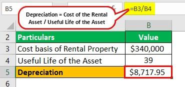

The legal process of depositions is vital in courtroom proceedings, especially during the discovery phase. A deposition involves taking a witness's sworn out-of-court testimony, which allows legal teams to gather essential information before a trial. It aids in evaluating the strengths and weaknesses of a case, thereby influencing legal strategies. Understanding the permissible questions during depositions is crucial for effectively extracting reliable information and avoiding legal pitfalls such as perjury.

In the complex world of financial trading, particularly in algorithmic trading, legal considerations related to depositions frequently intersect with financial regulations. Algorithmic trading relies on computer algorithms to execute trades at speeds and complexities that human traders cannot achieve. This sector faces rigorous scrutiny to ensure compliance with market rules and regulations. Legal professionals must often question technical experts to ascertain whether these algorithms adhere to applicable laws, emphasizing the need for precise questioning.



This article explores the types of questions allowed during depositions and illustrates how these legal principles apply to algorithmic trading. The intersection of legal and financial knowledge in these scenarios underscores the importance of thorough preparation and understanding to navigate this multifaceted landscape effectively.

## Table of Contents

## What is a Deposition?

A deposition serves as a key component in the legal discovery process, being the sworn out-of-court testimony of a witness. This testimony is vital as it enables attorneys from all involved parties to obtain detailed accounts and evidence before a trial begins. By conducting depositions, lawyers record witness statements, which can later be used in court either to challenge or support testimonies. This aspect of pre-trial discovery minimizes unexpected developments during the actual courtroom proceedings.

Depositions function as a strategic tool that provides insight into the trial testimony, effectively serving as a rehearsal for what might unfold in court. The structured opportunity to explore the witness's knowledge or recollection of the events in question allows both prosecution and defense to build robust, informed cases. Furthermore, by pre-emptively surfacing inconsistencies or affirming facts through deposition testimony, legal teams can diminish the likelihood of surprises during trial, ensuring a fairer and more predictable legal process.

Overall, the deposition serves as an essential intermediate step in the litigation process that facilitates comprehensive evidence-gathering and analysis, forming a cornerstone of efficient trial preparation and execution.

## Understanding the Legal Boundaries in Depositions

Depositions play a crucial role in legal proceedings, serving as a key element of the discovery process. The rules governing depositions are designed to ensure that the process is conducted fairly and effectively, preventing tactics that could intimidate or confuse witnesses. By adhering to these rules, the integrity of the legal process is maintained, resulting in a fair trial for all involved parties.

During a deposition, witnesses are required to provide truthful and accurate information. Therefore, they should only answer questions they are completely certain about. This preventative measure mitigates the risk of providing false information, which could otherwise lead to severe consequences such as perjury charges. Perjury is a criminal offense, as it involves providing false testimony under oath, and it can significantly influence the outcome of legal proceedings.

The regulations surrounding depositions emphasize clarity and transparency. These rules ensure that all parties involved in a legal case are aware of the testimonies and statements provided by witnesses. By having access to this information ahead of a court trial, legal teams are better prepared, and unforeseen surprises during court proceedings are minimized. Comprehensive understanding of the testimony allows both sides to strategize effectively, promoting a more balanced and just trial environment.

Furthermore, while depositions are conducted outside the courtroom, the legal boundaries applied to questioning are stringent to uphold the credibility of the process. Questions that are meant to intimidate or manipulate a witness are strictly prohibited. Likewise, questions should avoid leading witnesses to speculated or hypothetical responses that may not accurately reflect the facts of the case. 

In summary, the strict legal boundaries governing depositions protect the integrity of the judicial process by ensuring that witness testimonies are clear, truthful, and relevant to the matter at hand. Adherence to these rules contributes significantly to a fair trial, allowing for effective and equitable legal proceedings.

## Deposition Questions: What's Allowed?

In depositions, the scope of questioning is designed to facilitate the gathering of pertinent factual information that directly relates to the case at hand. This process allows for a more extensive range of inquiry than what is typically permitted during court proceedings. The objective is to uncover evidence that might be admissible later, providing both sides with a comprehensive understanding of the witness's potential testimony.

Common types of permissible questions during depositions focus on several key areas: 

1. **The Witness's Background**: Lawyers may ask questions to establish the witness's personal and professional history. This line of questioning helps to assess the witness's credibility and potential biases. For example, questions might center around the witness's education, work experience, or involvement in related activities.

2. **Specifics About Events**: Questions that seek detailed information about the events in question are crucial. Witnesses may be asked to recount specific dates, locations, and actions they observed. This can help to construct a clear timeline and determine the relevance and impact of the witness's testimony on the case.

3. **Clarity on Previous Statements**: If a witness has made prior statements, depositions allow for questions that seek to clarify or expand on these points. Lawyers might probe inconsistencies or request elaboration to ensure the witness's account is thoroughly understood.

While the breadth of questioning is extensive, there are clear boundaries intended to prevent misconduct or irrelevance. Lawyers are responsible for objecting to questions that do not conform to these legal standards. 

- **Speculative Questions**: Any question that solicits conjecture or hypothesizing from the witness is generally considered impermissible. The focus should remain on facts, not interpretations or predictions.

- **Questions Calling for Legal Conclusions**: Witnesses, unless they are qualified experts, should not be tasked with providing legal analyses or conclusions. Such questions can be misleading and are usually inappropriate.

- **Irrelevant or Harassing Questions**: The questioning must remain pertinent to the subject matter of the deposition. Any line of questioning deemed irrelevant or intended to intimidate or harass the witness is not allowed. Lawyers can object and seek protection orders if necessary to prevent abuse during depositions.

This framework ensures that depositions are conducted in a manner that is both comprehensive and respectful, focusing on the facts while safeguarding the witness's rights.

## Algorithmic Trading and Legal Implications

Algorithmic trading utilizes sophisticated computer programs to execute trades at high speed and [volume](/wiki/volume-trading-strategy), following a set of predetermined rules and strategies. This method of trading relies heavily on cutting-edge technology and comprehensive historical data analysis to formulate algorithms that can capitalize on market patterns and opportunities more rapidly than human traders.

Legal oversight in [algorithmic trading](/wiki/algorithmic-trading) is crucial due to the potential for market manipulation and the necessity to comply with a range of financial regulations. Regulatory bodies, such as the Securities and Exchange Commission (SEC) in the United States or the Financial Conduct Authority (FCA) in the United Kingdom, have established frameworks designed to ensure that automated trading activities do not disrupt the market or disadvantage other participants.

One of the key legal considerations involves ensuring that the design and execution of trading algorithms adhere to these regulatory standards. This necessitates thorough documentation of the algorithm's logic, parameters, and the rationale behind its development. Developers and financial institutions must conduct rigorous back-testing and ongoing monitoring to prevent unintended consequences or exploit vulnerabilities in the trading system.

In the case of legal disputes or regulatory inquiries, depositions play a significant role in scrutinizing the activities within algorithmic trading environments. Technical experts may be called upon to testify about the functionality and compliance of these algorithms. During such depositions, lawyers may examine:

1. The algorithm's design and the data sets used for back-testing.
2. The decision-making process behind coding specific rules or thresholds for trading activities.
3. The preventive measures implemented to avoid conflicts with market regulations or ethical standards.

The interaction between technical and legal disciplines in algorithmic trading ensures not only that the integrity of financial markets is maintained but also that traders and institutions remain accountable for their operations. Thus, understanding both the technical intricacies and legal requirements is imperative for anyone involved in this sector.

## Preparing for a Deposition in Legal and Financial Settings

Preparation for a deposition in both legal and financial settings requires a strategic approach to ensure factual accuracy and adherence to relevant guidelines. Anticipating potential lines of questioning is crucial. In legal settings, participants should acclimate themselves with the intricacies of the case, familiarizing themselves with key documents and witnesses, and crafting their responses to convey clarity and truthfulness without falling into speculative or irrelevant areas. They must be careful to provide concise answers, steering clear of conjecture, and remain within the legal boundaries set by counsel, as deviations can lead to complications or misinterpretations.

In financial settings, especially concerning algorithmic trading, preparation includes understanding and demonstrating the performance and compliance of trading algorithms. These algorithms, which are designed to execute trades at high speeds based on pre-set criteria, must align with existing financial regulations. It is imperative for those involved to be able to explicate the logic underpinning these algorithms, ensuring that they are not only effective but also adhere to market rules. This might involve detailing how safeguards are implemented to prevent market manipulation or how algorithms are tested against historical data for stability.

Individuals may employ technical expertise to validate the integrity of these algorithms through code reviews or compliance audits. For example, a Python script might be used to simulate trading conditions and evaluate the algorithm's decision-making process:

```python
# Example code to simulate and evaluate an algorithmic trading strategy
import numpy as np

# Assume we have a trading model that uses moving averages
def moving_average(data, period):
    return np.convolve(data, np.ones(period)/period, 'valid')

# Simulated prices
prices = np.random.normal(100, 10, 100)  # assuming 100 days of prices

# Calculate moving average
short_term = moving_average(prices, 5)
long_term = moving_average(prices, 20)

# Signal: buy if short-term MA crosses above long-term MA
signals = np.where(short_term[15:] > long_term, 1, 0)  # 1 for buy, 0 for no action

print("Generated trading signals:", signals)
```

Similarly, understanding regulatory frameworks like the Securities Exchange Act in the U.S. or MiFID II in Europe can be crucial. These frameworks set stringent requirements related to transparency, accountability, and risk management. Deposition preparation might thus involve preparing documentation that elucidates how algorithmic designs comply with such regulations.

Across both contexts, thorough preparation can minimize ambiguities and bolster one's position. Crafting a narrative that is supported by factual evidence and aligns with regulatory norms ensures a robust defense or argument during depositions. As such, fostering a deep understanding of both legal and financial systems is indispensable for successful participation in deposition proceedings.

## Concluding Thoughts

Understanding the scope and limitations of deposition questions is critical in both legal cases and financial trading systems, as it can significantly influence outcomes. In legal contexts, depositions serve as a pivotal tool in the discovery phase, where clear and precise questioning contributes to an equitable trial process. The preparation for a deposition must be exhaustive, involving a comprehensive review of case materials, potential questions, and strategic responses. Such meticulous preparation helps safeguard against inadvertent legal pitfalls and ensures that the testimony supports the case’s argument or defense robustly.

Similarly, in financial trading, particularly algorithmic trading a domain characterized by rapid and complex transactions, the integrity and accuracy of depositions concerning algorithm compliance with financial market rules are vital. Professionals involved in these depositions must understand not only the technical details of the algorithms but also the regulatory frameworks that govern financial markets. This dual knowledge ensures that trading activities remain within legal boundaries and that the credibility of financial systems is maintained.

Both fields necessitate adherence to principles of integrity, accuracy, and compliance. Legal professionals and financial experts alike must engage with the deposition process with utmost diligence to uphold the credibility of the testimony and the subsequent outcomes. By maintaining these standards, they contribute to transparent and fair processes that benefit all stakeholders involved.

## References & Further Reading

[1]: ["The Deposition Handbook: A Guide to Help You Prepare for Your Deposition"](https://www.americanbar.org/groups/young_lawyers/resources/tyl/practice-areas/how-to-prepare-for-your-first-deposition/) by Albert Moore and David A. Binder

[2]: ["Algorithmic Trading and DMA: An Introduction to Direct Access Trading Strategies"](https://www.semanticscholar.org/paper/Algorithmic-trading-%26-DMA-%3A-an-introduction-to-Johnson/aa5de1ab883d5e23b6651faa7c1807586d688e4b) by Barry Johnson

[3]: Financial Industry Regulatory Authority. ["Regulatory Notice 15-09: Equity Trading Initiatives – Automated Trading Desk Activities."](https://www.finra.org/rules-guidance/notices/15-09)

[4]: Securities and Exchange Commission. ["SEC Rule 15c3-5 – Market Access"](https://www.sec.gov/files/rules/final/2010/34-63241.pdf), Accessed October 15, 2023.

[5]: ["Flash Boys: A Wall Street Revolt"](https://en.wikipedia.org/wiki/Flash_Boys) by Michael Lewis

[6]: ["The Law of Financial Institutions"](https://aspenpublishing.com/products/carnell-financialinstitutions7) by Richard Scott Carnell, Jonathan R. Macey, and Geoffrey P. Miller

[7]: International Swaps and Derivatives Association, Inc. ["ISDA Best Practices"](https://www.isda.org/category/asset-classes/)

[8]: ["High-Frequency Trading: A Practical Guide to Algorithmic Strategies and Trading Systems"](https://www.wiley.com/en-us/High+Frequency+Trading%3A+A+Practical+Guide+to+Algorithmic+Strategies+and+Trading+Systems%2C+2nd+Edition-p-9781118343500) by Irene Aldridge