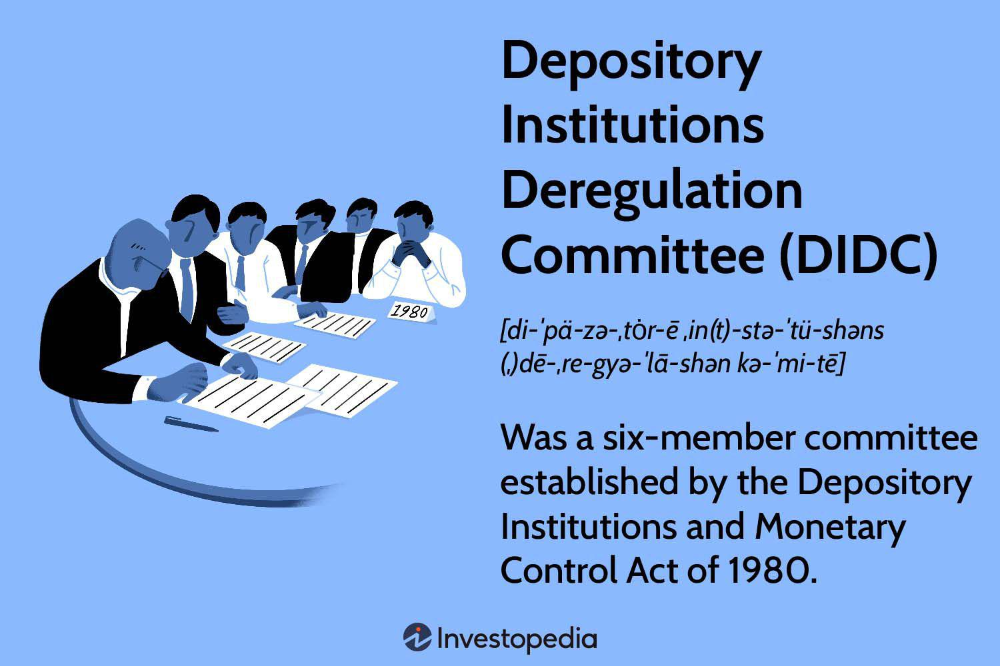

In the rapidly evolving landscape of modern finance, key components such as depository institutions, finance committees, deregulation, and algorithmic trading intersect in impactful ways. These elements collectively shape the structure and dynamics of today's financial markets, influencing everything from regulatory practices to market participants' behavior.

Depository institutions, including banks and credit unions, have long been fundamental to the economic system, serving as the primary interface between savings and investments. Their function in collecting deposits and providing loans underpins the broader financial infrastructure, facilitating trade and enabling economic growth. However, the landscape in which these institutions operate has been significantly altered by policies and regulations that determine their operational frameworks.

Finance committees, tasked with overseeing and implementing financial regulations, play a critical role in this ecosystem. Their responsibilities include balancing the interests of the financial sector with maintaining economic stability and consumer protection. One of the most significant shifts influenced by these committees has been deregulation—a process aimed at removing restrictions to encourage competition and innovation in the financial markets.

Deregulation, while offering potential benefits such as increased efficiency and reduced transaction costs, also brings challenges. It opens markets to greater competition and technological advancements like algorithmic trading. These trades—driven by complex computer algorithms—can execute at velocities unimaginable in previous decades, offering enhanced liquidity and operational efficiency. However, they also introduce risks related to market volatility and fair trading practices.

Algorithmic trading exemplifies the cutting-edge progress in financial technology, necessitating robust regulatory oversight to mitigate risks and safeguard market stability. As the interplay between deregulation and such innovations continues to evolve, understanding these dynamics becomes vital. Investors and policymakers must navigate these complexities with informed strategies to maximize opportunities while minimizing potential hazards.

By examining the historical context and current impacts of deregulation and algorithmic trading, alongside the foundational role of depository institutions and finance committees, this article aims to illuminate the intricate relationships within the modern financial ecosystem. This knowledge is essential for anyone looking to engage with or regulate today's nuanced financial environment effectively.

## Table of Contents

## Understanding Depository Institutions

Depository institutions, such as banks and credit unions, serve as foundational pillars of the financial system. They are primarily engaged in accepting deposits from the public and providing loans, thereby facilitating economic activity and ensuring market [liquidity](/wiki/liquidity-risk-premium). The operations of these institutions play a critical role in maintaining economic stability, enabling trade, investment, and consumer spending.

Historically, depository institutions have undergone significant transformation, influenced by a series of regulatory changes aimed at balancing stability with growth. In the United States, the Glass-Steagall Act of 1933 was one of the earliest regulatory frameworks designed to restore public confidence during the Great Depression by separating commercial banking from investment banking activities. This division was intended to reduce conflicts of interest and risky speculative activities that were believed to have contributed to the financial collapse.

The regulatory landscape continued to evolve, notably with the enactment of the Riegle-Neal Interstate Banking and Branching Efficiency Act of 1994, which allowed banks to operate across state lines, fostering competition and operational efficiency. Such regulations have periodically been reassessed by finance committees, which weigh the benefits of liberalized financial markets against the necessity for prudential supervision.

A significant shift occurred with the deregulation wave beginning in the late 20th century, marked by the Gramm-Leach-Bliley Act of 1999. This act dismantled barriers between commercial banks, investment banks, and insurers, fostering an environment conducive to innovation and competition. Proponents argued that deregulation enhanced the ability of depository institutions to offer a more comprehensive range of financial services, improving their profitability and efficiency. However, this also necessitated a more robust risk management framework to address the increased complexity and potential for systemic risk.

Depository institutions' adaptation to regulatory changes has been multifaceted. Many banks have invested in advanced risk management systems and diversified their services to remain competitive. Additionally, the emergence of fintech has compelled traditional depository institutions to innovate, integrating digital banking solutions to cater to evolving consumer preferences.

In conclusion, depository institutions play a critical role in the financial ecosystem. Their adaptation to historical and contemporary regulatory changes has significantly influenced their functions, promoting economic stability, trade, and investment. As the financial landscape continues to evolve, these institutions will need to navigate a complex environment of ongoing deregulation and technological advancement while balancing profitability with prudent risk management.

## The Role of Finance Committees in Deregulation

Finance committees, such as the Depository Institutions Deregulation Committee (DIDC), have significantly influenced financial policy, particularly through their role in deregulating financial markets. These committees are tasked with striking a balance between the needs and interests of the financial sector and the regulatory frameworks that govern economic activity. The DIDC, established in the late 20th century, was instrumental in advancing the deregulatory agenda by addressing key issues such as [interest rate](/wiki/interest-rate-trading-strategies) ceilings.

One of the DIDC's most notable tasks was the phasing out of interest rate ceilings during the 1980s. This move represented a pivotal shift towards market liberalization, allowing depository institutions greater flexibility in setting interest rates. The intention behind eliminating these ceilings was to increase competition among financial institutions, thereby fostering economic growth and enhancing consumer choice. By removing these constraints, the financial markets aimed to operate more efficiently, reflecting a broader trend towards deregulation during that period.

However, the effects of such deregulatory measures have been mixed. While these policies intended to spur economic development and improve the operational efficiency of financial markets, they also contributed to unforeseen challenges and crises. A notable example is the Savings and Loan crisis of the late 1980s and early 1990s. This crisis was partly attributed to the rapid deregulation of financial institutions, which, without sufficient oversight, engaged in risky financial practices leading to insolvency and significant financial losses. The crisis underscored the potential pitfalls of deregulation, emphasizing the necessity of prudent oversight even as markets were liberalized.

Finance committees, in this context, play a critical role in navigating the complex regulatory landscape. Their task extends beyond merely implementing deregulation; they must also ensure that such deregulatory measures are balanced with safeguards that protect the financial system's integrity and stability. This involves continuous assessment of the impacts of deregulation and, when necessary, the introduction of corrective regulations to address emergent issues. The DIDC and similar entities must consider both the short-term advantages of deregulation and the long-term implications for financial market stability and consumer protection.

Ultimately, the role of finance committees in deregulation highlights the delicate equilibrium required in financial policy-making. While deregulation can unleash market potential and drive economic growth, it also necessitates a framework that mitigates associated risks. Through strategic oversight and adaptive regulatory measures, finance committees can help navigate these complexities, fostering a financial environment that balances innovation and stability.

## Impact of Deregulation on Financial Markets

Deregulation in financial markets has been a subject of considerable debate, with its proponents and critics both presenting compelling arguments. The removal of various regulatory restrictions has undoubtedly opened the doors to enhanced competition and innovation within the financial sector. By eliminating rigid constraints, deregulation has facilitated market efficiency, primarily through the reduction of transaction costs and the promotion of innovative financial products and services.

One of the critical arguments in favor of deregulation is its potential to streamline operations within financial markets, thus facilitating faster and more cost-effective transactions. This efficiency is achieved by enabling financial entities to leverage economies of scale and adopt new technologies without the burden of excessive regulatory compliance. Consequently, consumers and businesses benefit from lower costs and increased access to a more diverse range of financial products.

However, deregulation is not without its challenges. A significant risk associated with deregulated markets is the potential for increased market [volatility](/wiki/volatility-trading-strategies). Without strict oversight, financial institutions may take on excessive risk, leading to destabilizing consequences. The complexities of a deregulated environment can also lead to systemic financial crises, as evidenced by historical financial events.

The 2008 financial crisis serves as a poignant example of the dangers posed by insufficient regulatory oversight in a deregulated market. The crisis was precipitated by the excessive risk-taking and lack of transparency inherent in a lightly regulated financial system. The widespread issuance of subprime mortgages, compounded by complex financial derivatives that were poorly understood and inadequately monitored, led to a catastrophic collapse that reverberated throughout the global economy. This crisis highlighted the critical need for a careful balance between deregulation and regulatory oversight to prevent similar systemic failures in the future.

While deregulation offers significant benefits by encouraging competition and facilitating market dynamism, it also necessitates a robust regulatory framework to manage the attendant risks. Thus, the challenge for policymakers is to strike a balance that harnesses the advantages of deregulation while ensuring sufficient oversight to protect the integrity of the financial markets and safeguard against systemic disruptions.

## The Rise of Algorithmic Trading in Deregulated Markets

Algorithmic trading, commonly referred to as algotrading, has gained significant traction in deregulated financial markets. This method utilizes complex computer algorithms to execute large numbers of trades at speeds and frequencies far beyond what a human trader could achieve. By leveraging advanced computing techniques, [algorithmic trading](/wiki/algorithmic-trading) enhances liquidity and reduces the market impact of trades, thereby improving the operational efficiency of financial markets.

One of the primary advantages of algorithmic trading is its ability to facilitate large volumes of transactions without significantly impacting market prices. This is achieved through strategies such as statistical [arbitrage](/wiki/arbitrage), [market making](/wiki/market-making), and [trend following](/wiki/trend-following), which enable traders to take advantage of minute price differences across various securities or markets. The increased liquidity resulting from such trading activities is beneficial for market participants, offering tighter bid-ask spreads and lower transaction costs.

Despite these benefits, the rapid execution characteristic of algorithmic trading poses several risks. The most notable among these is the potential for flash crashes, where markets experience extreme volatility within very short time frames. Such events are often attributed to the automatic mechanisms embedded within trading algorithms, which could lead to uncontrollable selling or buying pressures driven by erroneous signals or feedback loops. A well-documented occurrence is the Flash Crash of May 6, 2010, which saw the Dow Jones Industrial Average plunge about 1,000 points within minutes, only to recover almost as quickly.

Moreover, algorithmic trading can be exploited for market manipulation, such as spoofing or layering, which undermines market integrity. These tactics involve placing large orders that are then canceled before execution to create a misleading impression of market demand or supply, consequently influencing prices to the manipulator's advantage.

In response to these challenges, regulatory bodies have developed several mechanisms to ensure market stability. Circuit breakers, for instance, temporarily halt trading on an exchange to curb panic-selling and allow for information dissemination and market participants' reassessment of trading strategies. Enhanced surveillance systems have also been implemented to detect unusual trading patterns and to identify and penalize manipulative behavior promptly.

As algorithmic trading continues to evolve, it remains pivotal that regulatory frameworks adapt accordingly to balance the innovation and efficiency it brings with the necessity for robust market oversight. This ensures that the benefits of algorithmic trading are maximized while minimizing the risks to market integrity and stability.

## Conclusion

The interplay among depository institutions, finance committees, deregulation, and algorithmic trading is pivotal in shaping today's financial markets. Deregulation has been a double-edged sword, offering the promise of increased efficiency and innovation while simultaneously requiring prudent oversight to mitigate associated risks. On one hand, deregulation has fostered an environment where financial entities can operate with greater freedom, potentially lowering costs and improving services. On the other hand, the absence of sufficient regulatory measures can give rise to increased volatility and systemic risks, as evidenced by past financial crises.

Algorithmic trading, or algotrading, exemplifies the technological advancements that have prospered in this deregulated environment. These advanced trading systems leverage powerful algorithms to execute transactions at speeds unattainable by human traders, thereby enhancing liquidity and operational efficiency. However, the rapid influx of trades can also create vulnerabilities, such as flash crashes and market manipulation, highlighting the necessity for a balanced regulatory framework. Regulatory bodies have responded to these challenges by implementing mechanisms like circuit breakers and advanced surveillance systems in an effort to uphold market stability.

To successfully navigate these complexities, it is essential for investors, financial institutions, and regulators to fully grasp the intricacies of these interacting elements. The evolving financial landscape demands informed decision-making to effectively leverage opportunities while minimizing potential challenges. As the industry advances, ensuring a harmonious balance between innovation and regulation will be crucial for maintaining sustainable and resilient financial markets.

## References & Further Reading

[1]: Gorton, G., & Metrick, A. (2012). ["Getting Up to Speed on the Financial Crisis: A One-Weekend-Reader's Guide."](https://www.nber.org/system/files/working_papers/w17778/w17778.pdf) Journal of Economic Literature, 50(1), 128-150.

[2]: ["The Glass-Steagall Act and the Development of Unified Banking Supervision in the United States"](https://en.wikipedia.org/wiki/Glass%E2%80%93Steagall_Legislation) by the Federal Reserve History

[3]: Mishkin, F. S., & Eakins, S. G. (2012). ["Financial Markets and Institutions"](https://books.google.com/books/about/Financial_Markets_and_Institutions_Globa.html?id=PPJFDwAAQBAJ) (7th Edition). Boston: Pearson.

[4]: Philippon, T. (2015). ["Has the U.S. Finance Industry Become Less Efficient? On the Theory and Measurement of Financial Intermediation."](https://www.aeaweb.org/articles?id=10.1257/aer.20120578) American Economic Review, 105(4), 1408-38.

[5]: Jones, C. M. (2013). ["What Do We Know About High-Frequency Trading?"](https://papers.ssrn.com/sol3/papers.cfm?abstract_id=2236201) Columbia Business School Research Paper No. 13-11.