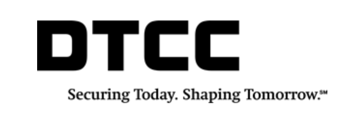

## Table of Contents

## What is the Depository Trust and Clearing Corporation (DTCC)?

The Depository Trust and Clearing Corporation, or DTCC, is a big company that helps make buying and selling stocks, bonds, and other financial products easier and safer. It acts like a middleman between buyers and sellers, making sure that when someone buys a stock, they actually get it, and when someone sells a stock, they get their money. This process is called clearing and settlement, and it helps keep the financial markets running smoothly.

DTCC also keeps track of who owns what in the financial markets. It holds onto electronic records of stocks and bonds, so instead of having physical certificates, everything is stored safely in their system. This makes it easier for people to trade and reduces the risk of losing important documents. Overall, DTCC plays a crucial role in making sure that the buying and selling of financial products happens quickly and securely.

## What are the main functions of the DTCC?

The DTCC has two main jobs: clearing and settlement, and keeping records of who owns what. When people buy or sell stocks, bonds, or other financial products, the DTCC makes sure that the buyer gets what they paid for and the seller gets their money. This process is called clearing and settlement. It's like being a referee in a game, making sure everyone plays fair and gets what they're supposed to.

The other big job of the DTCC is to keep track of who owns which stocks and bonds. Instead of having physical certificates, the DTCC holds onto electronic records of these financial products. This makes it easier for people to trade because they don't have to worry about losing important papers. It also helps keep everything safe and organized, like a big digital library for the financial world.

## How does the DTCC facilitate the settlement of securities transactions?

The DTCC helps with the settlement of securities transactions by acting as a middleman between buyers and sellers. When someone buys a stock or bond, the DTCC makes sure that the buyer gets the security they paid for. At the same time, it ensures that the seller gets the money from the sale. This process, called clearing and settlement, happens quickly, usually within two business days after the trade. The DTCC uses a system called the National Securities Clearing Corporation (NSCC) to match up all the trades and make sure everything is correct before the settlement happens.

To make this process even smoother, the DTCC also handles the transfer of ownership. Instead of using physical certificates, the DTCC keeps electronic records of who owns what. This is managed through the Depository Trust Company (DTC), which is part of the DTCC. When a trade is settled, the DTC updates its records to reflect the new owner of the security. This electronic system makes trading faster and reduces the risk of losing important documents. By managing both the money and the securities, the DTCC ensures that the buying and selling of stocks and bonds happens safely and efficiently.

## What role does the DTCC play in reducing risk in financial markets?

The DTCC helps make financial markets safer by acting as a middleman between buyers and sellers. When someone buys a stock or bond, the DTCC makes sure that the buyer gets what they paid for and the seller gets their money. This process, called clearing and settlement, happens quickly and accurately, which reduces the chance of mistakes or fraud. By managing this process, the DTCC lowers the risk that someone won't get what they're supposed to, which is called counterparty risk.

Another way the DTCC reduces risk is by keeping electronic records of who owns what. Instead of using paper certificates, the DTCC holds onto digital records of stocks and bonds. This makes it easier and safer to trade because there's less chance of losing important documents. If something goes wrong, like a company going bankrupt, the DTCC can quickly figure out who owns what and make sure everyone gets what they're entitled to. This helps keep the financial markets stable and trustworthy.

## Can you explain the difference between DTC and NSCC, both subsidiaries of DTCC?

The Depository Trust Company (DTC) and the National Securities Clearing Corporation (NSCC) are both part of the DTCC, but they do different jobs. The DTC is like a big safe for stocks and bonds. It keeps electronic records of who owns what, so instead of having paper certificates, everything is stored in a computer. When someone buys or sells a stock, the DTC makes sure the ownership records are updated correctly. This makes trading easier and safer because there's no risk of losing important papers.

The NSCC, on the other hand, is like a referee for trades. When people buy and sell stocks, the NSCC checks all the trades to make sure they match up. It makes sure that if someone buys a stock, they get it, and if someone sells a stock, they get their money. This process is called clearing and settlement, and it usually happens within two days after the trade. By doing this, the NSCC helps keep the financial markets running smoothly and reduces the chance of mistakes or fraud.

## How does the DTCC handle the custody of securities?

The DTCC takes care of securities by keeping them safe in an electronic form. Instead of using paper certificates, the DTCC uses computers to keep track of who owns stocks and bonds. This part of the DTCC is called the Depository Trust Company (DTC). When someone buys or sells a stock, the DTC makes sure the ownership records are updated correctly. This way, trading is easier and safer because there's no risk of losing important papers.

By keeping securities in electronic form, the DTCC makes sure that everyone knows who owns what at all times. If something goes wrong, like a company going bankrupt, the DTC can quickly figure out who owns the securities and make sure they are handled properly. This helps keep the financial markets stable and trustworthy, because people can be confident that their investments are safe and secure.

## What are some of the key services provided by DTCC to its participants?

The DTCC offers many important services to its participants, like banks, broker-dealers, and other financial institutions. One of the main services is clearing and settlement. When someone buys or sells a stock or bond, the DTCC makes sure the buyer gets the security and the seller gets the money. This happens quickly, usually within two days, and helps keep the financial markets running smoothly. The DTCC also helps match up all the trades to make sure everything is correct, which reduces the chance of mistakes or fraud.

Another key service is custody of securities. The DTCC keeps electronic records of who owns stocks and bonds, so instead of using paper certificates, everything is stored safely in their system. This makes trading easier and safer because there's no risk of losing important documents. If something goes wrong, like a company going bankrupt, the DTCC can quickly figure out who owns what and make sure everyone gets what they're entitled to. This helps keep the financial markets stable and trustworthy.

In addition, the DTCC provides services like trade reporting and data management. They keep track of all the trades that happen and provide this information to their participants. This helps everyone stay informed about what's happening in the markets. The DTCC also helps with managing risk by keeping an eye on the trades and making sure everything is done correctly. This way, the financial markets can work smoothly and safely.

## How has the DTCC evolved since its establishment?

The DTCC started in 1973 when a bunch of banks and broker-dealers got together to make trading easier and safer. Back then, they had to use paper certificates for stocks and bonds, which was slow and risky. The DTCC changed that by creating a system to keep electronic records of who owns what. This made trading faster and reduced the chance of losing important papers. Over the years, the DTCC grew bigger and added more services to help the financial markets run smoothly.

As time went on, the DTCC kept improving its services to keep up with new technology and the changing needs of the financial world. They started using computers to match up trades and make sure everything was done correctly. This helped reduce mistakes and fraud. The DTCC also started offering more services like trade reporting and risk management to help their participants stay informed and safe. Today, the DTCC is a big part of the financial markets, helping to make sure that buying and selling stocks and bonds happens quickly and securely.

## What regulatory oversight does the DTCC operate under?

The DTCC is watched over by several big groups to make sure it does its job right. The main group is the U.S. Securities and Exchange Commission (SEC), which makes rules for the financial markets. The SEC checks that the DTCC follows these rules and helps keep the markets safe and fair. Another important group is the Federal Reserve, which looks at how the DTCC handles money and payments. These groups work together to make sure the DTCC does everything correctly and safely.

Besides the SEC and the Federal Reserve, the DTCC also has to follow rules from other places. For example, the Financial Industry Regulatory Authority (FINRA) watches over how the DTCC deals with its members, like banks and broker-dealers. If the DTCC works in other countries, it has to follow rules from those places too. All these different groups help make sure that the DTCC keeps the financial markets running smoothly and safely for everyone.

## How does the DTCC integrate with global financial markets?

The DTCC helps connect with financial markets all around the world. It works with banks, broker-dealers, and other financial groups in different countries to make sure buying and selling stocks and bonds is safe and easy everywhere. The DTCC uses special systems to keep track of who owns what, no matter where they are. This way, people in different countries can trade with each other without worrying about losing important papers or making mistakes.

To make sure everything works well with global markets, the DTCC follows rules from many different places. It listens to the U.S. Securities and Exchange Commission (SEC) and other groups like the Federal Reserve, but it also has to follow rules from other countries where it works. By doing this, the DTCC helps make the global financial markets run smoothly and safely. It's like a big helper that makes sure everyone can trade with each other, no matter where they are.

## What are the technological innovations implemented by DTCC to improve its services?

The DTCC has made a lot of improvements to its services by using new technology. One big change is that they use computers to keep track of who owns stocks and bonds. Instead of using paper certificates, everything is stored safely in their system. This makes trading faster and safer because there's no risk of losing important papers. The DTCC also uses computers to match up trades and make sure everything is done correctly. This helps reduce mistakes and fraud, making the financial markets run more smoothly.

Another way the DTCC has improved its services is by using technology to help with trade reporting and risk management. They keep track of all the trades that happen and share this information with their participants. This helps everyone stay informed about what's happening in the markets. The DTCC also uses technology to keep an eye on the trades and make sure everything is done right. This way, they can manage risk better and keep the financial markets safe and stable for everyone.

## How does the DTCC manage and mitigate systemic risk in the financial system?

The DTCC helps keep the financial system safe by acting as a middleman between buyers and sellers. When someone buys or sells a stock or bond, the DTCC makes sure the buyer gets what they paid for and the seller gets their money. This process is called clearing and settlement, and it happens quickly, usually within two days. By doing this, the DTCC reduces the chance of mistakes or fraud, which helps keep the financial markets running smoothly. They also use computers to match up all the trades and make sure everything is correct, which helps lower the risk that someone won't get what they're supposed to.

Another way the DTCC manages systemic risk is by keeping electronic records of who owns stocks and bonds. Instead of using paper certificates, the DTCC stores everything safely in their system. This makes trading easier and safer because there's no risk of losing important papers. If something goes wrong, like a company going bankrupt, the DTCC can quickly figure out who owns what and make sure everyone gets what they're entitled to. By doing this, the DTCC helps keep the financial markets stable and trustworthy, reducing the chance of big problems that could affect everyone.

## References & Further Reading

[1]: The Depository Trust & Clearing Corporation. ["DTCC: Leading the Industry in Post-Trade Market Infrastructure."](https://www.dtcc.com/)

[2]: Gomber, P., Arndt, B., Lutat, M., & Uhle, T. (2011). ["High-Frequency Trading."](https://papers.ssrn.com/sol3/papers.cfm?abstract_id=1858626) Journal of Banking and Financial Markets, 15(4), 432-453.

[3]: Aldridge, I. (2013). ["High-Frequency Trading: A Practical Guide to Algorithmic Strategies and Trading Systems"](https://www.amazon.com/High-Frequency-Trading-Practical-Algorithmic-Strategies/dp/1118343506). Wiley Finance.

[4]: Kroszner, R. S. (2006). ["The Role of Clearinghouses in Financial Markets."](https://www.semanticscholar.org/paper/Lessons-from-Financial-Crises%3A-The-Role-of-Kroszner/01053b8686e602a7f0975096199be7c246c9e31f) Chicago Fed Letter, No. 229.

[5]: Lopez de Prado, M. (2018). ["Advances in Financial Machine Learning"](https://www.amazon.com/Advances-Financial-Machine-Learning-Marcos/dp/1119482089). Wiley.

[6]: Woodford, M. (2010). ["Financial Intermediation and Macroeconomic Analysis."](https://www.aeaweb.org/articles?id=10.1257/jep.24.4.21) Journal of the European Economic Association, 8(4), 983-1017. 

[7]: Casey, M. J., & Vigna, P. (2018). ["The Truth Machine: The Blockchain and the Future of Everything"](https://books.google.com/books/about/The_Truth_Machine.html?id=37QoDwAAQBAJ). St. Martin's Press.