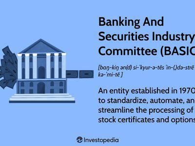

The intersection of financial services with clearing houses and algorithmic trading marks a significant evolution in the trading landscape that has shaped modern financial markets. Clearing houses play an essential role in trade execution, settlement, and risk management, ensuring the integrity and stability of the markets they serve. Their function as both intermediaries and guarantors effectively mitigates counterparty risk, thereby fostering confidence among market participants.

Algorithmic trading, characterized by its use of complex algorithms to execute trades at speeds and frequencies unattainable by human traders, has transformed market operations by enhancing speed and efficiency. This method of trading introduces substantial amounts of trading volume and liquidity, revolutionizing how trades are conducted. However, it also presents new challenges and requirements, particularly for clearing houses, as the need for rapid and accurate settlement procedures becomes paramount.



In exploring the integrated operations of clearing houses, the article investigates into the notable role of the Depository Trust & Clearing Corporation (DTCC), which exemplifies how clearing entities adapt to meet the demands of an increasingly fast-paced trading environment. Furthermore, the rise of algorithmic trading embodies a paradigm shift, pushing traditional boundaries and prompting developments in both regulatory and technological frameworks to maintain a balance between innovation and risk management.

This article aims to provide a comprehensive overview of these intertwined elements in the financial services sector, highlighting how they collectively contribute to the sophistication and functionality of contemporary trading systems.

## Table of Contents

## Understanding Clearing Houses

Clearing houses serve as critical intermediaries in financial markets, offering essential clearing and settlement services for a wide range of securities and derivatives. Their primary function is to facilitate smooth trade execution by addressing counterparty risk and ensuring the integrity of the trading process. This is achieved through robust mechanisms for trade matching and netting, which help to consolidate and simplify transactions between multiple parties.

Counterparty risk, the possibility that one party in a transaction might default on its contractual obligations, is a significant concern in trading activities. Clearing houses mitigate this risk by standing between the buyer and seller, effectively becoming the buyer to every seller and the seller to every buyer. This arrangement not only reduces the likelihood of a default affecting other market participants but also provides market stability by guaranteeing the execution of trades once matched.

The process of matching trades involves verifying that the buy and sell orders correspond accurately in terms of details like price, quantity, and security type. Netting, on the other hand, refers to the consolidation of multiple obligations to produce a single net obligation. For example, if a trader has multiple buy and sell transactions in the same security, a clearing house will net these trades to simplify settlement, potentially reducing the capital required for transaction completion.

The Depository Trust & Clearing Corporation (DTCC) exemplifies a prominent clearing house that offers diverse services across financial instruments, including equities, bonds, and derivatives. As a major player in post-trade services, DTCC provides infrastructure to clear and settle trades efficiently. This infrastructure is pivotal in maintaining market robustness, especially given the increasing complexity and [volume](/wiki/volume-trading-strategy) of global trades.

DTCC operates through several subsidiaries, each specializing in different market segments, ensuring comprehensive support for various trading activities. By centralizing these processes, DTCC reduces costs and risks for participants while enhancing transparency and accountability in financial markets.

In summary, clearing houses are indispensable components of the financial ecosystem, crucial for ensuring transaction integrity and market stability. Through the reduction of counterparty risk and trade simplification via matching and netting, they support the efficient functioning of modern financial markets.

## The Role of the Depository Trust & Clearing Corporation (DTCC)

The Depository Trust & Clearing Corporation (DTCC) was established in 1999, emerging as a pivotal entity in the financial industry's post-trade infrastructure. It was formed through the consolidation of several previously independent organizations to enhance efficiency, reduce costs, and streamline operations within the financial markets. DTCC is critical in ensuring the seamless transfer of securities, providing clearing and settlement services for various financial instruments, including equities, bonds, and derivatives.

DTCC operates through several key subsidiaries that each contribute uniquely to the clearing and settlement ecosystem. The National Securities Clearing Corporation (NSCC) is central to processing, clearing, and settling U.S. securities. It enhances market stability by providing netting services that greatly reduce the number of settlements per day, minimizing credit risk and operational complexity involved in trade settlements.

The Depository Trust Company (DTC) provides essential custody and asset servicing for securities. It facilitates the safekeeping and transfer of these assets, ensuring that transactions are executed smoothly and securely. By enabling the electronic maintenance of securities positions, DTC significantly reduces the need for physical certificates, thus enhancing market efficiency and security.

Meanwhile, the Fixed Income Clearing Corporation (FICC) is essential in managing fixed income transactions, including government and mortgage-backed securities. FICC plays a critical role in netting trades and managing counterparty risk, providing a comprehensive framework for fixed income trade settlement.

In response to evolving regulatory landscapes and technological advancements, DTCC has adapted its operations to maintain balance and efficiency across the markets it serves. The implementation of regulations like the Dodd-Frank Act and the European Market Infrastructure Regulation (EMIR) has required DTCC to enhance transparency and risk management practices. Technology has played a crucial role in its adaptation, with DTCC investing in innovative solutions such as blockchain and [artificial intelligence](/wiki/ai-artificial-intelligence) to optimize processes and reduce costs.

DTCC’s adaptability and robust framework ensure its position as a cornerstone of the financial services infrastructure, supporting billions of transactions annually and maintaining the integrity and reliability of market operations. As the financial landscape continues to evolve, DTCC is likely to remain a key player in enhancing market robustness through strategic innovations and regulatory compliance.

## Algorithmic Trading: Transforming Market Dynamics

Algorithmic trading employs sophisticated computer algorithms to execute trades with minimal human intervention, fundamentally altering the dynamics of financial markets. By analyzing vast datasets and leveraging predefined criteria, these algorithms decide on optimal trading actions within milliseconds, significantly enhancing trading speed and efficiency. This rapid trade execution is crucial in markets where price fluctuations can occur in fractions of a second, providing traders with improved access to [liquidity](/wiki/liquidity-risk-premium) and better pricing opportunities.

High-frequency trading ([HFT](/wiki/high-frequency-trading-strategies)), a specialized subset of [algorithmic trading](/wiki/algorithmic-trading), exemplifies the use of algorithms to conduct numerous trades at extraordinarily high speeds. HFT takes advantage of minute price differences across markets or delays in the updating of prices. With thousands of trades executed within seconds, HFT demands a highly reliable infrastructure. Clearing houses play an essential role here, facilitating the swift matching and settlement of trades, thereby ensuring market stability and reducing systemic risk.

The intricate nature of algorithmic trading, particularly high-frequency trading, places immense pressure on clearing mechanisms. Effective clearing and settlement processes are vital to accommodate the voluminous, swift transactions characteristic of algorithmic trading. Clearing houses reduce counterparty credit risk by standing between trade participants, thereby providing a guarantee that trades will be honored. They also employ techniques such as multilateral netting, which consolidates multiple trade positions into a single net position, reducing the amount of capital tied up in transactions and enhancing market liquidity.

As algorithmic trading continues to dominate financial markets, the demand for robust clearing solutions grows. Clearing institutions are increasingly integrating advanced technologies such as artificial intelligence and real-time data analytics to enhance their capacity to handle the high-speed nature and volume of algo trades. These innovations aim to increase the accuracy, security, and speed of the clearing and settlement process, offsetting the operational challenges posed by the efficiency-driven strategies of algorithmic trading.

Overall, the transformation brought about by algorithmic trading represents a significant shift towards more automated and efficient market operations, necessitating sophisticated risk management and clearing frameworks to ensure optimal market function.

## Integration of Clearing Houses with Algorithmic Trading

Clearing houses and algorithmic trading operations are profoundly interconnected, creating a mutually supportive ecosystem that enhances the efficiency and security of financial markets. This integration primarily relies on techniques like netting and risk management, crucial for handling the massive volumes of transactions typical in algorithmic trading environments.

Netting is a fundamental process in reducing the number of transactions and the associated risk. By offsetting multiple obligations between parties into a single net payment, clearing houses significantly decrease the complexity and potential exposure to counterparty risk. This process is vital in algorithmic trading, where trades are executed at high frequencies, necessitating swift and reliable settlement mechanisms. For example, given a series of trades where a trader buys and sells various instruments, netting consolidates these trades to minimize the number of settlements required, enhancing operational efficiency.

Risk management strategies employed by clearing houses are critical in ensuring the stability of high-frequency trading operations. These strategies include margin requirements, daily settlement of gains and losses, and maintenance of default funds. By implementing rigorous risk assessment and management protocols, clearing houses ensure that even if one party fails to meet its obligations, systemic risk is minimized, thereby protecting the integrity of the financial markets.

Automation plays an increasingly prominent role in optimizing the clearing processes for algorithmic trading. The integration of artificial intelligence (AI) and blockchain technology introduces greater efficiency and security. AI enhances decision-making in risk management by analyzing vast datasets to predict market movements and potential risks. Moreover, blockchain technology offers a decentralized ledger for recording transactions, which ensures transparency and immutability, reducing fraud risks and enhancing trust among market participants.

For example, blockchain provides real-time data verification and instant settlement capabilities, significantly improving the speed and accuracy of the clearing process. This technological advancement aligns perfectly with the requirements of algorithmic trading, where every millisecond counts.

In summary, the integration of clearing houses with algorithmic trading systems is crucial in maintaining the functionality and stability of modern financial markets. Through processes such as netting and risk management, combined with the adoption of AI and blockchain technologies, clearing operations have become more efficient, securing the vast number of trades executed by algorithmic trading platforms. This symbiotic relationship not only supports high-frequency trading but also underpins the broader financial ecosystem, ensuring robust and reliable market operations.

## Challenges and Innovations in Clearing and Settlement

Operational risks, cybersecurity threats, and market [volatility](/wiki/volatility-trading-strategies) are significant challenges that clearing houses face in their role of facilitating smooth financial transactions. These threats require robust systems and innovative solutions to ensure the security and efficiency of clearing and settlement processes. Among these solutions, emerging technologies such as blockchain and artificial intelligence (AI) offer promising advancements.

Blockchain technology enhances transparency and reduces operational risk by providing a decentralized ledger system that records all transactions in a secure, immutable manner. This technology ensures that each party involved in a transaction has access to a single source of truth, potentially reducing errors and the need for manual reconciliation. For example, clearing houses can implement smart contracts on a blockchain to automate the execution of trades once predetermined conditions are met, thereby increasing efficiency and reducing the chance of human error.

AI can be leveraged to improve various aspects of clearing and settlement operations. Machine learning algorithms can predict market trends, allowing clearing houses to manage risks proactively. Additionally, AI can bolster cybersecurity defenses by identifying patterns that signal potential threats, enabling institutions to address vulnerabilities before a breach occurs. These technologies together can streamline processes, such as trade matching and netting, by automating routine tasks and rapidly analyzing large datasets.

Regulatory frameworks, such as the Dodd-Frank Act and the European Market Infrastructure Regulation (EMIR), play an instrumental role in shaping the operations of clearing houses. These regulations require enhanced transparency, risk management practices, and adherence to stringent compliance standards. The Dodd-Frank Act, enacted in response to the 2008 financial crisis, mandates comprehensive record-keeping and stress testing to ensure that clearing houses can withstand financial shocks. Similarly, EMIR requires the use of central clearing for over-the-counter derivatives, aiming to mitigate systemic risk across the European financial market.

By aligning with these regulations and integrating advanced technologies, clearing houses can better manage the challenges posed by operational risks, cybersecurity threats, and market volatility. This combination of regulation and innovation is crucial for maintaining the stability and reliability of financial markets.

## The Future of Financial Services with Clearing Houses and Algo Trading

The integration of advanced technologies such as artificial intelligence (AI), blockchain, and cloud computing is anticipated to significantly transform clearing and settlement operations in the financial services sector. These innovations are expected to enhance the efficiency, security, and transparency of the processes underpinning clearing houses, enhancing their capacity to support the rapid execution demands of algorithmic trading.

Clearing houses, crucial for maintaining market stability and reliability, are set to become even more central as the complexity and volume of trades increase. Algorithmic trading, with its capacity for executing vast numbers of trades within milliseconds, necessitates robust and agile clearing mechanisms. Advanced technologies can help meet these demands by automating processes, thus reducing latency and improving the reliability of trade verifications and settlements.

The ongoing evolution and anticipated growth in both clearing houses and algorithmic trading are largely driven by technological advancements and shifting regulatory landscapes. For example, blockchain technology offers the potential for real-time trade settlement through decentralized and immutable ledgers, enhancing transparency and reducing counterparty risk. AI and [machine learning](/wiki/machine-learning) are being deployed to improve risk management and operational efficiency by predicting market movements and automating routine tasks.

Python, as a programming tool, plays a significant role in developing and implementing these technologies. It is widely used for building algorithms that handle high-frequency and algorithmic trading strategies, as well as for analyzing massive datasets to inform decision-making in clearing and settlements. A simple example of initiating a trade using Python might involve setting up a trade strategy based on historical data analysis:

```python
import pandas as pd
import numpy as np

def trading_strategy(data):
    data['signal'] = np.where(data['Close'] > data['Close'].shift(1), 1, -1)
    return data

# Sample usage
historical_data = pd.DataFrame({'Close': [100, 102, 101, 105, 107]})
trade_signals = trading_strategy(historical_data)
print(trade_signals)
```

Regulatory frameworks globally are being adapted to accommodate these technological changes. Initiatives like the Dodd-Frank Act in the United States and the European Market Infrastructure Regulation (EMIR) aim to bolster the resilience of financial markets, affecting how clearing houses operate. These regulations emphasize transparency, risk mitigation, and the standardization of over-the-counter derivatives.

In conclusion, the future of financial services, particularly the intersection of clearing houses and algorithmic trading, will be defined by a synthesis of technological innovation and regulatory adaptation. This dynamic environment promises increased market efficiencies, robust risk management practices, and the continual progression towards a more secure and transparent financial ecosystem.

## Conclusion

Clearing houses and algorithmic trading have become indispensable components of the contemporary financial services ecosystem. The integration of these entities supports the seamless execution of trades, especially with the high-frequency trading that defines modern markets. Clearing houses provide the critical infrastructure that manages risk and ensures the settlement of trades, facilitating algorithmic trading by providing a stable and efficient environment. 

Robust frameworks, facilitated by technological advancements, underpin the efficiency of clearing and settlement processes. These frameworks encompass sophisticated risk management techniques and netting mechanisms, allowing for the handling of large volumes of trades quickly and accurately. This efficiency is vital for high-frequency trading, where execution speed and market liquidity are paramount.

As the landscape of financial markets continues to evolve, the collaboration between clearing houses and algorithmic trading platforms is anticipated to drive further innovation and operational efficiency. This partnership is not only beneficial but necessary to address challenges such as market volatility, cybersecurity, and regulatory compliance. The future of financial services will likely witness enhanced technological integration, with clearing houses adapting to support the ever-increasing demands of algorithmic trading. This dynamic relationship will ensure that financial markets remain stable, reliable, and equipped to handle the complexities of modern trading activities, securing their pivotal role in the global economy.

## References & Further Reading

[1]: The Depository Trust & Clearing Corporation. ["DTCC: Leading the Industry in Post-Trade Market Infrastructure."](https://www.dtcc.com/)

[2]: Gomber, P., Arndt, B., Lutat, M., & Uhle, T. (2011). ["High-Frequency Trading."](https://papers.ssrn.com/sol3/papers.cfm?abstract_id=1858626) Journal of Banking and Financial Markets, 15(4), 432-453.

[3]: Aldridge, I. (2013). ["High-Frequency Trading: A Practical Guide to Algorithmic Strategies and Trading Systems"](https://www.amazon.com/High-Frequency-Trading-Practical-Algorithmic-Strategies/dp/1118343506). Wiley Finance.

[4]: Kroszner, R. S. (2006). ["The Role of Clearinghouses in Financial Markets."](https://www.semanticscholar.org/paper/Lessons-from-Financial-Crises%3A-The-Role-of-Kroszner/01053b8686e602a7f0975096199be7c246c9e31f) Chicago Fed Letter, No. 229.

[5]: Lopez de Prado, M. (2018). ["Advances in Financial Machine Learning"](https://www.amazon.com/Advances-Financial-Machine-Learning-Marcos/dp/1119482089). Wiley.

[6]: Woodford, M. (2010). ["Financial Intermediation and Macroeconomic Analysis."](https://www.aeaweb.org/articles?id=10.1257/jep.24.4.21) Journal of the European Economic Association, 8(4), 983-1017. 

[7]: Casey, M. J., & Vigna, P. (2018). ["The Truth Machine: The Blockchain and the Future of Everything"](https://books.google.com/books/about/The_Truth_Machine.html?id=37QoDwAAQBAJ). St. Martin's Press.