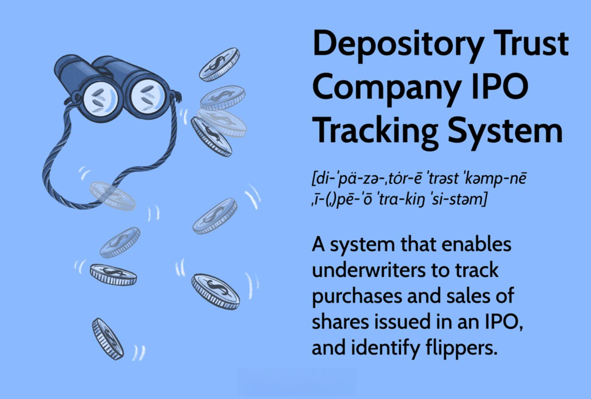

## Table of Contents

## What is the Depository Trust Company (DTC)?

The Depository Trust Company (DTC) is a big organization that helps keep track of stocks and bonds in the United States. It acts like a safe place where these investments are stored electronically, instead of having physical certificates. This makes it easier for people to buy and sell stocks and bonds without having to move paper around. The DTC was created in 1973 and is part of the Depository Trust & Clearing Corporation (DTCC).

The DTC makes sure that when someone buys or sells a stock or bond, everything goes smoothly. It does this by keeping records of who owns what and making sure the right amount of money and securities are exchanged. This is important because it helps prevent mistakes and fraud. The DTC works with banks, brokers, and other financial companies to make sure the trading of stocks and bonds is safe and efficient.

## What is an IPO and how does it relate to the DTC?

An IPO, or Initial Public Offering, is when a company decides to sell its stocks to the public for the very first time. It's like a big event where a company goes from being private, where only a few people own it, to being public, where anyone can buy its stocks. This is a way for the company to raise money, which it can use to grow bigger or pay off debts. When a company has an IPO, it works with banks and other financial helpers to decide how many stocks to sell and at what price.

The DTC, or Depository Trust Company, comes into play after the IPO happens. Once the stocks are sold to the public, the DTC helps keep track of who owns these stocks. Instead of giving people paper certificates, the DTC keeps everything electronic. This makes it easier for people to buy and sell the stocks after the IPO. The DTC makes sure that all the trades happen smoothly and that the records of who owns what are accurate. So, while the IPO is the event where the stocks are first sold, the DTC helps manage those stocks after the sale.

## What is the IPO Tracking System provided by the DTC?

The IPO Tracking System is a tool provided by the Depository Trust Company (DTC) to help with the process of an Initial Public Offering (IPO). When a company wants to go public and sell its stocks for the first time, there are a lot of steps and paperwork involved. The IPO Tracking System makes this easier by keeping track of all the important details and making sure everything is done correctly. It helps the people organizing the IPO to know exactly where they are in the process and what still needs to be done.

After the IPO, the IPO Tracking System continues to be useful. It helps keep records of who bought the stocks and makes sure that the stocks are properly transferred to the new owners. This is important because it helps prevent mistakes and makes the whole process of going public smoother and more organized. So, the IPO Tracking System is a big help both during and after an IPO.

## How does the DTC's IPO Tracking System benefit investors?

The DTC's IPO Tracking System helps investors by making the process of buying stocks during an IPO easier and more transparent. When a company goes public, there are a lot of steps and details to keep track of. The IPO Tracking System helps ensure that all these details are managed correctly, so investors can feel confident that their orders are being handled properly. This means investors can buy stocks without worrying about mistakes or delays, which is important especially during the excitement of an IPO.

After the IPO, the IPO Tracking System continues to benefit investors by keeping accurate records of who owns the stocks. This is important because it makes sure that the stocks are transferred correctly to the investors who bought them. By having a clear and reliable record, investors can be sure that their investment is safe and that they can easily sell their stocks if they want to. This helps build trust in the market and makes it easier for investors to participate in IPOs.

## What are the key features of the DTC's IPO Tracking System?

The DTC's IPO Tracking System has several important features that help make the IPO process easier and more reliable. One key feature is that it keeps track of all the important details during an IPO. This means it helps the people organizing the IPO to know exactly what's happening at every step. They can see what has been done and what still needs to be done, which helps prevent mistakes and makes sure everything goes smoothly.

Another feature is that it helps manage the paperwork and records after the IPO. Once the stocks are sold, the system keeps track of who bought them and makes sure the stocks are transferred correctly to the new owners. This is really important because it helps keep everything organized and makes sure investors get what they paid for. By keeping accurate records, the system builds trust and makes it easier for people to buy and sell stocks after the IPO.

Overall, the IPO Tracking System is designed to make the whole IPO process more efficient and transparent. It helps everyone involved, from the company going public to the investors buying stocks, to feel confident that the IPO is being managed well. This can lead to more successful IPOs and a smoother experience for everyone.

## How can one access the DTC's IPO Tracking System?

Accessing the DTC's IPO Tracking System is usually done through the professionals who help manage an IPO, like investment banks or brokers. These professionals have the tools and access needed to use the system. They use it to keep track of all the details during an IPO and to make sure everything is done correctly. So, if you're an investor interested in an IPO, you would typically work with a bank or broker who can use the system on your behalf.

As an individual investor, you don't directly access the IPO Tracking System. Instead, you rely on your bank or broker to handle the IPO process for you. They will use the system to manage your orders and make sure your stocks are transferred to you after the IPO. This way, you can focus on deciding which IPOs to invest in, while the professionals take care of the technical details.

## What types of data does the DTC's IPO Tracking System provide?

The DTC's IPO Tracking System keeps track of a lot of important information during and after an Initial Public Offering. It records details like who is buying the stocks, how many stocks they are buying, and at what price. This helps make sure that all the orders are correct and that everyone gets the stocks they paid for. The system also keeps track of when different steps of the IPO happen, so everyone knows where things stand.

After the IPO, the system continues to be useful by keeping records of who owns the stocks. This is important because it helps make sure that the stocks are transferred correctly to the new owners. The system also helps with managing any paperwork that comes after the IPO, making sure everything stays organized and accurate. By providing all this information, the IPO Tracking System helps make the whole process smoother and more trustworthy for everyone involved.

## How does the DTC ensure the accuracy and timeliness of the data in its IPO Tracking System?

The DTC makes sure the data in its IPO Tracking System is correct and up-to-date by working closely with banks and brokers. These professionals use the system to enter and check all the information about an IPO. They keep track of who is buying the stocks, how many stocks are being bought, and at what price. By having these professionals constantly update the system, the DTC can make sure the data is accurate and that any mistakes are caught quickly.

The DTC also uses technology to help keep the data timely. The system is designed to process information quickly and to send updates to everyone involved in the IPO. This means that as soon as something changes, like a new order coming in or a step in the IPO being completed, the system updates right away. This helps everyone stay informed and ensures that the IPO process moves smoothly without delays.

## Can you explain the process of tracking an IPO using the DTC's system?

When a company wants to go public and sell its stocks for the first time, the DTC's IPO Tracking System helps keep everything organized. The process starts with banks and brokers entering all the details into the system, like who is buying the stocks, how many stocks they want, and at what price. As the IPO moves forward, the system keeps track of each step, making sure everything is done on time and correctly. This helps everyone involved, from the company to the investors, know exactly what's happening.

Once the IPO is over and the stocks are sold, the DTC's system continues to be useful. It keeps a record of who owns the stocks now, making sure they are transferred to the right people. The system also helps manage any paperwork that comes after the IPO, keeping everything neat and accurate. By doing all this, the DTC makes sure that the whole process of an IPO goes smoothly and that investors can trust that their stocks are safe and correctly handled.

## What are the common challenges users face when using the DTC's IPO Tracking System and how can they be overcome?

One common challenge users face when using the DTC's IPO Tracking System is the complexity of the data. There are a lot of details to keep track of during an IPO, like who is buying the stocks, how many stocks they want, and at what price. This can be overwhelming, especially for those who are new to the system. To overcome this, it's helpful to work closely with experienced banks and brokers who can guide you through the process and make sure all the information is entered correctly.

Another challenge is making sure the data is entered and updated quickly. During an IPO, things can change fast, and delays can cause problems. To deal with this, it's important to use the system regularly and keep everything up-to-date. The DTC's system is designed to process information quickly, but it's still important for users to be proactive and enter new information as soon as it's available. By staying on top of updates, users can help ensure that the IPO process goes smoothly and that there are no delays.

## How does the DTC's IPO Tracking System integrate with other financial systems or platforms?

The DTC's IPO Tracking System works well with other financial systems and platforms by sharing information in a way that keeps everything organized. When a company has an IPO, banks and brokers use the DTC's system to keep track of all the details. They also use other systems for things like trading and managing money. The DTC's system can talk to these other systems, making sure that the information about the IPO is correct and up-to-date everywhere. This helps make the whole process of an IPO smoother and more reliable.

For example, when stocks are sold during an IPO, the DTC's system needs to tell the trading platforms about the new stocks so they can be bought and sold. It also needs to work with the systems that manage the money to make sure everyone gets paid correctly. By working together with these other systems, the DTC's IPO Tracking System helps make sure that the IPO goes well and that investors can trust the process.

## What future developments or enhancements are expected for the DTC's IPO Tracking System?

In the future, the DTC's IPO Tracking System might get better by adding new features that make it easier to use. One idea is to use more technology, like [artificial intelligence](/wiki/ai-artificial-intelligence), to help catch mistakes and make sure all the information is correct. This could make the IPO process faster and more reliable. Another possible change is to make the system easier to use on mobile devices, so people can keep track of things even when they're not at their desk. This would be really helpful for busy professionals who need to stay updated on the go.

Also, the DTC might work on making the system work even better with other financial systems. This means the IPO Tracking System could share information more quickly and smoothly with trading platforms and money management systems. By doing this, the DTC can help make the whole IPO process more efficient and trustworthy. These improvements would make it easier for companies to go public and for investors to buy stocks during an IPO.

## References & Further Reading

[1]: Bergstra, J., Bardenet, R., Bengio, Y., & Kégl, B. (2011). ["Algorithms for Hyper-Parameter Optimization."](https://papers.nips.cc/paper/4443-algorithms-for-hyper-parameter-optimization) Advances in Neural Information Processing Systems 24.

[2]: Marcos Lopez de Prado. (2018). ["Advances in Financial Machine Learning."](https://www.amazon.com/Advances-Financial-Machine-Learning-Marcos/dp/1119482089) Wiley.

[3]: David Aronson. (2006). ["Evidence-Based Technical Analysis: Applying the Scientific Method and Statistical Inference to Trading Signals."](https://www.amazon.com/Evidence-Based-Technical-Analysis-Scientific-Statistical/dp/0470008741) Wiley.

[4]: Stefan Jansen. (2020). ["Machine Learning for Algorithmic Trading."](https://github.com/stefan-jansen/machine-learning-for-trading) Packt Publishing.

[5]: Ernest P. Chan. (2008). ["Quantitative Trading: How to Build Your Own Algorithmic Trading Business."](https://www.amazon.com/Quantitative-Trading-Build-Algorithmic-Business/dp/0470284889) Wiley.