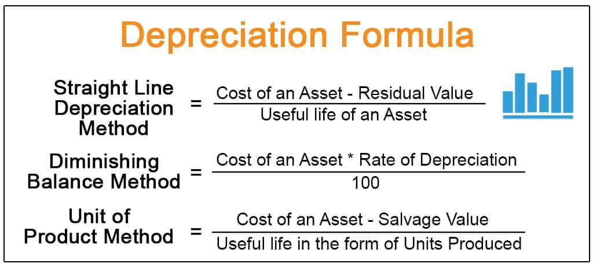

In the intricate world of finance, accounting concepts like depreciation are pivotal in shaping financial narratives. Depreciation, by systematically allocating the cost of tangible assets over their useful lives, impacts accounting records and financial reporting. It provides a method to mirror the consumption of an asset's value, offering transparency in financial statements.

This article addresses the nuanced intersection between accounting procedures, particularly depreciated cost calculations, and the paradigms of algorithmic trading. Depreciated cost calculations, which measure an asset's current worth by deducting accumulated depreciation from its original price, are fundamental in maintaining accurate financial records. These calculations not only affect the reported assets on balance sheets but also play crucial roles in tax reporting and investment analysis, areas that significantly overlap with trading operations.



The convergence of these elements influences financial reporting standards and trading strategies. Understanding how depreciation aligns asset valuation with actual utility and integrating these insights into algorithmic trading models enhances the predictive accuracy of such systems. By incorporating real-time adjustments based on asset depreciation, trading algorithms can efficiently manage asset turnover, optimize capital allocation, and forecast financial outcomes more precisely.

For professionals in both accounting and trading domains, mastering these concepts is crucial. An in-depth understanding of depreciation and its strategic implementations in algorithmic trading enables one to make informed decisions, optimize financial strategies, and ensure sustainable business growth. Proficiency in both fields can lead to improved financial statements analysis and enhanced trading performance, illustrating the significance of these concepts in the financial ecosystem.

## Table of Contents

## Understanding Depreciated Cost

Depreciated cost is the reduced value of a fixed asset, taking into account the depreciation that has accumulated over its useful life. This concept is crucial for evaluating the true worth of an asset over time, as it provides a more accurate picture compared to its initial purchase price. 

Depreciated cost is calculated to reflect the 'used up' portion of an asset's value that is recorded in a company's financial statements. By doing so, businesses can present a more accurate depiction of their financial position, enabling better decision-making for investors and stakeholders.

To compute the depreciated cost, one must deduct the cumulative depreciation from the initial purchase price of the asset. The cumulative depreciation is the total amount of the asset's value that has been allocated as an expense in the periods that have passed since the asset was acquired. This calculation helps businesses understand the asset's net book value, which is essential for financial reporting and assessment.

The formula for depreciated cost can be expressed as:

$$
\text{Depreciated Cost} = \text{Purchase Price} - \text{Accumulated Depreciation}
$$

Understanding this calculation is fundamental for accurate financial reporting. It provides transparency in showing how much of an asset's value has been consumed and how much remains, which is essential for investor analysis and financial decision-making processes. By comprehending depreciated cost, companies can align their asset valuations more closely with real-world usage, ensuring that financial statements are realistic and reflective of actual asset conditions.

## The Formula for Depreciated Cost

Depreciated Cost is calculated using the formula:

$$
\text{Depreciated Cost} = \text{Purchase Price} - \text{Cumulative Depreciation}
$$

This formula is fundamental in determining the net book value of an asset, which represents its accounted worth after accounting for wear and usage over time. The purchase price refers to the original cost of acquiring the asset, while cumulative depreciation denotes the total depreciation expensed over the asset's life up to the calculation point. By applying this formula, businesses can adjust their financial records to reflect a more accurate asset valuation, which is crucial for reporting and financial analysis purposes.

To illustrate how this might be used programmatically, consider the following Python example:

```python
def calculate_depreciated_cost(purchase_price, cumulative_depreciation):
    return purchase_price - cumulative_depreciation

# Example usage:
purchase_price = 10000  # Original cost of the asset
cumulative_depreciation = 4000  # Depreciation accumulated over the years
depreciated_cost = calculate_depreciated_cost(purchase_price, cumulative_depreciation)

print(f"Depreciated Cost: ${depreciated_cost}")
```

This approach not only ensures transparency in financial reporting but also aids in aligning the reported asset values with the actual usage and physical wear, thus providing stakeholders with a clearer picture of the company's asset management practices.

## Methods of Depreciation Calculation

Depreciation is a key concept in accounting that allows businesses to allocate the cost of a tangible asset over its useful economic life. Various methods of depreciation calculation offer flexibility in how this cost is spread over time, each catering to different financial reporting and tax implications. Below are the primary methods used to calculate depreciation:

### Straight-Line Method
The straight-line method is the most straightforward form of calculating depreciation. It spreads the asset’s cost evenly across its useful life. The annual depreciation expense is determined by subtracting the asset's salvage value from its purchase price, then dividing by the number of years of expected use. The formula is:

$$

\text{Annual Depreciation} = \frac{\text{Cost of Asset} - \text{Salvage Value}}{\text{Useful Life of Asset}} 
$$

This method is simple to apply and is often used when an asset is expected to provide utility evenly throughout its life.

### Declining Balance Method
The declining balance method accelerates depreciation, resulting in higher expenses in the earlier years of an asset’s life. It applies a constant rate of depreciation to the reducing book value of the asset each year. To calculate it, use:

$$

\text{Annual Depreciation} = \text{Book Value at Beginning of Year} \times \text{Depreciation Rate} 
$$

This method better matches the expense with the usage and revenue generation of the asset, especially if the asset loses value quickly.

### Double-Declining Balance Method
As an iteration of the declining balance method, the double-declining balance method is more aggressive, doubling the depreciation rate of the straight-line method. The formula is:

$$

\text{Annual Depreciation} = \text{Book Value at Beginning of Year} \times \left(\frac{2}{\text{Useful Life of Asset}}\right) 
$$

This method front-loads the depreciation expense, making it applicable for assets that rapidly decrease in value or quickly become obsolete.

### Sum-of-the-Years' Digits Method
The sum-of-the-years' digits method is another form of accelerated depreciation. It uses a fractional approach, where the number of years left of the asset’s life is divided by the sum of all the years. The calculation for depreciation is:

$$

\text{Annual Depreciation} = \left(\frac{\text{Remaining Life of Asset}}{\text{Sum of the Years Digits}}\right) \times (\text{Cost of Asset} - \text{Salvage Value})
$$

Where the sum of the years’ digits is calculated as:

$$

\frac{n(n+1)}{2} 
$$

with $n$ being the asset's useful life.

### Units of Production Method
The units of production method ties depreciation to actual usage rather than time, making it ideal for manufacturing equipment or vehicles. Depreciation is calculated based on the asset’s output:

$$

\text{Depreciation per Unit} = \frac{\text{Cost of Asset} - \text{Salvage Value}}{\text{Total Estimated Production}}
$$

$$

\text{Annual Depreciation} = \text{Depreciation per Unit} \times \text{Units Produced in the Period} 
$$

This method ensures that the expense recorded reflects the asset's wear and tear.

Each of these methods provides a different lens through which to view an asset’s consumption and replacement timeline, aiding businesses in financial reporting, budgeting, and strategic planning.

## Application in Algorithmic Trading

Algorithmic trading relies heavily on the efficiency and capability of automated systems and high-performance technology. These technological assets, such as servers and software, undergo wear and technological obsolescence over time, necessitating their depreciation for accurate financial reporting. Depreciation of these assets directly impacts key financial performance metrics such as net income and return on assets, which are crucial for evaluating the success of trading operations.

Proper scheduling of asset depreciation is essential for optimizing trading strategies. This process involves aligning the depreciation of technological assets with their anticipated operational lifecycle and replacement cycles. By doing so, firms can ensure that their technological infrastructure remains up-to-date, maintaining the speed and efficiency critical to [algorithmic trading](/wiki/algorithmic-trading) operations.

For example, when technological assets are depreciated accurately and timely, traders can plan more effectively for hardware upgrades or replacements. This foresight prevents bottlenecks and downtime that could negatively affect trading performance. Consider a trading firm utilizing a server expected to depreciate over five years using the straight-line method. The firm can anticipate when the server's performance might decline and budget resources for its replacement ahead of time, ensuring seamless operation of trading algorithms.

Moreover, the integration of precise depreciation calculations into algorithmic models supports the development of robust trading strategies. Traders can adjust algorithms to [factor](/wiki/factor-investing) in real-time changes in asset values, providing a more comprehensive view of operational costs and facilitating better decision-making. An example python snippet to calculate straight-line depreciation might look like this:

```python
def calculate_depreciation(purchase_price, salvage_value, useful_years):
    annual_depreciation = (purchase_price - salvage_value) / useful_years
    return annual_depreciation

# Example usage
purchase_price = 100000
salvage_value = 10000
useful_years = 5

annual_depreciation = calculate_depreciation(purchase_price, salvage_value, useful_years)
print(f"Annual Depreciation: ${annual_depreciation}")
```

This integration ensures that algorithmic models remain aligned with the actual economic value and usage of assets. By effectively managing the depreciation schedules, trading systems can be better adapted to continue delivering high performance, allowing companies to remain competitive in the fast-paced world of algorithmic trading.

## Integration of Depreciation in Trade Algorithms

Incorporating depreciation data into trading algorithms allows traders to enhance their predictive models by considering the reduction in asset values over time. This approach can significantly improve the accuracy of earnings forecasts and the management of technology and equipment longevity within algorithmic trading systems.

Given the high-performance nature of algorithmic trading, assets such as computing hardware and software undergo depreciation. Accounting for these changes in value helps traders adjust their strategies in line with the actual economic life of their assets. By integrating depreciation data, trading algorithms can dynamically update asset values and reflect real-time market conditions, thereby refining decision-making processes.

Imagine a trading model that periodically re-evaluates its technological infrastructure based on the depreciated cost of its assets. Such a model would use the formula:

$$
\text{Adjustable Asset Value} = \text{Initial Asset Value} - \text{Accumulated Depreciation to Date}
$$

This formula helps the model align its asset base with current technological needs, optimizing capital expenditure decisions and ensuring that the trading system remains efficient and competitive.

Furthermore, integrating depreciation into trading algorithms allows for precise calibration of risk management practices. Traders can simulate scenarios that account for asset depreciation, thereby ensuring they are better prepared for shifts in asset performance metrics. This approach supports the development of robust, data-driven strategies that are adaptable to changes not only in market conditions but also in the technological environment in which they operate.

Ultimately, the synergy between depreciation data and algorithmic trading systems leads to more informed trading strategies, better resource allocation, and improved financial outcomes. By maintaining an updated perspective on asset values, traders can sustain long-term growth and enhance their competitive edge in the market.

## Conclusion

Understanding the calculation and implications of depreciated cost is essential for both accounting and trading professionals. Depreciation plays a significant role in the domain of financial reporting, impacting how assets are valued and recognized over time. It directly affects the bottom line by determining expenses that reduce taxable income. This ripple effect on tax obligations emphasizes the necessity of strategic planning in any business environment.

In accounting, the methods of calculating depreciation—such as straight-line, declining balance, and units of production—ensure that asset values are aligned with their actual condition and use. Each method provides a different perspective on asset valuation, influencing reported profit margins and financial performance indicators. Properly assessing the depreciated cost allows companies to present a more realistic view of their profitability and asset turnover rates.

Incorporating depreciation knowledge into trading strategies is crucial for algorithmic trading professionals. As technological assets lose value, understanding how these changes impact financial performance can lead to more informed trading decisions. By including accurate depreciation forecasting into algorithmic models, traders can enhance their predictive capabilities, adjust quickly to market conditions, and optimize asset replacement cycles aligned with their operational strategies.

Overall, excelling in the understanding of depreciated cost calculation translates into the ability to craft optimized financial strategies. This expertise not only ensures compliance but also supports sustainable growth. By integrating these concepts into their strategic framework, both accountants and traders can better navigate the complexities of managing financial resources and ensuring long-term business success.

## References & Further Reading

Books, articles, and online resources provide valuable insights into understanding and applying depreciation in financial contexts. For a comprehensive understanding of financial accounting concepts, including depreciation, "Financial Accounting: Tools for Business Decision Making" by Paul D. Kimmel and colleagues offers a detailed exploration. This resource is instrumental for anyone seeking to grasp how depreciation affects financial statements and reporting. 

On the other hand, "Algorithmic Trading: Winning Strategies and Their Rationale" by Ernest P. Chan investigates into the nuances of algorithmic trading. This text discusses the integration of financial concepts like depreciation into trading algorithms, providing strategies that leverage data effectively for trading success. Chan’s book serves as a guide for developing trading models that incorporate real-time changes in asset values, enhancing decision-making accuracy and robustness.

These publications provide foundational knowledge and strategies for professionals in accounting and trading, offering clarity on the complexities of depreciation and its influence on financial decision-making.