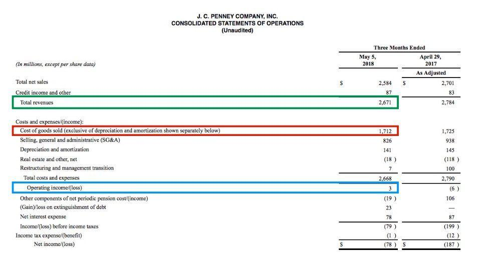

In today’s financial landscape, mastering concepts like amortization, gross profit, depreciation, and algorithmic trading is vital for investors. These principles serve as the foundation of any robust financial strategy, enabling investors to make informed decisions and optimize their returns. Amortization and depreciation are essential accounting methods used to distribute the cost of assets over their useful life, thus impacting a company’s taxable income and financial statements. Gross profit, derived after deducting the cost of goods sold from total revenue, highlights a company's efficiency in managing production-related expenses and in generating profit.

Algorithmic trading, which utilizes automated systems to execute trades based on predefined criteria, plays a crucial role in modern finance by optimizing speed and efficiency. By integrating principles such as amortization and depreciation into algorithmic models, investors can enhance cost management and strategy resilience. These concepts provide a comprehensive financial view, allowing algorithms to better anticipate market trends and execute trades effectively.



This article will explore each of these concepts in depth, illustrating their interactions and significance within the context of algorithmic trading. Understanding and implementing these tools is essential for maintaining financial compliance and refining trading strategies, ensuring that investors are well-equipped to navigate the evolving financial markets.

## Table of Contents

## Understanding Amortization and Depreciation

Amortization and depreciation are critical accounting processes that facilitate the allocation of asset costs over their useful lifetimes. They serve as essential tools for businesses to reflect the consumption and reduction in value of both intangible and tangible assets.

Amortization pertains to the gradual writing off of the cost of intangible assets over time. These intangible assets may include patents, trademarks, copyrights, and goodwill. The process of amortization ensures that the expense associated with using the intangible asset is recognized gradually, aligning with the period over which it generates revenue. For instance, if a company acquires a patent valued at $100,000 with a useful life of 10 years, the annual amortization expense would be calculated by dividing the cost by the useful life, resulting in an amortization expense of $10,000 per year. This systematic reduction in value is recorded on the financial statements, providing insight into asset utilization and aiding in financial planning.

Depreciation, on the other hand, applies to tangible assets such as machinery, vehicles, and buildings. It accounts for the decline in value of these physical assets due to factors like wear and tear, usage, and technological obsolescence. Various methods exist to calculate depreciation, including straight-line depreciation and accelerated depreciation methods like declining balance. The straight-line method divides the cost of the asset evenly across its useful life, while accelerated methods front-load the expense, recognizing a higher expense in the early years of an asset's life. This flexibility allows companies to tailor their financial reporting and tax strategies based on their unique asset utilization patterns.

Both amortization and depreciation significantly impact financial statements. They are recorded as expenses on the income statement, reducing the company's taxable income and providing a more accurate representation of the company's financial performance. By acknowledging these expenses over the asset's useful life, companies can match expenses with revenues, adhere to the matching principle of accounting, and enhance the accuracy of their profitability metrics. Additionally, these processes contribute to achieving strategic financial goals by optimizing tax efficiency and managing cash flows discreetly.

In conclusion, mastering amortization and depreciation is crucial as they play pivotal roles in financial statement preparation and asset management. Understanding these concepts not only aids in accurate financial reporting but also facilitates strategic financial decision-making.

## Gross Profit and Its Components

Gross profit is a critical financial metric that provides insight into a company's operational efficiency by measuring how effectively it manages its production-related costs to generate profit. It is calculated by subtracting the cost of goods sold (COGS) from total revenue. The formula for gross profit can be expressed as:

$$
\text{Gross Profit} = \text{Revenue} - \text{COGS}
$$

Where:
- **Revenue** is the total income generated from normal business operations and sales of goods or services.
- **COGS** includes direct costs attributable to the production of goods sold by a company, such as raw materials and direct labor expenses.

Gross profit serves as a fundamental indicator of a company's profitability before accounting for overhead, payroll, taxation, interest, and other operating expenses. A high gross profit margin suggests that the company efficiently controls production costs relative to sales, while a lower margin can indicate potential inefficiencies or increased competition leading to higher COGS.

### Key Components of Gross Profit:

1. **Revenue**: This is the starting point, representing the total monetary value of goods and services sold by the business. Revenue generation is influenced by factors such as pricing strategies, marketing effectiveness, and market demand.

2. **Direct Labor Costs**: These are wages paid to employees who are directly involved in the manufacturing of products or delivery of services. Efficient management of direct labor costs is essential, as it directly impacts the gross profit margin.

3. **Material Expenses**: This includes the cost of raw materials and components used in production. Companies strive to manage these expenses through supply chain optimization, bulk purchasing agreements, and inventory management practices.

By analyzing gross profit, companies can make informed decisions regarding pricing, production processes, and cost controls to enhance profitability. It acts as a preliminary step in assessing a firm's financial health and provides a benchmark for comparing operational performance over time and against industry peers.

## Depreciation and Amortization Impact on Financial Statements

Depreciation and amortization are crucial components in financial accounting, serving as mechanisms for allocating the cost of assets over their useful lives. Though these items do not contribute directly to gross profit, they are integral to the accurate calculation of net income on financial statements, reflecting a company's operational efficiency.

Depreciation applies to tangible assets such as machinery, vehicles, and buildings. It accounts for the wear and tear or gradual obsolescence these assets experience over time. There are several methods to calculate depreciation, the most common being the straight-line method, which equally spreads the cost over the asset's expected life. Alternatively, accelerated depreciation methods such as the declining balance method recognize higher expenses in the initial years of an asset's life.

Amortization, on the other hand, is the expensing of intangible assets like patents and copyrights, which, while lacking physical form, still diminish in value. Similar to depreciation, amortization typically uses the straight-line method, matching the cost of the intangible asset evenly across its useful life.

In the income statement, depreciation and amortization are recorded as separate line items, typically under operating expenses. This separation is vital as it distinguishes these non-cash expenses from cash outlays, providing deeper insights into a company’s operational health. By excluding these non-cash deductions from gross profit calculations, financial analysts can more accurately evaluate a company’s production efficiency and cost management.

Furthermore, understanding the impact of depreciation and amortization is essential for long-term financial strategy and asset management. These accounting processes enable companies to plan for future capital expenditures, assess tax obligations, and influence earnings before interest, taxes, depreciation, and amortization (EBITDA), a key metric used to gauge a company's operational performance.

For instance, consider a company with a machinery asset valued at $100,000, expected to last five years. Using the straight-line depreciation method, the annual depreciation expense would be:

$$
\text{Annual Depreciation Expense} = \frac{\text{Cost of Asset} - \text{Salvage Value}}{\text{Useful Life in Years}}
$$

If the salvage value is projected to be $10,000, the calculation would be:

$$
\text{Annual Depreciation Expense} = \frac{100,000 - 10,000}{5} = 18,000
$$

This annual expense would be recorded on each year's income statement, impacting net income while not affecting cash flow. Such calculations ensure that stakeholders have a comprehensive view of asset value erosion and financial health, aligning company strategy with asset management goals for sustained success.

## The Role of Algorithmic Trading

Algorithmic trading, often referred to as algo trading, utilizes automated systems to execute trading decisions based on pre-established criteria. This approach is built to maximize speed and operational efficiency, taking advantage of minimal market opportunities and slippage. These systems are designed to run complex calculations and manage large datasets rapidly, making them pivotal in today's fast-paced financial markets.

By integrating the principles of amortization and depreciation into these algorithms, traders can enhance their cost management and improve the resilience of their strategies. Amortization and depreciation are techniques that allocate the cost of assets over their useful lifespan. In the context of [algorithmic trading](/wiki/algorithmic-trading), these accounting practices are essential for accurately assessing asset values, which in turn inform better trading decisions and risk management.

Algorithms in trading analyze extensive arrays of market data — such as stock prices, trading volumes, and historical trends — to predict future market movements and identify profitable opportunities. These systems leverage financial principles, including those found in accounting, to navigate market fluctuations efficiently. For instance, an algorithm might incorporate historical asset valuation data, adjusted for depreciation, to more precisely forecast an asset's future value and its expected returns.

By systematically considering amortization and depreciation, algorithms can effectively differentiate between nominal asset values and those adjusted for wear and tear or obsolescence. This clarity allows for more informed trade execution and strategic asset management, providing a competitive edge in algorithm-driven markets.

Consequently, the incorporation of these accounting methods into algorithmic trading paves the way for more precise financial predictions. This improved accuracy helps traders maintain adherence to financial standards and optimize their strategies, ultimately navigating the nuances of dynamic market environments more effectively.

## The Interplay of Accounting Concepts in Algorithmic Trading

Amortization and depreciation play a crucial role in enhancing the analytical capabilities of algorithmic trading systems by enabling these models to incorporate a detailed and temporal understanding of asset values. Through amortization, the cost of intangible assets is evenly distributed over their useful life, while depreciation systematically reduces the book value of tangible assets, reflecting their wear and tear over time. These calculations ensure that the financial data fed into algorithmic models are both accurate and reflective of true value, aligning trading positions with prevailing accounting standards.

Incorporating these accounting concepts can significantly improve the precision of trading algorithms. Algorithms operating with current asset valuations derived from proper amortization and depreciation methodologies can better assess and manage trading risks. Consider an algorithmic trading model that factors in depreciation; it can adjust its strategy to accommodate the declining value of a firm's production equipment, thus projecting more accurate net income forecasts.

Furthermore, the integration of these principles helps traders optimize their financial outcomes. By using up-to-date asset valuations, trading algorithms can adeptly balance between risk and return, formulating strategies that leverage tax impacts and asset-ring fenced depreciations. For instance, in Python, using libraries like NumPy, one can simulate depreciation effects over time on trading positions, crafting a more resilient and informed trading strategy:

```python
import numpy as np

# Define initial value and useful life
initial_value = 100000  # Initial value of the asset
useful_life = 10  # Useful life in years

# Calculate yearly depreciation using straight-line method
def calculate_depreciation(initial_value, useful_life):
    return initial_value / useful_life

# Yearly depreciation
yearly_depreciation = calculate_depreciation(initial_value, useful_life)

# Simulate asset value over time
asset_values = [initial_value - yearly_depreciation * i for i in range(useful_life + 1)]

print("Asset values over time:", asset_values)
```

This Python script illustrates a basic straight-line depreciation model to project an asset's book value over its useful life. By integrating such models, algorithmic trading systems are equipped to anticipate the fiscal impacts of depreciation, thereby yielding refined predictions and superior financial strategies. This systematic approach to asset management within algorithmic trading underscores the importance of integrating accounting insights into trading algorithms, ultimately enhancing the potential for optimized financial outcomes.

## Conclusion

Mastering the concepts of amortization, depreciation, and gross profit is integral to achieving success in algorithmic trading. These financial principles are foundational for ensuring compliance and precision in trading strategies. Amortization involves spreading the cost of intangible assets over their useful life, which aids in understanding the ongoing value these assets contribute to a company. Meanwhile, depreciation allows for the distribution of the cost of tangible assets, providing insight into the wear and tear or usage of physical resources.

Both principles play a pivotal role in refining trading models and ensuring the accuracy of financial analysis. Gross profit, reflecting the efficiency of production processes, serves as a crucial indicator of a company's operational performance. Together, these concepts enable traders to develop robust strategies that account for asset valuation over time and optimize decision-making processes.

As financial markets and technologies continue to evolve, a thorough grasp of these accounting tools will remain critical for investors seeking to maximize returns and manage risks effectively. The integration of these methodologies within algorithmic trading systems not only enhances the accuracy of trading positions but also ensures adherence to financial standards, thereby fortifying the resilience and efficiency of trading operations in dynamic market environments.

## References & Further Reading

[1]: Bergstra, J., Bardenet, R., Bengio, Y., & Kégl, B. (2011). ["Algorithms for Hyper-Parameter Optimization."](https://dl.acm.org/doi/10.5555/2986459.2986743) Advances in Neural Information Processing Systems 24.

[2]: ["Advances in Financial Machine Learning"](https://www.amazon.com/Advances-Financial-Machine-Learning-Marcos/dp/1119482089) by Marcos Lopez de Prado

[3]: ["Evidence-Based Technical Analysis: Applying the Scientific Method and Statistical Inference to Trading Signals"](https://www.amazon.com/Evidence-Based-Technical-Analysis-Scientific-Statistical/dp/0470008741) by David Aronson

[4]: ["Machine Learning for Algorithmic Trading"](https://github.com/stefan-jansen/machine-learning-for-trading) by Stefan Jansen

[5]: ["Quantitative Trading: How to Build Your Own Algorithmic Trading Business"](https://github.com/LucindaYa/quant-resources/blob/master/Quantitative%20Trading%20How%20to%20Build%20Your%20Own%20Algorithmic%20Trading%20Business.pdf) by Ernest P. Chan