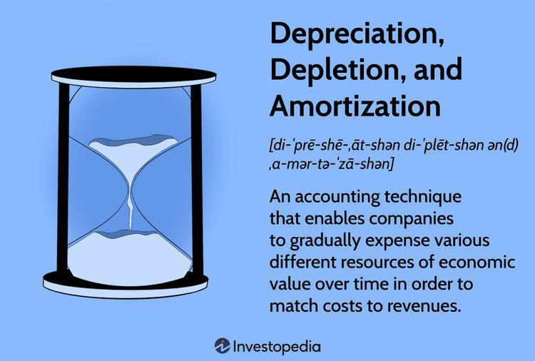

## Table of Contents

## What is depreciation and why is it important for businesses?

Depreciation is the way businesses account for the decrease in value of their assets over time. Assets like machines, vehicles, and buildings wear out or become outdated, so their value goes down. Instead of losing a big chunk of money all at once, businesses spread out this loss over several years. This helps them keep track of how much their assets are really worth and plan their finances better.

Depreciation is important for businesses because it affects their taxes and financial statements. By spreading out the cost of an asset, businesses can claim a smaller amount as an expense each year, which reduces their taxable income. This means they pay less in taxes. Also, showing depreciation on financial statements gives a more accurate picture of the business's value and performance. It helps business owners and investors make better decisions about buying new assets or planning for the future.

## Can you explain the difference between depreciation, depletion, and amortization?

Depreciation, depletion, and amortization are all ways to spread out the cost of an asset over time, but they apply to different types of assets. Depreciation is used for tangible assets like machines, vehicles, and buildings. These are physical items that wear out or get old over time, so their value goes down. Businesses use depreciation to account for this decrease in value and spread the cost of these assets over their useful life.

Depletion, on the other hand, is used for natural resources like oil, gas, and minerals. When a company extracts these resources, the amount available goes down, so the value of the resource decreases. Depletion helps businesses account for this reduction in value as they use up the resource. It's like depreciation, but for things that come from nature and can't be replaced once they're gone.

Amortization is used for intangible assets, like patents, trademarks, and software. These are things you can't touch but still have value for the business. Over time, these assets might lose their value or become less useful, so businesses spread their cost over the time they expect to use them. Amortization is similar to depreciation but applies to non-physical assets.

## What are the most common methods of calculating depreciation?

The most common methods of calculating depreciation are the straight-line method and the declining balance method. The straight-line method is the simplest. You take the cost of the asset, subtract its salvage value (what it will be worth at the end of its life), and then divide that by the number of years you expect to use the asset. This gives you the same amount of depreciation expense each year. For example, if a machine costs $10,000, has a salvage value of $2,000, and a useful life of 4 years, you would depreciate it by $2,000 each year (($10,000 - $2,000) / 4).

The declining balance method, on the other hand, lets you take a larger depreciation expense in the early years and a smaller one later on. This method is often used for assets that lose value quickly at first. A common type of declining balance method is the double-declining balance method. You start with the asset's cost and multiply it by a fixed rate, which is usually double the straight-line rate. Each year, you apply this rate to the remaining book value of the asset, not the original cost. So, the depreciation expense gets smaller each year. For example, if you use a 20% straight-line rate, the double-declining balance rate would be 40%. If the same $10,000 machine has no salvage value, the first year's depreciation would be $4,000 (40% of $10,000), the second year's would be $2,400 (40% of the remaining $6,000), and so on.

## How does depletion apply to natural resources?

Depletion is a way for businesses to keep track of how much of a natural resource they use up over time. Natural resources like oil, gas, and minerals are taken out of the ground and can't be put back. When a company takes out some of these resources, the total amount left goes down. This means the value of what's left in the ground also goes down. To show this in their financial records, businesses use depletion to spread out the cost of getting the resource over the time they use it.

For example, if a company buys the rights to a piece of land with oil, they will pay a lot of money for it. But instead of writing off the whole cost right away, they spread it out over the years they expect to be taking oil out of the ground. Each time they take out some oil, they record a bit of the cost as an expense. This way, the cost matches up with the income they get from selling the oil. It helps the company keep its financial records accurate and plan for the future, knowing how much of the resource is left and how much it's worth.

## What types of assets are typically amortized?

Amortization is used for intangible assets, which are things you can't touch but still have value. Common types of assets that are amortized include patents, trademarks, copyrights, and software. These are things a business might buy or develop to help them make money, but over time, they might lose their value or become less useful.

For example, a company might pay a lot of money to get a patent for a new invention. Instead of counting the whole cost as an expense right away, they spread it out over the years they expect to use the patent. This way, the cost matches up with the income they get from selling products that use the patent. It helps the company keep its financial records accurate and plan for the future.

## Can you provide an example of straight-line depreciation?

Imagine a small bakery buys a new oven for $5,000. They think the oven will last 5 years and then be worth $500. To figure out the depreciation using the straight-line method, they subtract the oven's salvage value from its cost and then divide by the number of years it will be used. So, it's ($5,000 - $500) divided by 5 years, which equals $900 per year. This means the bakery will record $900 as a depreciation expense every year for 5 years.

This method is simple and easy to understand. It spreads the cost of the oven evenly over the time it's used. At the end of 5 years, the total depreciation will be $4,500, and the oven's book value will be $500, which matches what they thought it would be worth at the end. This helps the bakery keep its financial records accurate and plan for when they might need to buy a new oven.

## How does the declining balance method of depreciation work?

The declining balance method of depreciation lets businesses take a bigger expense in the early years and a smaller one later on. It's good for things that lose value quickly at first, like computers or cars. You start with the cost of the item and multiply it by a fixed rate, which is often double the rate you'd use for the straight-line method. So, if the straight-line rate is 20%, the declining balance rate would be 40%. Each year, you take this rate and apply it to what's left of the item's value, not the original cost. This means the expense gets smaller each year.

For example, say a company buys a computer for $1,000 and decides to use the double-declining balance method with a 40% rate. In the first year, they'd take 40% of $1,000, which is $400, as the depreciation expense. The computer's value drops to $600. In the second year, they take 40% of the new value, so that's 40% of $600, which is $240. Now the computer is worth $360. They keep doing this until the computer is worth what they think it will be at the end, or until it's fully used up. This method helps businesses match the cost of the item with how much they use it, especially when it loses value fast at first.

## What is an example of depletion in the oil and gas industry?

Imagine a company buys the rights to drill for oil on a piece of land for $1 million. They think there are 100,000 barrels of oil in the ground. When they start drilling and pulling oil out, they need to keep track of how much oil is left and how much the oil in the ground is worth. So, they use depletion to spread out the $1 million cost over the 100,000 barrels. Each time they take out a barrel of oil, they record a small part of the $1 million as an expense. For example, if they take out 10,000 barrels in a year, they would record $100,000 as a depletion expense for that year ($1 million divided by 100,000 barrels times 10,000 barrels).

This helps the company keep its financial records accurate. It shows that the value of the oil in the ground goes down as they take it out. By spreading out the cost over time, the company can match the expense with the income they get from selling the oil. It also helps them plan for the future, knowing how much oil is left and how much it's worth.

## How is amortization calculated for intangible assets like patents?

Amortization for intangible assets like patents works a lot like depreciation for physical items, but it's used for things you can't touch. If a company buys a patent, they spread out the cost of the patent over the years they expect to use it. This helps them match the cost with the income they get from using the patent. For example, if a company buys a patent for $100,000 and thinks it will be useful for 10 years, they would divide the cost by the number of years. So, they would record $10,000 as an amortization expense each year for 10 years.

This method helps the company keep its financial records accurate. It shows that the value of the patent goes down over time as they use it. By spreading out the cost, the company can plan better for the future and know when they might need to buy or develop new patents. It also helps them show a true picture of their financial health to investors and others who look at their financial statements.

## What are the tax implications of depreciation, depletion, and amortization?

Depreciation, depletion, and amortization can lower a business's taxes. When a business spreads out the cost of an asset over time, they can take a bit of that cost as an expense each year. This lowers their taxable income, so they pay less in taxes. For example, if a company buys a machine and uses depreciation to spread out the cost, they can claim part of the machine's cost as an expense each year. This reduces their income for tax purposes, so their tax bill goes down.

Each method has its own rules for taxes. Depreciation is for things like machines and buildings. Depletion is for natural resources like oil and gas. Amortization is for things you can't touch, like patents and software. The tax laws might let businesses take more or less of these expenses in different years, depending on the method they use. It's important for businesses to know these rules so they can plan their taxes and keep their financial records right.

## How do changes in accounting standards affect the calculation of these expenses?

Changes in accounting standards can affect how businesses calculate depreciation, depletion, and amortization. These standards are rules that tell businesses how to keep their financial records. When the rules change, businesses might have to use different methods or rates to figure out these expenses. For example, if a new standard says that a certain type of asset should be depreciated over a shorter time, the business would have to take a bigger expense each year. This can change how much they pay in taxes and how their financial statements look.

These changes can be a big deal for businesses. They might have to go back and change old records to match the new rules. This can take a lot of time and money. Also, if the new standards make the expenses bigger or smaller, it can affect how much profit the business shows. This matters to investors and others who look at the business's financial health. So, businesses need to keep up with changes in accounting standards and adjust their calculations to stay accurate and follow the rules.

## Can you discuss a complex scenario where a company uses all three methods simultaneously?

Imagine a big mining company that does a lot of different things. They have machines to dig up the ground, they take out minerals like copper, and they also have special software to help them find the best places to dig. This company needs to use depreciation for their machines, depletion for the minerals, and amortization for the software, all at the same time. The machines wear out over time, so they use the straight-line method to spread out the cost evenly each year. For the minerals, they use depletion to keep track of how much they take out of the ground and how much is left. And for the software, they use amortization to spread out its cost over the years they use it.

This can get tricky because each method has its own rules and rates. The company has to keep careful records to make sure they're doing everything right. If the rules change, they might have to go back and change their old records, which can take a lot of work. But by using all three methods, the company can show a true picture of how their assets are doing and plan for the future. They can see how much their machines are worth, how much minerals they have left, and how much their software is helping them. This helps them make good decisions about when to buy new things or spend money on other parts of the business.

## What is the understanding of Depletion, Amortization, and Depreciation?

Depreciation, depletion, and amortization (DD&A) are vital accounting practices employed to systematically allocate the costs of assets across their useful lives, ensuring that financial statements accurately reflect an entity’s economic activities.

**Depreciation** concerns tangible assets, such as machinery, buildings, and equipment. It allocates the cost of these physical assets over their anticipated useful lives, accounting for the inevitable decline in value due to wear and tear or obsolescence. Methods such as straight-line depreciation, which divides the asset’s cost evenly across its useful life, and declining balance depreciation, which applies a constant rate to the decreasing book value, are commonly used. For example, in the straight-line method, the annual depreciation expense is calculated as follows: 

$$
\text{Annual Depreciation} = \frac{\text{Cost of the Asset} - \text{Residual Value}}{\text{Useful Life of the Asset}}
$$

**Amortization** pertains to intangible assets like patents, copyrights, and franchises. These assets do not have a physical presence but have value and a limited useful life. Amortization systematically lowers the book value of these intangible assets over their benefit period. Unlike depreciation, most amortization methods use a straight-line approach, spreading the asset’s cost evenly over its useful life. This treatment mirrors the cost allocation approach used for intangible assets, aligning expenses with the period the assets generate economic benefits.

**Depletion** is specific to natural resources, such as oil, minerals, and timber, where the asset is consumed over time. It allocates the cost of extracting and utilizing these resources as they are progressively exhausted. Depletion can be calculated using either cost depletion, where the total quantity of resource and the asset's purchase cost determine the depletion expense per unit extracted, or percentage depletion, a method often dictated by tax policy, where a fixed percentage of gross income generated by the resource is deducted.

Together, these methods ensure that the recorded expenses of using or consuming assets are matched to the periods in which the associated revenues are generated. This approach provides stakeholders with a transparent view of a company's financial health and operational efficiency, allowing for more informed decision-making.

## References & Further Reading

Explore comprehensive resources to deepen your understanding of financial accounting and [algorithmic trading](/wiki/algorithmic-trading):

- Consider influential texts such as "Advances in Financial Machine Learning" by Marcos López de Prado, which offers valuable insights into applying machine learning techniques within the financial markets, providing a strong foundation for developing sophisticated trading algorithms. Another essential read is "Quantitative Trading: How to Build Your Own Algorithmic Trading Business" by Ernest P. Chan, which serves as a practical guide to constructing and managing algorithmic trading strategies.

- For detailed guidance on the applications of depreciation, amortization, and depletion (DD&A), refer to Investopedia and the Financial Accounting Standards Board (FASB). Investopedia provides accessible explanations and examples of accounting principles, while FASB offers authoritative standards and guidelines crucial for financial reporting and compliance.

- Stay informed on recent advancements through reputable journals and financial publications. Journals such as the Journal of Finance and Financial Analysts Journal regularly publish recent studies and articles on financial accounting innovations and algorithmic trading. These publications can provide in-depth analyses of evolving trends and methodologies in these fields.

- This section provides a curated list of further readings and resources to enhance your knowledge in these domains. Engaging with these resources will help expand your understanding and expertise, enabling you to apply these concepts effectively in your financial and investment practices.

