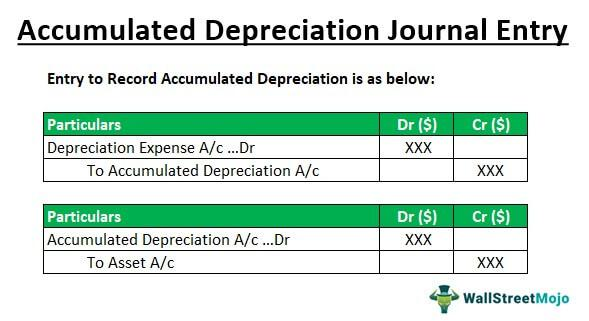

In the complex world of finance and accounting, understanding key concepts like depreciation is crucial. Depreciation is a fundamental accounting principle used to allocate the cost of tangible assets over their useful lives. This systematic allocation is critical for accurately portraying the financial health and operational efficiency of a company. By spreading the expense of an asset over time, entities can reflect the wearing down or obsolescence of assets, providing a more accurate picture of profitability.

This article aims to explain the differences and implications of two associated accounting concepts: depreciation expense and accumulated depreciation. Depreciation expense appears on the income statement and is important for understanding a company's operating costs and net profit. Accumulated depreciation, on the other hand, is recorded on the balance sheet and represents the total depreciation of an asset since its acquisition, indicating the asset's declining book value. Together, these concepts aid in responsible financial planning and reporting.



Furthermore, the integration of technology, notably algorithmic trading, is having a transformative impact on the management of these accounting elements. Algorithmic trading involves the use of algorithms to automate trading decisions and can significantly streamline financial data management, including depreciation schedules. These advanced tools can enhance accuracy, speed up financial reporting processes, and aid in strategic decision-making regarding asset utilization and replacement.

A comprehensive understanding of depreciation is essential for investors, accountants, and financial analysts alike. As they navigate financial statements, make investment decisions, or plan strategic initiatives, they must accurately interpret depreciation figures to assess an organization's financial performance and potential. In the ever-evolving landscape of finance, grasping these concepts will not only aid in compliance and reporting but also in leveraging technology for efficient financial management.

## Table of Contents

## What is Depreciation Expense?

Depreciation expense is a fundamental concept in accounting that represents the systematic allocation of an asset's cost over its useful life. This allocation is necessary to match the cost of the asset with the revenue it generates during a specific financial period. By spreading the cost over several years, companies can present a more accurate picture of their profitability and financial performance.

On the income statement, depreciation expense appears as a non-cash charge, reducing the company's taxable income and reported net income. Although it does not directly affect cash flow, it influences profitability metrics, which are crucial for stakeholders assessing a company's operational efficiency and financial health.

The calculation of depreciation expense involves several methods, each with distinct implications for financial reporting. The most common method is the straight-line depreciation, which evenly allocates the asset's cost over its useful life. The formula for straight-line depreciation is:

$$
\text{Depreciation Expense} = \frac{\text{Cost of Asset} - \text{Salvage Value}}{\text{Useful Life}}
$$

Other methods include the declining balance and units of production methods, each of which offers different expense recognition patterns based on asset usage or accelerated depreciation preferences.

Regular computation of depreciation expense helps in accurately reflecting the cost of using an asset, thereby aiding companies in budgeting for future asset replacements. This ensures that the company's financial statements provide an authentic depiction of the wear and tear on its assets, leading to better-informed investment and management decisions.

Ultimately, understanding and effectively managing depreciation expense provides companies with the ability to strategically plan for asset acquisition and replacement, maintaining operational continuity and optimal financial performance.

## Understanding Accumulated Depreciation

Accumulated depreciation accounts for the total depreciation of an asset from the time it is acquired until the present. It is crucial for accurately determining an asset's value on the balance sheet. Accumulated depreciation is classified as a contra-asset account, effectively reducing the gross value of the asset. This allows businesses to reflect more accurately the declining value of assets over time due to wear and tear, obsolescence, or passage of time.

The method of depreciation chosen by a company can significantly impact accumulated depreciation. Common methods include straight-line, declining balance, and units of production. For example, the straight-line method allocates an equal portion of the asset's value over its useful life:

$$
\text{Depreciation Expense} = \frac{\text{Cost of Asset} - \text{Salvage Value}}{\text{Useful Life}}
$$

Accumulated depreciation increases annually by the depreciation expense recorded for the given period. For instance, if an asset is depreciated using the straight-line method, accumulated depreciation will increase by the same amount annually until the asset is fully depreciated.

In financial reporting, accumulated depreciation aids in determining the net book value of an asset, calculated as:

$$
\text{Net Book Value} = \text{Cost of Asset} - \text{Accumulated Depreciation}
$$

This net book value provides stakeholders with insights into the current worth of an asset, which is vital for investment decisions, lending evaluations, and financial analysis.

Proper calculation and reporting of accumulated depreciation are essential for transparency and accuracy in financial statements. It helps ensure that the assets' values are neither overstated nor understated, giving a more realistic picture of a company's financial health and asset management efficiency.

## Key Differences between Depreciation Expense and Accumulated Depreciation

Depreciation expense and accumulated depreciation are critical components in financial accounting, both linked to the reduction of an asset's value over time, yet serving distinctly different roles within financial statements.

Depreciation expense is the amount allocated to an asset within a single accounting period, typically a year, reflecting the wear and tear or obsolescence of the asset during that period. This allocation is crucial for financial statements as it provides a closer estimate of the actual costs incurred in generating revenue, thus helping in assessing the operational efficiency of a business. The calculation of depreciation expense can follow various methods, such as straight-line or declining balance methods, depending on the nature of the asset and management's judgment. For instance, the straight-line method is calculated using the formula:

$$
\text{Depreciation Expense} = \frac{\text{Cost of the Asset} - \text{Salvage Value}}{\text{Useful Life of the Asset}}
$$

where the salvage value is the estimated residual value at the end of the asset's useful life.

On the other hand, accumulated depreciation accounts for the total depreciation of an asset from its acquisition to the current date. It is presented on the balance sheet as a contra-asset account and serves to reduce the book value of the asset. This cumulative measure gives stakeholders insights into how much of the asset's cost has been expensed, thus impacting the calculation of an asset's net book value, which is derived as:

$$
\text{Net Book Value} = \text{Cost of the Asset} - \text{Accumulated Depreciation}
$$

Accumulated depreciation continues to grow over the life of the asset, providing a comprehensive picture of the total expense attributed to the depreciation so far.

In summary, while depreciation expense pertains to a single period and aids in evaluating the performance for that period, accumulated depreciation amasses all such expenses, offering a broader view of the asset's diminishing value over time. Understanding these differences is fundamental for accurate financial analysis and strategic decision-making.

## The Role of Algo Trading in Managing Depreciation

Algorithmic trading, commonly known as algo trading, involves using computer algorithms to execute trading strategies at high speed and efficiency. This technology can be adapted beyond securities trading to enhance various financial and accounting processes, including the management of depreciation schedules. By leveraging the power of algorithms, businesses can streamline the administration of financial data associated with depreciation, ultimately enhancing the accuracy and efficiency of financial management.

One significant advantage of using algorithmic tools in managing depreciation is the increased accuracy and speed in financial reporting. Traditional methods of accounting for depreciation involve manual calculations and the risk of human error. With algorithmic systems, these calculations can be automated, reducing the likelihood of inaccuracies. For instance, depreciation schedules—outlining the depreciation expense allocated over an asset's life—can be efficiently managed by algorithms that automatically adjust for asset purchases, disposals, and changes in depreciation methods or rates.

Moreover, algorithms can significantly enhance decision-making processes. By analyzing large datasets quickly, algo trading tools provide accountants and financial professionals with detailed insights into asset utilization and depreciation trends. This enables more accurate predictions regarding asset replacement or upgrades, allowing companies to allocate resources more effectively and reduce unnecessary capital expenditures.

Advanced algorithms can also facilitate scenario analysis and forecasting, essential for strategic planning. Companies can simulate various scenarios through computational models to assess the impact of different asset management strategies on depreciation expenses and accumulated depreciation. This predictive capability supports the development of robust financial strategies by allowing companies to plan for future asset needs proactively.

Python, as a programming language, offers robust libraries like NumPy and pandas, which can be used to develop algorithms that process financial data related to depreciation. For instance, algorithms can be created to automatically update depreciation schedules based on real-time asset data input. Here is a simple Python snippet illustrating how pandas could be leveraged to calculate and update depreciation:

```python
import pandas as pd

# Sample asset data
data = {'Asset': ['Machine A', 'Machine B'],
        'Initial Value': [50000, 80000],
        'Useful Life': [5, 10],
        'Depreciation Rate': [0.2, 0.1]}

df = pd.DataFrame(data)

# Calculate yearly depreciation expense
df['Annual Depreciation'] = df['Initial Value'] * df['Depreciation Rate']

# Update accumulated depreciation over time
df['Accumulated Depreciation'] = df['Annual Depreciation'].cumsum()

print(df)
```

In conclusion, integrating [algorithmic trading](/wiki/algorithmic-trading) techniques into the management of depreciation schedules offers significant benefits in terms of speed, accuracy, and strategic insight. Financial professionals equipped with these advanced tools can make better-informed decisions, enhance their company's financial reporting accuracy, and effectively strategize asset management and replacement, thereby optimizing overall financial performance.

## FAQs on Depreciation and Algo Trading

**Is accumulated depreciation the same as depreciation expense?**

Accumulated depreciation and depreciation expense, while related, are distinct accounting concepts. Depreciation expense refers to the periodic allocation of an asset's cost, representing how much of an asset's value is consumed during a specific accounting period. It is recorded on the income statement and affects a company's net income by reflecting the usage cost of tangible assets like machinery or buildings over that period. For instance, if an asset costs $10,000 and has a useful life of 10 years, the annual depreciation expense might be $1,000 assuming straight-line depreciation.

Accumulated depreciation, on the other hand, is the cumulative total of all depreciation expenses recorded for an asset since its acquisition. This figure appears on the balance sheet as a contra-asset account, which reduces the gross value of the asset. Using the previous example, if the asset has been depreciated for three years, the accumulated depreciation would be $3,000. Thus, while depreciation expense affects income statements, accumulated depreciation impacts the book value presented on the balance sheet.

**How does depreciation impact a company’s financial performance?**

Depreciation affects a company's financial performance by influencing both profitability and asset valuation. On the income statement, depreciation expense reduces taxable income, potentially lowering tax liabilities, which can enhance cash flow. This expense is a non-cash charge, meaning it doesn't directly impact cash reserves but alters the reported net income. Hence, companies often use depreciation to smooth earnings over time.

On the balance sheet, accumulated depreciation adjusts the book value of assets, contributing to the precise calculation of net asset value and affecting key financial ratios, such as return on assets (ROA). By reducing the carrying amount of an asset, depreciation reflects the decline in utility and helps in financial analysis and decision-making regarding asset replacement and investment.

**Can algo trading be applied to depreciation management effectively?**

Algorithmic trading, commonly associated with executing trades at high speeds, can extend its utility to the domain of financial management, including the oversight of depreciation schedules. Advanced algorithms can improve the precision and speed of financial processes, providing real-time data analysis, which can aid in strategic decision-making.

In depreciation management, algorithms can be programmed to optimize asset usage, project cash flow implications of different depreciation methods, and recalibrate asset replacement strategies by scanning large data sets for patterns. Python, for example, with libraries such as Pandas or NumPy, can be employed to model depreciation scenarios and forecast their financial impacts. Through automation and predictive analytics, algorithmic tools thus enable more informed management of assets, aligning financial reporting with strategic business objectives.

## The Bottom Line

Depreciation expense and accumulated depreciation are essential components of financial accounting. These concepts help ensure that financial statements reflect the true economic value of a company's assets. Depreciation expense allocates the cost of tangible assets over their useful life, affecting the income statement and giving stakeholders a clear view of operational efficiency. Accumulated depreciation, conversely, is recorded on the balance sheet and provides a cumulative total of all depreciation expenses charged against an asset over time. This plays a vital role in determining the net book value of assets, which is crucial for assessing a company's financial health and guiding asset management decisions.

Incorporating the advancements of algorithmic trading into the management of depreciation processes can optimize overall financial management. Algorithmic trading systems are designed to process large volumes of financial data rapidly and accurately. This ability can be leveraged to automate and refine depreciation schedules, ensuring that the latest financial data and market conditions inform asset depreciation strategies. Through the use of algorithmic tools, financial professionals and accountants can achieve more precise and timely insights into asset management, forecasting needs for asset replacement, and strategic financial planning.

By enhancing depreciation management with algorithmic trading techniques, companies can improve their financial reporting accuracy and strategic asset utilization, ultimately leading to more efficient financial operations and stronger financial performance. Integrating these technological advancements can transform traditional accounting practices, offering a competitive edge in financial management.

## References & Further Reading

[1]: Atrill, P., & McLaney, E. (2015). ["Accounting and Finance for Non-Specialists"](https://www.pearson.com/nl/en_NL/higher-education/subject-catalogue/accounting-and-taxation/Atrill-McClaney-Financial-Accounting-and-finance-for-non-specialists-12e.html). Pearson Education.

[2]: Brigham, E.F., & Daves, P.R. (2019). ["Intermediate Financial Management"](https://www.amazon.com/Intermediate-Financial-Management-Eugene-Brigham/dp/1337395080). Cengage Learning.

[3]: ["Financial Accounting Theory and Analysis: Text and Cases"](https://archive.org/details/financialaccount0000schr) by Richard G. Schroeder, Myrtle W. Clark, and Jack M. Cathey

[4]: ["Algorithmic Trading and DMA: An Introduction to Direct Access Trading Strategies"](https://www.amazon.com/Algorithmic-Trading-DMA-introduction-strategies/dp/0956399207) by Barry Johnson

[5]: ["Machine Learning for Asset Managers"](https://www.cambridge.org/core/books/machine-learning-for-asset-managers/6D9211305EA2E425D33A9F38D0AE3545) by Marcos Lopez de Prado