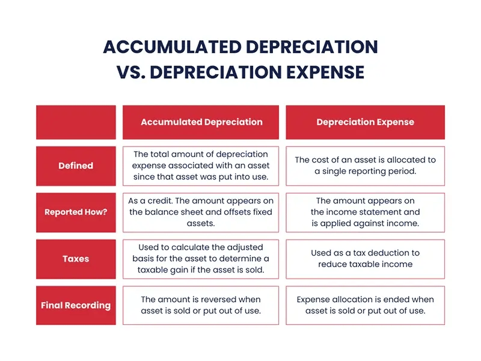

## Table of Contents

## What is depreciation expense?

Depreciation expense is the way businesses account for the cost of using up assets over time. Imagine you buy a machine for your factory. That machine won't last forever; it will wear out or become outdated. So, instead of counting the whole cost of the machine in the year you buy it, you spread the cost over the years you use it. This spread-out cost is called depreciation expense.

It's important for businesses because it helps them show a more accurate picture of their profits. If they didn't use depreciation, their profits would look too low in the early years when they buy expensive equipment, and too high in later years. By using depreciation, they can match the expense of the machine to the income it helps generate, which gives a clearer view of how the business is doing financially.

## What is accumulated depreciation?

Accumulated depreciation is like a running total of all the depreciation expenses that have been recorded for an asset over time. Imagine you have a car for your business. Every year, you note down how much the car has worn out, and that's your depreciation expense for the year. You keep adding up these yearly expenses, and that sum is your accumulated depreciation. It shows up on your balance sheet as a negative number, reducing the value of the car on your books.

This total helps businesses figure out the current book value of their assets. If you bought that car for $20,000 and your accumulated depreciation on it is $5,000, the book value of the car is now $15,000. It's a way to keep track of how much life an asset has left and helps in making decisions about whether to keep using it, repair it, or replace it. Accumulated depreciation is important for giving a clear picture of what the business owns and how much those things are worth now.

## How does depreciation expense affect the income statement?

Depreciation expense shows up on the income statement as an expense, just like salaries or rent. It's a way to spread out the cost of big things a business buys, like machines or buildings, over the time they use them. When a business adds depreciation expense to their income statement, it makes their profit look smaller. That's because expenses are subtracted from the money the business makes to figure out how much profit they have left.

For example, if a business makes $100,000 in a year and has a depreciation expense of $10,000, their profit before other expenses would be $90,000. This doesn't mean the business actually spent $10,000 that year on the asset; it's just an accounting way to show the asset is getting used up. By including depreciation, the income statement gives a more accurate view of the business's financial health over time, not just in the year they bought the asset.

## How is accumulated depreciation reflected on the balance sheet?

Accumulated depreciation is shown on the balance sheet as a negative number. It's like a running total of how much an asset has worn out over time. If a business bought a truck for $50,000 and the accumulated depreciation on it is $20,000, the balance sheet will show the truck at a lower value, now at $30,000. This helps show what the truck is really worth now, after it's been used for a while.

This number is important because it helps everyone see the true value of the business's stuff. It's not just about what they paid for things, but what those things are worth today. By subtracting accumulated depreciation from the original cost, the balance sheet gives a clearer picture of what the business owns and how much those things are worth right now.

## What are the main methods used to calculate depreciation expense?

There are a few common ways to figure out depreciation expense. The straight-line method is the simplest. You take the cost of the asset, subtract any value it might have at the end of its life (called salvage value), and then divide that by how many years you expect to use it. This gives you the same amount of depreciation expense each year. For example, if a machine costs $10,000, has a salvage value of $2,000, and you plan to use it for 8 years, you'd depreciate it by $1,000 each year (($10,000 - $2,000) / 8).

Another method is the declining balance method, which lets you take bigger depreciation expenses in the early years when the asset is new. You start with a fixed rate, like double the straight-line rate, and apply it to the asset's book value each year. So if you use a 20% rate (double the straight-line rate for a 5-year asset), you'd depreciate 20% of the remaining book value each year. This means the depreciation expense gets smaller over time as the asset's value goes down.

The units of production method is different because it bases depreciation on how much you actually use the asset. You figure out how many units the asset can produce in its lifetime, and then you depreciate it based on how many units it actually produces each year. If a machine can make 100,000 units and costs $10,000 with no salvage value, you'd depreciate it by $0.10 per unit ($10,000 / 100,000). If you make 10,000 units in a year, your depreciation expense for that year would be $1,000.

## How do you calculate accumulated depreciation over time?

To calculate accumulated depreciation over time, you add up all the depreciation expenses you've recorded for an asset each year. Let's say you bought a machine for $10,000 and you use the straight-line method to depreciate it over 5 years with no salvage value. Each year, you'd record a depreciation expense of $2,000 ($10,000 / 5). After the first year, your accumulated depreciation would be $2,000. After the second year, you'd add another $2,000, so your accumulated depreciation would be $4,000. You keep adding the yearly depreciation expense to the total until you reach the end of the asset's useful life.

If you use a different method like the declining balance method, the calculation changes a bit. Let's say you use a 40% declining balance rate for the same $10,000 machine. In the first year, you'd depreciate 40% of $10,000, which is $4,000, so your accumulated depreciation would be $4,000. In the second year, you'd depreciate 40% of the remaining $6,000, which is $2,400, making your accumulated depreciation $6,400. You keep doing this each year, always using 40% of the remaining book value, until the asset is fully depreciated or reaches its salvage value if it has one.

## What is the difference between depreciation expense and accumulated depreciation?

Depreciation expense is the amount of an asset's cost that a business charges as an expense each year. It's like spreading out the cost of something big over the years you use it. For example, if you buy a truck for your business, you don't count the whole cost of the truck in the year you buy it. Instead, you figure out how long you'll use the truck and divide the cost over those years. This yearly amount is your depreciation expense, and it shows up on your income statement as a way to match the cost of using the truck with the income it helps you make.

Accumulated depreciation, on the other hand, is the total of all the depreciation expenses you've recorded for an asset over time. It's like a running total that keeps growing each year as you add more depreciation expense. This total is shown on your balance sheet as a negative number, which reduces the value of the asset. So if you bought that truck for $20,000 and after a few years your accumulated depreciation is $5,000, the truck's value on your balance sheet would be $15,000. This helps show how much the truck is worth now, after it's been used for a while.

## How does depreciation impact the book value of an asset?

Depreciation lowers the book value of an asset over time. When you buy something big for your business, like a truck or a machine, you record it at its full cost on your balance sheet. But as you use it, it wears out or gets old, so you need to show that it's worth less now. You do this by taking a bit of the cost each year and calling it depreciation expense. This amount gets added to something called accumulated depreciation, which is a total of all the depreciation you've recorded so far. When you subtract this total from the original cost, you get the book value, which is what the asset is worth on your books now.

For example, if you bought a truck for $20,000 and after a few years your accumulated depreciation is $5,000, the book value of the truck would be $15,000. This means the truck is now worth $15,000 on your balance sheet, not the $20,000 you paid for it. This helps give a more accurate picture of what your business owns and how much those things are worth now. It's important for making good decisions about whether to keep using the truck, fix it up, or get a new one.

## Can depreciation expense be reversed?

Depreciation expense can't be reversed once it's recorded. Think of it like this: when you use a big thing for your business, like a truck, you spread out its cost over time. Each year, you say part of that cost is used up, and that's your depreciation expense. Once you've said that part is used up, you can't take it back. It's like saying you used up some of the truck's life, and you can't un-use it.

But, there's a special situation where you might change how you record depreciation. If you find out that the truck will last longer than you thought, or if you decide to use a different way to figure out depreciation, you can change how you do it going forward. But you don't go back and change the depreciation you already recorded. You just start using the new way from then on. So, while you can adjust your future depreciation, you can't reverse what's already been recorded.

## How does the choice of depreciation method affect financial reporting?

The choice of depreciation method can change how a business looks on its financial statements. If a business picks the straight-line method, it spreads out the cost of an asset evenly over its life. This makes the profit look the same each year because the depreciation expense is the same. But if they choose the declining balance method, the depreciation expense is bigger in the early years and smaller later on. This makes the profit look lower at first but higher later, which can make the business seem like it's doing better as time goes on.

The units of production method bases depreciation on how much the asset is used, so the profit can go up and down based on how busy the business is. This can make the financial statements look more unpredictable. Choosing the right method matters because it affects how much profit the business shows and how much tax it has to pay. It also changes how investors and banks see the business, so it's important to pick a method that matches how the business really uses its assets.

## What are the tax implications of depreciation expense and accumulated depreciation?

Depreciation expense helps businesses lower their taxes. When a business buys a big thing like a machine or a truck, it can't take all the cost as an expense right away. Instead, it spreads the cost over time with depreciation. This means the business can subtract a bit of the cost from its income each year, which makes its profit look smaller. Smaller profit means less tax to pay. So, depreciation is a way to save on taxes by matching the cost of the big thing with the money it helps make over time.

Accumulated depreciation doesn't directly affect taxes, but it helps show what the big thing is worth now. It's the total of all the depreciation expenses added up over time. When a business sells the big thing, it has to figure out if it made a profit or a loss on the sale. To do this, it subtracts the accumulated depreciation from what it paid for the thing to find out its book value. If the business sells it for more than the book value, it might have to pay tax on the profit. If it sells it for less, it might be able to use the loss to lower its taxes. So, accumulated depreciation helps with figuring out taxes when selling off assets.

## How do changes in accounting estimates affect depreciation expense and accumulated depreciation?

When a business changes its guess about how long an asset will last or what it will be worth at the end of its life, it has to change how it figures out depreciation. This is called a change in accounting estimate. For example, if a business thought a machine would last 5 years but now thinks it will last 7 years, it needs to spread out the cost of the machine over 7 years instead of 5. This means the depreciation expense each year will be smaller because it's spread out over more years. The business doesn't go back and change the depreciation it already recorded, but it changes how it does it from now on.

These changes also affect accumulated depreciation. Since the depreciation expense each year is different after the change, the total of all the depreciation expenses, which is the accumulated depreciation, will be different too. If the business is spreading the cost over more years, the accumulated depreciation will grow more slowly. This means the book value of the asset, which is what it's worth on the books after subtracting accumulated depreciation, will be higher for a while. So, changes in accounting estimates can make a big difference in how a business looks on its financial statements.

## What is Depreciation Expense?

Depreciation expense is a fundamental concept in accounting that represents the systematic allocation of an asset's cost over its useful life. This allocation is necessary to match the cost of the asset with the revenue it generates during a specific financial period. By spreading the cost over several years, companies can present a more accurate picture of their profitability and financial performance.

On the income statement, depreciation expense appears as a non-cash charge, reducing the company's taxable income and reported net income. Although it does not directly affect cash flow, it influences profitability metrics, which are crucial for stakeholders assessing a company's operational efficiency and financial health.

The calculation of depreciation expense involves several methods, each with distinct implications for financial reporting. The most common method is the straight-line depreciation, which evenly allocates the asset's cost over its useful life. The formula for straight-line depreciation is:

$$
\text{Depreciation Expense} = \frac{\text{Cost of Asset} - \text{Salvage Value}}{\text{Useful Life}}
$$

Other methods include the declining balance and units of production methods, each of which offers different expense recognition patterns based on asset usage or accelerated depreciation preferences.

Regular computation of depreciation expense helps in accurately reflecting the cost of using an asset, thereby aiding companies in budgeting for future asset replacements. This ensures that the company's financial statements provide an authentic depiction of the wear and tear on its assets, leading to better-informed investment and management decisions.

Ultimately, understanding and effectively managing depreciation expense provides companies with the ability to strategically plan for asset acquisition and replacement, maintaining operational continuity and optimal financial performance.

## What is Understanding Accumulated Depreciation?

Accumulated depreciation accounts for the total depreciation of an asset from the time it is acquired until the present. It is crucial for accurately determining an asset's value on the balance sheet. Accumulated depreciation is classified as a contra-asset account, effectively reducing the gross value of the asset. This allows businesses to reflect more accurately the declining value of assets over time due to wear and tear, obsolescence, or passage of time.

The method of depreciation chosen by a company can significantly impact accumulated depreciation. Common methods include straight-line, declining balance, and units of production. For example, the straight-line method allocates an equal portion of the asset's value over its useful life:

$$
\text{Depreciation Expense} = \frac{\text{Cost of Asset} - \text{Salvage Value}}{\text{Useful Life}}
$$

Accumulated depreciation increases annually by the depreciation expense recorded for the given period. For instance, if an asset is depreciated using the straight-line method, accumulated depreciation will increase by the same amount annually until the asset is fully depreciated.

In financial reporting, accumulated depreciation aids in determining the net book value of an asset, calculated as:

$$
\text{Net Book Value} = \text{Cost of Asset} - \text{Accumulated Depreciation}
$$

This net book value provides stakeholders with insights into the current worth of an asset, which is vital for investment decisions, lending evaluations, and financial analysis.

Proper calculation and reporting of accumulated depreciation are essential for transparency and accuracy in financial statements. It helps ensure that the assets' values are neither overstated nor understated, giving a more realistic picture of a company's financial health and asset management efficiency.

## What are the key differences between Depreciation Expense and Accumulated Depreciation?

Depreciation expense and accumulated depreciation are critical components in financial accounting, both linked to the reduction of an asset's value over time, yet serving distinctly different roles within financial statements.

Depreciation expense is the amount allocated to an asset within a single accounting period, typically a year, reflecting the wear and tear or obsolescence of the asset during that period. This allocation is crucial for financial statements as it provides a closer estimate of the actual costs incurred in generating revenue, thus helping in assessing the operational efficiency of a business. The calculation of depreciation expense can follow various methods, such as straight-line or declining balance methods, depending on the nature of the asset and management's judgment. For instance, the straight-line method is calculated using the formula:

$$
\text{Depreciation Expense} = \frac{\text{Cost of the Asset} - \text{Salvage Value}}{\text{Useful Life of the Asset}}
$$

where the salvage value is the estimated residual value at the end of the asset's useful life.

On the other hand, accumulated depreciation accounts for the total depreciation of an asset from its acquisition to the current date. It is presented on the balance sheet as a contra-asset account and serves to reduce the book value of the asset. This cumulative measure gives stakeholders insights into how much of the asset's cost has been expensed, thus impacting the calculation of an asset's net book value, which is derived as:

$$
\text{Net Book Value} = \text{Cost of the Asset} - \text{Accumulated Depreciation}
$$

Accumulated depreciation continues to grow over the life of the asset, providing a comprehensive picture of the total expense attributed to the depreciation so far.

In summary, while depreciation expense pertains to a single period and aids in evaluating the performance for that period, accumulated depreciation amasses all such expenses, offering a broader view of the asset's diminishing value over time. Understanding these differences is fundamental for accurate financial analysis and strategic decision-making.

## References & Further Reading

[1]: Atrill, P., & McLaney, E. (2015). ["Accounting and Finance for Non-Specialists"](https://www.pearson.com/nl/en_NL/higher-education/subject-catalogue/accounting-and-taxation/Atrill-McClaney-Financial-Accounting-and-finance-for-non-specialists-12e.html). Pearson Education.

[2]: Brigham, E.F., & Daves, P.R. (2019). ["Intermediate Financial Management"](https://www.amazon.com/Intermediate-Financial-Management-Eugene-Brigham/dp/1337395080). Cengage Learning.

[3]: ["Financial Accounting Theory and Analysis: Text and Cases"](https://archive.org/details/financialaccount0000schr) by Richard G. Schroeder, Myrtle W. Clark, and Jack M. Cathey

[4]: ["Algorithmic Trading and DMA: An Introduction to Direct Access Trading Strategies"](https://www.amazon.com/Algorithmic-Trading-DMA-introduction-strategies/dp/0956399207) by Barry Johnson

[5]: ["Machine Learning for Asset Managers"](https://www.cambridge.org/core/books/machine-learning-for-asset-managers/6D9211305EA2E425D33A9F38D0AE3545) by Marcos Lopez de Prado