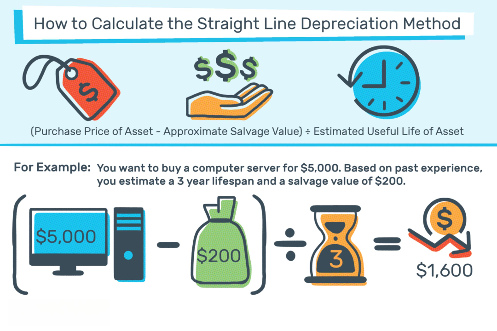

## Table of Contents

## What is depreciation recapture?

Depreciation recapture is a tax rule that applies when you sell a property that you've claimed depreciation on. Depreciation is when you deduct the cost of an asset over time because it wears out or becomes outdated. When you sell the property, the IRS wants some of that money back. They do this by taxing the amount you've depreciated as regular income, up to a certain limit.

This rule mainly affects people who own rental properties or business assets. If you sell your property for more than its depreciated value, you have to "recapture" the depreciation you claimed. The tax rate for this recaptured amount can be as high as 25%, which is usually higher than the capital gains tax rate. It's important to keep track of your depreciation and understand this rule to avoid surprises when you sell your property.

## Why is depreciation recapture important for tax purposes?

Depreciation recapture is important for tax purposes because it helps the government get back some of the tax benefits you received from depreciating your property. When you own a rental property or a business asset, you can claim depreciation on your taxes each year. This lowers your taxable income because you're saying the value of your property is going down over time. But when you sell the property, the IRS wants to make sure you don't keep all those tax benefits if you sell it for more than its depreciated value.

So, when you sell your property, you have to pay taxes on the amount you claimed as depreciation. This is called depreciation recapture, and it's taxed at a higher rate than regular capital gains, up to 25%. This rule makes sure that you don't get to keep all the tax benefits from depreciation if you end up selling your property for a profit. It's a way for the government to balance out the tax advantages you got while you owned the property.

## How does depreciation recapture affect the sale of a property?

When you sell a property that you've claimed depreciation on, you have to pay a special tax called depreciation recapture. This tax is on the amount of depreciation you claimed while you owned the property. The IRS wants some of that money back because you got tax benefits from saying the property was losing value over time. The tax rate for depreciation recapture can be as high as 25%, which is usually more than the tax rate for regular profits from selling a property.

Depreciation recapture can make a big difference in how much money you get to keep after selling your property. If you claimed a lot of depreciation, you might have to pay a lot in taxes when you sell. This can lower the amount of profit you make from the sale. It's important to think about depreciation recapture when you're planning to sell a property, so you're not surprised by a big tax bill.

## What types of property are subject to depreciation recapture?

Depreciation recapture applies to properties that you can claim depreciation on. This usually includes things like rental properties and business assets. If you own a house and rent it out, you can claim depreciation on it. The same goes for things like machines, vehicles, or equipment that you use for your business.

When you sell these kinds of properties, you have to pay back some of the tax benefits you got from depreciation. This is called depreciation recapture. The tax is on the amount of depreciation you claimed while you owned the property. It can be as high as 25%, which is usually more than the tax you pay on regular profits from selling a property. This rule helps the government get back some of the money you saved on taxes while you were claiming depreciation.

## How is depreciation recapture calculated for real property?

Depreciation recapture for real property is calculated when you sell a property you've claimed depreciation on. First, you need to know the total amount of depreciation you claimed over the years you owned the property. This is the amount you'll have to "recapture" when you sell. The IRS wants you to pay back some of the tax benefits you got from saying the property was losing value over time.

When you sell the property, you have to figure out how much profit you made. This is called your "gain." If your gain is more than the total depreciation you claimed, you have to pay a special tax on the amount of depreciation. This tax is called depreciation recapture, and it can be as high as 25%. So, if you claimed $50,000 in depreciation and your gain from selling the property is more than $50,000, you'll have to pay the recapture tax on that $50,000. This can make a big difference in how much money you get to keep after selling your property.

## What is the difference between Section 1245 and Section 1250 property in terms of depreciation recapture?

Section 1245 and Section 1250 are two types of property that have different rules for depreciation recapture. Section 1245 property includes things like machinery, equipment, and other personal property used in a business. When you sell Section 1245 property, you have to pay back the full amount of depreciation you claimed as ordinary income. This means you could be taxed at your regular income tax rate, which can be up to 37%.

On the other hand, Section 1250 property is mainly real property, like buildings and structures. When you sell Section 1250 property, the depreciation recapture is taxed at a special rate of up to 25%. This is usually lower than the rate for Section 1245 property. However, if you sell Section 1250 property at a gain that's more than the depreciation you claimed, the extra gain is taxed at the regular capital gains rate, which can be lower than the recapture rate. These differences can affect how much tax you pay when you sell your property, so it's important to know which type of property you have.

## How do you determine the amount of depreciation recapture when selling a rental property?

When you sell a rental property, you need to figure out how much depreciation recapture you owe. First, add up all the depreciation you claimed on the property while you owned it. This is the amount you have to "recapture" when you sell. If you sell the property for more than its depreciated value, you have to pay a special tax on the amount of depreciation you claimed. This tax can be as high as 25%, which is usually more than the tax on regular profits from selling a property.

To find out your depreciation recapture, start by calculating your total gain from the sale. This is the difference between what you sold the property for and what you originally paid for it, minus any selling costs. If your gain is more than the total depreciation you claimed, you have to pay the recapture tax on the amount of depreciation. For example, if you claimed $30,000 in depreciation and your gain from selling the property is $50,000, you'll have to pay the recapture tax on that $30,000. This can lower the amount of money you get to keep after selling your rental property.

## What are the tax rates applied to depreciation recapture?

Depreciation recapture is when you have to pay back some of the tax benefits you got from claiming depreciation on a property. The tax rate for depreciation recapture depends on the type of property you're selling. For real property, like buildings, the tax rate can be up to 25%. This is usually higher than the tax rate for regular profits from selling a property.

For personal property used in a business, like machinery or equipment, the tax rate can be even higher. When you sell this kind of property, you have to pay back the full amount of depreciation you claimed as regular income. This means you could be taxed at your regular income tax rate, which can be as high as 37%. Knowing these rates can help you figure out how much tax you'll have to pay when you sell your property.

## How can depreciation recapture impact long-term investment strategies?

Depreciation recapture can have a big effect on long-term investment strategies, especially if you own rental properties or business assets. When you claim depreciation on a property, you get tax benefits while you own it. But when you sell the property, you have to pay back some of those benefits through depreciation recapture. This can lower the amount of money you get to keep from the sale. So, when you're planning your investments, you need to think about how much depreciation recapture might cost you when you sell. This can help you decide whether to keep a property longer or sell it sooner.

For example, if you know you'll have to pay a lot in depreciation recapture, you might want to hold onto the property longer to spread out the tax impact. Or, you might decide to sell the property when you're in a lower tax bracket, so the recapture tax isn't as high. It's important to think about these things when you're making long-term investment plans. Understanding depreciation recapture can help you make smarter choices about when to buy and sell properties, and how to manage your taxes over time.

## Are there any strategies to minimize the tax impact of depreciation recapture?

One way to minimize the tax impact of depreciation recapture is to use a 1031 exchange. This is when you sell a property and use the money to buy another similar property. If you do this right, you can delay paying the depreciation recapture tax until you sell the new property. This can help you keep more money now and spread out the tax over time. But you have to follow the rules carefully, or you might have to pay the tax right away.

Another strategy is to sell the property when you're in a lower tax bracket. The tax on depreciation recapture can be as high as 25% for real property, but if you're in a lower tax bracket, you might pay less. You could also think about holding onto the property longer. If you keep it for a long time, you might be able to spread out the tax impact over many years. It's a good idea to talk to a tax advisor to figure out the best plan for your situation.

## What documentation is required to accurately report depreciation recapture on tax returns?

To accurately report depreciation recapture on your tax returns, you'll need to keep good records of the property you own. This includes the original purchase price, the total amount of depreciation you claimed over the years, and the sale price of the property. You'll also need to know if the property is Section 1245 or Section 1250, because this affects the tax rate for depreciation recapture. Make sure to keep all receipts, invoices, and any other documents that show how much you spent on the property and how much you claimed in depreciation.

When you fill out your tax return, you'll use Form 4797 to report the sale of the property and calculate the depreciation recapture. On this form, you'll list the property's details, including the date you bought it, the date you sold it, and the amounts involved. You'll also need to attach any additional forms or schedules that show how you calculated the depreciation. It's important to be accurate and complete, because the IRS will use this information to figure out how much tax you owe on the depreciation recapture. If you're not sure how to do this, it's a good idea to talk to a tax professional who can help you get it right.

## How does depreciation recapture interact with other tax provisions like capital gains?

When you sell a property, you have to think about both depreciation recapture and capital gains. Depreciation recapture is when you have to pay back some of the tax benefits you got from claiming depreciation on the property. This tax can be up to 25% for real property like buildings, and it's on the total amount of depreciation you claimed. Capital gains tax is what you pay on the profit you make from selling the property, after you've paid back the depreciation. The tax rate for capital gains can be lower, usually between 0% and 20%, depending on how long you owned the property and your income.

If you sell a property for more than its depreciated value, you have to pay the depreciation recapture tax first. Only after you've paid that do you figure out your capital gains. For example, if you claimed $30,000 in depreciation and sold the property for a $50,000 profit, you'd pay the recapture tax on the $30,000 first. Then, you'd pay capital gains tax on the remaining $20,000. This means you might end up paying different tax rates on different parts of your profit from selling the property.

## How do asset depreciation and tax calculations work?

Asset depreciation is the systematic allocation of an asset's cost over its useful life, allowing businesses to reflect the asset's consumption and wear. This process is crucial for financial management as it impacts financial statements and tax liabilities. By depreciating assets, companies can match expenses with generated revenues, thereby providing a more accurate financial picture. Furthermore, depreciation helps reduce taxable income, leading to tax savings over the asset's lifetime.

Several methods exist for calculating depreciation, each with distinct advantages and disadvantages:

1. **Straight-Line Depreciation**: This method distributes an asset's cost evenly across its useful life. It is simple to calculate and widely used, offering consistency in financial reporting. However, it may not accurately reflect the actual wear and tear of an asset that has a higher utility during its early years.
$$
   \text{Depreciation Expense} = \frac{\text{Cost of Asset} - \text{Salvage Value}}{\text{Useful Life}}

$$

2. **Declining Balance Depreciation**: This accelerated method applies a constant rate to the asset's declining book value, producing higher depreciation in the early years. It is suitable for assets that rapidly lose value and provides tax benefits by deferring tax liabilities.

3. **Sum-of-the-Years'-Digits Depreciation**: Another accelerated depreciation method, it assigns more depreciation in the initial years. This method involves a fractional allocation based on the sum of the years' digits.

4. **Modified Accelerated Cost Recovery System (MACRS)**: Widely used in the United States, MACRS offers different depreciation schedules based on asset class, allowing businesses to accelerate deductions and optimize cash flows.

Accurate depreciation calculations are essential for minimizing tax liabilities and optimizing financial planning. By capturing the true cost of asset usage, businesses can achieve better capital allocation, manage expenses effectively, and plan for future investments. When calculations fall short in precision, companies face the risk of misstated financial performance and unexpected tax burdens.

Different asset categories are treated under distinct tax laws. For instance, buildings often use straight-line depreciation, while vehicles might qualify for accelerated methods. Understanding these classifications is vital for compliance and tax efficiency.

Technological advancements have led to the development of tools and software that automate and simplify asset depreciation tax calculations. Software such as QuickBooks, SAP, and Xero offer features to manage fixed assets and automate depreciation schedules. These tools not only ensure accuracy but also save time, allowing businesses to focus on strategic financial decisions.

Here's a simple example of calculating straight-line depreciation in Python:

```python
def calculate_straight_line_depreciation(cost, salvage_value, useful_life):
    depreciation_expense = (cost - salvage_value) / useful_life
    return depreciation_expense

# Example usage
cost_of_asset = 10000  # USD
salvage_value = 2000   # USD
useful_life = 5        # years

depreciation = calculate_straight_line_depreciation(cost_of_asset, salvage_value, useful_life)
print(f"Annual Depreciation Expense: ${depreciation}")
```

By leveraging such automated solutions, businesses can enhance accuracy, maintain compliance, and make informed financial decisions that integrate seamlessly into broader financial strategies.

## References & Further Reading

[1]: Kohler, M. J. (2016). ["The Tax and Legal Playbook: Game-Changing Solutions to Your Small Business Questions."](https://www.amazon.com/Tax-Legal-Playbook-Game-Changing-Solutions/dp/1599186438) Entrepreneur Press.

[2]: Chan, E. P. (2013). ["Algorithmic Trading: Winning Strategies and Their Rationale."](https://github.com/ftvision/quant_trading_echan_book) Wiley.

[3]: Internal Revenue Service. (2022). ["Publication 946: How to Depreciate Property."](https://www.irs.gov/pub/irs-prior/p946--2022.pdf) U.S. Department of the Treasury.

[4]: Lopez de Prado, M. (2018). ["Advances in Financial Machine Learning."](https://www.amazon.com/Advances-Financial-Machine-Learning-Marcos/dp/1119482089) Wiley.

[5]: U.S. Securities and Exchange Commission. ["Algorithmic Trading: Overview of How the SEC Regulates Securities Markets."](https://www.sec.gov/about/reports-publications/algo_trading_report_2020) 

[6]: Commodity Futures Trading Commission. ["Automated Trading."](https://www.cftc.gov/sites/default/files/idc/groups/public/@economicanalysis/documents/file/oce_automatedtrading.pdf) 

[7]: Aarons, D. (2006). ["Evidence-Based Technical Analysis: Applying the Scientific Method and Statistical Inference to Trading Signals."](https://www.amazon.com/Evidence-Based-Technical-Analysis-Scientific-Statistical/dp/0470008741) Wiley.

[8]: Jansen, S. (2018). ["Machine Learning for Algorithmic Trading."](https://github.com/stefan-jansen/machine-learning-for-trading) Packt Publishing.