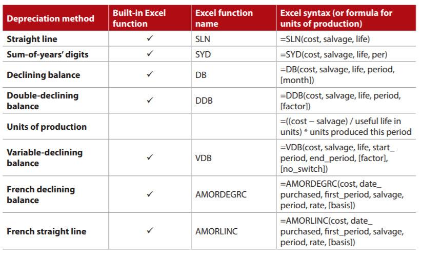

## Table of Contents

## What is depreciation and why is it important for businesses?

Depreciation is the way businesses account for the decrease in value of their assets over time. Imagine you buy a new computer for your business. As you use it, it gets older and less valuable. Depreciation helps you spread out the cost of that computer over the years you use it, instead of taking the whole cost in the year you bought it.

This is important for businesses because it helps them show a more accurate picture of their finances. By spreading out the cost of assets, businesses can match the expense of the asset with the income it helps generate. This makes it easier to understand how much profit the business is really making each year. It also helps with tax calculations, as depreciation can reduce the amount of taxable income a business reports.

## What are the different types of depreciation methods?

There are several ways businesses can calculate depreciation, and each method has its own way of spreading out the cost of an asset. The straight-line method is the simplest. It spreads the cost evenly over the asset's useful life. For example, if you buy a machine for $10,000 and it lasts 5 years, you'd claim $2,000 in depreciation each year. The declining balance method, on the other hand, lets you claim more depreciation in the early years and less as time goes on. This can be good for assets that lose value quickly at first.

Another method is the units of production method, which bases depreciation on how much the asset is used. If a machine makes 10,000 units over its life and you use it to make 2,000 units in a year, you'd claim 20% of its cost as depreciation that year. The sum-of-the-years'-digits method is a bit more complicated but still useful. It also lets you claim more depreciation early on, but it uses a formula based on the asset's useful life to figure out how much to claim each year. Each method can be useful depending on the type of asset and how the business wants to manage its finances.

## How does the Straight-Line Depreciation method work?

The Straight-Line Depreciation method is a simple way to spread out the cost of an asset over its useful life. Imagine you buy a piece of equipment for your business. You know how long it will last and how much it cost. With this method, you divide the cost of the equipment by the number of years it will be useful. For example, if you buy a machine for $10,000 and it will last 5 years, you would claim $2,000 in depreciation each year. It's like taking the total cost and breaking it into equal pieces for each year.

This method is easy to understand and use, which is why many businesses like it. It's great for assets that lose value at a steady rate. Every year, you claim the same amount of depreciation, so it's simple to plan your finances. However, it might not be the best choice for assets that lose value quickly at first and then slow down. But for things like buildings or office furniture, the Straight-Line method works well because it keeps things straightforward and predictable.

## Can you explain the Declining Balance Depreciation method with an example?

The Declining Balance Depreciation method is a way to claim more depreciation in the early years of an asset's life and less as time goes on. It's like saying the asset loses value faster at first and then slows down. To use this method, you start with the asset's original cost and multiply it by a fixed rate. This rate is usually double the straight-line rate, so it's called the Double Declining Balance method. But you can use other rates too.

Let's say you buy a computer for your business for $2,000, and it will last 5 years. With the Double Declining Balance method, the straight-line rate would be 20% (100% divided by 5 years). So, you double that to get a 40% rate. In the first year, you'd claim 40% of $2,000, which is $800 in depreciation. Now the computer's book value is $1,200. In the second year, you take 40% of $1,200, which is $480. You keep doing this each year, but you stop when the asset's book value reaches its salvage value, or when you've claimed the total cost of the asset, whichever comes first. This method is good for things like computers or cars, which lose a lot of value right away.

## What is the Units of Production Depreciation method and when is it most useful?

The Units of Production Depreciation method is a way to figure out how much an asset loses value based on how much you use it. Imagine you have a machine that makes parts. Instead of saying it will last 5 years, you say it will make 10,000 parts over its life. If you use it to make 2,000 parts in a year, you'd claim 20% of the machine's cost as depreciation that year. It's like saying the more you use it, the more it wears out, and the more you can claim in depreciation.

This method is most useful when an asset's value depends on how much you use it, not just how old it is. It's great for things like machines in a factory or vehicles that drive a lot of miles. If you use the asset more in one year, you can claim more depreciation that year. This can help match the cost of the asset more closely with the income it helps you make. It's a fair way to spread out the cost because it's based on actual use, not just time.

## How do you calculate depreciation using the Sum-of-the-Years'-Digits method?

The Sum-of-the-Years'-Digits method is a way to claim more depreciation in the early years of an asset's life and less as time goes on. To use this method, you first figure out the sum of the years' digits. If an asset lasts 5 years, you add up the numbers 5 + 4 + 3 + 2 + 1, which equals 15. This 15 is your sum-of-the-years'-digits. Then, you figure out the fraction you'll use for each year. In the first year, you'd use 5/15, in the second year 4/15, and so on until the last year, when you'd use 1/15.

Let's say you buy a machine for $10,000 that will last 5 years. In the first year, you'd claim 5/15 of the cost, which is $3,333.33 in depreciation. In the second year, you'd claim 4/15, which is $2,666.67. You keep going like this, claiming a smaller fraction each year. This method is good for things that lose value quickly at first, like computers or cars. It helps you spread out the cost in a way that matches how the asset loses value over time.

## What are the tax implications of different depreciation methods?

The way you choose to calculate depreciation can affect how much tax you pay each year. If you use a method like the Declining Balance or Sum-of-the-Years'-Digits, you can claim more depreciation in the early years. This means you'll have less taxable income in those years, so you might pay less tax. But later on, when you're claiming less depreciation, your taxable income will be higher, and you might pay more tax. It's like borrowing from the future to save on taxes now.

On the other hand, if you use the Straight-Line method, you'll claim the same amount of depreciation every year. This keeps your taxable income more even over time. You won't save as much on taxes in the early years, but you also won't have a big jump in taxes later on. The Units of Production method can be a bit different. If you use the asset a lot in one year, you'll claim more depreciation and have less taxable income that year. It all depends on how you use the asset and what makes the most sense for your business.

## How does depreciation affect financial statements?

Depreciation affects financial statements by changing the value of assets and the amount of expenses a business reports. When you claim depreciation, you're saying that an asset, like a machine or a computer, is worth less than it was when you bought it. This means the value of your assets on the balance sheet goes down. At the same time, depreciation is an expense on the income statement. It reduces your net income because it's like saying you spent money on the asset over time.

This can make a big difference in how your business looks financially. If you claim a lot of depreciation in one year, your net income will be lower, and your assets will be worth less on paper. This can affect things like how much tax you pay and how investors see your business. But it's important to remember that depreciation is just an accounting way to spread out the cost of an asset. It doesn't mean you have less money in the bank. It's all about showing a fair picture of how your business is doing over time.

## What is the Modified Accelerated Cost Recovery System (MACRS) and how is it used?

The Modified Accelerated Cost Recovery System (MACRS) is a way to figure out depreciation for tax purposes in the United States. It's a bit different from the methods we talked about before because it's set up by the tax rules. MACRS lets businesses claim more depreciation in the early years of an asset's life, kind of like the Declining Balance method. It's meant to help businesses save on taxes by letting them write off the cost of their assets faster.

To use MACRS, you first figure out which "class" your asset belongs to. The tax rules say how long different types of assets should last, like 5 years for computers or 7 years for office furniture. Then, you use a special table to find out how much depreciation you can claim each year. This table tells you the percentage you can claim, and it's set up so you claim more in the early years. MACRS can be a bit tricky to figure out, but it's important for businesses because it can save them money on taxes.

## How do international accounting standards (IAS) treat depreciation?

International Accounting Standards (IAS), specifically IAS 16, set rules for how businesses should handle depreciation. These rules say that businesses need to spread out the cost of their assets over the time they use them. This means figuring out how long an asset will last and then claiming a bit of its cost as an expense each year. IAS 16 allows businesses to use different methods like the Straight-Line method or the Declining Balance method, as long as they pick a method that shows the asset's value going down in a fair way.

The main idea behind IAS 16 is to make sure that financial statements show a true picture of a business's finances. By claiming depreciation, businesses can match the cost of their assets with the income those assets help them make. This helps everyone see how much profit the business is really making each year. It's important for businesses all over the world to follow these rules so that people can compare financial statements from different countries and understand them easily.

## What are the considerations for choosing a depreciation method for a specific asset?

When choosing a depreciation method for a specific asset, businesses need to think about how the asset loses value over time. Some assets, like computers or cars, lose a lot of value right away and then slow down. For these, methods like the Declining Balance or Sum-of-the-Years'-Digits might make more sense because they let you claim more depreciation in the early years. Other assets, like buildings or office furniture, might lose value at a steady rate. For those, the Straight-Line method could be better because it spreads the cost evenly over time.

Another thing to consider is how the depreciation method will affect your taxes and financial statements. If you want to save on taxes in the early years, you might choose a method that lets you claim more depreciation right away. But remember, this means you'll have less to claim later on, so your taxes might go up in the future. Also, think about how the method will show your business's finances. If you claim a lot of depreciation in one year, your net income will be lower, and your assets will be worth less on paper. It's all about finding a method that matches how the asset loses value and fits with your business's financial goals.

## How can software tools assist in managing and calculating depreciation for a company?

Software tools can make it a lot easier for companies to keep track of and figure out depreciation. These tools can automatically calculate depreciation using different methods like Straight-Line, Declining Balance, or Units of Production. All you need to do is put in the details about your assets, like how much they cost and how long they will last. The software then does the math for you and keeps everything organized. This saves a lot of time and helps make sure you're doing things right, especially when you have a lot of assets to keep track of.

Using software also helps with reporting and planning. It can create reports that show how much depreciation you're claiming each year and how this affects your financial statements. This is really helpful when you're getting ready for tax time or when you need to show your financials to investors or banks. Plus, many software tools can work with other accounting systems, so everything stays up to date and connected. This makes managing depreciation a lot simpler and helps businesses make better financial decisions.

## What are the types of depreciation?

Depreciation is a fundamental concept in accounting, and various methods exist to allocate the cost of assets over their useful life. Each method has distinct applications and advantages, tailored to different asset types and business requirements.

1. **Straight-Line Method**: This is the most straightforward method, where an asset's cost is evenly spread over its estimated useful life. It's calculated using the formula:
$$
   \text{Annual Depreciation} = \frac{\text{Cost} - \text{Salvage Value}}{\text{Useful Life}}

$$

   This method is ideal for assets that generate consistent benefits over time.

2. **Declining Balance Method**: This accelerated depreciation approach results in higher expense in the earlier years of an asset's life, reflecting rapid obsolescence or usage. The depreciation is calculated using a fixed percentage of the asset's remaining book value each year:
$$
   \text{Depreciation Expense} = \text{Book Value at Beginning of Year} \times \text{Depreciation Rate}

$$

   The depreciation rate is typically higher than the straight-line rate.

3. **Double-Declining Balance Method**: As a more aggressive accelerated method, it doubles the rate used in the declining balance method. This approach again emphasizes higher depreciation costs in the initial periods and is expressed as follows:
$$
   \text{Depreciation Expense} = \text{Book Value at Beginning of Year} \times \left(\frac{2}{\text{Useful Life}}\right)

$$

   This method is often employed for assets that quickly reduce in utility or value.

4. **Sum-of-the-Years' Digits Method**: Another accelerated depreciation method, this calculates annual depreciation based on a fraction of the asset's depreciable cost. The numerator of the fraction decreases each year, while the denominator remains constant and is the sum of the years' digits. The formula is:
$$
   \text{Depreciation Expense} = \frac{\text{Remaining Life of Asset}}{\text{Sum of Years' Digits}} \times (\text{Cost} - \text{Salvage Value})

$$

   The sum of years' digits for an asset with a five-year life is $1+2+3+4+5=15$.

5. **Units of Production Method**: This method ties depreciation directly to the asset's output, making it ideal for manufacturing equipment or vehicles. Depreciation expense is calculated proportionately based on actual use:
$$
   \text{Depreciation Expense} = \left(\frac{\text{Cost} - \text{Salvage Value}}{\text{Total Estimated Production}}\right) \times \text{Units Produced}

$$

   Each depreciation method offers distinct advantages and suitability based on the nature of the asset, its usage pattern, and business strategic goals. These methods enable businesses to align their financial accounting practices with operational realities and tax planning strategies.

## What is the relationship between Algorithmic Trading and Depreciation?

Algorithmic trading, characterized by the use of automated software systems to execute trading decisions, requires careful consideration of asset depreciation. These systems often comprise sophisticated hardware and technology, which represent significant capital investments. As with any other physical asset, these components depreciate over time, impacting both the costs and the strategic planning of trading operations.

Understanding depreciation is crucial for optimizing the financial performance of trading systems. Depreciation affects the fixed costs associated with trading, influencing the calculation of net profits. For instance, computer hardware and servers, integral to high-frequency trading platforms, experience wear and technological obsolescence. As these assets lose value, they need systematic evaluation to ensure that the operating costs are accurately reflected in financial records. This evaluation involves choosing an appropriate depreciation method, such as the Straight-Line or Declining Balance method, depending on how the asset's productivity decreases over time.

Consider a scenario where a computer server, essential for executing trading algorithms, was purchased for $10,000 with an anticipated useful life of 5 years and a salvage value of $1,000. Using the Straight-Line method, annual depreciation is calculated as:

$$
\text{Depreciation Expense} = \frac{\text{Cost} - \text{Salvage Value}}{\text{Useful Life}} = \frac{10,000 - 1,000}{5} = 1,800 \, \text{per year.}
$$

This consistent expense impacts annual net income assessments, aiding traders in aligning their financial forecasts and operational budgets with actual resource value diminution.

Another aspect to consider is the timing of asset replacement and its financial implications. Automated systems must often remain cutting-edge to maintain competitive edge; thus, integrating depreciation strategies allows traders to anticipate asset replacement and associated costs. By aligning depreciation schedules with financial forecasting, traders can ensure they have the necessary capital reserves for timely upgrades, while also using depreciation tax benefits to their advantage, thereby optimizing cash flow.

In high-frequency [algorithmic trading](/wiki/algorithmic-trading), where profits are dependent on speed and efficiency, the quality of underlying hardware is critical. Therefore, synchronizing financial forecasts with depreciation schedules is vital for maintaining efficient trading infrastructure. Such synchronization ensures adequate planning for reinvestment in technological advancements, preserving the efficacy of trading algorithms.

In sum, incorporating depreciation understanding into trading strategies enables traders not only to manage costs effectively but also to sustain long-term operational efficiency in evolving technological landscapes.

## References & Further Reading

[1]: ["Financial Accounting: Tools for Business Decision Making"](https://books.google.com/books/about/Financial_Accounting.html?id=tidEEAAAQBAJ) by Paul D. Kimmel, Jerry J. Weygandt, and Donald E. Kieso

[2]: ["Intermediate Accounting"](https://accountingtestprep.com/intermediate-accounting-2/) by Donald E. Kieso, Jerry J. Weygandt, and Terry D. Warfield

[3]: ["Depreciation: Simplified Explanation and Calculation with Examples"](https://www.investopedia.com/terms/d/depreciation.asp) by Ravindra B. Vora

[4]: ["Algorithmic Trading: Winning Strategies and Their Rationale"](https://www.wiley.com/en-us/Algorithmic+Trading%3A+Winning+Strategies+and+Their+Rationale-p-9781118460146) by Ernest P. Chan

[5]: ["Algorithmic Trading and DMA: An Introduction to Direct Access Trading Strategies"](https://www.semanticscholar.org/paper/Algorithmic-trading-%26-DMA-%3A-an-introduction-to-Johnson/aa5de1ab883d5e23b6651faa7c1807586d688e4b) by Barry Johnson