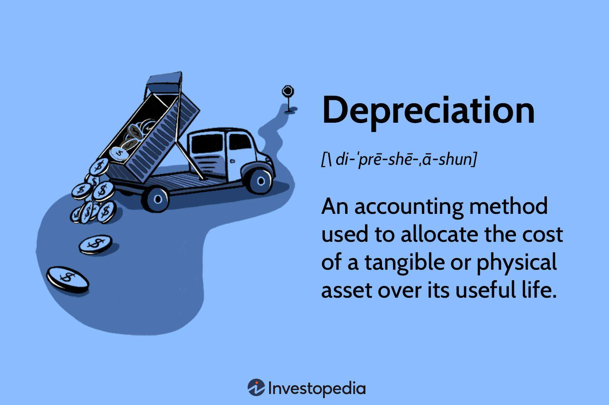

## Table of Contents

## What is depreciation?

Depreciation is the way we account for the loss in value of things like machines, vehicles, or buildings over time. Imagine you buy a new car. As soon as you drive it off the lot, it's worth less than what you paid. That decrease in value is what we call depreciation. Businesses use depreciation to spread out the cost of an asset over its useful life, which helps them match the expense with the income the asset helps to generate.

There are different methods to calculate depreciation, but the most common ones are straight-line and declining balance. In the straight-line method, you divide the cost of the asset by how many years it will be useful, and you deduct the same amount each year. The declining balance method lets you deduct more in the early years and less as time goes on, which can be useful if the asset loses value quickly at first. Both methods help businesses keep their financial records accurate and plan for future expenses.

## Why is depreciation important for businesses?

Depreciation is important for businesses because it helps them keep track of how much their assets are worth over time. When a business buys something big like a machine or a truck, it doesn't lose all its value right away. Instead, it loses value little by little as it gets older or used more. By using depreciation, a business can figure out how much the asset is worth each year and show that in their financial records. This helps them know the true value of what they own and make better decisions about buying new things or fixing old ones.

Another reason depreciation is important is that it helps businesses manage their taxes and profits. When a business calculates depreciation, it can deduct that amount from its income. This means they pay less in taxes because their taxable income is lower. It also helps them see their real profit more clearly. Without depreciation, a business might think it's making more money than it really is, because it's not accounting for the fact that its assets are getting older and less valuable. By using depreciation, businesses can plan better for the future and make sure they're not spending more than they can afford.

## What are the different methods of calculating depreciation?

There are several ways to calculate depreciation, and each one works a bit differently. The straight-line method is the simplest. You take the cost of the asset and subtract what you think it will be worth at the end of its life, called the salvage value. Then, you divide that number by how many years the asset will be useful. This gives you the same amount of depreciation to deduct each year. It's like spreading the cost evenly over time.

Another method is the declining balance method, which is good for assets that lose value faster at the beginning. Instead of deducting the same amount each year, you start with a bigger deduction and it gets smaller as time goes on. You take a fixed percentage of the asset's book value at the beginning of each year and deduct that. This means you're taking off more in the early years when the asset is newer and less as it gets older.

There's also the units of production method, which is useful if you want to base depreciation on how much the asset is actually used. You figure out how many units the asset can produce over its life, and then you calculate depreciation based on how many units it actually produces each year. This way, if the asset is used more in one year, you'll deduct more depreciation for that year. It's a good fit for things like machines in a factory where usage can vary a lot from year to year.

## How does depreciation affect financial statements?

Depreciation affects financial statements by showing how much the value of assets goes down over time. On the balance sheet, it reduces the value of the asset and increases the amount in the accumulated depreciation account, which is a part of the total assets. This makes the total value of the business's assets go down, giving a more accurate picture of what the company owns. It's like saying, "This machine is worth less now because it's older," and that helps everyone see the true value of the business.

On the income statement, depreciation is an expense. When you add it to other expenses, it reduces the company's net income. This is important because it shows the real cost of using the asset to make money. For example, if a company uses a truck to deliver goods, the cost of the truck's depreciation should be included when figuring out how much profit the company made from those deliveries. By including depreciation as an expense, the income statement gives a clearer view of the company's financial health and helps with planning for the future.

## What is the difference between depreciation and amortization?

Depreciation and amortization are both ways to spread out the cost of something over time, but they are used for different things. Depreciation is used for physical things like machines, cars, or buildings. When a business buys these things, they don't lose all their value right away. Instead, they get a little less valuable each year. Depreciation helps the business figure out how much less valuable these things get each year and show that in their financial records.

Amortization, on the other hand, is used for things you can't touch, like patents or trademarks. These are called intangible assets. Just like with physical things, these intangible assets also lose value over time. Amortization helps businesses spread out the cost of these intangible assets over their useful life. So, while depreciation deals with things you can see and touch, amortization deals with things you can't. Both help businesses keep their financial records accurate and plan for the future.

## Can depreciation be claimed on all types of assets?

Not all types of assets can be depreciated. Depreciation is mainly for things that a business uses to make money and that wear out over time, like machines, vehicles, or buildings. These are called tangible assets because you can touch them. If an asset is going to last more than one year and loses value as it gets older, then it can usually be depreciated.

However, some things can't be depreciated. For example, land doesn't wear out or lose value over time, so you can't claim depreciation on it. Also, assets that are used for personal use instead of business use don't qualify for depreciation. And if an asset is already fully depreciated, meaning its value has been reduced to zero on the books, you can't claim any more depreciation on it.

## How do tax laws influence depreciation?

Tax laws play a big role in how businesses can claim depreciation. Different countries have different rules about how much depreciation you can claim and which method you have to use. For example, in the United States, the IRS has rules called the Modified Accelerated Cost Recovery System (MACRS), which tells businesses how to depreciate their assets for tax purposes. These rules can let businesses take bigger deductions in the early years, which means they pay less tax right away. This can help businesses save money and plan their finances better.

Also, tax laws sometimes change, which can affect how depreciation works. Governments might offer special tax breaks or incentives to encourage businesses to invest in new equipment or technology. For instance, there might be a bonus depreciation rule that lets businesses deduct a bigger portion of an asset's cost in the first year it's bought. These changes in tax laws can make a big difference in how much money a business has to pay in taxes and how they manage their cash flow. It's important for businesses to keep up with these rules so they can take full advantage of the tax benefits available to them.

## What is accelerated depreciation and when is it used?

Accelerated depreciation is a way for businesses to take bigger deductions for the cost of their assets in the early years instead of spreading it out evenly over time. It's like saying, "This machine loses a lot of value right away, so let's take off more of its cost now." This method can help businesses save on taxes because they can deduct more from their income in the first few years after buying the asset.

Businesses often use accelerated depreciation when they buy things that lose value quickly at first, like computers or vehicles. It's also used when a business wants to get a bigger tax break right away, which can help them have more cash on hand to use for other things. Governments might even encourage businesses to use accelerated depreciation by offering special tax rules, like bonus depreciation, to help the economy grow.

## How does one determine the useful life of an asset for depreciation purposes?

Determining the useful life of an asset for depreciation purposes involves looking at how long the asset is expected to be useful to the business. This can be based on how long the manufacturer says the asset will last, industry standards, or the company's own experience with similar assets. For example, if a business has used a certain type of machine for about five years before it wears out, they might use five years as the useful life for that type of asset.

Sometimes, businesses also look at how much they plan to use the asset. If they expect to use it a lot, the useful life might be shorter than if they plan to use it less. Tax laws can also play a role. In some countries, the government sets rules about how long different types of assets can be depreciated, and businesses have to follow those rules. By figuring out the useful life, businesses can spread out the cost of the asset over the right number of years, which helps them keep their financial records accurate and plan for the future.

## What are the implications of choosing different depreciation methods on a company's financial health?

Choosing different depreciation methods can really change how a company's financial health looks. If a company uses the straight-line method, they spread out the cost of an asset evenly over its useful life. This means their expenses stay the same each year, which can make their profits look steady. But if they use an accelerated method like declining balance, they take bigger deductions in the early years. This can lower their taxes right away and make their profits look higher in later years because the depreciation expense goes down. So, the method they pick can make a big difference in how much profit they show and how much tax they pay.

The choice of depreciation method can also affect how a company plans its cash flow. If they use an accelerated method, they can save on taxes early on, which means more cash in their pocket to use for other things like growing the business or paying off debts. But they need to be careful because if they're always using accelerated depreciation, their profits might look artificially high in later years, which could make it hard to get loans or attract investors. On the other hand, using the straight-line method keeps things simple and predictable, which can be good for long-term planning but might not give them the tax benefits they need right away. So, the method they choose can impact not just their current financial health but also their future financial planning.

## How do international accounting standards treat depreciation?

International accounting standards, like those set by the International Accounting Standards Board (IASB), have specific rules for how companies should handle depreciation. These rules are found in the International Financial Reporting Standards (IFRS), especially in IAS 16, which deals with property, plant, and equipment. According to these standards, companies must use a method of depreciation that reflects how they use the asset and how it loses value over time. This means they can choose between methods like straight-line or declining balance, as long as the method they pick makes sense for the asset and their business.

The key thing with IFRS is that companies need to review the useful life and the method of depreciation of their assets at least once a year. If something changes, like if the asset starts wearing out faster or slower than expected, the company has to adjust how they calculate depreciation. This helps make sure their financial statements are accurate and give a true picture of the company's value. By following these international standards, companies can make sure their financial reporting is consistent and clear, no matter where they do business.

## What advanced strategies can be used to optimize depreciation for tax benefits?

One advanced strategy to optimize depreciation for tax benefits is to use accelerated depreciation methods like the Modified Accelerated Cost Recovery System (MACRS) or bonus depreciation. These methods allow businesses to take bigger deductions in the early years after buying an asset. This means they can lower their taxable income right away, which saves them money on taxes. For example, if a business buys new equipment, using bonus depreciation might let them deduct a big part of the cost in the first year, giving them more cash to use for other things like growing the business.

Another strategy is to carefully plan when to buy assets. If a business knows that tax laws are changing or that there are special tax incentives coming up, they might decide to buy assets at certain times to get the best tax benefits. For example, if the government offers a temporary increase in bonus depreciation, a business might rush to buy new equipment before the offer ends. By timing their purchases and choosing the right depreciation methods, businesses can save a lot on taxes and manage their cash flow better.

## What is the Role of Depreciation in Asset Valuation?

Depreciation is a fundamental concept in accounting that refers to the systematic allocation of the cost of a tangible asset over its useful life. Its primary purpose is to match the cost of an asset with the revenue it generates, thereby providing a more accurate picture of a company's financial performance over time. By recognizing depreciation, companies can allocate a portion of an asset's cost as an expense for each accounting period, which reflects the asset's usage and wear.

Several methods are used to calculate depreciation, each impacting the financial statements differently:

1. **Straight-Line Depreciation**: This is the simplest and most commonly used method. It involves spreading the cost of an asset equally over its useful life. The formula is:
$$
   \text{Depreciation Expense} = \frac{\text{Cost of Asset} - \text{Salvage Value}}{\text{Useful Life}}

$$

2. **Double Declining Balance (DDB)**: This accelerated method allows for higher depreciation expenses in the early years of an asset's life. The formula for the Double Declining Balance method is:
$$
   \text{Depreciation Expense} = 2 \times \text{Straight-Line Depreciation Rate} \times \text{Book Value at Beginning of Year}

$$

3. **Units of Production**: This method depreciates the asset based on its usage or production rather than time. It is calculated as follows:
$$
   \text{Depreciation Expense} = \frac{\text{(Cost of Asset - Salvage Value)}}{\text{Total Estimated Production}} \times \text{Units Produced in the Period}

$$

Depreciation significantly affects asset value and the balance sheet. It reduces the book value of assets, impacting equity and affecting various financial ratios used in decision-making. A higher depreciation expense decreases net income, which can influence management decisions, stock prices, and investor perception.

**Example Calculation**:

Consider a machinery purchased for $100,000 with a salvage value of $10,000 and a useful life of 10 years. Using the straight-line method, annual depreciation is:
$$
   \text{Depreciation Expense} = \frac{100,000 - 10,000}{10} = 9,000

$$

In the Double Declining Balance method, assuming the straight-line rate is 10%:
$$
   \text{Depreciation Expense (Year 1)} = 2 \times 0.1 \times 100,000 = 20,000

$$

Depreciation's impact on financial statements can lead to reduced taxable income, providing a tax shield. However, it necessitates careful management to align tax advantages with true asset utilization. Understanding these impacts is crucial for stakeholders, particularly in formulating strategies that involve capital-intensive assets.

## References & Further Reading

[1]: ["Financial Accounting, Fifth Edition"](https://www.cengage.com/c/financial-accounting-5e-rich-jones-myers/9780357132692/?searchIsbn=9780357132692) by Jerry J. Weygandt, Paul D. Kimmel, and Donald E. Kieso

[2]: ["Valuation: Measuring and Managing the Value of Companies"](https://www.amazon.com/Valuation-Measuring-Managing-Companies-Finance/dp/1119610885) by McKinsey & Company Inc.

[3]: ["Algorithmic Trading: Winning Strategies and Their Rationale"](https://books.google.com/books/about/Algorithmic_Trading.html?id=CIwCTVqEj4oC) by Ernest P. Chan

[4]: ["Accounting for Derivatives: Advanced Hedging under IFRS"](https://onlinelibrary.wiley.com/doi/pdf/10.1002/9781119065876.index) by Juan Ramirez

[5]: ["Python for Finance: Analyze Big Financial Data"](https://books.google.com/books/about/Python_for_Finance.html?id=E93SBQAAQBAJ) by Yves Hilpisch