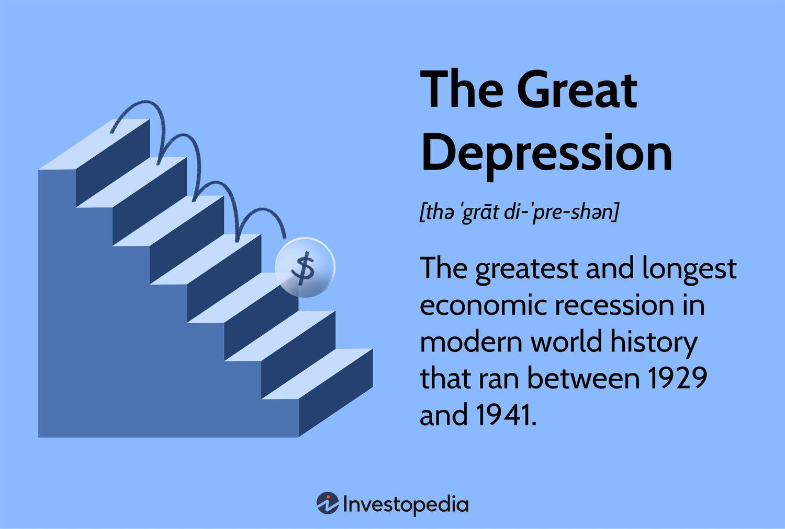

The intersection between mental health and financial markets is an increasingly important topic in today's rapidly evolving economic landscape. With markets moving at unprecedented speeds due to technology and globalization, understanding how mental health influences financial decisions and tools, such as algorithmic trading, is essential for both individual traders and the broader financial industry. This article will explore the impact of depressive assets and various types of depression on algorithmic trading. By analyzing the psychological and economic factors that influence trading decisions, we can better comprehend how significant mental wellness is when trading in volatile market conditions.

Depressive assets, marked by their tendency to lose value due to negative market sentiment, are a critical focus of this discussion. Their influence not only shapes the financial outcomes for investors but also interlinks with psychological factors causing market trends and shifts. Alongside, the types of depression, such as major depressive disorder or bipolar disorder, carry profound implications for traders whose mental state inevitably affects their decision-making process and risk tolerance.



In algorithmic trading, where decisions must be made instantaneously, ensuring the mental wellness of those involved can significantly determine the accuracy and efficiency of these systems. As we dive into the complexities of how mental health issues intersect with and shape financial processes, this article underscores the need to prioritize trader well-being to build a more resilient market environment. By understanding these interconnected dimensions, it is possible to create strategies that enhance both financial performance and personal well-being, underscoring the necessity of mental health mindfulness in achieving sustainable trading practices.

## Table of Contents

## Understanding Depressive Assets

Depressive assets refer to financial assets that have experienced a significant decline in value due to negative market sentiment or investor pessimism. These assets become a focal point during economic downturns when fear and uncertainty among investors can exacerbate their depreciation. In the context of financial markets, depressive assets hold importance because their devaluation can lead to broader economic implications, affecting market stability and investor confidence.

Market sentiment, often driven by macroeconomic indicators, geopolitical events, or significant financial news, plays a critical role in creating depressive assets. When sentiment turns negative, investors may rush to sell off assets, leading to a drop in prices and creating a self-reinforcing cycle of depreciation. This phenomenon can intensify during bearish market conditions, where collective pessimism overshadows intrinsic asset values.

Historical examples illustrate the impact of depressive assets on economies. The 2008 financial crisis is an epitome of how depressive assets, notably mortgage-backed securities, can undermine financial systems. As the U.S. housing market collapsed, these securities lost value rapidly, triggering widespread panic and a global economic downturn. Another instance is the dot-com bubble burst in the early 2000s, where investor exuberance turned to extreme pessimism, depreciating technology stocks significantly.

Investor psychology is closely linked to asset depreciation, as emotions like fear and greed drive market behavior. Behavioral finance studies suggest that cognitive biases, such as overreaction and herd mentality, can aggravate asset [volatility](/wiki/volatility-trading-strategies) and lead to depressive assets. For instance, the availability heuristic may cause investors to overestimate the impact of recent negative events, prompting needless sell-offs.

To navigate depressive asset scenarios, investors can adopt several strategies. Diversification is a common approach, spreading investment across various asset classes to mitigate risks associated with any single asset's devaluation. Additionally, value investing, which involves buying undervalued assets, can be effective when market sentiment disproportionately affects asset prices. Investors may also use hedging techniques, such as options and futures contracts, to protect against potential losses during downturns.

Managing depressive assets requires an understanding of the psychological factors influencing market behavior, alongside solid financial acumen. By recognizing and adjusting for investor biases and market sentiment, investors can better strategize to safeguard their portfolios against depressive asset risks.

## Types of Depression and Their Impact on Trading

Depression is a multifaceted mental health condition that affects millions globally, with varying prevalence across different types. Major depressive disorder (MDD) is among the most common, characterized by persistent sadness and loss of interest. Dysthymia, or persistent depressive disorder, involves a chronic state of depression lasting for at least two years. Bipolar disorder, which includes depressive episodes alongside manic phases, and seasonal affective disorder (SAD), a type of depression occurring at specific times of the year, are also significant subtypes. According to the World Health Organization, depression affects approximately 5% of the adult population worldwide, illustrating its pervasive nature.

The influence of depression and other mental health issues on trading behavior is a critical concern. Depression can lead to cognitive impairments such as decreased concentration, indecisiveness, and impaired judgment, making efficient trading difficult. Traders experiencing depression might exhibit increased risk-aversion or heightened sensitivity to market fluctuations, adversely impacting their trading strategies. Behavioral finance studies have shown that emotions significantly influence financial decisions, indicating that traders with mental health issues are more likely to deviate from rational investment strategies.

Trader's mental states are pivotal in decision-making and risk assessment, key components in trading efficacy. An unstable mental health condition can impair a trader's ability to analyze market data logically and make timely decisions. For instance, anxiety and stress, often associated with depression, can lead to a phenomenon known as "emotional trading," where decisions are driven more by emotional responses rather than objective data analysis. This can increase susceptibility to the trading biases of overconfidence and loss aversion, reducing market performance.

Undiagnosed mental health issues [carry](/wiki/carry-trading) significant long-term implications for market performance. Persistent mental health challenges may lead to chronic underperformance, contributing to detrimental cycles of poor decision-making and financial loss. Over time, this can escalate not only personal financial instability but also systemic risks as collective trading inefficiencies increase market volatility.

To address these challenges, supportive measures are essential for traders to manage their mental health effectively. One approach is the implementation of mental health awareness and training programs within trading firms, encouraging a supportive work environment. Regular mental health check-ups and availability of professional psychological resources could aid in early detection and intervention of mental health issues. Additionally, promoting work-life balance and stress management techniques such as mindfulness and physical activity can enhance traders' overall well-being.

Integrating technology solutions can further aid in monitoring and improving traders' mental health. Wearable devices and mental health applications can track stress levels and mood changes, providing real-time feedback and actionable insights. This data can be used in conjunction with trading algorithms to adjust strategies dynamically, potentially mitigating the impact of mental health challenges on trading performance.

## Algorithmic Trading: Intersection with Mental Health

Algorithmic trading, a method of executing orders using automated pre-programmed trading instructions, has gained significant prominence in financial markets due to its ability to process large volumes of data with speed and accuracy. This technology relies on mathematical models and complex algorithms to make trading decisions, enabling quicker processing of market variables compared to human capabilities. With the rise of [algorithmic trading](/wiki/algorithmic-trading), traders can capitalize on small price movements by executing trades in fractions of a second, an advantage that is crucial in today's fast-paced markets.

However, despite its technological advancements, the high-stakes environment of financial trading can induce considerable stress and pressure on individuals involved in these markets. The persistent demand for high performance, coupled with the volatility and unpredictability of financial markets, creates an atmosphere where stress-related errors are likely. Here, algorithmic trading plays a key role in mitigating such errors by providing a systematic approach to executing trades, thus reducing the emotional involvement of human traders and the biases they might bring.

Nonetheless, the mental health of those designing, monitoring, and managing these algorithmic systems remains a significant [factor](/wiki/factor-investing) in trading efficiency. Poor mental health can lead to impaired judgment, reduced focus, and diminished risk assessment abilities, all of which are crucial in maintaining the precision and timing required in algorithmic trading strategies. Errors in programming logic, oversight of market data inputs, or misinterpretation of algorithm outputs could occur, leading to substantial economic repercussions.

Given these challenges, there is an emerging need to integrate psychological considerations into the development of trading algorithms. By incorporating factors such as stress levels and emotional states of traders into the algorithms, the decision-making processes could become more robust. For instance, [machine learning](/wiki/machine-learning) models could be trained to recognize patterns not only in market data but also in trader behavior, potentially triggering alerts or modifying trading strategies in response to detected stress indicators. 

Using Python, a simple implementation could involve tracking physiological data (such as heart rate or skin conductivity) to gauge stress levels and feed this data into machine learning models. Libraries such as TensorFlow or PyTorch could be employed:

```python
import tensorflow as tf

# Hypothetical function to process inputs, including stress indicators
def process_data(market_data, stress_data):
    # Combine market data with stress data for holistic analysis
    combined_features = tf.concat([market_data, stress_data], axis=1)
    return combined_features

# Example neural network model that could use combined data
model = tf.keras.Sequential([
    tf.keras.layers.Dense(128, input_shape=(n_features,), activation='relu'),
    tf.keras.layers.Dense(64, activation='relu'),
    tf.keras.layers.Dense(1, activation='sigmoid')
])

model.compile(optimizer='adam', loss='binary_crossentropy', metrics=['accuracy'])
```

This model could help optimize trading decisions while considering the psychological state of the trader, thus contributing to error reduction and improved trading outcomes. The consideration of mental health within algorithmic trading underscores a broader movement towards ensuring trader wellness alongside financial performance, enhancing both market stability and participant longevity in the industry.

## Strategies to Mitigate Risks Associated with Depressive Assets and Mental Health

To effectively mitigate the risks associated with depressive assets and mental health challenges in trading, traders and financial institutions must adopt a multifaceted approach that encompasses economic strategies and psychological well-being. Understanding and implementing these strategies can enhance decision-making capabilities and sustain market stability.

**1. Actionable Strategies for Traders Dealing with Depressive Assets**

Traders facing depressive assets should employ robust risk management techniques. This includes diversification of the investment portfolio to spread risk and reduce exposure to any single asset class. Additionally, employing stop-loss orders can limit potential losses by automatically selling an asset when it reaches a predetermined price. Constant monitoring of market sentiment through sentiment analysis tools can provide insights into potential market downturns, allowing traders to make informed decisions.

**2. Significance of Mental Health Awareness and Support Systems**

The trading environment, characterized by rapid decision-making and high stakes, can be mentally taxing. Raising mental health awareness is paramount in ensuring traders maintain optimal performance. Financial institutions should establish comprehensive support systems that include access to counseling services, mental health days, and workshops focusing on stress management and mindfulness techniques. Promoting an open culture where traders can discuss mental health issues without fear of stigma is crucial to early intervention and support.

**3. Technologies for Monitoring and Improving Trader's Mental Well-being**

Innovative technologies that track physiological and psychological markers can be instrumental in monitoring trader well-being. Wearable devices, like smartwatches, can provide data on heart rate variability and stress levels, offering insights into a trader’s mental state. Additionally, software applications leveraging [artificial intelligence](/wiki/ai-artificial-intelligence) can analyze behavioral patterns to predict and preemptively address mental health issues. For example, sentiment analysis from personal interactions and trading patterns can be conducted using machine learning algorithms to flag potential mental health concerns.

Python Code Example:
```python
import numpy as np
from sklearn.linear_model import LogisticRegression

# Sample data representing physiological indicators
# Features: [heart_rate_variability, self_reported_stress_level]
X = np.array([[32, 5], [28, 4], [25, 7], [35, 2], [27, 6]])

# Labels: 0 for stable, 1 for at risk
y = np.array([0, 0, 1, 0, 1])

# Logistic Regression Model
model = LogisticRegression()
model.fit(X, y)

# Predicting potential risk based on new data
new_data = np.array([[30, 6]])
risk_prediction = model.predict(new_data)
print("Risk Prediction:", "At Risk" if risk_prediction else "Stable")
```

**4. Development and Implementation of Mental Health Training Programs**

Instituting mental health training programs can provide traders with the necessary tools to manage stress effectively and improve psychological resilience. These programs should encompass cognitive-behavioral techniques, relaxation methods, and emotional regulation strategies tailored to the unique challenges of trading. Engagement with mental health professionals to deliver these programs ensures they are grounded in clinical best practices.

**5. Positive Impact of Balanced Mental Health on Trading Competence and Market Stability**

Balanced mental health significantly enhances trading competence by improving focus, risk assessment accuracy, and decision-making speed. Traders with stable mental health are more likely to exhibit resilience in the face of market volatility, contributing to overall market stability. Furthermore, by maintaining well-being, traders can reduce the frequency of emotionally-driven trades, which often exacerbate market fluctuations.

In conclusion, addressing the interrelated challenges of depressive assets and mental health requires a comprehensive strategy that integrates financial prudence with psychological well-being. By fostering an environment of awareness, support, and innovation, financial markets can progress toward sustainable practices that ensure both economic and mental health longevity.

## Conclusion

The intersection of depressive assets, types of depression, and algorithmic trading presents an intricate framework that elucidates the profound impacts of mental health on financial markets. This relationship underscores the significance of understanding how psychological states influence trading behaviors and decision-making processes amidst fluctuating market conditions. It is imperative to recognize that mental health challenges, particularly various forms of depression, have potential ramifications on trading outcomes and market performance.

High-pressure financial environments necessitate a heightened awareness of mental health issues. Traders operating in these arenas often encounter substantial stress, which can lead to impaired judgment and increased risk-taking behavior. Recognition of these factors is essential for fostering environments where mental wellness is prioritized. Emphasizing mental health in trading realms helps mitigate the risks associated with poor decision-making and promotes a culture of support and understanding.

A holistic approach that integrates financial expertise with mental wellness strategies is crucial for sustaining healthy trading practices. This involves the incorporation of mental health monitoring technologies and structured support systems that ensure traders are equipped to manage stress effectively. Encouraging financial institutions to implement mental health training programs can strengthen trader resilience and enhance overall market stability.

Future research directions may focus on developing algorithms that factor in cognitive and psychological elements, thus creating trading strategies that are not only technically sound but also psychologically informed. Policymakers could consider frameworks that mandate mental health considerations in trading platforms, making mental wellness as critical as technical proficiency in finance.

Ultimately, prioritizing mental health mindfulness in trading strategies can lead to more stable and sustainable market environments. By addressing the psychological components intertwined with financial activities, we can foster healthier trading practices and promote long-term economic resilience.

## References & Further Reading

[1]: Bergstra, J., Bardenet, R., Bengio, Y., & Kégl, B. (2011). ["Algorithms for Hyper-Parameter Optimization."](https://papers.nips.cc/paper/4443-algorithms-for-hyper-parameter-optimization) Advances in Neural Information Processing Systems 24.

[2]: ["Advances in Financial Machine Learning"](https://www.amazon.com/Advances-Financial-Machine-Learning-Marcos/dp/1119482089) by Marcos Lopez de Prado

[3]: ["Evidence-Based Technical Analysis: Applying the Scientific Method and Statistical Inference to Trading Signals"](https://www.amazon.com/Evidence-Based-Technical-Analysis-Scientific-Statistical/dp/0470008741) by David Aronson

[4]: ["Machine Learning for Algorithmic Trading"](https://github.com/stefan-jansen/machine-learning-for-trading) by Stefan Jansen

[5]: ["Quantitative Trading: How to Build Your Own Algorithmic Trading Business"](https://www.amazon.com/Quantitative-Trading-Build-Algorithmic-Business/dp/1119800064) by Ernest P. Chan

[6]: Thaler, R. H. (1999). ["The End of Behavioral Finance."](https://www.researchgate.net/publication/2593983_The_End_of_Behavioral_Finance) Financial Analysts Journal, 55(6), 12-17.

[7]: Nofsinger, J. R. (2001). ["Investment Madness: How Psychology Affects Your Investing, and What to Do About It."](https://archive.org/details/investmentmadnes0000nofs) Financial Times Prentice Hall.

[8]: Kahneman, D., & Tversky, A. (1979). ["Prospect Theory: An Analysis of Decision under Risk."](http://web.mit.edu/curhan/www/docs/Articles/15341_Readings/Behavioral_Decision_Theory/Kahneman_Tversky_1979_Prospect_theory.pdf) Econometrica, 47(2), 263–291. 

[9]: Aristotle, J., & Noland, T. (2012). ["Behavioral Finance: Building Tools for Cellular Beach Managers."](https://academic.oup.com/edited-volume/28232) Journal of Behavioral Studies in Business, 5, 1-12.

[10]: Schaler, S. J. (2004). ["Addiction Is a Choice."](http://www.schaler.net/addictionisachoice/) Open Court Publishing Company.

