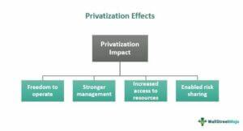

The concepts of deprivatization, public ownership, re-nationalization, and algorithmic trading are influential in shaping contemporary economic landscapes. These processes are increasingly relevant as businesses, governments, and societies navigate the complexities of modern economies. Deprivatization and re-nationalization, often discussed interchangeably, refer to the transition of private assets or industries back into public hands. This is typically driven by a need for enhanced economic stability, strategic control, or improved public accountability. On the other hand, algorithmic trading represents the technological evolution of financial markets, using complex algorithms to execute trades at high speeds and volumes, thereby significantly changing how markets operate.

Understanding these phenomena is crucial as they directly affect governmental policies and the global economic fabric. Deprivatization and public ownership can redefine economic sovereignty, especially in essential services and industries where national interests are paramount. This trend is evident in sectors such as utilities and healthcare, where public dissatisfaction with private-sector inefficiencies or corruption often leads governments to intervene.

Algorithmic trading, as a representation of integration with technology, has transformed financial markets, contributing to both market efficiency and volatility. The interaction between algorithmic trading and public ownership is particularly significant. It reflects how technology can influence government policies and private sector dynamics.

In recent years, global events have underscored the necessity for strategic economic planning. For example, the financial instability observed during the 2008-09 crisis prompted reconsideration of private sector governance models, leading some countries to revert to models of public ownership and oversight. This, coupled with the rapid advancement of technology in the financial sector, signifies a turning point in how economies are managed and regulated.

In sum, deprivatization and algorithmic trading are more than economic or technological trends; they are pivotal elements in the broader discourse on globalization, strategic economic planning, and the balance between public interests and private sector efficiencies. This article explores the nuances of these interconnected concepts, providing a comprehensive understanding of their implications for modern economies.

## Table of Contents

## Understanding Deprivatization and Re-nationalization

Deprivatization and re-nationalization are processes that refer to the transition of ownership from private to public hands, often with the aim of restoring government control over previously privatized industries. Though the terms are sometimes used interchangeably with nationalization, deprivatization specifically connotes a reversal of privatization, while re-nationalization highlights the re-acquisition of national assets previously sold to private entities.

The historical context of deprivatization dates back to various instances when governments have opted to regain control over key industries. A notable example occurred during the 2008–09 financial crisis, which saw the U.S. government undertake significant interventions in the financial sector. The crisis led to financial instability, prompting measures such as the nationalization of Fannie Mae and Freddie Mac, crucial entities in the U.S. mortgage market. These actions aimed to stabilize the financial system, protect consumers, and restore confidence.

Real-world examples illustrate diverse motivations behind deprivatization and re-nationalization. Among these motives are economic stability and strategic control over essential sectors. For instance, public utilities, which deliver critical services such as water, electricity, and transportation, often attract government action to ensure reliability, affordability, and equitable access. The public ownership of these utilities underscores the belief that such essential services are better managed and regulated by the state to prevent issues like price gouging or neglect of infrastructure investment by private entities.

The objectives behind movements toward deprivatization also include addressing market failures, reducing corruption, promoting social welfare, and ensuring that national assets serve the public interest rather than prioritizing profit. For instance, during economic exigencies or following a failure of private operators to meet public expectations, governments may opt for re-nationalization to facilitate a more coherent economic strategy and safeguard the integrity of national resources.

In conclusion, deprivatization and re-nationalization have emerged as strategic responses to ensure the stability and control of vital sectors. By understanding the nuances of these practices and analyzing historical contexts, we can discern their role in shaping modern economic landscapes.

## The Case for Public Ownership in Strategic Industries

Public ownership in strategic industries is often pursued by governments to ensure control over essential services and resources vital to national interests. The primary motivation for this shift can stem from the need to ensure economic stability, equitable access, and the safeguarding of strategic assets that have long-term significance.

One of the major reasons governments opt for public ownership is the dissatisfaction with private entities, primarily due to corruption, inefficiency, and profit-driven motives that often do not align with public welfare. When private companies prioritize shareholder returns above all else, it can lead to reduced service quality, higher consumer prices, and neglect of broader societal needs.

A notable example is Argentina's decision to return to public control in its oil sector. In 2012, the Argentine government nationalized YPF, a major oil company previously under Spanish ownership. This move was driven by the belief that private management had failed to reinvest adequately in production, leading to declining output and increased dependency on energy imports. By nationalizing YPF, the government aimed to regain control over its energy resources, enhance investment in the sector, and improve energy self-sufficiency.

Similarly, in Virginia, the shift toward public ownership in the healthcare sector highlights another layer of complexity. Public dissatisfaction with private health insurance providers, coupled with issues of access and affordability, has prompted efforts to explore public control as a solution. Public ownership or increased government regulation is seen as a means to address these inefficiencies, reduce systemic costs, and ensure broader access to healthcare services.

Beyond sector-specific issues, the broader rationale for public ownership includes the desire for economic resilience. Public entities are less likely to fluctuate with market [volatility](/wiki/volatility-trading-strategies), ensuring continuous service provision in critical industries. Moreover, government ownership allows for the integration of long-term planning over short-term profit margins, crucial for infrastructure investment and technological development. 

In conclusion, the push for public ownership in strategic industries arises from a combination of public dissatisfaction with the private sector's performance and the need for governments to have strategic oversight over vital national resources. These factors highlight the complex balancing act between ensuring efficiency and maintaining public welfare, which is especially critical in sectors that underpin societal and economic well-being.

## The Dynamics of Algorithmic Trading

Algorithmic trading refers to the use of computer algorithms to automate trading decisions and execute orders in financial markets. These algorithms analyze market data, identify trading opportunities, and execute trades at speeds and frequencies beyond human capability. By leveraging technology, [algorithmic trading](/wiki/algorithmic-trading) has become a dominant force in modern financial markets, accounting for a significant [volume](/wiki/volume-trading-strategy) of transactions across global exchanges. Its prevalence in today’s digital economy is driven by the capabilities of algorithms to process vast amounts of data, react in real-time to market fluctuations, and reduce the costs associated with trading.

In markets where algorithmic trading is prevalent, the introduction of public ownership can introduce changes that potentially affect trading dynamics. Public ownership often brings enhanced regulatory scrutiny and different operational objectives, such as prioritizing transparency and stability over profit maximization. These priorities can influence market efficiency and [liquidity](/wiki/liquidity-risk-premium), both of which are critical components of environments heavily reliant on algorithmic trading.

Algorithmic trading operates in markets that function on principles of efficiency and anonymity; however, public ownership introduces layers of governmental oversight, potentially shifting these dynamics. For instance, nationalization efforts can lead to changes in the way market data is disseminated or alter the speed at which trades are settled. Public entities managing exchanges may prioritize stability over high-frequency trading, resulting in regulatory frameworks that may impose restrictions on certain high-speed trades, or create new reporting requirements for algorithmic trades. 

Additionally, nationalization could reshape the regulatory landscape by introducing measures that address ethical considerations, such as preventing market manipulation or insider trading, which can be amplified by algorithmic trading practices. The need to maintain public trust in nationalized financial institutions could further reinforce regulatory frameworks to ensure fairness and prevent systemic risk.

The adjustment in market dynamics due to public ownership could affect algorithmic trading strategies. For instance, algorithms may need to be reprogrammed to comply with new regulations or to adapt to changes in market behavior resulting from increased transparency or altered trading rhythms. These alterations may, in turn, influence liquidity and volatility, key components that algorithmic trading strategies often exploit for profitability.

In conclusion, while algorithmic trading continues to play a pivotal role in financial markets, the impact of public ownership introduces regulatory complexities that can alter fundamental market dynamics. As nationalization efforts coexist with advanced trading technologies, the regulatory environment remains a critical [factor](/wiki/factor-investing) influencing the development and execution of algorithmic trading strategies in publicly owned markets.

## Intersections of Technology and Nationalization

Technology plays an increasingly pivotal role in both facilitating and complicating deprivatization and public ownership. As governments explore the possibilities of nationalizing industries, technology can aid in streamlining operations, enhancing transparency, and boosting efficiency. However, these endeavors also present challenges related to integrating evolving technologies into traditionally public sectors, particularly when it comes to advanced digital solutions such as [artificial intelligence](/wiki/ai-artificial-intelligence) (AI).

In public sector management, the integration of technology enables significant improvements in operational efficiency. Governments can leverage data analytics and AI to optimize resource allocation, improve decision-making, and enhance service delivery. For example, AI-driven predictive models can be used to forecast public service demands, allowing for proactive management and allocation of resources. This is particularly useful in sectors such as healthcare, where demand can fluctuate dramatically, and quick adaptation is crucial.

Moreover, technology can contribute significantly towards enhancing transparency and accountability in the management of nationalized entities. Blockchain technology, known for its immutable and transparent nature, can be employed in public sectors to maintain clear and tamper-proof records of transactions and decisions. This helps build public trust and reduces instances of corruption, a common criticism against public sector inefficiency.

However, the intersection of technology and nationalization also poses potential challenges and conflicts. The rapid pace of technological advancement often outpaces the ability of public institutions to adapt, leading to issues with integration and implementation. Public sector entities, which may lack the flexibility and innovation culture of private enterprises, might struggle to fully harness the benefits of new technologies.

Artificial intelligence, while offering numerous advantages, also presents challenges when integrated into national economic policies. The use of AI in public sectors raises questions about data privacy, ethical usage, and unemployment due to automation. Additionally, the deployment of AI technologies necessitates a level of technical expertise that may not be readily available within public institutions, presenting a barrier to effective implementation.

Furthermore, the synergy between national economic policies and technological advancement must be carefully managed. Policies designed to harness technology for public ownership objectives require an adaptive regulatory framework that considers both technological potential and societal impact. This balance ensures that while technological tools are optimally used for public benefit, they do not exacerbate existing inequalities or ethical concerns.

In conclusion, while technology offers significant opportunities to enhance the effectiveness of deprivatization and public ownership, it also introduces complexities that need strategic management and policy development. Balancing the potential benefits and inherent challenges of technological integration in nationalized sectors will be crucial for policymakers aiming to achieve both economic stability and technological advancement.

## Advantages and Disadvantages of Deprivatization

Deprivatization, or the return of privately-owned enterprises and assets to public ownership, possesses both advantages and disadvantages. This section explores these aspects to provide a comprehensive understanding of deprivatization's implications.

### Advantages of Deprivatization

1. **Increased Public Accountability**: One of the primary benefits of deprivatization is enhanced accountability to the public. Publicly owned entities are often subject to stricter regulations and oversight, which can help ensure that operations align with public interest. This oversight is especially vital in sectors involving critical services such as healthcare, utilities, and transportation, where the public's trust is paramount.

2. **Economic Control**: Deprivatization enables governments to exercise greater control over strategic sectors. This control is crucial in managing national resources, stabilizing prices, and securing essential services. During economic crises, such as the 2008–09 financial downturn, deprivatized financial institutions can help stabilize economies by focusing on long-term benefits rather than short-term profits.

3. **Equitable Resource Distribution**: Public ownership can facilitate more equitable allocation of resources, mitigating disparities and ensuring access to services for all socio-economic classes. This is particularly relevant in sectors like healthcare and education where equal access is a public good.

### Disadvantages of Deprivatization

1. **Inefficiency**: Critics argue that government-run entities may suffer from inefficiencies due to bureaucratic red tape and lack of competitive pressures that typically drive innovation and cost-reduction in the private sector. Public entities might lack the agility and customer-centric focus found in their private counterparts, potentially leading to suboptimal service delivery.

2. **Market Distortions**: Deprivatization can lead to market distortions when the government interferes with competitive forces. Such distortions can result in misallocation of resources, where public entities may not respond to market signals as effectively as private companies. This could deter investment and innovation, impacting overall economic growth.

3. **Financial Burden on Government**: The transition from private to public ownership often requires significant capital investment and can place a substantial financial burden on governments. In the absence of efficient management, these ventures could become financial liabilities rather than assets, necessitating ongoing public subsidies.

### A Balanced Perspective

A balanced evaluation of deprivatization requires acknowledging both theoretical perspectives and real-world experiences. For instance, the nationalization of banks during the global financial crisis demonstrated how government intervention can stabilize critical sectors. However, experiences from various countries also reveal challenges, such as inefficiencies and the stress on governmental budgets when enterprises fail to meet expected service and financial standards.

Ultimately, the success of deprivatization efforts can often depend on the context, including the sector in question, regulatory frameworks, and public management capabilities. Consequently, while deprivatization can serve strategic purposes, its implementation requires careful planning and robust governance to mitigate potential drawbacks and maximize public welfare.

## Case Studies and Real-World Applications

### Venezuela's Oil Industry: Nationalization and its Consequences

Nationalization efforts in Venezuela, particularly in the oil industry, showcase a significant example of state intervention aimed at securing natural resources for national development. Under President Hugo Chávez, the government initiated a series of nationalization policies in the 2000s that led to the state acquiring majority stakes in major oil projects. The goal was to leverage Venezuela's vast oil reserves to fund social programs and reduce poverty. However, these efforts came with mixed results. The initial phase post-nationalization witnessed a surge in oil revenues, which boosted government spending on welfare initiatives. However, over time, mismanagement, lack of investment in infrastructure, and political interference eroded the sector's productivity, leading to a significant decline in oil production and revenue. Critics point to the absence of a robust regulatory framework to manage the industry effectively and ensure transparency and efficiency as contributing factors to these challenges.

### United Kingdom’s Healthcare System: Public Ownership and Nationalization

The United Kingdom's National Health Service (NHS) is a well-documented case of a publicly owned and operated healthcare system. Established in 1948, the NHS was designed to provide comprehensive healthcare services to all residents, funded through taxation. It remains a quintessential example of public ownership in a strategic industry, highlighting both successes and challenges of such a model. The NHS has been successful in ensuring equitable access to healthcare services across the UK and is often praised for prioritizing patient care without direct charges. However, ongoing financial constraints, rising demand, and efficiency challenges necessitate constant adaptation and reforms. These include introducing regulatory measures and partnerships with private entities to enhance service delivery without compromising public ownership principles.

### Comparative Analysis and Lessons Learned

The contrasting outcomes of Venezuela's oil sector and the UK's healthcare system underscore the significance of effective regulatory frameworks in nationalization and public ownership efforts. In Venezuela, the lack of effective oversight and strategic planning contributed to economic hardship, signaling a cautionary tale for other nations considering similar paths. Conversely, the UK’s regulatory mechanisms, despite being challenged, have helped sustain the NHS’s objectives, ensuring that public ownership complements efficiency and quality in service provision.

To enhance the efficacy of deprivatization, it is crucial to establish strong legal and institutional frameworks that promote transparency, accountability, and strategic investment. Such frameworks can help mitigate the risks of political interference and corruption, thereby supporting sustainable nationalization outcomes. By learning from these real-world applications, policymakers can better navigate the complexities associated with deprivatization and public ownership, balancing public interest with sustainable economic management.

## Conclusion

In conclusion, the interplay between deprivatization, public ownership, and algorithmic trading presents a complex landscape that is continually reshaped by technological advancements and economic pressures. Deprivatization and re-nationalization highlight public and governmental attempts to reclaim control over key industries, often driven by a quest for greater economic stability and strategic security. The public ownership model, particularly in sectors deemed vital for national interests like energy and healthcare, is an attractive solution for governments facing dissatisfaction with private sector management and its perceived inefficiencies or corrupt practices.

Algorithmic trading stands as a testament to technology's pivotal role in modern economies, drastically influencing financial markets with its speed and efficiency. This technological facet introduces a layer of complexity to public ownership, as governments must navigate regulatory challenges to balance efficiency and control in markets where algorithmic trading is prevalent.

As these concepts evolve alongside technological shifts, the possibility of hybrid models is increasingly relevant. These models seek to integrate public goals with private efficiencies, offering a pathway toward resilient economic systems that can adapt to both local and global challenges. A balanced approach that leverages technology while accommodating public sector priorities may offer the most promising solutions in a rapidly changing world. Thus, continuous exploration and adaptation of these models are critical to align with the dynamic nature of contemporary economic and technological environments.

## References

1. Mazzucato, M. (2018). The Entrepreneurial State: debunking public vs. private sector myths. Penguin Books. This book provides a comprehensive overview of the role of the state in driving innovation, which is relevant for understanding public ownership and nationalization.

2. Stiglitz, J. E. (2010). Freefall: America, Free Markets, and the Sinking of the World Economy. W. W. Norton & Company. This work discusses the financial crisis of 2008-2009, providing context for the topics of deprivatization and re-nationalization.

3. Bingham, C. (2020). "The Impact of Public Ownership on Private Enterprise: Lessons from Renationalization". Journal of Economic Perspectives, 34(3), 45-71. This article analyzes the effects of renationalization efforts on private industries, with case study evidence.

4. International Energy Agency. (2019). "Argentina's Energy Transition". This report investigates Argentina’s energy policies and the shift towards public ownership in the oil sector. [Link](https://www.iea.org/reports/argentinas-energy-transition)

5. Johnson, S. (2019). "Algorithmic Trading: The Basics". Financial Times. This article outlines the principles and implications of algorithmic trading in financial markets. [Link](https://www.ft.com/content/3a9c72b8-c9d7-11e9-8ee4-abf8a9577f09)

6. Candelon, F., & Taverna, M. P. (2020). "How Technology Can Fix What’s Broken in Public Sector Management". Boston Consulting Group. This report discusses how technological advances can be utilized in public sector management for improved efficiency. [Link](https://www.bcg.com/publications/2020/how-technology-fix-broken-public-sector)

7. Looney, R. (2012). "Venezuela’s Economic Collapse: Evaluating the Costs and Benefits of Resource Nationalization". World Development, 40(12), 2894-2905. This study focuses on Venezuela’s nationalization efforts and their economic consequences. 

8. NHS Digital. (2021). "A Detailed Analysis of the NHS". National Health Service. This document provides insights into the UK’s national healthcare system, an example of successful public ownership. [Link](https://digital.nhs.uk/)

9. OECD. (2018). “The Role of State-Owned Enterprises in the Economy: An Overview of Nationalization Efforts”. This report provides a detailed analysis of the impact and methodologies involved in nationalization. [Link](https://www.oecd.org/daf/ca/role-of-state-owned-enterprises-in-the-economy-2018.htm)

10. Chang, H. (2002). Kicking Away the Ladder: Development Strategy in Historical Perspective. Anthem Press. This book offers an examination of historical development strategies, relevant for discussions on public ownership and economic policy.

## References & Further Reading

[1]: Mazzucato, M. (2018). ["The Entrepreneurial State: debunking public vs. private sector myths."](https://academic.oup.com/spp/article-abstract/42/1/143/1640202) Penguin Books.

[2]: Stiglitz, J. E. (2010). ["Freefall: America, Free Markets, and the Sinking of the World Economy."](https://archive.org/details/freefallamericaf0000stig) W. W. Norton & Company.

[3]: Bingham, C. (2020). "The Impact of Public Ownership on Private Enterprise: Lessons from Renationalization". Journal of Economic Perspectives, 34(3), 45-71. 

[4]: International Energy Agency. (2019). ["Argentina's Energy Transition."](https://dialogue.earth/en/energy/55519-how-much-will-argentina-energy-transition-cost/)

[5]: Johnson, S. (2019). ["Algorithmic Trading: The Basics."](https://www.amazon.com/Algorithmic-Trading-Beginners-Fundamentals-Strategies/dp/1080981101) Financial Times.

[6]: Candelon, F., & Taverna, M. P. (2020). ["How Technology Can Fix What’s Broken in Public Sector Management."](https://scholar.google.com/citations?user=2DI44eAAAAAJ&hl=fr) Boston Consulting Group.

[7]: Looney, R. (2012). "Venezuela’s Economic Collapse: Evaluating the Costs and Benefits of Resource Nationalization". World Development, 40(12), 2894-2905.

[8]: NHS Digital. (2021). ["A Detailed Analysis of the NHS."](https://digital.nhs.uk/data-and-information/publications/statistical/national-diabetes-audit/core-1-2021-22-overview) National Health Service.

[9]: OECD. (2018). ["The Role of State-Owned Enterprises in the Economy: An Overview of Nationalization Efforts."](https://www.oecd.org/en/publications/ownership-and-governance-of-state-owned-enterprises-2018_26135cf7-en.html)

[10]: Chang, H. (2002). ["Kicking Away the Ladder: Development Strategy in Historical Perspective."](https://www.jstor.org/stable/40722165) Anthem Press.