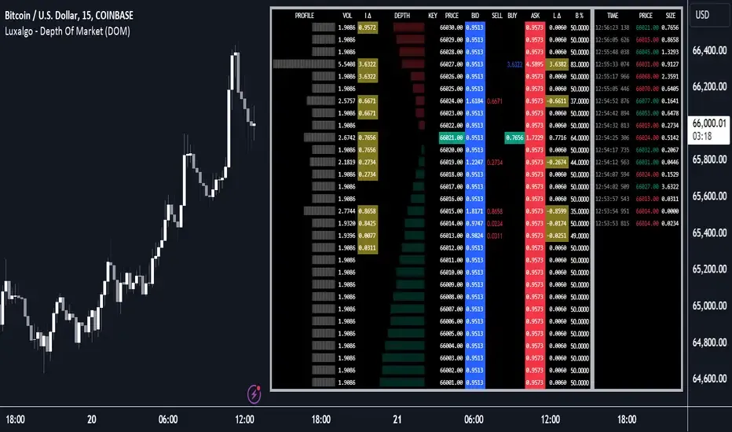

## Table of Contents

## What is Depth of Market (DOM) and why is it important?

Depth of Market (DOM), also known as the order book, is a tool that shows how many orders there are to buy or sell a particular asset at different price levels. It gives traders a clear picture of the supply and demand for that asset at any given moment. Imagine you're looking at a list that shows how many people want to buy a stock at $10, $11, and so on, and how many want to sell at those prices too. This list updates in real time, so you can see how the market is moving.

DOM is important because it helps traders make better decisions. By looking at the order book, traders can see where the big orders are placed and predict how the price might move next. For example, if there are a lot of buy orders at a certain price, it might mean the price is likely to go up soon. This information can help traders decide when to buy or sell, making their trading strategies more effective.

## How does DOM data differ from traditional market data?

DOM data is different from traditional market data because it shows more details about what's happening in the market right now. Traditional market data usually just tells you the last price a stock was traded at, the highest and lowest prices of the day, and how many shares were traded. This is like looking at a summary of what happened. On the other hand, DOM data shows you the actual orders to buy and sell at different prices. It's like looking at a live list of what people are willing to do at this very moment.

Because DOM data gives you a peek into the current supply and demand, it can help you understand the market better. Traditional market data is more about what has already happened, so it's like looking in the rearview mirror. DOM data, however, lets you see the road ahead by showing you where big orders are placed. This can be really useful for traders who want to make quick decisions based on what's happening right now, not just what happened in the past.

## What are the basic components of a DOM display?

A DOM display shows you a list of buy and sell orders for a certain asset, like a stock or a currency. On one side, you'll see the "bid" orders, which are people wanting to buy the asset. Each bid order will show the price someone is willing to pay and how many shares or units they want to buy. On the other side, you'll see the "ask" orders, which are people wanting to sell the asset. Each ask order will show the price someone is willing to sell at and how many shares or units they want to sell.

The difference between the highest bid price and the lowest ask price is called the "bid-ask spread." This spread can tell you a lot about how easy or hard it might be to trade that asset at that moment. The DOM display also updates in real time, so you can see new orders coming in and old orders being filled or taken away. This helps you understand how the market is moving right now and can help you make better trading decisions.

## How can beginners interpret the information shown on a DOM?

When beginners look at a DOM, they should first find the highest bid price and the lowest ask price. The highest bid is the most someone is willing to pay to buy the asset right now, and the lowest ask is the least someone is willing to sell it for. The difference between these two numbers is called the bid-ask spread. If the spread is small, it means the asset is easy to trade because buyers and sellers are close on price. If the spread is big, it might be harder to trade because buyers and sellers are far apart on what they think the asset is worth.

Next, beginners should look at the number of orders at each price level. If there are a lot of buy orders at a certain price, it might mean the price could go up soon because there's a lot of demand. On the other hand, if there are a lot of sell orders at a certain price, it might mean the price could go down because there's a lot of supply. By watching how these orders change over time, beginners can start to see patterns and make guesses about where the price might go next. It's like trying to read the mood of the market and use that to make better trading decisions.

## What are some common strategies for using DOM data in trading?

One common strategy for using DOM data is called "order flow trading." Traders watch the DOM to see where big buy and sell orders are placed. If they see a lot of big buy orders at a certain price, they might think the price will go up soon. So, they buy the asset before it goes up, hoping to sell it later for a profit. On the other hand, if they see a lot of big sell orders, they might think the price will go down. They could then sell the asset or short it, hoping to buy it back later at a lower price.

Another strategy is "iceberg detection." Sometimes, big traders hide their big orders by breaking them into smaller parts. This is called an "iceberg order." By watching the DOM closely, traders can spot these hidden orders. If they see small orders being filled quickly at the same price level, it might mean there's a bigger order hiding underneath. Traders can use this information to predict where the price might go next and make their trades accordingly.

Lastly, traders might use the DOM to find "support and resistance levels." These are price levels where the asset often stops going up or down. By looking at where a lot of buy orders are stacked up, traders can guess where the price might find support and stop falling. Similarly, by looking at where a lot of sell orders are stacked up, they can guess where the price might find resistance and stop rising. This helps traders decide when to enter or [exit](/wiki/exit-strategy) trades based on where they think the price will move next.

## How does DOM data help in understanding market liquidity?

DOM data helps traders understand market [liquidity](/wiki/liquidity-risk-premium) by showing them how many buy and sell orders are waiting at different price levels. Liquidity is all about how easily you can buy or sell an asset without affecting its price too much. If you see a lot of orders on both the buy and sell sides of the DOM, it means the market is liquid. This means you can trade the asset quickly and at a fair price because there are lots of people willing to buy and sell.

On the other hand, if the DOM shows only a few orders, it suggests the market is less liquid. In this case, it might be harder to buy or sell the asset without moving the price a lot. For example, if you want to sell a lot of shares but there aren't many buyers, you might have to lower your price to find someone willing to buy. By looking at the DOM, traders can get a good sense of how liquid the market is and make better decisions about when and how to trade.

## What are the limitations of DOM data that traders should be aware of?

DOM data can be very helpful, but it has some limitations that traders need to know about. One big limitation is that DOM data only shows what's happening right now. It doesn't tell you why people are buying or selling, or what might happen in the future. For example, if there are a lot of buy orders, it might look like the price will go up, but something unexpected could change that. So, traders should use DOM data along with other information to make better guesses about the market.

Another limitation is that DOM data can be tricky because of "spoofing" and "iceberg orders." Spoofing is when traders put in fake orders to trick other people into thinking the market is moving a certain way. Iceberg orders are big orders that are hidden by breaking them into smaller parts. These things can make the DOM look different from what's really happening. Traders need to be careful and look at other signs too, so they don't get fooled by what they see on the DOM.

## How can advanced traders use DOM data to predict short-term price movements?

Advanced traders use DOM data to predict short-term price movements by watching the order flow closely. They look for big buy or sell orders at specific price levels. If they see a lot of buy orders at a certain price, it might mean that the price will go up soon because there's strong demand. On the other hand, if there are a lot of sell orders at a certain price, it might mean the price will go down because there's a lot of supply. By spotting these big orders, traders can make quick trades to take advantage of the expected price changes.

Another way advanced traders use DOM data is by looking for patterns and trends in the orders. For example, they might notice that every time a big buy order comes in at a certain price, the price moves up a little bit. By watching these patterns, traders can guess where the price might go next. They also keep an eye out for hidden orders, like iceberg orders, which can affect the price without being obvious on the DOM. By combining these observations with other market information, advanced traders can make more accurate predictions about short-term price movements.

## What role does DOM play in high-frequency trading?

In high-frequency trading, DOM data is very important because it helps traders make quick decisions. High-frequency traders use computers to buy and sell things very fast, often in just a few seconds or less. They look at the DOM to see where big orders are placed and how the market is moving right now. By watching the DOM closely, they can spot chances to make a profit before other traders do. For example, if they see a lot of buy orders coming in, they might buy the asset quickly and then sell it a little bit later for a small profit.

DOM data also helps high-frequency traders understand how liquid the market is. If there are a lot of orders on the DOM, it means the market is easy to trade in, which is good for high-frequency trading. But if there are only a few orders, it might be harder to trade quickly without moving the price a lot. High-frequency traders use this information to decide when and how to trade. They also watch for things like iceberg orders and spoofing, which can affect what they see on the DOM. By using all this information, they can make smart trades very quickly.

## How can DOM data be integrated with other technical analysis tools?

DOM data can be used with other technical analysis tools to help traders make better decisions. For example, traders often use moving averages to see the general direction of the market. By looking at the DOM, they can see if there are big orders that might push the price towards or away from the moving average. This can help them decide if it's a good time to buy or sell. Also, traders use indicators like the Relative Strength Index (RSI) to see if an asset is overbought or oversold. If the RSI shows that an asset is overbought but the DOM shows a lot of sell orders, it might be a good time to sell.

Another way to use DOM data with other tools is by looking at chart patterns. For example, if a trader sees a head and shoulders pattern forming on the chart, they can check the DOM to see if there are enough sell orders to confirm the pattern. This can give them more confidence in their trading decision. By combining DOM data with these other tools, traders can get a fuller picture of what's happening in the market and make smarter trades.

## What are the best practices for setting up and monitoring DOM for optimal trading?

To set up and monitor DOM for optimal trading, start by choosing a reliable trading platform that offers real-time DOM data. Make sure the platform lets you see the bid and ask prices clearly, along with the number of orders at each level. It's helpful to customize the display to show the most important information at a glance, like the bid-ask spread and the total [volume](/wiki/volume-trading-strategy) of orders. Set up alerts for when big orders come in or when the price reaches certain levels, so you don't miss important changes in the market.

Once your DOM is set up, keep an eye on it regularly but don't let it overwhelm you. Look for patterns like big buy or sell orders at certain prices, which can give you clues about where the price might go next. It's good to combine what you see on the DOM with other market information, like news and technical indicators, to make better trading decisions. Remember, the DOM shows you what's happening right now, so use it to help you act quickly but always think about the bigger picture too.

## How do professional traders utilize DOM data in different market conditions?

Professional traders use DOM data differently depending on whether the market is calm or moving a lot. In calm markets, they watch the DOM to spot small changes in order flow that might show where the price could go next. They look for big orders at certain prices that might push the price up or down. If they see a lot of buy orders at a certain price, they might buy the asset, hoping to sell it later for a small profit. In calm markets, they also use the DOM to see how liquid the market is, which helps them decide if it's a good time to trade.

When the market is moving a lot, professional traders use the DOM to react quickly to big changes. They watch for sudden big orders that might mean the price will jump up or down fast. For example, if they see a lot of sell orders coming in, they might sell their assets quickly to avoid losing money. They also use the DOM to spot hidden orders, like iceberg orders, which can affect the price without being obvious. By combining what they see on the DOM with other market information, they can make smart trades even when things are moving fast.

## References & Further Reading

[1]: Bergstra, J., Bardenet, R., Bengio, Y., & Kégl, B. (2011). ["Algorithms for Hyper-Parameter Optimization."](https://dl.acm.org/doi/10.5555/2986459.2986743) Advances in Neural Information Processing Systems 24.

[2]: ["Advances in Financial Machine Learning"](https://www.amazon.com/Advances-Financial-Machine-Learning-Marcos/dp/1119482089) by Marcos Lopez de Prado

[3]: ["Evidence-Based Technical Analysis: Applying the Scientific Method and Statistical Inference to Trading Signals"](https://www.amazon.com/Evidence-Based-Technical-Analysis-Scientific-Statistical/dp/0470008741) by David Aronson

[4]: ["Machine Learning for Algorithmic Trading"](https://github.com/stefan-jansen/machine-learning-for-trading) by Stefan Jansen

[5]: ["Quantitative Trading: How to Build Your Own Algorithmic Trading Business"](https://www.amazon.com/Quantitative-Trading-Build-Algorithmic-Business/dp/1119800064) by Ernest P. Chan