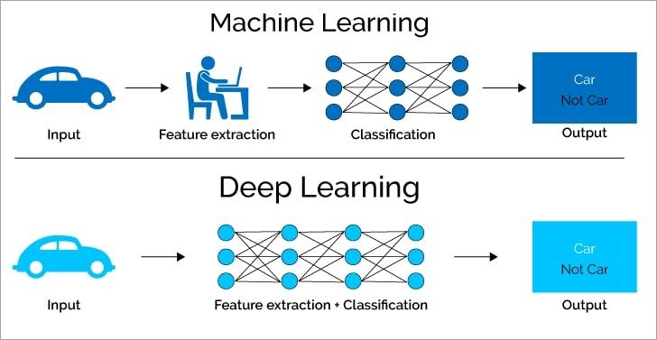

## Table of Contents

## What is depth in the context of machine learning?

In machine learning, depth refers to the number of layers in a neural network. Think of a neural network like a stack of pancakes. Each pancake is a layer, and the more pancakes you stack, the deeper the network. Deep neural networks, which have many layers, can learn more complex patterns in data than shallow networks with just a few layers. This is because each layer can learn different features of the data, and as the data passes through more layers, the network can understand more intricate details.

For example, in image recognition, the first few layers of a deep neural network might learn to recognize simple edges and shapes, while deeper layers can identify more complex objects like faces or cars. The depth of the network allows it to build up its understanding step by step. However, deeper networks are also harder to train because it's more challenging for the network to learn how to adjust all the layers at once. Techniques like backpropagation help with this, but it's still a balancing act to make sure the network learns effectively without getting stuck or overfitting to the training data.

## Why is depth important in neural networks?

Depth is important in neural networks because it allows them to learn and understand complex patterns in data. Imagine you're trying to recognize a dog in a picture. A shallow network with just a few layers might only see simple shapes and colors. But a deep network, with many layers, can start with those simple shapes and build up to recognize more detailed features like the shape of the dog's ears or the texture of its fur. Each layer adds a bit more understanding, so by the time the data reaches the final layer, the network can make a very accurate guess about what's in the picture.

However, deeper networks are not always better. They can be harder to train because the information has to travel through many layers, and it can be tricky for the network to figure out how to adjust all those layers at once. This is where techniques like backpropagation come in, helping the network learn from its mistakes and improve over time. But if the network is too deep, it might start to overfit, meaning it learns the training data too well and doesn't perform as well on new data. So, finding the right depth is a bit like finding the right balance – enough layers to understand the data well, but not so many that the network gets confused.

## How does increasing the depth of a neural network affect its performance?

Increasing the depth of a neural network can make it better at understanding and learning from data. When a network has more layers, it can learn more complex patterns. For example, in recognizing a picture of a cat, early layers might just see lines and edges, but deeper layers can start to see the shape of the cat's ears or the texture of its fur. This means that with more layers, the network can build up its understanding step by step, leading to more accurate predictions or classifications.

However, making a network deeper doesn't always mean it will work better. Deeper networks can be harder to train because the information has to travel through many layers, and it can be tricky for the network to figure out how to adjust all those layers at once. If a network is too deep, it might start to overfit, meaning it learns the training data too well and doesn't perform as well on new data. So, finding the right depth is important – enough layers to understand the data well, but not so many that the network gets confused.

## What are some common architectures that utilize depth in machine learning?

One common architecture that uses depth in machine learning is the Convolutional Neural Network (CNN). CNNs are especially good at understanding images. They have many layers, including convolutional layers that look for patterns in small parts of the image, and pooling layers that simplify the data. As the image data goes through these layers, the network can start to recognize more and more complex features, like edges in early layers, and shapes or objects in deeper layers. This depth helps the CNN to be very good at tasks like recognizing faces or classifying different types of animals in photos.

Another architecture that benefits from depth is the Recurrent Neural Network (RNN). RNNs are used a lot for understanding sequences of data, like words in a sentence or notes in a song. They have layers that can remember information from previous steps, which means they can understand the context of the data over time. Deeper RNNs, or those with more layers, can handle longer sequences and more complex patterns. A special type of RNN called Long Short-Term Memory (LSTM) networks use even more depth to keep track of information over longer periods, making them great for things like language translation or predicting the next word in a sentence.

Lastly, the Transformer architecture has become very popular, especially in natural language processing. Transformers use a lot of depth through multiple layers of attention mechanisms. These layers help the model focus on different parts of the input data at the same time, allowing it to understand relationships between words or other elements in the data. The depth in Transformers helps them to be very effective at tasks like translating languages or generating text that sounds like it was written by a human.

## Can you explain the concept of deep learning and its relation to depth?

Deep learning is a part of machine learning that uses neural networks with many layers to learn from data. These layers are what we mean by depth in deep learning. Imagine a stack of pancakes, where each pancake is a layer in the network. The more pancakes you have, the deeper the stack. In deep learning, these layers help the network to understand and learn more complex patterns in the data. For example, when looking at a picture of a cat, early layers might just see lines and edges, but as the data goes through more layers, the network can start to see the shape of the cat's ears or the texture of its fur.

The depth in deep learning is important because it allows the network to build up its understanding step by step. Each layer can learn different features of the data, and as the data passes through more layers, the network can understand more intricate details. However, making a network deeper doesn't always mean it will work better. Deeper networks can be harder to train because the information has to travel through many layers, and it can be tricky for the network to figure out how to adjust all those layers at once. If a network is too deep, it might start to overfit, meaning it learns the training data too well and doesn't perform as well on new data. So, finding the right depth is important – enough layers to understand the data well, but not so many that the network gets confused.

## What challenges arise when training deeper neural networks?

Training deeper neural networks can be tricky because the information has to travel through many layers. This makes it hard for the network to figure out how to adjust all those layers at once. When you're training a network, you want it to learn from its mistakes and get better over time. But with a deep network, the error signals have to go back through many layers, and sometimes they can get weaker or disappear before they reach the early layers. This problem is called the vanishing gradient, and it can make it hard for the network to learn effectively.

Another challenge is that deeper networks can start to overfit. This means they learn the training data too well and don't perform as well on new data. Imagine you're trying to recognize different types of dogs. A deep network might learn to recognize every little detail in the training pictures, like the exact color of a dog's collar, but then it might not recognize a new dog because its collar is a different color. So, you need to find the right balance – enough depth to understand the data well, but not so much that the network gets too focused on the training data and misses the bigger picture.

To help with these challenges, researchers use different techniques. For example, they might use special ways of initializing the weights in the network or use methods like batch normalization to help the signals travel through the layers more easily. They also use techniques like dropout to prevent overfitting, where some neurons are randomly ignored during training to make the network more robust. By using these methods, they can train deeper networks that learn well without getting stuck or overfitting.

## How do techniques like skip connections help in training deep networks?

Skip connections, also known as shortcut connections, help in training deep networks by allowing the data to skip over some layers. Imagine you're climbing a tall mountain. If you have to go through every single step, it can be really tiring and you might not make it to the top. But if you can take some shortcuts, you can reach the top more easily. In a deep neural network, skip connections let the data take these shortcuts, making it easier for the network to learn and for the error signals to travel back through the layers without getting too weak.

These connections help solve the problem of vanishing gradients, where the error signals get smaller and smaller as they go back through the layers, making it hard for the early layers to learn. With skip connections, the error signals can take a shorter path, so they stay strong enough to help the network learn effectively. This means that even very deep networks can be trained successfully, leading to better performance on complex tasks like image recognition or natural language processing.

## What is the role of depth in convolutional neural networks (CNNs)?

In convolutional neural networks (CNNs), depth plays a big role in how well the network can understand pictures. Think of a CNN like a stack of pancakes, where each pancake is a layer. The more layers you have, the deeper the network. Each layer in a CNN looks at different parts of the picture and learns to recognize different features. Early layers might see simple things like edges or colors, but as the picture goes through more layers, the network can start to see more complex things like shapes or even whole objects. This depth helps the CNN to build up its understanding step by step, making it really good at tasks like recognizing faces or classifying different types of animals in photos.

However, making a CNN deeper doesn't always mean it will work better. Deeper networks can be harder to train because the information has to travel through many layers, and it can be tricky for the network to figure out how to adjust all those layers at once. If a network is too deep, it might start to overfit, meaning it learns the training data too well and doesn't perform as well on new data. So, finding the right depth is important – enough layers to understand the pictures well, but not so many that the network gets confused. Techniques like skip connections can help by letting the data take shortcuts through the layers, making it easier for the network to learn and perform well.

## How does depth impact the learning of hierarchical features in neural networks?

In neural networks, depth helps the network learn about things in a step-by-step way, kind of like building a tower from blocks. Each layer in the network is like adding another block to the tower. The early layers learn simple things, like lines or colors. As the data goes through more layers, the network can start to see more complex things, like shapes or even whole objects. This is called learning hierarchical features because the network builds its understanding from simple to more complex, layer by layer. The more layers, or the deeper the network, the better it can understand these complex patterns.

However, making a network deeper doesn't always make it better. It can be harder to train a deep network because the information has to travel through many layers, and it can be tricky for the network to figure out how to adjust all those layers at once. If a network is too deep, it might start to overfit, meaning it learns the training data too well and doesn't perform as well on new data. So, finding the right depth is important – enough layers to understand the data well, but not so many that the network gets confused. Techniques like skip connections can help by letting the data take shortcuts through the layers, making it easier for the network to learn and perform well.

## What are the trade-offs between network depth and width in model design?

In designing neural networks, there's a balance to strike between depth and width. Depth refers to the number of layers in the network, while width refers to the number of neurons or units in each layer. A deeper network with more layers can learn more complex patterns because it can build up its understanding step by step. For example, in image recognition, early layers might learn simple features like edges, while deeper layers can recognize more complex objects like faces or cars. However, deeper networks can be harder to train because the information has to travel through many layers, and it can be tricky for the network to figure out how to adjust all those layers at once.

On the other hand, a wider network with more neurons in each layer can learn more about the data at each step. This can be useful if the data has a lot of different features that need to be understood at the same time. A wider network might be easier to train than a very deep network because the information doesn't have to travel as far. But wider networks can also be slower to train and use more memory because they have more parameters to adjust. So, finding the right balance between depth and width is important – enough depth to understand the data well, but not so much that the network gets confused, and enough width to capture the important features without making the network too big or slow.

## How can one effectively measure the impact of depth on model generalization?

To measure how the depth of a neural network affects its ability to generalize to new data, you can start by training different versions of the same model, each with a different number of layers. After training each model, you test them on a separate set of data that they haven't seen before. This is called the validation set. You can then compare how well each model does on this validation set. A model that generalizes well will perform similarly on both the training data and the validation data. If a model performs much better on the training data than on the validation data, it might be overfitting, which means it's too focused on the training data and not good at handling new data. By looking at how performance changes as you add more layers, you can see how depth affects generalization.

One way to look at this more closely is to use a technique called cross-validation. In cross-validation, you split your data into several parts and train the model multiple times, each time using a different part of the data for validation. This gives you a more reliable estimate of how well the model will perform on new data. You can use metrics like accuracy, precision, recall, or even the area under the ROC curve (AUC) to measure performance. For example, if you're using accuracy, you would calculate the percentage of correct predictions on the validation set. By comparing these metrics across models with different depths, you can get a clear picture of how adding more layers impacts the model's ability to generalize. If you see that performance on the validation set starts to drop as you add more layers, it might mean that the model is getting too deep and starting to overfit.

## What are the latest advancements in optimizing the depth of neural networks for better performance?

One of the latest advancements in optimizing the depth of neural networks is the development of techniques like neural architecture search (NAS). NAS uses algorithms to automatically find the best network architecture, including the right depth, for a given task. This means the network can be tailored to perform well without a human having to guess how many layers are needed. For example, NAS can test many different versions of a network, each with a different number of layers, and pick the one that works best on a validation set. This helps in finding a balance between having enough depth to understand the data well and not so much that the network overfits.

Another advancement is the use of techniques like residual connections, which were introduced in architectures like ResNet. Residual connections, or skip connections, help deep networks train more easily by allowing the data to skip over some layers. This makes it easier for the network to learn and for the error signals to travel back through the layers without getting too weak. By using residual connections, researchers can build much deeper networks that still generalize well to new data. This has led to big improvements in tasks like image recognition, where deeper networks can now be trained without the problems of vanishing gradients that used to make training deep networks hard.