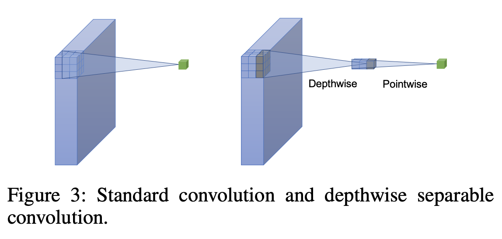

## Table of Contents

## What is a Depthwise Separable Convolutional Neural Network (SepCNN)?

A Depthwise Separable Convolutional Neural Network (SepCNN) is a type of neural network that is designed to be more efficient than traditional convolutional neural networks. It achieves this by breaking down the standard convolution process into two separate steps: depthwise convolution and pointwise convolution. In the depthwise convolution step, each input channel is convolved separately with its own set of filters. This is followed by the pointwise convolution step, where 1x1 convolutions are used to combine the outputs of the depthwise convolution. This approach reduces the number of parameters and computations needed, making SepCNNs faster and less resource-intensive.

The main advantage of using SepCNNs is their ability to maintain high accuracy while significantly reducing the computational cost. This makes them particularly useful for applications where resources are limited, such as on mobile devices or in embedded systems. For example, in a standard convolutional layer, if you have an input of size $$C \times H \times W$$ and a filter of size $$K \times K \times C \times M$$, the number of parameters is $$K^2 \times C \times M$$. In contrast, a SepCNN would first apply $$C$$ filters of size $$K \times K$$ in the depthwise convolution, and then $$C \times M$$ filters of size $$1 \times 1$$ in the pointwise convolution, resulting in fewer parameters and computations overall. This efficiency makes SepCNNs a popular choice in modern deep learning architectures.

## How does a SepCNN differ from a traditional Convolutional Neural Network (CNN)?

A SepCNN, or Depthwise Separable Convolutional Neural Network, differs from a traditional CNN mainly in how it processes data. In a traditional CNN, a convolutional layer applies a set of filters to the entire input volume at once. Each filter spans all the input channels and produces one output channel. For example, if you have an input of size $$C \times H \times W$$ and a filter of size $$K \times K \times C \times M$$, the CNN will use all these filters to create a new set of feature maps. This process can be computationally expensive because it involves a lot of multiplications and additions across all channels.

On the other hand, a SepCNN breaks this process into two steps to make it more efficient. First, it uses depthwise convolution, where each input channel is convolved separately with its own filter. This means if you have $$C$$ input channels, you'll use $$C$$ filters of size $$K \times K$$. After this, the SepCNN applies pointwise convolution using 1x1 filters to combine these outputs. This two-step approach reduces the number of parameters and computations needed. For instance, instead of $$K^2 \times C \times M$$ parameters in a traditional CNN, a SepCNN would use $$K^2 \times C$$ for depthwise convolution and $$C \times M$$ for pointwise convolution, resulting in fewer overall parameters and faster processing.

## What are the main components of a SepCNN?

A SepCNN, or Depthwise Separable Convolutional Neural Network, has two main parts: depthwise convolution and pointwise convolution. In the depthwise convolution part, the network looks at each input channel separately. If you have an input with $$C$$ channels, the network will use $$C$$ different filters to process each channel on its own. This step helps reduce the amount of work the network has to do because it doesn't mix information from different channels right away.

After the depthwise convolution, the SepCNN uses pointwise convolution. This step uses small 1x1 filters to combine the results from the depthwise step. These 1x1 filters look at all the channels at once and mix their information to create new feature maps. By breaking the convolution into these two steps, a SepCNN can do its job with fewer calculations and less memory, making it faster and more efficient than a regular CNN.

## How does the depthwise convolution work in a SepCNN?

Depthwise convolution in a SepCNN works by looking at each channel of the input separately. If you have an input with $$C$$ channels, the network uses $$C$$ different filters, each of size $$K \times K$$, to process each channel on its own. This means that for each channel, the network slides a small filter over it, doing a convolution to create a new feature map for that channel. This step helps reduce the amount of work because it doesn't mix information from different channels right away.

After the depthwise convolution, you have a set of feature maps, one for each input channel. These feature maps are then ready for the next step, which is the pointwise convolution. The main benefit of depthwise convolution is that it makes the process more efficient by breaking down the work into smaller, more manageable pieces.

## What is the role of pointwise convolution in a SepCNN?

Pointwise convolution in a SepCNN is like a helper that combines the results from the depthwise convolution step. After the depthwise convolution, you have a set of feature maps, one for each input channel. The pointwise convolution uses small 1x1 filters to look at all these feature maps at once. It mixes the information from different channels to create new feature maps that capture more complex patterns in the data. This step is important because it helps the network understand how different parts of the input relate to each other.

By using 1x1 filters, the pointwise convolution can do its job without needing a lot of extra calculations. If you have $$C$$ input channels and want to create $$M$$ output channels, the pointwise convolution will use $$C \times M$$ filters. This is much less work than a regular convolution, which would use $$K^2 \times C \times M$$ parameters for a filter of size $$K \times K$$. So, the pointwise convolution makes the SepCNN more efficient and faster, while still helping it learn important features from the data.

## What are the computational benefits of using a SepCNN over a standard CNN?

Using a SepCNN instead of a standard CNN can save a lot of computational work. In a regular CNN, each filter looks at all the input channels at once. If you have an input with $$C$$ channels and you want to make $$M$$ new channels using a filter of size $$K \times K$$, the CNN will need $$K^2 \times C \times M$$ parameters. That's a lot of numbers to keep track of and a lot of math to do. But a SepCNN splits this job into two easier steps. First, it does depthwise convolution, using just $$K^2 \times C$$ parameters to look at each channel separately. Then, it does pointwise convolution, using $$C \times M$$ parameters to mix the results. This means a SepCNN uses a lot fewer parameters and does less math, making it faster and more efficient.

The savings in computation with SepCNNs also mean they need less memory and can run on devices with limited resources, like mobile phones or small computers. Because they use fewer parameters, SepCNNs can also be easier to train and less likely to overfit the data. This makes them a good choice for many applications where speed and efficiency are important, without losing much accuracy compared to standard CNNs.

## Can you explain how SepCNNs help in reducing the model size and parameters?

SepCNNs help reduce the model size and the number of parameters by breaking down the traditional convolution process into two more efficient steps: depthwise convolution and pointwise convolution. In a regular CNN, each filter spans all input channels and produces one output channel. This means if you have an input with $$C$$ channels and you want to create $$M$$ new channels using a filter of size $$K \times K$$, the CNN will need $$K^2 \times C \times M$$ parameters. That's a lot of numbers to keep track of. But a SepCNN does things differently. It first uses depthwise convolution, where it looks at each channel separately with its own $$K \times K$$ filter. This step only needs $$K^2 \times C$$ parameters. After that, it uses pointwise convolution with 1x1 filters to combine the results, needing just $$C \times M$$ parameters.

This two-step approach means SepCNNs use a lot fewer parameters overall. For example, if you're using a 3x3 filter, a regular CNN would need $$3^2 \times C \times M = 9 \times C \times M$$ parameters, but a SepCNN would only need $$3^2 \times C + C \times M = 9C + CM$$ parameters. This reduction in parameters makes SepCNNs smaller and faster. They can run on devices with less memory and processing power, like mobile phones or small computers. Plus, because they use fewer parameters, SepCNNs are less likely to overfit the data, making them easier to train and more reliable for many applications.

## What are some common applications where SepCNNs are particularly effective?

SepCNNs are particularly effective in applications where computational resources are limited, such as on mobile devices and in embedded systems. For example, they are widely used in mobile vision applications like real-time object detection and image classification. Because SepCNNs need fewer parameters and less computing power, they can run quickly on smartphones, helping apps recognize objects or faces without draining the battery too much.

Another common use for SepCNNs is in the field of healthcare, specifically in medical imaging. They can help analyze X-rays or MRI scans to spot diseases or abnormalities faster and with less powerful computers. This is important because it means doctors in smaller clinics or remote areas can still use advanced image analysis tools without needing expensive equipment. SepCNNs make it possible to bring sophisticated technology to places where resources are limited, improving patient care.

## How does the performance of SepCNNs compare to traditional CNNs in terms of accuracy and speed?

SepCNNs often perform nearly as well as traditional CNNs in terms of accuracy, but they can do it much faster and with less computing power. In a SepCNN, the work is split into two steps: depthwise convolution and pointwise convolution. This means SepCNNs need fewer parameters, like $$K^2 \times C + C \times M$$ instead of $$K^2 \times C \times M$$ for a traditional CNN with a filter size of $$K \times K$$. Because they use fewer numbers, SepCNNs can process data more quickly, making them great for devices like smartphones where speed and battery life matter a lot.

In terms of accuracy, SepCNNs might not always reach the same level as the best traditional CNNs, but the difference is usually small. For many tasks, like recognizing objects in pictures or analyzing medical images, SepCNNs can give very good results without needing a super powerful computer. This makes them a smart choice when you want to balance accuracy with how fast and easy they are to use on smaller devices.

## What are some advanced techniques used to optimize SepCNNs?

One advanced technique to optimize SepCNNs is called "channel pruning." This method involves removing some of the less important channels in the network to make it smaller and faster. By figuring out which channels don't contribute much to the final result, you can cut them out. This reduces the number of parameters and calculations the network needs, making it more efficient without losing too much accuracy.

Another technique is "knowledge distillation," where a smaller SepCNN learns from a bigger, more accurate CNN. The idea is to train the smaller network to mimic the behavior of the larger one, so it can perform almost as well but with fewer resources. This way, you get the benefits of a big, powerful network in a smaller package that's easier to use on devices like smartphones.

Lastly, "quantization" is a technique that reduces the precision of the numbers used in the network, like changing them from 32-bit floating-point numbers to 8-bit integers. This makes the network take up less memory and run faster because smaller numbers are easier to process. By carefully choosing which numbers to simplify, you can keep the SepCNN's accuracy high while making it much more efficient.

## How can one implement a SepCNN using popular deep learning frameworks like TensorFlow or PyTorch?

To implement a SepCNN using TensorFlow, you can use the `tf.keras.layers` module. Start by importing TensorFlow and defining your input shape. Then, create a model using `tf.keras.Sequential` and add layers. Use `tf.keras.layers.DepthwiseConv2D` for the depthwise convolution step, specifying the kernel size and strides. Follow this with `tf.keras.layers.Conv2D` for the pointwise convolution, using a 1x1 kernel size. You can also add other layers like `tf.keras.layers.BatchNormalization` and `tf.keras.layers.ReLU` for better performance. Here's a simple example:

```python
import tensorflow as tf

model = tf.keras.Sequential([
    tf.keras.layers.Input(shape=(32, 32, 3)),
    tf.keras.layers.DepthwiseConv2D(kernel_size=(3, 3), padding='same', activation='relu'),
    tf.keras.layers.Conv2D(filters=64, kernel_size=(1, 1), activation='relu'),
    tf.keras.layers.BatchNormalization(),
    tf.keras.layers.MaxPooling2D(pool_size=(2, 2)),
    tf.keras.layers.Flatten(),
    tf.keras.layers.Dense(10, activation='softmax')
])

model.compile(optimizer='adam', loss='sparse_categorical_crossentropy', metrics=['accuracy'])
```

In PyTorch, you can implement a SepCNN using the `torch.nn` module. Begin by importing PyTorch and defining your network class that inherits from `nn.Module`. Inside the class, define the `__init__` method to set up the layers, including `nn.Conv2d` for the depthwise convolution with `groups` set to the number of input channels, and another `nn.Conv2d` for the pointwise convolution with a 1x1 kernel size. In the `forward` method, specify how data flows through these layers. You can also include other layers like `nn.BatchNorm2d` and `nn.ReLU` for improved performance. Here's a basic example:

```python
import torch
import torch.nn as nn

class SepCNN(nn.Module):
    def __init__(self):
        super(SepCNN, self).__init__()
        self.depthwise = nn.Conv2d(3, 3, kernel_size=3, padding=1, groups=3)
        self.pointwise = nn.Conv2d(3, 64, kernel_size=1)
        self.bn = nn.BatchNorm2d(64)
        self.relu = nn.ReLU()
        self.pool = nn.MaxPool2d(2, 2)
        self.fc = nn.Linear(64 * 16 * 16, 10)

    def forward(self, x):
        x = self.depthwise(x)
        x = self.pointwise(x)
        x = self.bn(x)
        x = self.relu(x)
        x = self.pool(x)
        x = x.view(-1, 64 * 16 * 16)
        x = self.fc(x)
        return x

model = SepCNN()
criterion = nn.CrossEntropyLoss()
optimizer = torch.optim.Adam(model.parameters())
```

## What are the current research trends and future directions for SepCNNs in the field of machine learning?

Current research trends in SepCNNs focus on making them even more efficient and versatile. One big area is figuring out how to make SepCNNs work better with less data. Researchers are trying out new ways to train these networks with fewer examples, which is important for applications where data is hard to get. Another trend is combining SepCNNs with other types of networks, like transformers, to handle different kinds of data, like images and text, at the same time. This could open up new uses for SepCNNs in areas like understanding language in pictures or videos. Also, researchers are exploring how to make SepCNNs run on tiny devices, like sensors or wearables, by using techniques like quantization to make them smaller and faster.

Looking ahead, the future of SepCNNs looks promising. One direction is making SepCNNs more adaptive, so they can change how they work based on the task at hand. This could mean SepCNNs that can switch between different ways of processing data depending on what's needed. Another exciting area is using SepCNNs for real-time applications, like self-driving cars or robots, where speed and efficiency are key. Researchers are also thinking about how SepCNNs can help with privacy and security, by processing data right on the device instead of sending it to the cloud. As these trends continue, SepCNNs could become even more important in making machine learning work better in all sorts of situations.