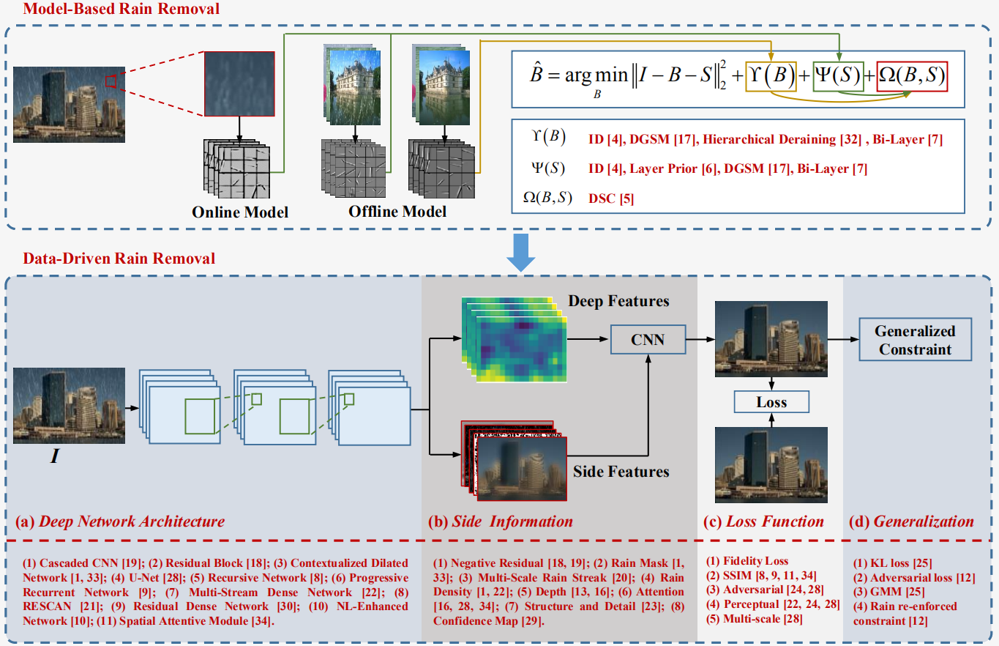

## Table of Contents

## What is deraining in the context of machine learning?

Deraining in machine learning refers to the process of removing rain from images or videos using algorithms. Rain can make it hard to see things clearly in pictures, which can be a problem for tasks like self-driving cars or security cameras. Machine learning models are trained to recognize and remove rain, making the images clearer and more useful.

These models use deep learning techniques, where they learn from lots of examples of rainy and clear images. They figure out patterns and features that help them tell the difference between rain and the actual scene. Once trained, these models can take a rainy image as input and produce a derained version, improving the quality and usability of the image for various applications.

## Why is deraining important for image processing?

Deraining is important for image processing because rain can make it hard to see things clearly in photos or videos. When it rains, the drops can blur or hide important details in an image. This can be a big problem for things like self-driving cars, which need to see the road and other cars clearly to drive safely. It's also important for security cameras, where clear images are needed to identify people or events.

Machine learning helps solve this problem by teaching computers to recognize and remove rain from images. By looking at many examples of rainy and clear images, these computers learn to tell the difference between rain and the actual scene. Once they learn this, they can take a rainy image and make it look like it was taken on a clear day. This makes the images much more useful for all sorts of purposes, from helping cars drive safely to making sure security cameras work well even in bad weather.

## What are the common challenges faced in deraining tasks?

One of the biggest challenges in deraining tasks is that rain can look very different depending on how heavy it is and how far away it is from the camera. Light rain might just make things a little blurry, but heavy rain can create streaks and big drops that cover up important parts of the image. This means that a model has to be really good at figuring out what kind of rain it's looking at and how to remove it without messing up the rest of the picture.

Another challenge is that rain can change the way light works in a scene. When rain drops catch the light, they can make things brighter or create weird shadows. This makes it hard for a model to tell the difference between the real scene and the rain. The model has to learn to ignore these light changes and focus on the important parts of the image, which can be tricky.

Lastly, there's the problem of not having enough good examples to train the model. To learn how to derain images, the model needs to see lots of pictures that show both rainy and clear versions of the same scene. But taking these pictures can be hard and time-consuming. Without enough good examples, the model might not learn well enough to handle all the different ways rain can appear in real life.

## What is the MSPFN model and how does it approach the deraining problem?

The MSPFN model, which stands for Multi-Scale Progressive Fusion Network, is a [machine learning](/wiki/machine-learning) model designed to remove rain from images. It works by using different levels of detail to understand and remove rain. The model looks at the image in small, medium, and large scales. By doing this, it can see both the big picture and the tiny details of the rain. This helps the model figure out where the rain is and how to get rid of it without messing up the rest of the image.

MSPFN uses something called progressive fusion to combine information from these different scales. It starts with the smallest scale and slowly adds in details from bigger scales. This way, the model can build up a clear image step by step. By the end, it has used all the information it needs to create a derained image that looks like it was taken on a clear day. This approach helps the model deal with the challenges of rain looking different at different distances and under different lighting conditions.

## How does the architecture of the MSPFN model differ from traditional deraining models?

The MSPFN model uses a special way to look at images that sets it apart from traditional deraining models. Instead of just looking at an image once, MSPFN looks at it in different sizes, from small to big. This is called multi-scale analysis. By doing this, the model can see both the tiny details of the rain and the bigger picture of the scene. Traditional models might only look at the image in one size, which can make it harder for them to understand how rain affects different parts of the picture.

Another big difference is how MSPFN puts all this information together. It uses a technique called progressive fusion, where it starts with the smallest scale and slowly adds in details from bigger scales. This step-by-step approach helps the model build a clear image without losing important details. Traditional models might try to remove the rain all at once, which can sometimes lead to mistakes or missing parts of the scene. By using multi-scale analysis and progressive fusion, MSPFN can create better derained images that look more like they were taken on a clear day.

## What datasets are commonly used to train and evaluate deraining models like MSPFN?

To train and evaluate deraining models like MSPFN, researchers often use the Rain100L and Rain100H datasets. These datasets contain pairs of images, one with rain and one without. Rain100L has 200 images in total, with 100 rainy and 100 clean versions. Rain100H is similar but has heavier rain, making it a bit harder for the models to learn from. These datasets help the models learn how to remove different types of rain, from light showers to heavy downpours.

Another popular dataset is the DDN dataset, which stands for "Dense and Depth-aware Network." It includes 12,600 images, which is a lot more than Rain100L and Rain100H. This larger number of images helps the models get better at recognizing rain in all kinds of scenes. Researchers also use the Rain800 dataset, which has 800 images taken in real-world conditions. This dataset is great for testing how well a model can handle rain in everyday situations, not just in controlled settings.

Using these datasets, researchers can see how well their deraining models work. They can compare the derained images to the clean ones and measure how much rain was removed. This helps them improve the models and make them better at clearing up rainy images.

## How is the performance of deraining models typically measured?

The performance of deraining models is usually measured by comparing the derained images to the clean, rain-free versions. One common way to do this is by using something called the Peak Signal-to-Noise Ratio (PSNR). PSNR looks at how much the derained image looks like the clean image. A higher PSNR means the derained image is closer to the clean one, which is good. Another measure is the Structural Similarity Index (SSIM), which checks how similar the structure of the derained image is to the clean image. A higher SSIM means the model did a good job keeping the important parts of the scene clear.

Researchers also use visual inspections to see how well the models work. They look at the derained images to see if they look natural and if all the rain has been removed. Sometimes, they ask people to rate the images to get an idea of how good the deraining is. This helps make sure the models are not just good at numbers but also at making images that look right to human eyes. By using both numbers and human checks, researchers can get a full picture of how well their deraining models are doing.

## What are the key innovations introduced by the MSPFN model in the field of deraining?

The MSPFN model, which stands for Multi-Scale Progressive Fusion Network, brings new ideas to deraining by looking at images in different sizes. It starts by looking at the smallest details of the image and then slowly adds in bigger details. This way, the model can understand both the tiny rain drops and the overall scene. This is different from older models that might only look at the image in one size, which can miss important details. By using this multi-scale approach, MSPFN can remove rain better and keep the image looking natural.

Another big innovation in MSPFN is how it puts all the information together. It uses a method called progressive fusion, where it builds the derained image step by step. It starts with the smallest scale and then adds in details from bigger scales. This helps the model to not miss any important parts of the image and to remove rain more accurately. Traditional models might try to remove rain all at once, which can lead to mistakes. With progressive fusion, MSPFN can create clearer images that look more like they were taken on a sunny day.

## Can you explain the training process of the MSPFN model?

The training process of the MSPFN model involves showing it lots of images that have rain and their clean versions. The model looks at these images in different sizes, from small to big, to understand how rain affects the picture. It starts by trying to remove rain from the smallest details and then slowly adds in bigger details. This step-by-step approach helps the model learn how to take away the rain without messing up the rest of the image. During training, the model compares its derained images to the clean ones and uses this comparison to get better at removing rain. It keeps doing this over and over until it gets really good at making rainy images look clear.

To make the training work well, researchers use special math formulas to measure how close the derained images are to the clean ones. One common formula is the Peak Signal-to-Noise Ratio (PSNR), which looks at how much the derained image looks like the clean image. Another is the Structural Similarity Index (SSIM), which checks how similar the structure of the derained image is to the clean one. The model tries to make these numbers as high as possible during training. By using these formulas and lots of practice images, the MSPFN model learns to remove rain better and better, making it useful for real-world applications like helping cars drive in the rain or making security cameras work better.

## How does MSPFN handle different types of rain streaks compared to other models?

The MSPFN model is really good at handling different types of rain streaks because it looks at images in different sizes. It starts with small details and then slowly adds bigger details. This helps the model see both the tiny rain drops and the bigger streaks of rain. Other models might only look at the image in one size, so they might miss some rain or not understand how it affects the whole picture. By looking at the image in different sizes, MSPFN can remove all kinds of rain, from light showers to heavy downpours, and make the image look clear.

When training, MSPFN uses a lot of images with different types of rain. It compares its derained images to the clean ones and tries to make them as close as possible. This helps the model learn how to handle different rain streaks better. Other models might not be as good at this because they don't use this multi-scale approach. MSPFN's way of slowly building up the image from small to big helps it understand and remove rain more accurately, making it a better choice for dealing with all sorts of rain in real life.

## What are the limitations of the MSPFN model and how can they be addressed in future research?

The MSPFN model is great at removing rain from images, but it does have some limits. One big problem is that it needs a lot of images to train well. If there aren't enough images showing different kinds of rain, the model might not learn how to handle all types of rain properly. Another issue is that MSPFN can sometimes change the image too much, making it look a bit strange or different from the original scene. This happens because the model tries to remove the rain but might also change parts of the image that don't have rain.

To make MSPFN even better, future research could focus on finding new ways to get more training images. Scientists could use special computer programs to make more images with rain in them, or they could take more pictures in real life. Also, researchers might work on making the model more careful about changing the image. They could teach the model to only remove the rain and leave the rest of the image alone. By doing these things, the MSPFN model could become even better at making rainy images look clear and natural.

## How can deraining models like MSPFN be integrated into real-world applications?

Deraining models like MSPFN can be really helpful in real life, especially for things like self-driving cars and security cameras. For self-driving cars, these models can make the road and other cars clearer even when it's raining. This helps the car's computer see better and drive safely. Security cameras can also use these models to keep an eye on things even during bad weather. If it's raining, the camera can still take clear pictures, making it easier to spot anything unusual or important.

To use MSPFN in real life, you need to put the model into the computer system of the car or camera. The model looks at the images coming from the camera and quickly removes any rain it sees. This all happens in the background, so the car or camera can keep working without any delays. By making images clearer, MSPFN helps these systems work better and stay safe, even when it's pouring outside.

## References & Further Reading

[1]: Ren, D., Zuo, W., Hu, Q., Zhu, P., & Meng, D. (2019). ["Progressive Image Deraining Networks: A Better and Simpler Baseline."](https://arxiv.org/abs/1901.09221) Proceedings of the IEEE/CVF Conference on Computer Vision and Pattern Recognition (CVPR).

[2]: Wang, Y., Zhao, S., & Patel, V. M. (2019). ["DesnowNet: Context-aware Deep Network for Snow Removal."](https://www.mdpi.com/2227-7390/12/10/1424) Proceedings of the IEEE/CVF Conference on Computer Vision and Pattern Recognition (CVPR).

[3]: Fu, X., Huang, J., Ding, X., Liao, Y., Paisley, J., & Zhang, X. P. (2017). ["Clearing the Skies: A Deep Network Architecture for Single-Image Rain Removal."](https://ieeexplore.ieee.org/document/7893758) IEEE Transactions on Image Processing, 26(6), 2944-2956.

[4]: Yang, W., Tan, R. T., Feng, J., Liu, J., & Guo, Z. (2017). ["Deep Joint Rain Detection and Removal from a Single Image."](https://ieeexplore.ieee.org/document/8099666) Proceedings of the IEEE Conference on Computer Vision and Pattern Recognition (CVPR).